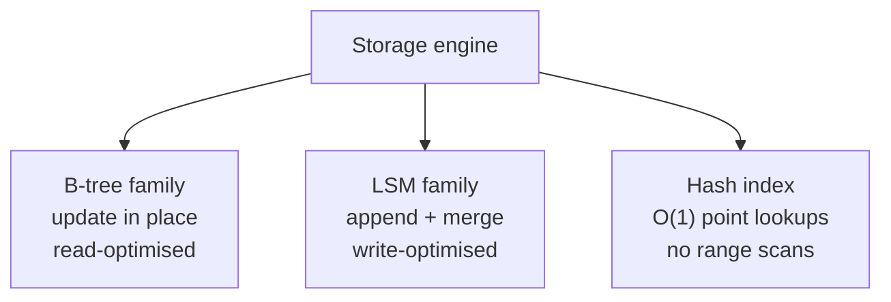

# 4.1.1 — Data Structures Behind Databases

> **Part 4 · Data Storage · Data Structures Behind Databases · Chapter 1 of 4**
> Why some databases are fast at reads and others at writes. It comes down to one structural choice.

---

## 🧒 ELI5 — Explain Like I'm 5

Imagine you have to keep a list of everyone in your school, and people join and leave all the time.

**Way 1 — the tidy binder.** Names in alphabetical order, in a ring binder. Looking someone up is easy: flip to roughly the right place, done in seconds. But when a new person joins, you have to **find their exact spot and squeeze them in** — and if the page is full, you have to split it and reshuffle. Adding is slow. *(That's a B-tree.)*

**Way 2 — the notepad.** Just write every new name **at the bottom of the page**, in whatever order they arrive. Adding is instant — no searching, no squeezing. But looking someone up means **reading the whole notepad**. So every evening you tidy the day's page into a small sorted list, and once a week you merge all the small sorted lists into one big one. *(That's an LSM tree.)*

Two completely different trade-offs:

- **Binder:** fast to read, slow to write.
- **Notepad:** fast to write, slower to read (you check several lists), and you do tidying work in the background.

Every database on Earth is basically one of those two. Postgres and MySQL are binders. Cassandra and RocksDB are notepads.

**And the reason it matters:** writing to the *end* of something is enormously faster than writing to the *middle* — on a spinning disk it avoids a seek, and on an SSD it avoids rewriting whole blocks. That one physical fact created two entire families of databases.

---

## The physical facts that drive everything

| Operation | HDD | SSD | RAM |
|---|---|---|---|
| Random read | ~10 ms (seek) | ~100 μs | ~100 ns |
| Sequential read | ~100 MB/s | ~500 MB – 7 GB/s | ~10 GB/s |
| Random write | ~10 ms | ~100 μs (+ write amplification) | ~100 ns |
| Sequential write | ~100 MB/s | ~500 MB – 5 GB/s | ~10 GB/s |

🔢 **Sequential I/O is 100–1000× faster than random I/O.** Even on SSDs, where there's no seek, random writes cause **write amplification**: the flash erase block is typically 256 KB–4 MB, so modifying 100 bytes can mean rewriting a whole block.

**Everything below is a strategy for turning random access into sequential access.**

---

## The three fundamental structures



| | **B-tree** | **LSM tree** | **Hash index** |
|---|---|---|---|
| Write path | Find the page, modify in place | Append to memory, flush sequentially | Append + update the hash map |
| Read (point) | O(log n) — 3–4 disk seeks | O(log n) but checks several files | ✅ O(1) |
| Read (range) | ✅ Excellent — leaves are linked | Good — merge sorted runs | ❌ Impossible |
| Write throughput | Moderate | ✅ **Very high** |✅ Very high |
| Write amplification | 2–10× (WAL + page rewrite) | 10–30× (compaction) | Low |
| Read amplification | ✅ Low | Higher (multiple levels) | ✅ Lowest |
| Space amplification | ~1.3× (page fragmentation) | ✅ ~1.1× with compression | High (in-memory index) |
| Transactions | ✅ Natural (in-place locking) | Harder (MVCC over immutable files) | Limited |
| Used by | Postgres, MySQL InnoDB, Oracle, SQL Server, SQLite | Cassandra, RocksDB, LevelDB, ScyllaDB, HBase, Bigtable | Bitcask, Redis (in memory) |

🎯 **The one-sentence summary interviewers want:** *"B-trees update in place, which makes reads cheap and writes random; LSM trees append and merge later, which makes writes sequential and reads more expensive. Pick by your read:write ratio."*

---

## The RUM conjecture

You can optimise for at most **two** of three:

| | Meaning |
|---|---|
| **R — Read amplification** | How much data you read to answer a query |
| **U — Update amplification** | How much you write to persist an update |
| **M — Memory (space) amplification** | How much space the data occupies |

| Structure | Optimises | Sacrifices |
|---|---|---|
| B-tree | Read + space | Update (random writes, WAL) |
| LSM tree | Update + space | Read (check multiple levels) |
| Hash index | Read + update | Space (index must fit in memory) |

⚖️ This is why "which database is fastest?" is not a question. **Fastest at what?**

---

## The write-ahead log (both families use it)

Before modifying anything, append the change to a sequential log and `fsync` it.

```
1. Append the change to the WAL          ← sequential, fast, durable
2. fsync                                  ← the durability point
3. Acknowledge the client
4. Apply to the actual data structure     ← later, possibly batched
```

**Why:** a crash after step 2 loses nothing — replay the WAL on restart. A crash before step 2 means the write was never acknowledged, so the client knows.

🔢 `fsync` is the real cost of a durable write: ~0.1–1 ms on SSD, ~5–10 ms on HDD. **This is why single-row commit throughput is in the thousands, not millions**, and why batching (group commit) matters so much: 100 transactions committed in one `fsync` cost the same as one.

The WAL also enables: replication (ship the log), point-in-time recovery (replay to a timestamp), and CDC (tail the log). **The log is the source of truth; the data files are a materialised view of it** — an idea that recurs throughout distributed systems.

---

## B-tree in one page

```
                    [ 50 | 100 ]              ← internal node (keys + child pointers)
                   /     |      \
        [10|25|40]   [60|75|90]   [110|150]   ← more internal nodes
         /  |  \       ...           ...
      leaves: sorted key→value, linked left↔right for range scans
```

- **High fan-out** (hundreds of keys per 4–16 KB page) means a very shallow tree: ~4 levels for a billion keys.
- **Point lookup** = one page read per level; the top levels are always cached, so a lookup is typically **one** disk read.
- **Range scan** = find the start leaf, then follow sibling pointers sequentially. ✅ Excellent.
- **Insert** = find the leaf, insert; if full, **split** and propagate upward.

**Costs:** in-place updates are random writes; page splits cause fragmentation; and each write touches the WAL *and* the page (write amplification). Full detail: [B-tree](02-b-tree.md).

---

## LSM tree in one page

```
Writes → MemTable (in-memory sorted map)
              │ when full, flush sequentially
              ▼
         L0: SSTable SSTable SSTable        (may overlap in key range)
              │ compaction merges
         L1: SSTable SSTable ...            (non-overlapping, 10x larger)
         L2: ...                            (10x larger again)
```

- **Write** = append to the WAL + insert into an in-memory sorted structure. ✅ Extremely fast, no disk seek.
- **Flush** = write the MemTable out as an immutable, sorted **SSTable**. Purely sequential.
- **Read** = check the MemTable, then each level, newest first. **Bloom filters** per SSTable make "definitely not here" answers free.
- **Compaction** = merge SSTables in the background to remove duplicates and tombstones, and to keep the number of levels small.

**Costs:** reads may touch multiple files (read amplification); compaction consumes I/O and CPU continuously and can cause **latency spikes**; deletes are tombstones that occupy space until compacted. Full detail: [SSTable](03-sstable.md), [LSM Tree](04-lsm-tree.md).

---

## Indexes: primary, secondary, clustered

| Index type | Meaning |
|---|---|
| **Primary / clustered** | The table's rows are physically stored in index order (InnoDB, SQL Server). A primary-key lookup fetches the row directly |
| **Heap + secondary index** | Rows live in an unordered heap; indexes point to row locations (Postgres) |
| **Secondary index** | Maps a non-key column to primary keys or row pointers |
| **Covering index** | Contains all columns a query needs → no table lookup at all |
| **Composite index** | Multiple columns; **only usable left-to-right** (`(a,b,c)` serves `a`, `a,b`, `a,b,c` — not `b` alone) |
| **Partial index** | Indexes only rows matching a predicate — much smaller |
| **Unique index** | Enforces a constraint and provides the lookup |

⚠️ **Every index makes writes slower.** An insert must update the table *and* every index on it. A table with eight indexes writes nine structures per insert. **Index for the queries you actually run, and drop unused indexes** — most databases can report index usage statistics.

**Covering indexes are the big win worth naming:** if the index contains every column the query selects, the database never touches the table. That can turn a 50 ms query into a 2 ms one.

---

## Other structures worth knowing

| Structure | Purpose | Where |
|---|---|---|
| **Hash index** | O(1) point lookups | Redis, in-memory maps, Postgres hash indexes |
| **Bloom filter** | "Definitely absent / possibly present" in a few bits | LSM read paths, cache penetration defence |
| **Inverted index** | term → list of documents | Elasticsearch, Lucene, full-text search |
| **Skip list** | Sorted, lock-friendly, probabilistic | Redis sorted sets, some MemTables |
| **R-tree / geohash / S2 / H3** | Spatial queries | PostGIS, geo databases |
| **Trie** | Prefix search | Autocomplete |
| **Column store + compression** | Analytical scans over few columns | ClickHouse, Parquet, BigQuery |
| **HyperLogLog** | Approximate distinct count in ~12 KB | Redis, analytics |
| **Merkle tree** | Efficiently detect divergence between replicas | Cassandra anti-entropy, Git, blockchains |
| **Count-Min Sketch** | Approximate frequency | Hot-key detection, TinyLFU admission |

---

## Column stores: the other axis

Row stores and column stores differ in **layout**, which is orthogonal to B-tree vs LSM.

```
Row store:     [id1,name1,age1][id2,name2,age2][id3,name3,age3]
Column store:  [id1,id2,id3][name1,name2,name3][age1,age2,age3]
```

| | Row store | Column store |
|---|---|---|
| `SELECT * WHERE id=5` | ✅ One read | Reassemble from N columns |
| `SELECT AVG(age) FROM t` | Reads every column of every row | ✅ Reads one column only |
| Compression | Moderate | ✅ Excellent — similar values adjacent (10–50×) |
| Writes | ✅ One location | Touches every column file |
| Use | OLTP | OLAP |

🔢 A `SELECT AVG(age)` over a billion rows: a row store reads ~200 GB (all columns); a column store reads ~4 GB, compressed to ~400 MB. **That's a 500× difference**, and it's why analytical databases are columnar. ([OLTP vs OLAP](../02-storage/07-oltp-vs-olap.md))

---

## Choosing, in an interview

| Workload | Structure | Example database |
|---|---|---|
| Read-heavy, complex queries, transactions | B-tree | Postgres, MySQL |
| Write-heavy, time-ordered, high volume | LSM | Cassandra, ScyllaDB, RocksDB |
| Pure key-value, point lookups, in memory | Hash | Redis, Memcached |
| Full-text search | Inverted index | Elasticsearch |
| Analytics over billions of rows | Column store | ClickHouse, BigQuery |
| Time-series with high ingest | LSM + column + downsampling | InfluxDB, TimescaleDB |

🎯 **Say the structure, not just the product.** *"Write-heavy and time-ordered, so I want an LSM engine — Cassandra — because appends are sequential and there's no read-modify-write on the write path."* That is a mechanism-level answer, and it's the difference between naming a tool and understanding it.

---

## 📋 Chapter checklist

| Skill | Ready? |
|---|---|
| State why sequential I/O is 100–1000× faster | ☐ |
| Compare B-tree, LSM, and hash across seven dimensions | ☐ |
| State the RUM conjecture | ☐ |
| Explain the WAL and why `fsync` bounds commit throughput | ☐ |
| Explain group commit | ☐ |
| Sketch a B-tree and an LSM tree from memory | ☐ |
| Explain covering and composite indexes, including left-to-right | ☐ |
| Explain why every index slows writes | ☐ |
| Name six auxiliary structures and what each is for | ☐ |
| Quantify the column-store advantage for aggregations | ☐ |

---

**← Previous** [3.4.3 Push vs Pull in Twitter Timeline](../../03-scaling-services/04-dataflow/03-push-vs-pull-twitter-timeline.md)
**Next →** [4.1.2 B-tree](02-b-tree.md)
