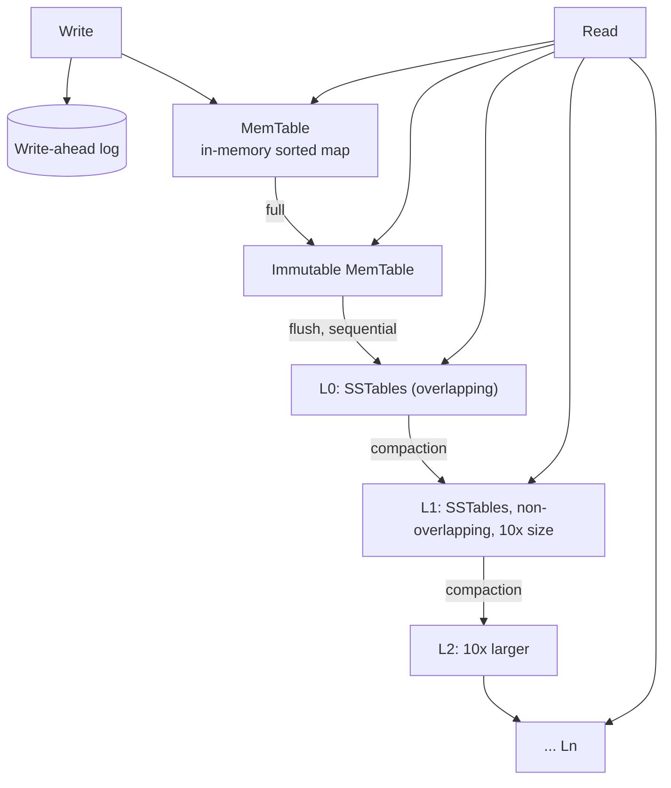

# 4.1.4 — LSM Tree

> **Part 4 · Data Storage · Data Structures Behind Databases · Chapter 4 of 4**
> Log-Structured Merge tree: how to make writes sequential, and what you pay for it.

---

## 🧒 ELI5 — Explain Like I'm 5

You're taking notes in a lesson, fast.

You do **not** keep a perfect alphabetical list as you go — that would mean stopping every few seconds to find the right spot. Instead:

1. **Scribble everything on a rough pad**, in whatever order it comes. Instant. *(MemTable.)*
2. When the pad is full, **copy it out neatly in alphabetical order onto a fresh sheet**, and start a new pad. The neat sheet is finished forever. *(Flush to an SSTable.)*
3. After a while you have lots of neat sheets. Looking something up means checking the newest sheet, then the next, then the next. Annoying.
4. So every so often, **merge several sheets into one bigger sheet**, keeping only the newest version of each entry and throwing away anything crossed out. *(Compaction.)*

And one safety rule: **before anything goes on the rough pad, you also shout it into a tape recorder.** If you drop the pad in a puddle, you replay the tape. *(Write-ahead log.)*

That's an LSM tree. Writing is as fast as scribbling. Reading costs a bit more because you check several sheets. And there's a tidying-up crew working constantly in the background — which is both the secret of the design and its main operational headache.

---

## The architecture



| Component | Role |
|---|---|
| **WAL** | Durability — the write is safe the instant this is `fsync`ed |
| **MemTable** | An in-memory sorted structure (skip list or red-black tree), typically 32–256 MB |
| **Immutable MemTable** | A full MemTable awaiting flush; writes continue to a fresh one |
| **L0** | Freshly flushed SSTables; **key ranges overlap** between them |
| **L1…Ln** | Each level ~10× the previous; **non-overlapping** within a level (in levelled compaction) |

---

## The write path

```
1. Append to the WAL, fsync                     ← the durability point, sequential
2. Insert into the MemTable (sorted, in memory) ← O(log n), no disk
3. Acknowledge the client                       ← done, typically < 1 ms
   ... asynchronously ...
4. MemTable full → freeze it, start a new one
5. Flush the frozen MemTable to an L0 SSTable   ← one sequential write
6. Compaction merges L0 → L1 → L2 ...           ← background
```

🔢 **The key property: no disk read is required to write.** A B-tree must read the target page before modifying it (a read-modify-write). An LSM tree just appends. That is why LSM write throughput can be **10–100×** higher for random-key workloads.

⚠️ **`fsync` on the WAL still bounds you.** Cassandra's `commitlog_sync: periodic` (every 10 s by default) is fast but can lose up to 10 s on a crash; `batch` mode `fsync`s per group commit — durable and slower. **This setting is exactly the durability-vs-throughput dial** and is worth naming.

---

## The read path

```
1. MemTable                    (memory)
2. Immutable MemTables         (memory)
3. L0 SSTables — ALL of them, newest first    ← ranges overlap, so all must be checked
4. L1: binary search to find the ONE file whose range covers the key
5. L2: same
   ...
   For each file: Bloom filter → index → one block read
6. First value found wins (newest). A tombstone means "deleted".
```

**Read amplification** = the number of files consulted. With Bloom filters at ~1% false positives, most files are eliminated for free, so a typical point read costs **one or two block reads**.

⚠️ **L0 is the weak spot.** L0 files have overlapping key ranges, so *every* L0 file must be checked. If compaction falls behind and L0 accumulates 20 files, read latency degrades sharply. Monitoring L0 file count is a standard LSM health check.

⚠️ **Range scans can't use Bloom filters.** Every file whose min/max overlaps the range must be opened and merged. This is why LSM range performance is good but not B-tree-good.

---

## Compaction strategies

### Size-tiered (STCS)
Merge SSTables of similar size; when N similar-sized files exist, merge them into one larger file.

| ✅ | ❌ |
|---|---|
| Low write amplification (~4–10×) | High **space** amplification — up to 2× (a merge needs room for both input and output) |
| Cheap, simple | High read amplification — many overlapping files |
| Good for write-heavy | Large, infrequent, spiky merges |

### Levelled (LCS)
Each level holds non-overlapping SSTables and is ~10× the size of the previous.

| ✅ | ❌ |
|---|---|
| Read amplification ≈ 1 file per level | High write amplification (~10–30×) |
| Space amplification ~1.1× | Constant background I/O |
| Predictable read latency | More CPU |

### Time-window (TWCS)
Group SSTables by write-time window; compact only within a window.

| ✅ | ❌ |
|---|---|
| ✅ Ideal for time-series with TTL — an entire window's file expires at once, no compaction needed to reclaim | Only correct for time-ordered, immutable data |
| Very low write amplification | Bad if you update old data |

⚖️ **The choice, stated as a rule:**

| Workload | Strategy |
|---|---|
| Write-heavy, reads mostly recent data | Size-tiered |
| Read-heavy, latency-sensitive | Levelled |
| Time-series with TTL | Time-window |
| Mixed | Universal (RocksDB), or levelled with tuned L0 |

---

## Amplification: the three numbers

| | Definition | B-tree | LSM (levelled) | LSM (size-tiered) |
|---|---|---|---|---|
| **Write amp** | Bytes written to disk ÷ bytes of user data | 2–10× | 10–30× | 4–10× |
| **Read amp** | Reads per query | ✅ ~1 | 1–3 (with Bloom) | 3–10 |
| **Space amp** | Disk used ÷ live data | ~1.3× | ✅ ~1.1× | ~2× |

☠️ **The counter-intuitive result: levelled LSM often has *higher* write amplification than a B-tree.** So why is it faster to write?

Because **write amplification measures bytes, not latency**. LSM's writes are:
- **Sequential**, so they achieve full disk bandwidth (vs random writes at a fraction of it).
- **Off the critical path** — compaction happens in the background, not during the user's write.
- **Batched** — a single compaction pass amortises many logical writes.

🎯 That explanation is a genuinely strong interview answer, because it shows you understand the difference between *total work* and *latency-critical work*.

---

## Tombstones and deletes

A delete writes a tombstone marker. Consequences covered in [SSTable](03-sstable.md):

- Space isn't reclaimed until compaction reaches that data.
- Range scans over many tombstones are slow.
- Tombstones must survive `gc_grace_seconds` so offline replicas don't resurrect deleted rows.

☠️ **The queue anti-pattern:** using a Cassandra table as a work queue (insert, read, delete, repeat) creates a partition that is almost entirely tombstones. A read of that partition scans millions of dead entries and times out. **LSM stores are poor at high-churn small datasets** — the pattern they're worst at.

---

## Operational realities

| Issue | Symptom | Mitigation |
|---|---|---|
| **Compaction I/O storms** | Latency spikes, disk saturation | Throttle compaction (`compaction_throughput_mb_per_sec`), schedule off-peak, use faster disks |
| **Write stalls** | Writes block completely | RocksDB stalls when L0 exceeds a threshold — this is backpressure by design. Tune `level0_slowdown_writes_trigger` |
| **Compaction falling behind** | L0 grows, reads degrade, then stalls | More compaction threads, a less aggressive strategy, or more nodes |
| **Space amplification spike** | Disk fills mid-compaction | Keep ≥ 50% free disk with STCS; monitor closely |
| **Bloom filter memory** | Memory pressure | ~10 bits/key; tune per level, fewer bits at large cold levels |
| **Large partitions** | One partition doesn't fit / is slow | Cap partition size in the data model — a Cassandra design rule |
| **Read latency p99** | Spiky | Usually compaction or L0 depth. This is LSM's characteristic weakness |

🎯 **The honest summary for an interview:** *"LSM gives you very high write throughput and good space efficiency, and the price is background compaction — which means p99 read latency is spikier and there's real operational tuning involved."* Acknowledging the operational cost is more convincing than claiming it's free.

---

## LSM vs B-tree: the decision

| Choose **LSM** when | Choose **B-tree** when |
|---|---|
| Writes ≫ reads (10:1 or more) | Reads ≫ writes, or balanced |
| Data is append-mostly / time-ordered | Frequent in-place updates of existing rows |
| Very large datasets, small hot set | Working set fits in the buffer pool |
| Point lookups dominate | Range scans and `ORDER BY` dominate |
| Eventual consistency is acceptable | ACID transactions required |
| High compression matters | Predictable, low p99 read latency matters |
| Examples: event logs, time-series, metrics, messaging, IoT | Examples: orders, users, financial records, general OLTP |

**Real systems:**

| Engine | Type | Notes |
|---|---|---|
| RocksDB | LSM | The embedded default; under CockroachDB, TiKV, Kafka Streams, Flink |
| LevelDB | LSM | RocksDB's ancestor |
| Cassandra / ScyllaDB | LSM | Distributed, tunable consistency |
| HBase / Bigtable | LSM | Hadoop / GCP ecosystems |
| InfluxDB | LSM (TSM) | Time-series specialised |
| Postgres / MySQL InnoDB | B-tree | The OLTP default |
| MongoDB WiredTiger | **Both** | B-tree default, LSM option |
| SQLite | B-tree | Embedded |

⚠️ **MongoDB's WiredTiger supporting both is a useful fact:** the storage engine is a configuration choice, not a property of the database. It reinforces that you should reason about the *structure*, not the brand.

---

## The idea generalises

The log-structured principle appears everywhere:

| System | Manifestation |
|---|---|
| Kafka | The log *is* the storage; segments are immutable |
| Filesystems (F2FS, log-structured FS) | Sequential writes for flash |
| SSD firmware (FTL) | The drive itself is log-structured internally, which is *why* random writes amplify |
| Git | Immutable objects, packed and repacked (compaction) |
| Event sourcing | Append events, fold into projections |
| Datomic, immutable databases | Append-only facts with time |

🎯 **The unifying insight:** *"append is cheap, mutate is expensive; so append now and reorganise in the background."* That sentence explains LSM trees, Kafka, event sourcing, SSD firmware, and Git.

---

## 📋 Chapter checklist

| Skill | Ready? |
|---|---|
| Draw the full LSM architecture | ☐ |
| Explain why no disk read is needed to write | ☐ |
| Explain the WAL sync mode as a durability dial | ☐ |
| Walk the read path and explain why L0 is special | ☐ |
| Compare STCS, LCS, TWCS on all three amplifications | ☐ |
| Explain why higher write amplification can still mean faster writes | ☐ |
| Explain tombstones and the queue anti-pattern | ☐ |
| Name five operational issues and their mitigations | ☐ |
| Choose LSM vs B-tree from a workload description | ☐ |
| Explain how the same idea underlies Kafka and SSD firmware | ☐ |

---

**← Previous** [4.1.3 SSTable](03-sstable.md)
**Next →** [4.2.1 Introduction to Storage](../02-storage/01-introduction-to-storage.md)
