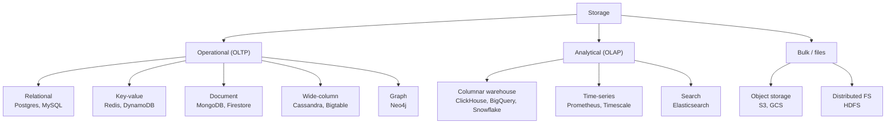
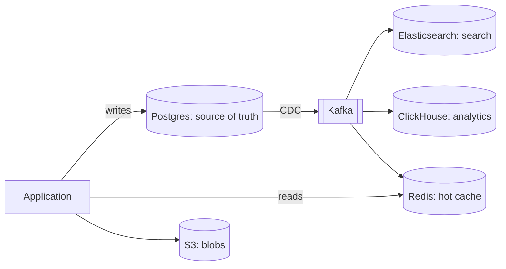

# 4.2.1 — Introduction to Storage

> **Part 4 · Data Storage · Storage · Chapter 1 of 9**
> The map of every storage family, and the method for choosing between them.

---

## 🧒 ELI5 — Explain Like I'm 5

You have stuff to keep. **Where you keep it depends entirely on what you'll do with it later.**

- **Socks you wear every day** → a drawer by the bed. Quick to reach, small. *(Cache / key-value.)*
- **Important papers** → a proper filing cabinet with labelled folders, in strict order, and you can cross-reference them. *(Relational database.)*
- **Photos and videos** → a big box in the loft. Cheap, enormous, but you have to climb up to get anything. *(Object storage.)*
- **A recipe book with a good index** → so you can find "everything with tomatoes" instantly, even though tomatoes appear on 200 pages. *(Search engine.)*
- **A diary** → things written in time order, never edited, and you mostly read the recent bit. *(Time-series / log.)*
- **The school's whole exam results, so you can work out averages** → a spreadsheet where each *column* is stored together, because you only ever want one column at a time. *(Analytics warehouse.)*

Here's the mistake everyone makes: **choosing the container before knowing what you'll do with the stuff.** You don't put your everyday socks in the loft, and you don't put 500 photo albums in your bedside drawer.

So: **describe what you'll ask for, then pick the container.** Never the other way round.

---

## The families



| Family | Data model | Query by | Scales by | Typical use |
|---|---|---|---|---|
| **Relational** | Tables, rows, relations | Anything (SQL) | Vertical, then sharding | Orders, users, anything with invariants |
| **Key-value** | `key → opaque value` | Key only | Horizontal (trivially) | Sessions, caches, counters |
| **Document** | JSON documents | Key, or fields with indexes | Horizontal | Catalogues, profiles, CMS |
| **Wide-column** | Partition key + clustering columns | The key structure only | Horizontal (linearly) | Time-ordered events, messaging |
| **Search** | Inverted index | Text, fuzzy, facets, relevance | Horizontal | Search, log analytics |
| **Columnar / warehouse** | Columns | SQL aggregations | Horizontal | BI, analytics |
| **Time-series** | `(metric, tags, ts) → value` | Time ranges + tags | Horizontal | Metrics, IoT |
| **Graph** | Nodes and edges | Traversals | Hard | Social graph, fraud rings |
| **Object storage** | `key → bytes` | Key (+ list by prefix) | Effectively unlimited | Media, backups, data lake |

---

## The method: access pattern first

🎯 **Answer these five questions before naming any technology.** The answers select the store almost mechanically.

### 1. How is it read?
| Pattern | Points to |
|---|---|
| By primary key only | Key-value, document, wide-column |
| By many different fields, ad hoc | Relational |
| By text content / fuzzy matching | Search |
| By time range | Time-series, wide-column |
| Aggregations over billions of rows | Columnar |
| Multi-hop relationship traversal | Graph, or adjacency lists in a KV store |
| Whole objects, streamed | Object storage |

### 2. How is it written?
| Pattern | Points to |
|---|---|
| Low volume, transactional, with invariants | Relational |
| Very high volume, append-only | Wide-column (LSM), log |
| Bulk load | Columnar, object storage |
| Frequent in-place updates of existing rows | Relational (B-tree) |
| Write once, read many, large blobs | Object storage |

### 3. How big does it get?
| Size | Implication |
|---|---|
| < 100 GB | Anything works. Use Postgres. |
| 100 GB – 10 TB | Single relational node with good indexing still fine |
| 10 – 100 TB | Sharding, or a natively distributed store |
| > 100 TB | Distributed store; object storage for blobs |
| Petabytes | Object storage + columnar analytics; never a relational primary |

### 4. What consistency does it need?
| Requirement | Points to |
|---|---|
| ACID transactions across rows | Relational, or Spanner/CockroachDB |
| Single-key atomicity is enough | KV, document, wide-column |
| Eventual is fine | Anything |
| Read-your-writes | Relational, or a KV with a session guarantee |

### 5. What's the query latency budget?
| Budget | Points to |
|---|---|
| < 1 ms | In-memory KV |
| < 10 ms | KV, document, indexed relational |
| < 100 ms | Relational with joins, search |
| Seconds | Columnar analytics |
| Minutes | Batch over object storage |

---

## The default answer, and when to leave it

⚖️ **Start with PostgreSQL.** It is the correct answer far more often than its reputation suggests:

- ACID transactions and rich SQL.
- JSONB gives you document-store flexibility with indexing (GIN).
- Full-text search built in (adequate up to millions of documents).
- PostGIS for geospatial; TimescaleDB for time-series; `pgvector` for embeddings.
- Arrays, ranges, materialised views, partitioning, logical replication, CDC.
- One thing to operate, back up, and monitor.

🎯 **Saying "I'd start with Postgres and add a specialised store when a specific access pattern demands it"** is a *strong* answer, not a lazy one. It shows you weigh operational cost. Then name the specific triggers:

| Leave Postgres when | Add |
|---|---|
| Full-text search over millions of docs with ranking and facets | Elasticsearch |
| Analytics scanning billions of rows | ClickHouse / BigQuery |
| Write rate exceeds one node and the model is key-ordered | Cassandra / DynamoDB |
| Sub-millisecond reads on hot keys | Redis |
| Large binary objects | S3 |
| Metrics at high cardinality | Prometheus / Timescale |
| Deep graph traversals | Neo4j (or model as adjacency lists first) |

---

## Polyglot persistence

Real systems use several stores, each fed from a source of truth.



**Rules that keep this sane:**

1. **One source of truth per piece of data.** Everything else is a derived view that can be rebuilt.
2. **Derive via CDC or events**, never dual writes ([Async Communication](../../02-microservices-and-dataflow/02-asynchronous-communication/01-async-communication.md#the-dual-write-problem-and-the-only-good-fix)).
3. **Every derived store must be rebuildable from scratch.** If it isn't, it's a second source of truth and it *will* diverge.
4. **Each store costs operational overhead** — backups, monitoring, upgrades, expertise, on-call. Justify each one.

☠️ **The polyglot trap:** five stores, each partly authoritative, kept in sync by application code. Nobody knows which one is right during an incident. The rules above are what prevent it.

---

## Blob + metadata: the pattern for large objects

Never store large binary data in a database.

```
Postgres:  videos(id, owner_id, title, status, s3_key, size_bytes, created_at)
S3:        s3://bucket/videos/{id}/original.mp4
```

| Why | Detail |
|---|---|
| Cost | S3 ~$0.02/GB-month vs ~$0.10/GB-month for database storage |
| Backup | A 50 TB database backup is unmanageable |
| Bandwidth | Blobs stream via CDN, never through your API tier |
| Buffer pool | Large blobs evict useful pages from the database cache |
| Replication | Every replica would carry a full copy |

**The flow:** client requests a presigned URL → uploads **directly** to S3 → notifies your API → you record metadata. Bytes never touch your servers.

---

## Data lifecycle and tiering

Data gets colder. Storage cost should follow.

| Tier | Latency | Cost/GB-month | Use |
|---|---|---|---|
| Memory | ns | ~$3–5 | Hot cache |
| Local SSD | μs | ~$0.10 | Active database |
| Network block (EBS) | ms | ~$0.08 | Database volumes |
| Object storage (standard) | 10s of ms | ~$0.023 | Blobs, data lake |
| Infrequent access | 10s of ms + retrieval fee | ~$0.0125 | Backups |
| Archive (Glacier) | Minutes to hours | ~$0.004 | Compliance |
| Deep archive | 12+ hours | ~$0.001 | Legal retention |

🔢 **A 1 PB dataset costs ~$23,000/month in S3 Standard and ~$1,000/month in Deep Archive.** Lifecycle policies that move objects automatically after 30/90/365 days are one of the highest-value cost optimisations available, and they're a single configuration block.

**Also design deletion:** retention policies, TTLs, and GDPR erasure paths. Data you keep forever costs forever.

---

## Choosing under interview pressure

Say it in this order:

> "The access pattern is **[reads by X, writes of shape Y]**, at **[N QPS]** and **[S TB]**, needing **[consistency]** at **[latency]**.
> That points to **[store]**, because **[the property that matters]**.
> The alternative would be **[other]**, which I'd reject because **[reason]**.
> The cost is **[trade-off I'm accepting]**."

Worked:

> "Reads are almost entirely by `video_id`, writes are append-only at 1,000/s, metadata is ~36 TB with three-way replication, single-key atomicity is sufficient, and I need p99 under 20 ms. That points to a **wide-column store — Cassandra** — because writes are LSM-based and sequential, and it scales linearly with nodes.
> The alternative is sharded Postgres, which I'd reject because I don't need joins or multi-row transactions here, and I'd be building the sharding layer myself.
> The cost is no ad-hoc queries — every access pattern has to be designed into the key up front, and adding a new one later means a new table and a backfill."

---

## 📋 Chapter checklist

| Skill | Ready? |
|---|---|
| Name nine storage families and their query model | ☐ |
| Ask the five access-pattern questions before naming a technology | ☐ |
| Justify Postgres as the default and name seven triggers to leave it | ☐ |
| State the four polyglot persistence rules | ☐ |
| Explain the blob + metadata split with five reasons | ☐ |
| Quote storage tier costs and compute a lifecycle saving | ☐ |
| Deliver the four-sentence choice framework | ☐ |

---

**← Previous** [4.1.4 LSM Tree](../01-data-structures-behind-databases/04-lsm-tree.md)
**Next →** [4.2.2 SQL Database](02-sql-database.md)
