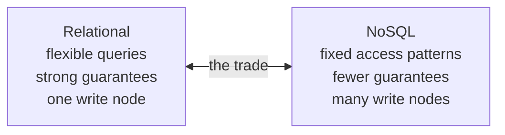

# 4.2.3 — Introduction to NoSQL Databases

> **Part 4 · Data Storage · Storage · Chapter 3 of 9**
> Not "no SQL" — "not only SQL". Four families, one shared trade.

---

## 🧒 ELI5 — Explain Like I'm 5

The strict filing cabinet is brilliant — but it has one desk, and one very careful clerk who checks every rule.

When a *million* people want to file things at once, that clerk is the bottleneck. You can't just hire a hundred clerks, because they all need to check each other's work to keep the rules ("no duplicate emails", "every order has a real customer"). All that checking is exactly what slows things down.

So NoSQL made a deal:

> **"What if we drop most of the rules, so we don't need the clerks to talk to each other? Then we can have a hundred desks."**

And it works! You get enormous speed and you can add desks forever.

But you gave something up. Now:

- **Nobody checks that the order belongs to a real customer.** Your program has to.
- **You can't easily ask "show me everything about X across three different cabinets."** You have to have decided, in advance, exactly what questions you'd ask, and filed things that way.
- **Two desks might disagree for a moment.** Ann's new address might be on desk 3 but not yet on desk 7.

That's the whole deal: **you trade flexibility and guarantees for scale.** It's a good trade for some data and a terrible trade for other data — and the skill is knowing which is which.

---

## What "NoSQL" actually means

The label covers four genuinely different data models that share one property: **they relax something relational databases guarantee, in exchange for horizontal scalability.**

| Family | Model | Examples | Relaxes |
|---|---|---|---|
| **Key-value** | `key → opaque bytes` | Redis, DynamoDB, Memcached | Queries by anything but the key |
| **Document** | JSON documents | MongoDB, Couchbase, Firestore | Cross-document joins and constraints |
| **Wide-column** | Partition key + clustering columns | Cassandra, ScyllaDB, HBase, Bigtable | Ad-hoc queries; the key defines everything |
| **Graph** | Nodes and edges | Neo4j, JanusGraph, Neptune | Horizontal scalability (graphs are hard to shard) |

⚠️ **Graph databases are the odd one out** — they usually *don't* scale better than relational; they exist for query expressiveness on traversals, not for scale.

---

## The core trade



| You give up | You gain |
|---|---|
| Joins | Linear horizontal scaling |
| Multi-row ACID transactions (mostly) | Very high write throughput |
| Foreign keys and constraints | Flexible or absent schema |
| Ad-hoc queries | Predictable per-operation latency |
| A mature, universal query language | Built-in multi-datacenter replication |
| The planner deciding *how* | You control the physical layout |

🎯 **The single most important consequence: in NoSQL you design the schema from the queries, not the queries from the schema.** In SQL you model the domain and then query it however you like. In Cassandra or DynamoDB you enumerate every access pattern up front and build a table (or index) for each one. **Adding a new access pattern later means a new table and a backfill.**

That sentence is the highest-value thing to say about NoSQL in an interview.

---

## Query-first modelling, demonstrated

**Relational thinking:**
```sql
users(id, name, email)
orders(id, user_id, total, created_at)
-- Any question is answerable:
SELECT * FROM orders WHERE user_id = 5 ORDER BY created_at DESC;
SELECT * FROM orders WHERE total > 100;
SELECT u.name, sum(o.total) FROM users u JOIN orders o ... GROUP BY u.name;
```

**NoSQL thinking (Cassandra):**
```
Access pattern 1: "orders for a user, newest first"
  CREATE TABLE orders_by_user (
    user_id uuid, created_at timestamp, order_id uuid, total decimal,
    PRIMARY KEY ((user_id), created_at)
  ) WITH CLUSTERING ORDER BY (created_at DESC);

Access pattern 2: "one order by its ID"
  CREATE TABLE orders_by_id (order_id uuid PRIMARY KEY, ...);

Access pattern 3: "orders over £100"
  → NOT POSSIBLE efficiently. Either add a table keyed differently,
    or push this to an analytics store.
```

**Note the duplication:** the same order is written to multiple tables. That's normal and expected in NoSQL — storage is cheap, and writes are cheap; the application (or a CDC pipeline) keeps the copies in step.

☠️ **The consequence people forget:** because the same fact lives in several tables, an update must touch all of them, and there's no transaction to make that atomic. Either accept eventual consistency across the copies, or use a single-partition batch where the engine supports it.

---

## Consistency models

| Model | Meaning | Examples |
|---|---|---|
| **Strong** | Reads always see the latest write | DynamoDB (`ConsistentRead`), Spanner, single-node Mongo primary |
| **Tunable** | You choose per query | Cassandra (`ONE`/`QUORUM`/`ALL`) |
| **Eventual** | Converges; may be briefly stale | DynamoDB default, Cassandra `ONE` |
| **Causal / session** | Read-your-writes within a session | MongoDB sessions, Cosmos DB |

**Cassandra's tunable consistency in one line:**

$$R + W > N \implies \text{strong consistency}$$

with `N` = replication factor, `R` = replicas read, `W` = replicas written.

| Config (N=3) | Guarantee | Trade |
|---|---|---|
| W=1, R=1 | Eventual | ✅ Fastest, survives 2 node failures |
| W=QUORUM(2), R=QUORUM(2) | ✅ Strong (2+2>3) | Balanced — **the usual choice** |
| W=ALL(3), R=1 | Strong | Fast reads; **writes fail if any node is down** |
| W=1, R=ALL(3) | Strong | Fast writes; reads fail if any node is down |

🎯 Being able to write `R + W > N` and explain the quorum trade-off is a reliable interview win.

---

## Transactions in NoSQL (they exist now)

The "NoSQL has no transactions" claim is outdated:

| System | Transaction support |
|---|---|
| **DynamoDB** | `TransactWriteItems` — ACID across up to 100 items; 2× cost |
| **MongoDB** | Multi-document ACID transactions since 4.0 (replica sets) / 4.2 (sharded) |
| **Cassandra** | Lightweight transactions (Paxos) for compare-and-set — **very slow**, ~10–20× a normal write |
| **Spanner / CockroachDB / TiDB** | Full distributed ACID — the "NewSQL" category |

⚠️ **They're available but expensive.** A design that leans on them heavily has usually chosen the wrong store — if you need transactions everywhere, use a relational database.

---

## The four families, chosen

| Need | Family | Why |
|---|---|---|
| Session store, cache, counters, rate limits | **Key-value** (Redis) | O(1), sub-millisecond, rich atomic operations |
| Serverless KV at any scale, predictable latency | **Key-value** (DynamoDB) | Fully managed, single-digit-ms, scales to anything |
| Product catalogue, user profiles, CMS | **Document** (MongoDB) | Nested data in one read; flexible schema |
| Time-ordered events, messaging, IoT at massive write volume | **Wide-column** (Cassandra) | LSM writes, linear scaling, multi-DC replication |
| Social graph, recommendations, fraud rings | **Graph** (Neo4j) | Multi-hop traversal is a first-class operation |

---

## The honest counter-argument

⚖️ **Most systems that chose NoSQL didn't need to.**

- Postgres handles 20,000+ reads/s and multi-terabyte datasets on one node.
- JSONB gives document flexibility with indexing and transactions.
- Sharding is only forced when *writes* exceed one node — which is rarer than people think.
- Adding a distributed database adds real operational cost: repair, compaction tuning, multi-node upgrades, and a much harder debugging story.

☠️ **The classic mistake:** choosing Cassandra for a system doing 500 writes/s, then discovering six months later that a new product feature requires a query the partition key can't serve. In Postgres it would have been an index. In Cassandra it's a new table plus a full backfill.

🎯 **The strong interview position:** *"I'd use Postgres unless the write rate exceeds a single node or the data model is naturally key-ordered at very large scale. NoSQL buys horizontal write scaling and costs query flexibility — I'd only pay that when the numbers force it."*

---

## Migration between the two

| Direction | Difficulty | Notes |
|---|---|---|
| SQL → NoSQL | Hard | Requires redesigning around access patterns; joins must become denormalised tables |
| NoSQL → SQL | Easier | The data is already denormalised; you gain query flexibility |
| **Hybrid (both)** | ✅ Common | Postgres as source of truth, a NoSQL store as a derived read model via CDC |

**The hybrid is often the right answer:** keep correctness-critical data relational with real constraints and transactions, and project it into a NoSQL store shaped for a specific high-volume read pattern. You get both, and only one source of truth.

---

## Common misconceptions

| Myth | Reality |
|---|---|
| "NoSQL is schema-less" | It has an **implicit** schema, enforced by your application code instead of the database — usually worse, because it's enforced in many places |
| "NoSQL is faster" | Faster *for its designed access pattern*. Often much slower for anything else |
| "NoSQL doesn't scale down" | Managed offerings (DynamoDB on-demand, Atlas) are fine at small scale — but so is Postgres |
| "NoSQL has no transactions" | Most do now, at a cost |
| "SQL can't do JSON" | Postgres JSONB is excellent, with GIN indexes |
| "SQL can't scale" | It scales vertically very far, and horizontally with Citus, Vitess, CockroachDB |
| "You must pick one" | Polyglot persistence with one source of truth is the mature answer |

---

## 📋 Chapter checklist

| Skill | Ready? |
|---|---|
| Name the four families and what each relaxes | ☐ |
| State the core trade in one sentence | ☐ |
| Explain query-first modelling with a concrete example | ☐ |
| Explain why the same data is duplicated across tables, and the cost | ☐ |
| Write `R + W > N` and explain the quorum trade-offs | ☐ |
| Name the transaction support in four NoSQL systems | ☐ |
| Give the honest counter-argument for Postgres | ☐ |
| Describe the hybrid pattern with CDC | ☐ |
| Correct five common misconceptions | ☐ |

---

**← Previous** [4.2.2 SQL Database](02-sql-database.md)
**Next →** [4.2.4 Key-value Database](04-key-value-database.md)
