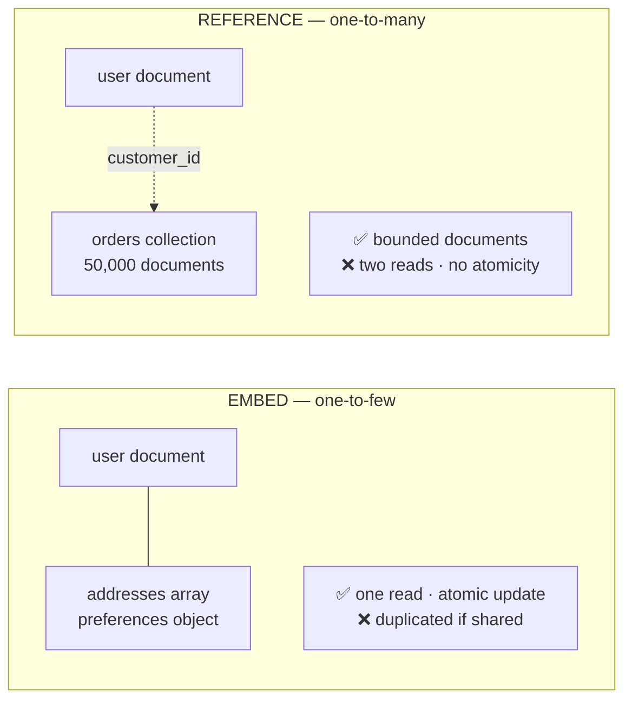

# 4.2.5 — Document Database

> **Part 4 · Data Storage · Storage · Chapter 5 of 9**
> Store the whole object as one document. One read, no joins — and one very specific trap.

---

## 🧒 ELI5 — Explain Like I'm 5

A relational database keeps a person's details **spread across several drawers**: name in one, addresses in another, orders in a third. To see everything about them you open three drawers and match things up. *(That's a join.)*

A document database keeps **one folder per person, with everything inside it**: name, all their addresses, their recent orders, all in one place. Want to see everything about Ann? **Open one folder. Done.**

That's brilliant — until two things happen:

1. **Ann orders a lot.** Her folder gets fatter and fatter, until it's too thick to lift, and you have to carry the whole thing just to read her name. *(The unbounded array problem — the classic mistake.)*
2. **The shop changes its name.** In the relational version you change it in one place. In the document version, the shop's name is written inside **fifty thousand folders**, and you have to find and change every one. *(Duplicated data is expensive to update.)*

So the rule: **put things in the same folder if they're always read together, always change together, and there aren't too many of them.** Otherwise, keep them in separate folders and store a reference.

---

## The model

```json
{
  "_id": "usr_44",
  "name": "Ann",
  "email": "ann@example.com",
  "addresses": [
    { "type": "home", "line1": "1 High St", "city": "London", "postcode": "SW1" },
    { "type": "work", "line1": "9 Tech Rd", "city": "London", "postcode": "EC2" }
  ],
  "preferences": { "theme": "dark", "notifications": { "email": true, "sms": false } },
  "created_at": "2026-01-15T10:00:00Z"
}
```

| Property | Detail |
|---|---|
| **Self-contained** | Nested objects and arrays, no joins needed |
| **Flexible schema** | Documents in one collection may differ |
| **Indexed on any field**, including nested paths and array elements |
| **Atomic per document** | Updates to a single document are atomic |

---

## Document vs relational vs key-value

| | Relational | **Document** | Key-value |
|---|---|---|---|
| Query by non-key fields | ✅ Any | ✅ Any indexed field | ❌ |
| Nested data | Requires joins | ✅ Native | Opaque |
| Schema | Enforced | Optional | None |
| Joins | ✅ | Limited (`$lookup`, slow) | ❌ |
| Transactions | ✅ Full | ✅ Multi-document (modern) | Limited |
| Horizontal scaling | Manual sharding | ✅ Built-in | ✅ Trivial |
| Read a whole entity | Several joins | ✅ **One read** | One read (if it's the key) |

🎯 **Document stores sit between the other two:** more query flexibility than key-value, better horizontal scaling and locality than relational.

---

## Embed or reference — the central decision




```json
// EMBED — one read, atomic updates
{ "_id": "order_88", "customer_name": "Ann",
  "items": [{ "sku": "A1", "qty": 2, "price_minor": 999 }] }

// REFERENCE — normalised, two reads
{ "_id": "order_88", "customer_id": "usr_44", "item_ids": ["itm_1", "itm_2"] }
```

| Embed when | Reference when |
|---|---|
| The data is always read together | It's read independently |
| It changes together (one atomic update) | It changes independently |
| The relationship is **one-to-few** (< ~100) | One-to-many or one-to-**squillions** |
| The child has no independent identity | The child is a first-class entity |
| Total document stays well under 1 MB | It would grow unbounded |
| Duplication is acceptable | The data is shared by many parents |

☠️ **The unbounded array is the #1 document-database mistake.**

```json
// BROKEN
{ "_id": "usr_44", "name": "Ann",
  "orders": [ /* ... 50,000 orders ... */ ] }
```

Consequences:
- MongoDB's document limit is **16 MB** — you will hit it and writes will simply fail.
- Every read of the user's *name* loads the entire document from disk.
- Every append rewrites the document and may **move** it, invalidating index entries.
- Concurrent appends contend on one document lock.

✅ **Fix:** orders are their own collection, referencing `user_id`. Embed only **bounded** things: a handful of addresses, a preferences object, the line items of one order.

**The rule of thumb:** *one-to-few* → embed. *One-to-many* → reference. *One-to-squillions* → reference, and index the child by parent.

---

## Schema flexibility: the honest version

⚖️ **"Schemaless" means the schema moved from the database to your application** — where it is enforced in many places instead of one, inconsistently, and often not at all.

| Genuine benefit | Real cost |
|---|---|
| No migration to add a field | Old documents lack it; every reader needs a default |
| Polymorphic documents in one collection | Application code branches on shape |
| Fast early iteration | Three years in, nobody knows what shapes exist |
| Sparse attributes without null columns | Bugs from typos in field names are silent |

**Use schema validation.** MongoDB supports JSON Schema validators; use them for anything long-lived:

```javascript
db.createCollection("users", { validator: { $jsonSchema: {
  bsonType: "object",
  required: ["email", "created_at"],
  properties: {
    email:      { bsonType: "string", pattern: "^.+@.+$" },
    created_at: { bsonType: "date" }
  }
}}})
```

🎯 **The mature position:** *"I'd use a document store for the locality benefit, but with schema validation enabled — flexible schema is useful for evolution, not for avoiding design."*

---

## Indexing

```javascript
db.users.createIndex({ email: 1 }, { unique: true })
db.users.createIndex({ "addresses.city": 1 })          // nested path
db.orders.createIndex({ user_id: 1, created_at: -1 })  // compound
db.products.createIndex({ name: "text" })              // basic text search
db.places.createIndex({ location: "2dsphere" })        // geospatial
db.users.createIndex({ email: 1 },
  { partialFilterExpression: { active: true } })       // partial
```

| Index type | Notes |
|---|---|
| Single field | Standard |
| **Compound** | Same left-to-right rule as SQL: `{a:1, b:1}` serves `a` and `a,b`, not `b` alone |
| **Multikey** (on an array) | Indexes every element — very useful, but one document can produce many index entries |
| Text | Basic; **not a substitute for Elasticsearch** |
| Geospatial | `2dsphere` for real geo queries |
| TTL | Auto-deletes documents after N seconds — excellent for sessions and events |
| Partial / sparse | Smaller indexes |

⚠️ Same rule as relational: **every index slows writes**, and multikey indexes on large arrays can be dramatically expensive.

---

## Sharding

```javascript
sh.shardCollection("app.orders", { user_id: "hashed" })
```

| Shard key strategy | Effect |
|---|---|
| **Hashed** | ✅ Even distribution; ❌ range queries hit every shard |
| **Ranged** | ✅ Range queries hit one shard; ❌ monotonic keys create a hot shard |
| **Compound** | `{tenant_id: 1, created_at: 1}` — locality per tenant with time ordering |

☠️ **Shard key selection is the highest-stakes decision**, and historically it was irreversible (MongoDB 5.0+ allows resharding, but it's an expensive operation).

**A good shard key:** high cardinality, even write distribution, and **present in most queries** — otherwise every query becomes a scatter-gather across all shards, which destroys the point of sharding.

```
Query includes the shard key  → targeted to ONE shard ✅
Query omits it                → broadcast to ALL shards ❌
```

🎯 That distinction — targeted vs broadcast queries — is the single most important operational fact about a sharded document store.

---

## Transactions and consistency

| Scope | Support |
|---|---|
| Single document | ✅ Always atomic — the reason to embed related data |
| Multi-document, single replica set | ✅ Since MongoDB 4.0 |
| Multi-document, sharded | ✅ Since 4.2, at higher cost |

**Read/write concerns** are the tuning dials:

| Setting | Meaning |
|---|---|
| `w: 1` | Acknowledged by the primary only — **can lose data on failover** |
| `w: "majority"` | ✅ Acknowledged by a majority — survives failover |
| `j: true` | Written to the journal (durable on disk) |
| `readConcern: "majority"` | Reads only majority-committed data |
| `readPreference: secondary` | Reads from a replica — faster, possibly stale |

⚠️ **`w: 1` is the MongoDB equivalent of Kafka's `acks=1`** — fast, and it silently loses acknowledged writes when a primary fails over. Use `w: "majority"` for anything that matters.

---

## The good and bad fits

| ✅ Document store fits | ❌ Prefer something else |
|---|---|
| Content management, catalogues | Complex multi-entity transactions → relational |
| User profiles with varied attributes | Heavy analytical aggregation → columnar |
| Event and activity logs (with TTL) | Many-to-many relationships → relational |
| Product catalogues with per-category attributes | Full-text search with ranking → Elasticsearch |
| Real-time collaboration state | Strict referential integrity → relational |
| Mobile/offline sync (Firestore, Couchbase) | Ad-hoc joins across entities → relational |
| Configuration and rules documents | Data whose access patterns are still unknown → relational |

---

## The Postgres JSONB counter-argument

⚖️ You can have documents *inside* a relational database:

```sql
CREATE TABLE products (
  id BIGSERIAL PRIMARY KEY,
  sku TEXT UNIQUE NOT NULL,
  attributes JSONB NOT NULL DEFAULT '{}'
);
CREATE INDEX ON products USING GIN (attributes);

SELECT * FROM products WHERE attributes @> '{"colour": "red"}';
SELECT * FROM products WHERE attributes->>'brand' = 'Acme';
```

| You get | Compared to MongoDB |
|---|---|
| Documents with indexing | ✅ Equivalent for most needs |
| **Plus** joins, foreign keys, constraints | MongoDB has none of these |
| **Plus** full ACID across tables | MongoDB: yes, but costlier |
| One system to operate | Two |
| ❌ Manual sharding | MongoDB shards natively |

🎯 **The strong position:** *"I'd use Postgres with JSONB for the flexible parts and real columns with constraints for the structured parts. I'd move to MongoDB only if I needed native horizontal sharding, which at our write volume I don't."*

---

## ☠️ Failure modes

| Mistake | Consequence |
|---|---|
| Unbounded embedded arrays | 16 MB limit hit; huge reads; document moves |
| No schema validation | Silent field-name typos; unknown shapes after two years |
| Poor shard key | Every query is a scatter-gather; a hot shard |
| Using `$lookup` as a substitute for joins | Slow, and it doesn't work well across shards |
| `w: 1` | Silent data loss on failover |
| Relying on the built-in text index for real search | Poor relevance, no faceting; use Elasticsearch |
| Duplicated data with no update path | Divergent copies of the same fact |
| Treating "schemaless" as "no design" | Unmaintainable within a year |
| Missing index on a query field | Full collection scans |

---

## 📋 Chapter checklist

| Skill | Ready? |
|---|---|
| Compare document stores to relational and key-value | ☐ |
| Apply the embed-vs-reference rules | ☐ |
| Explain the unbounded array problem and its four consequences | ☐ |
| State the honest cost of schema flexibility | ☐ |
| Name six index types and the multikey caveat | ☐ |
| Choose a shard key and explain targeted vs broadcast queries | ☐ |
| Explain write concerns and the `w: 1` hazard | ☐ |
| Make the Postgres JSONB counter-argument | ☐ |
| Name nine failure modes | ☐ |

---

**← Previous** [4.2.4 Key-value Database](04-key-value-database.md)
**Next →** [4.2.6 Full-text Search Database](06-full-text-search-database.md)
