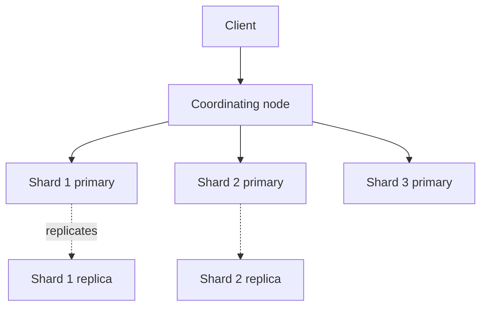
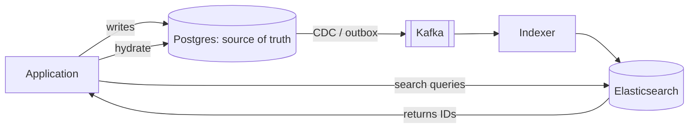

# 4.2.6 — Full-text Search Database

> **Part 4 · Data Storage · Storage · Chapter 6 of 9**
> Inverted indexes: finding documents by their contents, ranked by relevance.

---

## 🧒 ELI5 — Explain Like I'm 5

You have a thousand books and someone asks: **"which books mention dragons?"**

**The slow way:** open book 1, read every page. Open book 2, read every page. A thousand books later, you have an answer and it's next Tuesday. *(That's `LIKE '%dragon%'` — a full scan.)*

**The fast way:** build an **index at the back**, like a real book has — except one giant index for your whole library:

```
dragon  →  book 3 (p12, p88), book 17 (p4), book 402 (p6, p7, p9)
castle  →  book 3 (p1), book 88 (p44)
```

Now the answer takes a fraction of a second: look up "dragon", read the list. Done.

That flipped-around index is called an **inverted index**, and it's the whole idea.

Two extra clever bits:

- **"Dragons", "dragon", and "Dragon" should all match.** So before indexing you tidy every word down to its root form. *(Analysis: lowercase, remove punctuation, stem.)*
- **Which book is the *best* match?** One that mentions dragons 200 times is probably more about dragons than one that mentions them once. And a word that appears in *every* book (like "the") tells you nothing. *(That's relevance scoring — BM25.)*

That's a search engine: **a flipped index, plus tidying, plus a score.**

---

## The inverted index

```
Documents:
  1: "The quick brown fox"
  2: "The lazy brown dog"
  3: "Quick brown foxes jump"

Inverted index (after analysis):
  brown → [1, 2, 3]
  dog   → [2]
  fox   → [1, 3]          ← "foxes" stemmed to "fox"
  jump  → [3]
  lazi  → [2]             ← "lazy" stemmed
  quick → [1, 3]
                          ← "the" removed as a stop word
```

**Query "quick brown"** → intersect `[1,3]` and `[1,2,3]` → `[1, 3]`, then rank.

Each posting typically stores: document ID, term frequency, and positions (for phrase queries).

---

## Analysis: the pipeline that decides everything

```
"The Quick Brown FOXES!"
  → character filters   → strip HTML, normalise unicode
  → tokenizer           → ["The","Quick","Brown","FOXES"]
  → lowercase           → ["the","quick","brown","foxes"]
  → stop words          → ["quick","brown","foxes"]
  → stemming            → ["quick","brown","fox"]
  → synonyms            → ["quick","fast","brown","fox"]
  → index
```

⚠️ **The same analyser must be applied at query time.** If you index "foxes" as "fox" but search for the literal "foxes", you get nothing. Mismatched index-time and query-time analysers is the single most common "search returns no results" bug.

| Component | Choices and trade-offs |
|---|---|
| **Tokenizer** | Whitespace, standard, n-gram (substring matching), keyword (no splitting) |
| **Stemming** | Porter/Snowball (fast, crude: "university" → "univers") vs lemmatisation (accurate, slower) |
| **Stop words** | Smaller index; ❌ but breaks phrase searches like "to be or not to be" |
| **Synonyms** | "laptop" ≈ "notebook". Index-time (fast queries, reindex to change) vs query-time (flexible, slower) |
| **Language** | Per-language analysers; a field can be indexed several ways |
| **N-grams** | Enables substring and typo matching at a large index-size cost |

🎯 **Multi-field indexing is the standard technique:** index `title` three ways — as `title` (analysed for relevance), `title.keyword` (exact, for sorting and faceting), and `title.ngram` (for autocomplete). One source field, three indexes, three query capabilities.

---

## Relevance scoring

**BM25** is the modern default (an improvement on TF-IDF):

$$\text{score} = \sum_{t \in q} \text{IDF}(t) \cdot \frac{f(t,d)\cdot(k_1+1)}{f(t,d) + k_1\cdot(1 - b + b\cdot\frac{|d|}{\text{avgdl}})}$$

In plain terms, three intuitions:

| Factor | Intuition |
|---|---|
| **Term frequency** | A document mentioning "dragon" ten times is more relevant than one mentioning it once — but with **diminishing returns** (10× isn't 10× better) |
| **Inverse document frequency** | A rare word ("thaumaturgy") is far more informative than a common one ("the") |
| **Field length normalisation** | A match in a 5-word title matters more than a match in a 5,000-word body |

**Boosting** shapes results further:
```json
{ "multi_match": { "query": "wireless headphones",
                   "fields": ["title^3", "description", "brand^2"] } }
```
Title matches count triple. Combine with function scores for recency, popularity, or a business ranking.

⚠️ **Relevance tuning is empirical, not analytical.** You need judgement data, click-through metrics, and A/B tests. Anyone who claims a boost configuration is "correct" without measuring is guessing.

---

## What search engines do that databases can't

| Capability | Detail |
|---|---|
| **Relevance ranking** | Results ordered by how well they match, not by a column |
| **Fuzzy matching** | Typo tolerance via edit distance (`fuzziness: AUTO`) |
| **Phrase and proximity** | `"quick brown"~2` — words near each other |
| **Faceted navigation** | Counts per category, computed with the results |
| **Autocomplete** | Edge n-grams or completion suggesters |
| **Highlighting** | Show the matching snippet with terms marked |
| **Multi-language** | Per-language analysis |
| **"Did you mean?"** | Spell correction from the index |
| **Aggregations** | Histograms, percentiles, cardinality over matching documents |
| **Vector / semantic search** | kNN over embeddings — meaning, not keywords |

🎯 **Faceting is the underrated one.** "Show 1,247 results, of which 412 are Electronics, 88 under £50, 610 in stock" — computed in the same pass as the search. Reproducing that in SQL means many separate `COUNT` queries and it doesn't scale.

---

## Elasticsearch / OpenSearch architecture



| Concept | Meaning |
|---|---|
| **Index** | A logical collection of documents (like a table) |
| **Shard** | A Lucene index; the unit of scaling. **Fixed at index creation** |
| **Replica** | A copy — provides HA and extra read throughput |
| **Segment** | Immutable Lucene files, merged in the background — the same idea as [SSTables](../01-data-structures-behind-databases/03-sstable.md) |
| **Refresh** | Makes new documents searchable. **Default: every 1 second** |
| **Coordinating node** | Fans a query out to shards and merges the results |

**How a query executes:** the coordinating node sends the query to one copy of every shard; each returns its top N by score; the coordinator merges and returns the global top N. This is scatter-gather, and it means **query latency is bounded by the slowest shard**.

⚠️ **Elasticsearch is near-real-time, not real-time.** A document is searchable after the next refresh (1 s by default). For bulk loading, set `refresh_interval: -1` and refresh once at the end — this can make indexing several times faster.

### Shard sizing

| Guidance | Reason |
|---|---|
| 10–50 GB per shard | Larger shards are slow to recover and rebalance |
| Shards ≈ nodes × 1–3 | Too many shards means per-shard overhead dominates |
| **Cannot change shard count** without reindexing | Plan ahead; use rollover indices for time-series |
| Use **time-based indices** for logs (`logs-2026.08.31`) | Delete old data by dropping an index — instant |

☠️ **Over-sharding is the classic Elasticsearch mistake:** 1,000 shards for 10 GB of data. Each shard carries memory and file-handle overhead, cluster state grows, and every query fans out 1,000 ways. **Fewer, larger shards is almost always better.**

---

## Search is a derived store, never the source of truth



| Rule | Reason |
|---|---|
| **Never make the search engine the source of truth** | No transactions, no constraints, eventual consistency, and reindexing is routine |
| **Feed it via CDC or an outbox** | Dual writes silently diverge |
| **Must be rebuildable from scratch** | You *will* change the mapping, and mappings are largely immutable |
| **Return IDs, hydrate from the primary** | Search finds; the database provides authoritative current data |

⚠️ **Reindexing is a normal operation, not an emergency.** Elasticsearch mappings can't be changed for existing fields, so any analyser or type change requires building a new index. Use **aliases** so you can swap atomically:

```
alias "products" → products_v3      (live)
build products_v4, backfill, verify
atomically move the alias → products_v4
delete products_v3
```

---

## Do you actually need a search engine?

⚖️ **Postgres full-text search is genuinely good** up to a point:

```sql
ALTER TABLE products ADD COLUMN ts tsvector
  GENERATED ALWAYS AS (to_tsvector('english', title || ' ' || description)) STORED;
CREATE INDEX ON products USING GIN (ts);

SELECT * FROM products
WHERE ts @@ websearch_to_tsquery('english', 'wireless headphones')
ORDER BY ts_rank(ts, websearch_to_tsquery('english', 'wireless headphones')) DESC;
```

Plus `pg_trgm` for fuzzy matching and `pgvector` for semantic search.

| Stay with Postgres when | Move to Elasticsearch when |
|---|---|
| < a few million documents | Tens of millions or more |
| Simple relevance is acceptable | Relevance tuning is a product requirement |
| No faceting, or simple `GROUP BY` counts | Rich faceted navigation |
| One language | Many languages |
| Search is a secondary feature | Search **is** the product |
| You value one system | You need aggregations, highlighting, suggesters |

🎯 **Strong interview answer:** *"I'd start with Postgres full-text search — GIN on a tsvector column — because it avoids a second system and a sync pipeline. I'd move to Elasticsearch when we need faceting, typo tolerance, and real relevance tuning, or past roughly ten million documents. And when I do, it's a derived store fed by CDC, rebuildable from the primary."*

---

## Vector / semantic search

Modern search increasingly combines keyword and embedding-based retrieval:

| | Keyword (BM25) | Vector (kNN) |
|---|---|---|
| Matches | Exact terms | **Meaning** |
| "car" finds | "car" | "automobile", "vehicle" |
| Explainable | ✅ Yes | ❌ Opaque |
| Cold start | ✅ Works immediately | Needs an embedding model |
| Cost | Cheap | Embedding generation + ANN index memory |

**Hybrid search** runs both and fuses the rankings (Reciprocal Rank Fusion is the common method). It is the current default for high-quality search: keyword search handles exact terms, IDs, and rare words; vector search handles paraphrase and intent.

Options: Elasticsearch/OpenSearch kNN, `pgvector`, or a dedicated vector store (Pinecone, Qdrant, Weaviate, Milvus).

---

## ☠️ Failure modes

| Mistake | Consequence |
|---|---|
| Search engine as the source of truth | Data loss; no transactions |
| Dual writes instead of CDC | Silent divergence |
| Mismatched index/query analysers | Queries return nothing, mysteriously |
| Over-sharding | Cluster overhead dominates; slow queries |
| No index aliases | Reindexing requires downtime |
| Deep pagination (`from: 10000`) | ES refuses past 10k by default — use `search_after` |
| Unbounded aggregations on high-cardinality fields | Memory blow-up, circuit breaker trips |
| Indexing everything, including huge blobs | Index size explodes; slow merges |
| Relying on default relevance for a search product | Poor results; needs measurement and tuning |
| No `refresh_interval` tuning during bulk load | Indexing many times slower than necessary |

---

## 📋 Chapter checklist

| Skill | Ready? |
|---|---|
| Draw an inverted index from three documents | ☐ |
| List the analysis pipeline stages | ☐ |
| Explain the analyser-mismatch bug | ☐ |
| Explain the three intuitions behind BM25 | ☐ |
| Name ten capabilities databases lack | ☐ |
| Explain shards, replicas, segments, and refresh | ☐ |
| State shard sizing guidance and the over-sharding mistake | ☐ |
| Explain why search must be a derived store | ☐ |
| Describe alias-based reindexing | ☐ |
| Argue Postgres FTS vs Elasticsearch with thresholds | ☐ |
| Explain hybrid keyword + vector search | ☐ |

---

**← Previous** [4.2.5 Document Database](05-document-database.md)
**Next →** [4.2.7 OLTP vs OLAP](07-oltp-vs-olap.md)
