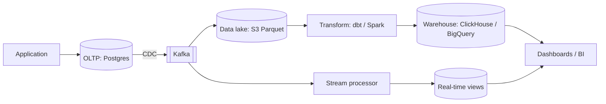

# 4.2.7 — OLTP or OLAP?

> **Part 4 · Data Storage · Storage · Chapter 7 of 9**
> Two workloads so different that they need different databases, different hardware, and different teams.

---

## 🧒 ELI5 — Explain Like I'm 5

Two completely different jobs, both involving "the shop's data."

**Job 1 — the till.** Someone buys a chocolate bar. You need to: take the money, subtract one chocolate bar from stock, print a receipt. **Small, fast, exact, thousands of times a day.** If you get it wrong, a real person is standing there upset. *(That's OLTP — transactions.)*

**Job 2 — the manager's question.** *"What did we sell, by category, by month, for the last three years?"* You need to look at **every single receipt ever printed**, but only two columns of each: what and when. **Enormous, slow, occasional, and approximately-right-is-fine.** *(That's OLAP — analytics.)*

Now the important bit: **if the manager runs their giant question on the till, the till stops working.** Customers queue up while the till chews through three years of receipts.

So you keep **two copies**: the till's live data, and a separate pile of all the old receipts for the manager. They're organised completely differently — the till keeps whole receipts together, the manager's pile is sorted into "all the whats" and "all the whens" so counting is fast.

**Two jobs. Two databases. Never the same one.**

---

## The two workloads

| | **OLTP** (transactional) | **OLAP** (analytical) |
|---|---|---|
| Purpose | Run the business | Understand the business |
| Query shape | Read/write a few rows by key | Scan billions of rows, few columns |
| Rows touched | 1–100 | Millions to billions |
| Columns touched | All of them | 2–10 of 200 |
| Writes | Constant, small, transactional | Bulk load or stream append |
| Latency target | < 10 ms | Seconds to minutes |
| Concurrency | Thousands of users | Dozens of analysts |
| Data volume | GB to a few TB | TB to PB |
| Data age | Current state | Full history |
| Consistency | Strong, ACID | Eventual is fine; hours stale often fine |
| Storage layout | **Row-oriented** | **Column-oriented** |
| Indexes | Many, B-tree | Few; zone maps and min/max statistics |
| Examples | Postgres, MySQL, DynamoDB | ClickHouse, BigQuery, Snowflake, Redshift, DuckDB |

---

## Why the storage layout differs

```
Row store (OLTP):
  [id1|name1|city1|age1|salary1][id2|name2|city2|age2|salary2]...
  → reading one whole row is one contiguous read ✅
  → reading one column means touching every row ❌

Column store (OLAP):
  [id1,id2,id3,...][name1,name2,...][city1,city2,...][age1,age2,...]
  → reading one column is one contiguous read ✅
  → reading a whole row means gathering from N files ❌
```

**Worked example:** `SELECT AVG(salary) FROM employees` over 1 billion rows with 50 columns.

| | Row store | Column store |
|---|---|---|
| Bytes read | All 50 columns ≈ **200 GB** | Just `salary` ≈ **8 GB** |
| After compression | ~150 GB | ✅ **~0.8 GB** (10× — similar values adjacent) |
| Time at 1 GB/s | ~150 s | ✅ **~1 s** |

🔢 **A 150× difference on the same query and the same data.** That is why analytical databases are columnar, and it's the number to quote.

### Why columns compress so well

Adjacent values in a column are similar, which is exactly what compression exploits:

| Technique | Example |
|---|---|
| **Run-length encoding** | `[UK,UK,UK,UK,US,US]` → `[(UK,4),(US,2)]` |
| **Dictionary encoding** | 200 distinct cities → 1-byte codes instead of strings |
| **Delta encoding** | Sorted timestamps → store differences, tiny numbers |
| **Bit packing** | Values 0–7 need 3 bits, not 32 |
| **Frame of reference** | Store an offset from a block minimum |

🔢 **10–50× compression is routine on real analytical data**, versus 2–3× for row stores. Less data on disk means less I/O, which is most of the speedup.

---

## Other OLAP techniques worth naming

| Technique | Effect |
|---|---|
| **Vectorised execution** | Process 1,000 values per CPU instruction batch instead of row-at-a-time — 10–100× on CPU-bound aggregation |
| **Late materialisation** | Filter on compressed columns first; only decode the rows that survive |
| **Zone maps / min-max statistics** | Skip whole blocks that can't match the predicate — no index needed |
| **Partition pruning** | `WHERE date >= '2026-08'` reads only those partitions |
| **Sort keys / clustering** | Physically order data so range filters read contiguous blocks |
| **Materialised views / rollups** | Pre-aggregate common queries |
| **Massively parallel processing (MPP)** | Split the scan across dozens of nodes |
| **Separation of storage and compute** | Scale query power independently of data volume (Snowflake, BigQuery) |

🎯 **Zone maps are the elegant one.** A column store keeps min/max per block; a query filtering on `date` skips 99% of blocks without any index, purely from statistics. It's why column stores need few indexes.

---

## Never run OLAP on your OLTP database

☠️ **The incident:** an analyst runs `SELECT ... GROUP BY ...` over three years of orders on the production primary. It:

- Reads hundreds of GB, **evicting the entire buffer pool** — every subsequent transactional query goes to disk.
- Saturates disk and CPU, so p99 for the checkout path goes from 20 ms to 4 s.
- Holds a long-running transaction, which **blocks vacuum** and causes table bloat.
- On a replica, it can cause replay conflicts that either cancel the query or stall replication.

**Checkout stops working because someone asked a business question.**

| Fix | Notes |
|---|---|
| **A dedicated analytics replica** | ✅ Simplest good answer. Isolates the load; accept higher lag on that replica |
| **A real warehouse fed by CDC/ETL** | ✅ The right long-term answer |
| Query timeouts + resource groups on the primary | A guardrail, not a solution |
| Materialised views refreshed off-peak | Good for a known, small set of queries |

---

## The pipeline



| Stage | Purpose |
|---|---|
| **CDC** | Capture every change without touching the OLTP database's query capacity |
| **Data lake** | Cheap, immutable raw storage (Parquet on object storage) |
| **Transform** | Clean, join, model into analytical tables |
| **Warehouse** | Serve fast aggregations |
| **Stream path** | Sub-minute freshness for real-time dashboards |

⚠️ **Freshness is the design decision here.** Batch ETL gives hours; CDC + streaming gives seconds — at considerably more complexity. **Ask what freshness the business actually needs** before building a streaming pipeline; "daily" is a very common and much cheaper answer.

---

## HTAP — can one system do both?

| System | Approach |
|---|---|
| **TiDB** | Row store (TiKV) + columnar replica (TiFlash), same transactions |
| **SingleStore** | Rowstore + columnstore tables in one engine |
| **Postgres + Citus / cstore** | Columnar extension |
| **DuckDB** | Embedded OLAP; queries Parquet directly — excellent alongside an OLTP database |
| **Snowflake Unistore / Aurora zero-ETL** | Managed convergence |

⚖️ **HTAP is real but not free.** You pay in cost and complexity, and the analytical side rarely matches a dedicated warehouse. **The pragmatic answer for most systems:** OLTP database + CDC + a warehouse. Reach for HTAP when you genuinely need transactional consistency *inside* analytical queries.

🎯 **DuckDB is worth naming for a different reason:** for datasets up to a few hundred GB, an embedded columnar engine querying Parquet files gives warehouse-class analytics with **no cluster at all**. Many "we need a data warehouse" requirements are actually "we need DuckDB and some Parquet files."

---

## Choosing, by question

| Question the system must answer | Store |
|---|---|
| "What is Ann's current balance?" | OLTP |
| "Charge this card and create the order" | OLTP |
| "Show this user's last 20 orders" | OLTP |
| "Revenue by product category by month, last 3 years" | OLAP |
| "Which customers are likely to churn?" | OLAP |
| "How many unique visitors yesterday?" | OLAP |
| "Live count of orders in the last 5 minutes" | Stream processing → real-time view |
| "Full-text search the catalogue" | Search engine |
| "Metrics for the last hour, by host" | Time-series |

⚠️ **Notice the last three aren't OLTP or OLAP.** The dichotomy is useful but incomplete — real systems also have streaming, search, and time-series workloads, each with its own store.

---

## Cost models differ too

| | OLTP | OLAP |
|---|---|---|
| Priced by | Instance size (always on) | Data scanned (BigQuery), or compute-seconds (Snowflake), or nodes (ClickHouse) |
| Optimisation lever | Right-size the instance; add read replicas | **Reduce bytes scanned**: partition, cluster, select fewer columns |
| Typical surprise | Storage growth | **A single `SELECT *` over a petabyte table** costing hundreds of dollars |

🔢 On BigQuery at ~$5/TB scanned, `SELECT * FROM events` over a 200 TB table costs **$1,000 — for one query**. Partitioning and clustering aren't just performance features there; they're the cost control. This is a favourite real-world gotcha.

---

## 📋 Chapter checklist

| Skill | Ready? |
|---|---|
| Contrast OLTP and OLAP across ten dimensions | ☐ |
| Do the row-vs-column bytes-read calculation | ☐ |
| Name five columnar compression techniques | ☐ |
| Explain vectorised execution and zone maps | ☐ |
| Narrate the analytics-on-the-primary incident with four consequences | ☐ |
| Draw the CDC → lake → warehouse pipeline | ☐ |
| State when HTAP is and isn't worth it | ☐ |
| Name DuckDB and when it replaces a warehouse | ☐ |
| Classify nine questions to the right store | ☐ |
| Explain OLAP cost models and the `SELECT *` trap | ☐ |

---

**← Previous** [4.2.6 Full-text Search Database](06-full-text-search-database.md)
**Next →** [4.2.8 Blob/Object Storage](08-blob-object-storage.md)
