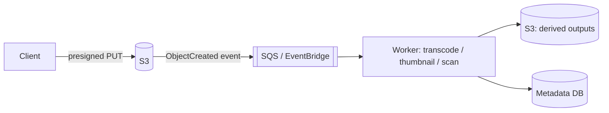

# 4.2.8 — Blob / Object Storage

> **Part 4 · Data Storage · Storage · Chapter 8 of 9**
> Effectively infinite, extremely cheap, extremely durable, and not a filesystem.

---

## 🧒 ELI5 — Explain Like I'm 5

Object storage is **a gigantic self-storage warehouse.**

You bring a box, you write a label on it, and they put it somewhere. Later you say the label and they bring you **the whole box**. That's it.

Three things make it wonderful:

1. **It's effectively infinite.** You will never fill it. One box or a billion boxes, the warehouse doesn't care.
2. **It's incredibly cheap.** About a fiftieth the cost of keeping things in your house.
3. **They never lose a box.** They secretly keep several copies in different buildings.

And three things make it *not* a filing cabinet:

1. **You can only ask by label.** There's no "find me all the boxes with red things in them."
2. **You can't open a box and change one item.** You take the whole box away, change it, and bring back a whole new box. *(Objects are immutable — no partial writes.)*
3. **It's a bit slow to fetch.** Not slow like "next week" — slow like "a moment," rather than "instantly." Fine for photos, hopeless for something you need a thousand times a second.

So: **big things you write once and read whole.** Photos, videos, backups, logs. Not your shopping list.

---

## The model

```
bucket / key  →  bytes + metadata

s3://my-app/videos/vid_88/original.mp4
s3://my-app/users/44/avatar.jpg
s3://my-app/backups/2026-08-31/db.dump.gz
```

| Property | Detail |
|---|---|
| **Flat namespace** | "Folders" are an illusion — `/` is just a character in the key. Listing by prefix simulates directories |
| **Immutable objects** | No partial writes or appends; you replace the whole object |
| **Metadata** | Content-Type, cache headers, and custom key-value tags |
| **Versioning** | Optional; keeps previous versions of a key |
| **Durability** | ~99.999999999% (11 nines) — erasure-coded across multiple facilities |
| **Availability** | 99.9–99.99% depending on the storage class |
| **Consistency** | ✅ Read-after-write strong consistency (S3 since Dec 2020) |

⚠️ **Historically S3 was eventually consistent for overwrites and lists**, and much older design advice works around that. It no longer applies — S3 is now strongly read-after-write consistent. Saying so correctly is a small but real signal of currency.

---

## What object storage is not

| It is not | Because |
|---|---|
| A filesystem | No partial writes, no atomic rename, no real directories, no `fsync` semantics |
| A database | No queries, no transactions, no secondary indexes |
| Low latency | 10–100 ms first byte, vs microseconds for a disk |
| Cheap for tiny objects | Per-request costs dominate; millions of 1 KB objects are inefficient |
| A queue | No ordering, no delivery semantics (though events can trigger one) |

☠️ **The mounted-bucket anti-pattern.** Tools like `s3fs` present a bucket as a filesystem. It appears to work, then fails: a "partial write" downloads and re-uploads the entire object, "rename" is a copy plus delete, there's no locking, and latency is 1000× a real disk. **Use the API, not a mount.**

---

## The blob + metadata pattern

**Never store large binaries in a database.** Split them:

```
Postgres (metadata):
  videos(id, owner_id, title, status, s3_key, size_bytes, content_type, created_at)

S3 (bytes):
  s3://media/videos/{id}/original.mp4
  s3://media/videos/{id}/720p.m3u8
```

| Reason | Detail |
|---|---|
| **Cost** | S3 ~$0.023/GB-month vs ~$0.10 for database block storage — 4× |
| **Backups** | A 50 TB database dump is unmanageable; S3 versioning is instant |
| **Buffer pool** | Blobs in the database evict useful index pages |
| **Replication** | Every database replica would carry a full copy of every blob |
| **Delivery** | S3 + CDN streams bytes; your API tier never touches them |

---

## Presigned URLs: keep bytes off your servers

☠️ **Wrong:** the client uploads a 2 GB video to your API, which forwards it to S3. Your API tier now needs bandwidth, memory, and long-lived connections proportional to upload volume — and a 2 GB upload occupies a worker for minutes.

✅ **Right:** the API issues a short-lived signed URL; the client uploads **directly** to S3.

```python
# Upload
url = s3.generate_presigned_url(
    "put_object",
    Params={"Bucket": "media", "Key": f"videos/{vid}/original.mp4",
            "ContentType": "video/mp4"},
    ExpiresIn=900)                       # 15 minutes
# Client: PUT <url> with the bytes. Your servers never see them.

# Download (private content)
url = s3.generate_presigned_url(
    "get_object",
    Params={"Bucket": "media", "Key": key},
    ExpiresIn=3600)
```

| Benefit | Detail |
|---|---|
| Zero bandwidth through your API | Enormous cost and capacity saving |
| Scales with S3, not with your fleet | 10,000 concurrent uploads is fine |
| Time-limited access to private objects | Better than making objects public |

⚠️ **Presigned URLs are bearer credentials.** Anyone with the URL has that access until it expires. Keep expiry short, scope the URL to one key and one method, and never log them.

**For large files use multipart upload**: split into parts (5 MB–5 GB each), upload in parallel, retry individual parts, and complete. Required above 5 GB and much faster below it.

---

## Storage classes and lifecycle

| Class | Cost/GB-month | Retrieval | Use |
|---|---|---|---|
| Standard | ~$0.023 | Instant, free | Active data |
| Intelligent-Tiering | ~$0.023 → $0.004 | Instant | ✅ Unknown access patterns — it moves objects automatically |
| Standard-IA | ~$0.0125 | Instant + per-GB fee | Backups, older data |
| One Zone-IA | ~$0.01 | Instant + fee | Reproducible data only (single AZ) |
| Glacier Instant | ~$0.004 | Instant + fee | Archives read occasionally |
| Glacier Flexible | ~$0.0036 | Minutes–hours | Compliance archives |
| Deep Archive | ~$0.00099 | 12+ hours | Long-term legal retention |

```json
{ "Rules": [{
    "Id": "tier-and-expire",
    "Status": "Enabled",
    "Transitions": [
      { "Days": 30,  "StorageClass": "STANDARD_IA" },
      { "Days": 90,  "StorageClass": "GLACIER_IR" },
      { "Days": 365, "StorageClass": "DEEP_ARCHIVE" }],
    "Expiration": { "Days": 2555 }
}]}
```

🔢 **1 PB in Standard = ~$23,000/month. The same petabyte in Deep Archive = ~$1,000/month.** A lifecycle policy is a few lines of JSON and is routinely one of the largest cost savings available in a cloud bill.

⚠️ **Watch the hidden costs:** IA and Glacier classes charge for **retrieval** and have **minimum storage durations** (30/90/180 days). Moving objects that are then read frequently, or deleted early, costs *more* than Standard. Tier by measured access patterns, not by hope.

---

## Performance

| Aspect | Reality |
|---|---|
| First-byte latency | 10–100 ms (Standard) |
| Throughput per object | ~100 MB/s+; use ranged GETs in parallel for more |
| Request rate | Very high per prefix (S3: 3,500 PUT/s, 5,500 GET/s **per prefix**) |
| Parallelism | ✅ Effectively unlimited across keys |

⚠️ **The prefix rate limit is per key prefix.** If every object is under `uploads/2026-08-31/...`, that date prefix becomes a hotspot. **Spread keys across prefixes** (a hash prefix, or reversed timestamps) for very high request rates. Modern S3 auto-scales prefixes, but not instantly — a sudden burst on one prefix still throttles.

**Range requests** enable partial reads:
```http
GET /video.mp4
Range: bytes=1048576-2097151
```
This is how video seeking works, and how a query engine reads one column group from a Parquet file without downloading the whole object.

---

## Object storage as a data lake

```
s3://lake/events/year=2026/month=08/day=31/hour=10/part-0001.parquet
```

| Element | Purpose |
|---|---|
| **Parquet / ORC** | Columnar, compressed, with embedded statistics |
| **Hive-style partitioning** | `year=/month=/day=` lets engines prune by path |
| **Table formats** (Iceberg, Delta Lake, Hudi) | Add ACID transactions, schema evolution, and time travel *on top of* object storage |
| **Query engines** | Athena, Trino, Spark, DuckDB read directly from the lake |

🎯 **Table formats are the significant development.** Historically a data lake was "files in a bucket" with no transactions and no safe schema changes. Iceberg and Delta Lake add a metadata layer giving atomic commits, snapshot isolation, and time travel — turning object storage into a genuine analytical table store at a fraction of a warehouse's cost. Naming Iceberg in a data-platform discussion is a strong signal.

---

## Durability, availability, and what they don't cover

| Guarantee | Meaning |
|---|---|
| **11 nines durability** | Erasure coding across ≥3 facilities; hardware loss is effectively impossible |
| **99.99% availability** | The service may be briefly unreachable |
| **Versioning** | Recover from overwrite or accidental delete |
| **Object Lock / WORM** | Immutable for a retention period — ransomware and compliance protection |
| **Cross-region replication** | Regional disaster protection |

☠️ **Durability does not protect you from yourself.** The realistic risks are: a bad deploy overwriting objects, a script deleting a prefix, ransomware, or a compromised credential. **Enable versioning and MFA-delete on important buckets**, and use Object Lock where the data is irreplaceable. "S3 is durable" is not a backup strategy.

---

## Security

| Control | Purpose |
|---|---|
| **Block Public Access** | ✅ On by default now; leave it on. Public buckets are the classic breach headline |
| Bucket policies + IAM | Least privilege per prefix |
| Presigned URLs | Time-limited access without making objects public |
| **SSE-S3 / SSE-KMS** | Encryption at rest; KMS gives per-key access control and audit |
| Client-side encryption | The provider never sees plaintext |
| Access logging / CloudTrail | Who read what, when |
| VPC endpoints | Traffic never traverses the public internet |

⚠️ **Serve private content via CDN with signed URLs or signed cookies**, not by making objects public. And when you serve user-uploaded content, **use a separate domain** — otherwise a malicious upload can execute JavaScript in your application's origin.

---

## Event-driven processing



Object storage emits events on create/delete, which makes it a natural pipeline trigger: upload → event → process → write derived outputs → update metadata.

⚠️ **Events are at-least-once and can be out of order.** Make handlers idempotent — key derived outputs deterministically (`{id}/720p.mp4`) so a reprocess simply overwrites.

---

## When object storage is the wrong tool

| Situation | Better |
|---|---|
| Frequent small updates to the same data | Database |
| Queries by content or attributes | Database or search engine |
| Sub-millisecond reads | Cache or in-memory store |
| Millions of tiny objects | Pack into larger files; per-request cost dominates |
| Strict ordering or transactions across objects | Database, or a table format like Iceberg |
| A POSIX filesystem is genuinely required | EFS / FSx / a real filesystem |

---

## 📋 Chapter checklist

| Skill | Ready? |
|---|---|
| State the model and its five properties | ☐ |
| Say what object storage is not, and why `s3fs` is an anti-pattern | ☐ |
| Explain the blob + metadata split with five reasons | ☐ |
| Write a presigned upload flow and state the security caveat | ☐ |
| Quote storage class costs and compute a lifecycle saving | ☐ |
| Name the hidden retrieval and minimum-duration costs | ☐ |
| Explain prefix rate limits and key spreading | ☐ |
| Explain range requests and where they're used | ☐ |
| Describe a Parquet data lake and name a table format | ☐ |
| Explain why 11 nines isn't a backup strategy | ☐ |
| List six security controls | ☐ |

---

**← Previous** [4.2.7 OLTP vs OLAP](07-oltp-vs-olap.md)
**Next →** [4.2.9 SQL vs NoSQL](09-sql-vs-nosql.md)
