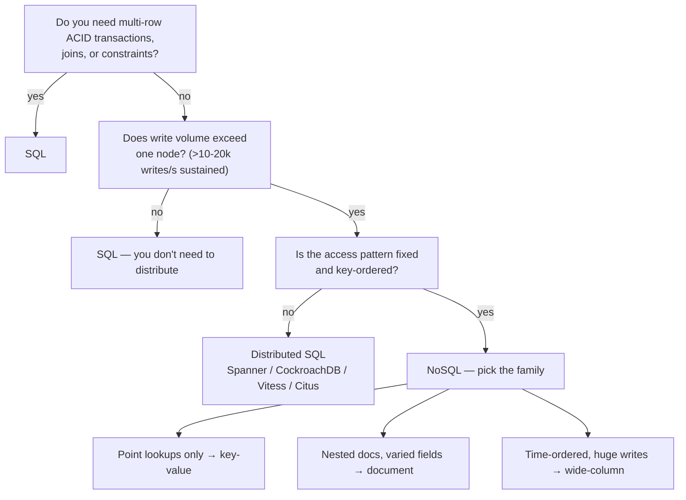
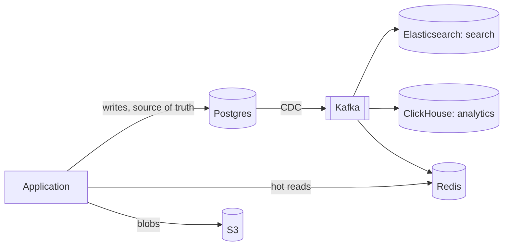

# 4.2.9 — SQL vs NoSQL

> **Part 4 · Data Storage · Storage · Chapter 9 of 9**
> The decision, made properly. This is the chapter to reread before an interview.

---

## 🧒 ELI5 — Explain Like I'm 5

Everyone argues about this like it's football teams. It isn't. It's **one honest question**:

> **"Do I know exactly what questions I'll ask, forever?"**

- **No, I'll ask all sorts of things and I'm still figuring the product out** → use the strict filing cabinet (SQL). It lets you change your mind. It checks your work. It's one machine, but that machine is far bigger than you think.

- **Yes, I know precisely: always by customer ID, always newest first, and there will be a hundred thousand of them per second** → use the specialised system (NoSQL). Enormously fast at that one thing. Useless at anything else. Changing your mind later means rebuilding.

That's genuinely it. Everything else — "web scale", "modern", "flexible" — is noise.

And the honest secret: **most systems that chose NoSQL didn't need to**, and paid for it later when the product changed.

---

## The decision tree

⚠️ **Note where the tree lands most often.** Two of the first three branches end at SQL, and that reflects reality.

---

## The honest comparison

| Dimension | SQL | NoSQL |
|---|---|---|
| **Query flexibility** | ✅ Any query, any time | Only the designed access patterns |
| **Joins** | ✅ Native | Manual, or denormalise |
| **Transactions** | ✅ Full ACID, multi-table | Single-key, or limited/expensive multi-key |
| **Constraints** | ✅ Enforced by the database | Application's responsibility |
| **Schema evolution** | Migrations (well-tooled) | ✅ Add fields freely (and handle old shapes forever) |
| **Write scaling** | Vertical, then manual sharding | ✅ Horizontal, native |
| **Read scaling** | Replicas + cache | ✅ Horizontal |
| **Predictable latency at scale** | Degrades as the working set exceeds RAM | ✅ Consistent |
| **Multi-region writes** | Hard | ✅ Often built in |
| **Operational maturity** | ✅ 40 years of tooling | Younger, more variable |
| **Talent availability** | ✅ Everyone knows SQL | Specialist |
| **Cost at small scale** | ✅ Cheap | Managed options are fine; self-hosted clusters aren't |
| **Cost at huge scale** | Expensive to shard | ✅ Linear |

---

## The single-node ceiling — know these numbers

The decision usually hinges on "can one node do it?" 🔢 For a modern well-tuned server:

| Metric | Realistic ceiling |
|---|---|
| Indexed point reads | 20,000–50,000 QPS |
| Simple writes (durable) | 5,000–20,000 QPS |
| Complex joins | 100–2,000 QPS |
| Dataset (with a cacheable working set) | 5–50 TB |
| Connections | Hundreds (with a pooler) |

**Add caching and read replicas and the effective read ceiling rises by 10–100×.** The *write* ceiling is the one that actually forces sharding.

🎯 **The framing to use:** *"Sharding is forced by write volume or dataset size, not by read volume — reads are solved by caching and replicas. So the question is: do we exceed ~20,000 sustained writes per second, or ~10 TB? If not, one Postgres primary is the right answer."*

---

## Worked decisions

| System | Choice | Reasoning |
|---|---|---|
| **E-commerce orders** | **SQL** | Money, inventory, and referential integrity. Transactions are the point. Volume is modest — even Amazon-scale order rates are ~2,000/s |
| **User accounts / auth** | **SQL** | Unique constraints, transactional updates, small dataset |
| **Product catalogue** | **SQL** (+ Elasticsearch for search) | Rich queries, moderate volume, complex filtering |
| **Session store** | **KV (Redis)** | Key lookups, TTL, disposable |
| **Chat messages** | **Wide-column (Cassandra)** | ~1M writes/s, always keyed by conversation + time, append-only |
| **Activity feed** | **KV / wide-column** | Precomputed timelines, key lookups only |
| **IoT / metrics** | **Time-series** | Extreme write rate, time-range queries, downsampling |
| **Analytics** | **Columnar** | Aggregations over billions of rows |
| **Media files** | **Object storage** + SQL metadata | Blobs never in a database |
| **Social graph** | **Graph** or adjacency lists in KV | Multi-hop traversal |
| **Payments ledger** | **SQL** | Correctness above all; volume is never the problem |
| **Ad click events** | **Log → columnar** | Massive append volume, analytical reads |

⚠️ **Notice the pattern:** anything with money, invariants, or evolving requirements → SQL. Anything with enormous append volume and a fixed key-ordered access pattern → NoSQL. Anything analytical → columnar.

---

## The polyglot answer (usually correct)

**The four rules that keep it manageable** (from [Introduction to Storage](01-introduction-to-storage.md)):

1. One source of truth per fact.
2. Derive everything else via CDC or events — **never dual writes**.
3. Every derived store must be rebuildable from scratch.
4. Each additional store has a real operational cost — justify it individually.

🎯 **The strongest interview answer is usually polyglot, stated with restraint:** *"Postgres as the source of truth, Redis for hot reads, S3 for media. If search becomes a product requirement I'd project into Elasticsearch via CDC. I wouldn't add a distributed database unless write volume forces it."*

---

## Distributed SQL — the third option people forget

You are not limited to "one Postgres" or "give up SQL":

| System | What it gives you |
|---|---|
| **Google Spanner** | Global ACID, external consistency (TrueTime), SQL. Expensive |
| **CockroachDB** | Postgres wire-compatible, Raft-replicated, survives node and region loss |
| **YugabyteDB** | Similar; Postgres-compatible |
| **Vitess** | Sharded MySQL — powers YouTube and Slack |
| **Citus** | Postgres extension for sharding |
| **PlanetScale** | Managed Vitess |
| **TiDB** | MySQL-compatible, with a columnar replica for HTAP |

⚖️ **These give horizontal write scaling *and* SQL semantics** — at the cost of higher write latency (consensus per write, typically 5–20 ms), more operational complexity, and a higher bill.

**They are often the right answer** when you've outgrown a single node but genuinely need transactions and joins. Mentioning them prevents the false dichotomy, and it's a strong signal that you know the space.

---

## Migration difficulty (choose knowing this)

| Direction | Difficulty | Notes |
|---|---|---|
| SQL → SQL (bigger box, replicas, partitions) | ✅ Easy | No model change |
| SQL → sharded SQL (Citus, Vitess) | Medium | Requires a shard key; some queries change |
| SQL → distributed SQL | Medium | Mostly compatible; latency changes |
| SQL → NoSQL | ❌ **Hard** | Remodel around access patterns; joins must be denormalised; transactions must become sagas |
| NoSQL → SQL | Medium | Data is already denormalised; you gain flexibility |
| **Adding a derived store** | ✅ Easy | The polyglot path — additive, reversible |

🎯 **This asymmetry is the practical argument for starting with SQL.** Starting relational and adding specialised stores later is straightforward. Starting with Cassandra and later needing ad-hoc queries is a rewrite.

---

## What to say in an interview

**The structure:**

> "The access patterns are **[X]**, at **[N] writes/s** and **[S] TB**, needing **[consistency]**.
> A single Postgres primary handles roughly 20,000 writes/s and tens of TB, so **[we're comfortably under / we exceed]** that.
> Therefore **[choice]**, because **[the property that decides it]**.
> The cost is **[what I'm giving up]**, and if **[condition]** changes I'd revisit by **[migration path]**."

**Worked — a chat system:**

> "Writes are the dominant pattern: 80 billion messages a day is about 1 million writes per second, always keyed by conversation and always time-ordered, and reads are almost always 'recent messages in this conversation'. That's far past a single node, and the access pattern is fixed and key-ordered — so **Cassandra**, partitioned by `conversation_id` with `sent_at` as the clustering key. LSM storage makes those appends sequential, and it scales linearly with nodes.
>
> I'd reject sharded Postgres because I'd be building the sharding layer myself for no benefit — I don't need joins or multi-row transactions on the message path.
>
> The cost is that every access pattern has to be designed into the key up front; a new one means a new table and a backfill. And message *metadata* that does need transactions — user accounts, group membership, billing — stays in Postgres."

⚠️ **That last sentence is what makes it a senior answer:** different data in the same product gets different stores, for stated reasons.

---

## The myths, corrected

| Myth | Reality |
|---|---|
| "SQL can't scale" | It scales vertically very far, and horizontally with Citus/Vitess/CockroachDB |
| "NoSQL is faster" | Faster *for its designed pattern*; often much slower otherwise |
| "NoSQL is schemaless" | The schema moved into your application, enforced in many places instead of one |
| "You must pick one" | Polyglot with one source of truth is the mature answer |
| "NoSQL has no transactions" | Most do now, at a cost |
| "SQL can't do JSON" | Postgres JSONB with GIN indexes is excellent |
| "NoSQL for big data" | "Big" starts higher than people think — tens of TB is fine on one node |
| "Sharding is inevitable" | Most systems never need it |

---

## 📋 Chapter checklist

| Skill | Ready? |
|---|---|
| Draw the decision tree from memory | ☐ |
| Quote single-node write, read, and size ceilings | ☐ |
| Explain why reads don't force sharding but writes do | ☐ |
| Justify a choice for twelve system types | ☐ |
| State the four polyglot rules | ☐ |
| Name four distributed-SQL options and their cost | ☐ |
| Explain the migration asymmetry | ☐ |
| Deliver the four-sentence answer structure | ☐ |
| Give the chat-system worked answer | ☐ |
| Correct eight myths | ☐ |

---

**← Previous** [4.2.8 Blob/Object Storage](08-blob-object-storage.md)
**Next →** [5.1.1 How to Scale Databases](../../05-scaling-data-storage/01-data-replication/01-database-scaling.md)
