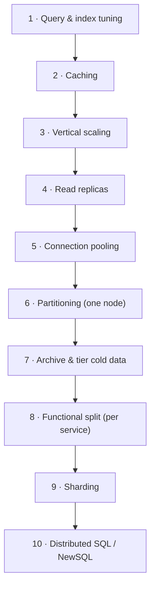

# 5.1.1 — How to Scale Databases

> **Part 5 · Scaling Data Storage · Data Replication · Chapter 1 of 5**
> The ladder, in order. Most systems stop three rungs earlier than they expect.

---

## 🧒 ELI5 — Explain Like I'm 5

The library is getting too busy. There's a queue at the desk. What do you do, **in order**?

1. **Put up signs and an index.** Half the queue is people who can't find things. Good signposting cuts the queue in half for free. *(Indexes and query tuning.)*
2. **Keep the ten most-borrowed books on a table by the door.** Most people want the same few books. *(Cache.)*
3. **Get a bigger desk and a faster librarian.** *(Bigger machine.)*
4. **Photocopy the popular books so several people can read at once.** Only helps *reading* — you still write into the one master copy. *(Read replicas.)*
5. **Have a helper who takes everyone's requests and passes them to the librarian in batches**, so the librarian isn't interrupted a thousand times. *(Connection pooling.)*
6. **Split the library into two buildings: A–M and N–Z.** Now two librarians work in parallel. But: *"find every book about dragons"* now means visiting both buildings and combining the answers, and you can't easily move a book between buildings. *(Sharding — powerful and painful.)*

**Do them in that order.** People skip to step 6 and are then astonished by how hard everything becomes — when step 1 or 2 would have solved it for a hundredth of the effort.

---

## The ladder



| Rung | Gains | Effort | Reversible? |
|---|---|---|---|
| 1 Query tuning | **10–1000×** on specific queries | Low | ✅ |
| 2 Caching | 10–100× read capacity | Low–medium | ✅ |
| 3 Vertical | 2–10× | ✅ Trivial | ✅ |
| 4 Read replicas | N× reads | Low | ✅ |
| 5 Pooling | Removes a hard ceiling | ✅ Trivial | ✅ |
| 6 Partitioning | Maintenance + pruning | Medium | Mostly |
| 7 Archiving | Shrinks the working set | Medium | ✅ |
| 8 Functional split | Independent scaling per domain | Medium–high | Hard |
| 9 Sharding | Linear writes | **Very high** | ❌ Very hard |
| 10 Distributed SQL | Linear writes with SQL | High | ❌ |

🎯 **Rungs 1–5 typically give more than rungs 6–10 combined, at a fraction of the cost.** Say this. Reaching for sharding before profiling is the classic mistake, and interviewers are listening for whether you know the order.

---

## Rung 1 — Query and index tuning

**Always first.** A single missing index can be the entire problem.

```sql
-- Find the queries actually costing you
SELECT query, calls, mean_exec_time, total_exec_time
FROM pg_stat_statements ORDER BY total_exec_time DESC LIMIT 20;

-- Find missing indexes: high sequential scans on big tables
SELECT relname, seq_scan, seq_tup_read, idx_scan
FROM pg_stat_user_tables WHERE seq_scan > 0 ORDER BY seq_tup_read DESC;

-- Find unused indexes: pure write cost, no benefit
SELECT relname, indexrelname, idx_scan
FROM pg_stat_user_indexes WHERE idx_scan = 0;
```

| Problem | Fix | Typical gain |
|---|---|---|
| **N+1 queries** | Batch with `= ANY($1)` or a join | 10–100× |
| Missing index | Add it | 10–1000× |
| `SELECT *` | Select needed columns → index-only scans | 2–10× |
| `OFFSET` pagination | Cursor pagination | 10–100× on deep pages |
| Function on an indexed column | Expression index | 10–100× |
| `LIKE '%x%'` | Trigram index or a search engine | 10–100× |
| Stale statistics | `ANALYZE` | Fixes catastrophic plans |
| Unused indexes | Drop them | Faster writes |

☠️ **The N+1 query is the most common real-world database performance bug**, and it's usually invisible in code review because each individual query is fast. 200 queries at 1 ms is 200 ms of pure latency that one batch eliminates.

---

## Rung 2 — Caching

Removes 90–99% of read load. Eighteen chapters in [Part 3](../../03-scaling-services/03-caching/). The database-relevant summary:

$$\text{required hit rate} = 1 - \frac{\text{DB capacity}}{\text{total read QPS}}$$

⚠️ And the corollary: once you depend on that hit rate, **the database must be able to survive losing the cache**, or the cache is a critical dependency in disguise.

---

## Rung 3 — Vertical scaling

⚖️ **Massively underrated.** Modern instances reach 192+ vCPUs and 24 TB of RAM. Doubling the machine is a maintenance window, not a project, and introduces **zero** distributed-systems bugs.

**The single most impactful setting** is the buffer pool (`shared_buffers` at 25–40% of RAM in Postgres; `innodb_buffer_pool_size` at 50–70% in MySQL). If the working set fits in it, reads are memory-speed. If it doesn't, every read is a disk seek and performance falls off a cliff.

🎯 **"Does the working set fit in RAM?"** is the highest-value database performance question there is. Adding RAM is often a 10× improvement for a few hundred pounds a month.

---

## Rung 4 — Read replicas

Scales reads linearly; **does nothing for writes**. Full treatment in [Read-Write Separation](../../03-scaling-services/02-read-write-separation/01-read-write-separation.md).

The essential points: replication lag is real and spikes under load; route reads-after-write to the primary; classify reads by freshness need; and isolate analytics onto their own replica so a heavy report can't push user-facing lag to minutes.

---

## Rung 5 — Connection pooling

☠️ Postgres uses a **process per connection** (~5–10 MB). 50 app servers × 100-connection pools = 5,000 connections = failure. The database sits near-idle while everything times out.

```
app instances → PgBouncer (transaction mode) → 50 real connections → Postgres
```

**Real pool size ≈ `cores × 2 + effective_spindles`** — usually **tens**. Past that, throughput *decreases* due to context switching and lock contention.

🎯 This surprises people and is a reliable interview point: **more connections make a database slower, not faster.**

---

## Rung 6 — Partitioning within one node

```sql
CREATE TABLE events (id BIGINT, created_at TIMESTAMPTZ, ...)
  PARTITION BY RANGE (created_at);
```

| Benefit | Detail |
|---|---|
| **Partition pruning** | Date-filtered queries scan one partition |
| **Instant deletion** | `DROP TABLE events_2025_01` vs a `DELETE` of a billion rows |
| Smaller indexes | Each partition's index fits in memory |
| Parallel maintenance | Vacuum and analyze per partition |

⚠️ **Partitioning is not sharding.** Everything is still on one node; it doesn't add write capacity. It's a maintenance and query-pruning win. Confusing the two is a common error.

---

## Rung 7 — Archive and tier

Often the cheapest big win, and frequently forgotten.

| Data | Where |
|---|---|
| Last 90 days | Hot, in the primary |
| 90 days – 2 years | A separate archive table or partition |
| 2+ years | Parquet in object storage, queried by Athena/DuckDB when needed |

🔢 Moving 80% of rows out of a table shrinks the indexes by ~80%, which often brings the working set back inside RAM — turning every query from disk-bound to memory-bound. **This can be a bigger win than any amount of hardware.**

Also: enforce retention. Data kept forever costs forever, and increases GDPR exposure.

---

## Rung 8 — Functional split

Give each service its own database, so each scales independently:

```
Before:  one Postgres with orders, users, analytics_events, sessions, audit_log
After:   orders    → Postgres
         users     → Postgres
         sessions  → Redis
         events    → Kafka → ClickHouse
         audit     → append-only, archived to S3
```

**Often the single most effective move**, because the tables with wildly different access patterns stop competing for the same buffer pool. An append-heavy events table can evict your orders index from cache; separating them fixes both.

⚠️ The cost: no cross-database joins or transactions. Same trade as [microservices](../../01-introduction/05-microservices/01-microservices-vs-monolithic.md).

---

## Rung 9 — Sharding

Split rows across N independent databases by a partition key. **The big complexity jump.**

| You lose | Consequence |
|---|---|
| Cross-shard joins | Application-side merges |
| Cross-shard transactions | Sagas |
| Global uniqueness (auto-increment) | Distributed ID generation |
| Global `ORDER BY` / aggregates | Scatter-gather |
| Simple backups | Per-shard, and they're not mutually consistent |
| Easy schema migrations | N times, coordinated |
| Easy rebalancing | A major operation |

Full treatment: [Database Partitioning](../02-data-partitioning/01-database-partitioning.md).

🎯 **Delay this as long as honestly possible.** The signal that it's genuinely time: sustained write throughput exceeds a single node's capacity even after tuning and caching, or the dataset exceeds what one machine can hold and index.

---

## Rung 10 — Distributed SQL

| System | Notes |
|---|---|
| **CockroachDB / YugabyteDB** | Postgres-compatible, Raft per range, survives node/region loss |
| **Spanner** | Global ACID with TrueTime; expensive |
| **Vitess** | Sharded MySQL (YouTube, Slack) |
| **Citus** | Postgres extension for sharding |
| **TiDB** | MySQL-compatible with a columnar replica |

⚖️ These give horizontal writes **and** SQL semantics, at the cost of higher write latency (consensus per commit, ~5–20 ms) and higher operational and financial cost. **Often the right answer when you've genuinely outgrown one node** — and worth naming so the discussion isn't a false SQL-vs-NoSQL dichotomy.

---

## Diagnosing which rung you need

| Symptom | Bottleneck | Rung |
|---|---|---|
| A few queries are slow, most are fine | Missing index / bad plan | 1 |
| The same query runs thousands of times | Repeated reads | 2 (cache) |
| High CPU, cache hit ratio good, all queries slow | CPU-bound | 3 |
| High disk I/O, low buffer cache hit ratio | Working set > RAM | 3 or 7 |
| Read QPS high, write QPS low | Read capacity | 4 |
| "Too many connections" errors, low DB CPU | Connection ceiling | 5 |
| Deletes of old data take hours | Table size / maintenance | 6, 7 |
| One table's activity hurts everything else | Shared buffer pool contention | 8 |
| **Write QPS at the node's ceiling**, all else tuned | True write limit | 9 or 10 |
| Dataset exceeds a single machine | Storage limit | 9 or 10 |

🎯 **Match the symptom to the rung, out loud.** *"Buffer cache hit ratio is 70% and disk I/O is saturated, so the working set doesn't fit in RAM — that's more memory or archiving, not sharding."*

---

## The metrics to watch

```sql
-- Buffer cache hit ratio: want > 99%
SELECT sum(blks_hit)*100.0/nullif(sum(blks_hit+blks_read),0) FROM pg_stat_database;

-- Replication lag (on a replica)
SELECT now() - pg_last_xact_replay_timestamp();

-- Connections
SELECT count(*), state FROM pg_stat_activity GROUP BY state;

-- Table and index bloat, and vacuum health
SELECT relname, n_dead_tup, last_autovacuum FROM pg_stat_user_tables
ORDER BY n_dead_tup DESC LIMIT 20;

-- Lock waits
SELECT * FROM pg_locks WHERE NOT granted;
```

| Metric | Healthy | Action if not |
|---|---|---|
| Buffer cache hit ratio | > 99% | More RAM, or archive |
| Replication lag | < 1 s | Faster replicas; isolate analytics |
| Active connections | < pool size | Add a pooler |
| Dead tuples | Low, vacuum recent | Tune autovacuum |
| Lock waits | ~0 | Shorten transactions |
| Longest transaction | < a few seconds | Kill long idle-in-transaction sessions |

---

## 📋 Chapter checklist

| Skill | Ready? |
|---|---|
| Recite the ten rungs in order | ☐ |
| Argue that rungs 1–5 beat 6–10 for most systems | ☐ |
| Name the top five query-tuning fixes | ☐ |
| Explain why the buffer pool is the key setting | ☐ |
| Explain the connection ceiling and why more is worse | ☐ |
| Distinguish partitioning from sharding | ☐ |
| Explain how archiving can outperform hardware | ☐ |
| Explain the functional-split buffer-pool argument | ☐ |
| List what sharding costs you | ☐ |
| Map ten symptoms to the right rung | ☐ |

---

**← Previous** [4.2.9 SQL vs NoSQL](../../04-data-storage/02-storage/09-sql-vs-nosql.md)
**Next →** [5.1.2 Database Replication: Fundamentals and Algorithms](02-database-replication.md)
