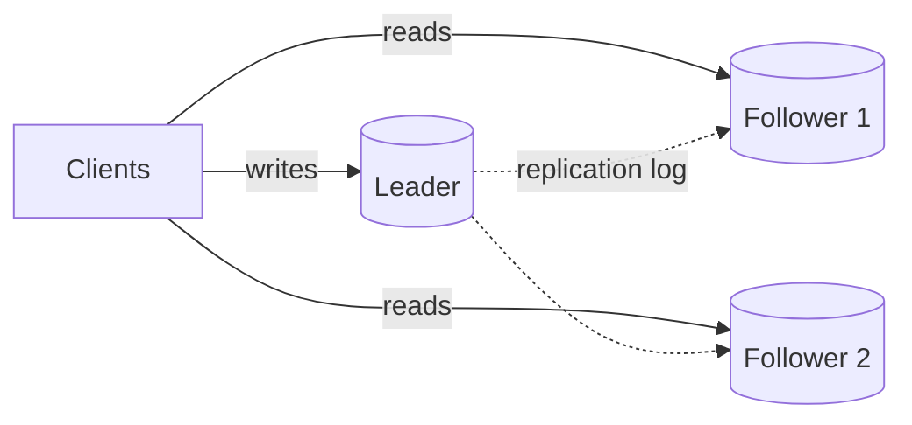
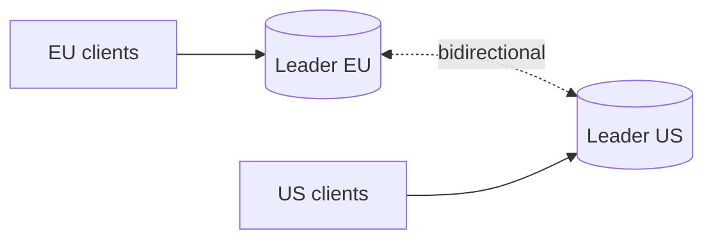
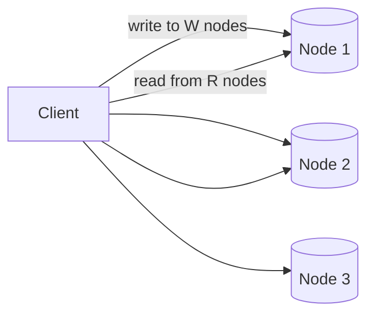

# 5.1.2 — Database Replication: Fundamentals and Algorithms

> **Part 5 · Scaling Data Storage · Data Replication · Chapter 2 of 5**
> Keeping N copies of the data in step. The foundation of availability, read scaling, and geo-distribution.

---

## 🧒 ELI5 — Explain Like I'm 5

You have one notebook with everything important in it. That's terrifying: spill tea on it and it's gone.

So you make **copies**. Now three questions appear, and every replication system on Earth is an answer to these three:

**1. Who's allowed to write?**
- **One person writes, everyone else only copies.** Simple, no arguments — but if that person is ill, nobody can write anything. *(Single-leader.)*
- **Anyone can write in any copy.** Never blocked — but two people can write different things in the same spot and now the copies **disagree**, and someone has to decide who wins. *(Multi-leader / leaderless.)*

**2. When do you say "saved"?**
- **After you've written in your own copy** — fast, but if you're hit by a bus before the copies are made, that entry is lost. *(Asynchronous.)*
- **After at least one other copy also has it** — slower, but nothing is ever lost. *(Synchronous.)*

**3. What do you copy — the *instructions* or the *result*?**
- *"Add today's date next to Ann"* — short, but if one copy's clock is different, you get different answers. *(Statement replication — dangerous.)*
- *"Line 5 now reads: Ann, 31 August 2026"* — bigger, but always identical everywhere. *(Row/physical replication — what real systems use.)*

Those three answers determine everything: how fast writes are, how much you can lose, and whether the copies can disagree.

---

## Why replicate

| Reason | Detail |
|---|---|
| **Availability** | A node dies; another takes over |
| **Read scaling** | N replicas serve N× read traffic |
| **Latency** | A replica near the user answers faster |
| **Durability** | Data exists in several failure domains |
| **Analytics isolation** | Heavy queries on a dedicated replica |
| **Zero-downtime maintenance** | Upgrade replicas, fail over, upgrade the old primary |
| **Human-error insurance** | A deliberately *delayed* replica lets you recover from a bad `DELETE` |

---

## Topology 1 — Single leader (the default)



**All writes go to one node**; followers apply the same changes in the same order.

| ✅ | ❌ |
|---|---|
| No write conflicts, ever | The leader is a write bottleneck |
| Simple to reason about | Failover is a real, risky operation |
| Strong consistency available at the leader | Replication lag on followers |
| Every mainstream database supports it | Single point of write failure |

**Used by:** Postgres, MySQL, MongoDB replica sets, SQL Server, Redis, Kafka (per partition).

🎯 **This is the right answer for the vast majority of systems.** Say so, then discuss the failover mechanics — that's where the interesting content is.

---

## Topology 2 — Multi-leader



Writes accepted in multiple locations; leaders replicate to each other.

| ✅ | ❌ |
|---|---|
| Local writes in every region | **Write conflicts are inevitable** |
| Survives a region outage for writes | Conflict resolution is application-visible |
| Good for offline-capable clients | Constraints (uniqueness) can't be enforced globally |
| | Debugging is genuinely hard |

**Used for:** multi-datacenter active-active, offline-first mobile apps (each device is a leader), and collaborative editing.

⚠️ **The uniqueness problem is the killer:** two regions can both accept `email = ann@example.com` because neither knows about the other's write. There is no way to enforce a global unique constraint under multi-leader replication without cross-region coordination — which defeats the purpose. Recognising this is a strong signal.

---

## Topology 3 — Leaderless (Dynamo-style)



No leader. The client (or a coordinator) writes to several nodes and reads from several.

**The quorum rule:**

$$R + W > N \implies \text{a read overlaps a write} \implies \text{strong consistency}$$

| N | W | R | Property |
|---|---|---|---|
| 3 | 2 | 2 | ✅ Strong; tolerates 1 node down — **the usual choice** |
| 3 | 1 | 1 | Eventual; fastest; tolerates 2 down |
| 3 | 3 | 1 | Strong; fast reads; **writes fail if any node is down** |
| 3 | 1 | 3 | Strong; fast writes; reads fail if any node is down |

**Repair mechanisms** (needed because writes may miss nodes):
- **Read repair** — a read that sees stale data on one replica writes the fresh value back.
- **Anti-entropy** — background comparison using **Merkle trees** to find divergent ranges efficiently.
- **Hinted handoff** — a node that's down has its writes held by a peer and delivered on recovery.

**Used by:** Cassandra, ScyllaDB, DynamoDB, Riak.

---

## What travels: the replication log

| Method | Content | Pros | Cons |
|---|---|---|---|
| **Statement-based** | The SQL text | ✅ Compact | ☠️ **Non-deterministic**: `NOW()`, `RAND()`, auto-increment, and triggers diverge |
| **Write-ahead log (physical)** | Byte-level page changes | ✅ Exact, efficient | Tied to the storage format — no version-skew upgrades |
| **Logical / row-based** | "Row X changed from A to B" | ✅ Version-independent, feeds CDC | Larger than statements |
| **Trigger-based** | Application-level triggers | Flexible, selective | Slow, invasive, error-prone |

🎯 **Statement-based replication's non-determinism is a classic interview point.** `UPDATE t SET updated_at = NOW()` produces different values on each replica. MySQL's default moved to row-based for exactly this reason.

⚖️ **Physical vs logical is a real operational trade:** physical replication (Postgres streaming) is efficient but requires identical major versions; **logical replication enables zero-downtime major-version upgrades** and selective table replication, at higher CPU cost. Naming that upgrade path is a useful, practical detail.

---

## Synchronous vs asynchronous

```
Async:   client → leader → ACK          (followers catch up later)
Sync:    client → leader → follower ACK → ACK
Semi:    client → leader → ≥1 follower ACK → ACK
```

| Mode | Latency | Data loss on failover (RPO) | Availability |
|---|---|---|---|
| **Async** | ✅ Lowest | Seconds of writes | ✅ Followers can't block writes |
| **Sync (all)** | Highest | ✅ Zero | ❌ **Any follower down blocks all writes** |
| **Semi-sync (≥1)** | Medium | ✅ Zero (given one healthy follower) | Good — **the usual choice** |

⚠️ **Fully synchronous replication to all followers is almost always wrong**: it makes your availability the *product* of every node's availability. Semi-synchronous — wait for any one (or a quorum) — gives durability without that fragility.

**Postgres:**
```
synchronous_commit = on
synchronous_standby_names = 'ANY 1 (replica1, replica2)'    -- quorum-based
```

**Cross-region synchronous replication adds a full round trip to every write** — 50–150 ms. That's the price of zero data loss across regions, and it's usually too expensive for anything except money movement.

---

## Replication lag and its consequences

| Anomaly | What the user sees | Fix |
|---|---|---|
| **Read-your-writes violated** | "I saved it and it's gone" | Route reads to the leader for N seconds after a write, or per-entity |
| **Monotonic reads violated** | Data appears, disappears, reappears | Sticky-route a session to one replica |
| **Consistent prefix violated** | An answer appears before its question | Ensure causally related writes go through one partition |

**Lag sources:** network transfer, single-threaded apply (a big transaction blocks everything behind it), long-running queries on the replica conflicting with apply, and under-provisioned replicas.

☠️ **Lag spikes exactly when you least want it** — during bulk updates, schema migrations, and traffic surges. Any design that assumes "lag is a few milliseconds" breaks precisely during those events. **Monitor it and have a policy** for what happens when it exceeds a threshold (usually: route reads back to the primary).

---

## Failover

**The sequence:**
```
1. Detect: the leader has missed N health checks
2. Elect:  choose the follower with the highest applied LSN/GTID
3. FENCE:  ensure the old leader cannot accept writes
4. Promote
5. Redirect clients — via a PROXY, not DNS
6. Repoint the other followers at the new leader
7. Verify and alert
```

☠️ **Split brain** is the danger: the old leader is alive but partitioned, still accepting writes. Two leaders, divergent data, and a manual reconciliation nightmare.

**Prevention — you need both:**
- **Quorum**: a majority must agree on the promotion. **Two nodes cannot form a majority**, which is why "2-node HA" is not HA.
- **Fencing**: the old leader must be provably unable to write — STONITH (power it off), revoke its storage/network access, or use a monotonic **epoch number** that the storage layer checks and rejects if stale.

⚠️ **Failover data loss with async replication** equals the lag at the moment of failure. If the new leader was 2 seconds behind, those 2 seconds of acknowledged writes are gone. **That is your RPO** — state it explicitly rather than pretending it's zero.

**Tools:** Patroni (Postgres, etcd-backed), repmgr, Orchestrator (MySQL), MongoDB's built-in Raft-like election, RDS/Aurora managed failover.

---

## Consensus: Raft and Paxos

Systems needing correctness *guarantees* rather than best-effort replication use consensus.

**Raft in one paragraph:** nodes elect a leader by majority vote for a numbered *term*. The leader appends entries to its log and replicates them; an entry is **committed** once a majority have it. Followers only vote for a candidate whose log is at least as up to date as theirs, which guarantees a new leader has every committed entry.

| Property | Consequence |
|---|---|
| Needs a **majority** | 3 nodes tolerate 1 failure; 5 tolerate 2. **Odd numbers only** |
| A committed entry is never lost | Real durability guarantee |
| Consistent ordering | Linearizable operations |
| Cost | A round trip to a majority per write — 5–20 ms typical |

**Used by:** etcd, Consul, CockroachDB, TiKV, MongoDB elections, Kafka KRaft, Neo4j causal clustering.

⚖️ **Consensus gives correctness; asynchronous replication gives speed.** Systems increasingly use consensus for *metadata* (who is the leader, which shard is where) and cheaper replication for the *data*.

---

## Choosing

| Requirement | Topology | Sync mode |
|---|---|---|
| Standard web application | Single leader | Async + read-your-writes routing |
| Zero data loss (payments) | Single leader | Semi-sync (quorum) |
| Multi-region reads, single-region writes | Single leader + cross-region async replicas | Async |
| Multi-region writes | Multi-leader or leaderless | Async + conflict resolution |
| Massive write scale, tunable consistency | Leaderless (Cassandra) | Quorum |
| Strong consistency, distributed | Consensus (CockroachDB, Spanner) | Synchronous quorum |
| Offline-first clients | Multi-leader / CRDTs | Async |

---

## 📋 Chapter checklist

| Skill | Ready? |
|---|---|
| Give seven reasons to replicate | ☐ |
| Compare single-leader, multi-leader, and leaderless | ☐ |
| Explain the multi-leader uniqueness problem | ☐ |
| Write `R + W > N` and give four configurations | ☐ |
| Name read repair, anti-entropy, hinted handoff | ☐ |
| Explain why statement-based replication is dangerous | ☐ |
| Explain physical vs logical replication and the upgrade path | ☐ |
| Explain why fully-synchronous replication is usually wrong | ☐ |
| Name three lag anomalies and their fixes | ☐ |
| Recite the failover sequence including fencing | ☐ |
| Explain split brain and both preventions | ☐ |
| Explain Raft in one paragraph | ☐ |

---

**← Previous** [5.1.1 How to Scale Databases](01-database-scaling.md)
**Next →** [5.1.3 Implementing Database Replication](03-implementing-replication.md)
