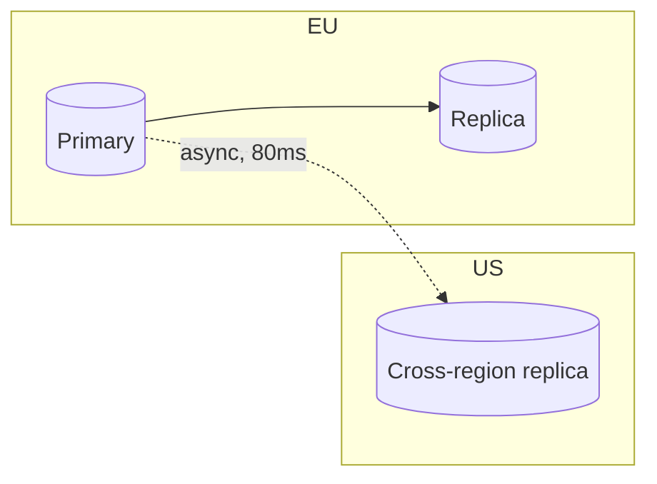

# 5.1.3 — Implementing Database Replication: Practical Guide and Failover Strategies

> **Part 5 · Scaling Data Storage · Data Replication · Chapter 3 of 5**
> The configuration, the routing, the failover, and the runbook.

---

## 🧒 ELI5 — Explain Like I'm 5

You've decided to keep copies of the notebook. Now the boring, essential questions:

- **How does a brand-new copy get made?** You can't copy a notebook that's being written in. So: take a photograph of it at an exact instant, then apply everything written *since* that instant. *(Base backup + WAL replay.)*
- **How does the copy keep up?** The writer shouts out each change as it happens; the copier writes it down. *(Streaming replication.)*
- **How do people know which notebook to read from?** You need a **receptionist** who knows which one is the master today. If everyone memorised the address instead, they'd all go to the wrong place after a swap. *(A proxy, not DNS.)*
- **What if the writer collapses?** Someone must (a) check they're really down, not just quiet, (b) make sure they **can't** start writing again, and (c) tell everyone the new master. Skip step (b) and you get two masters writing different things. *(Fencing.)*
- **Does the plan work?** You do not know until you have done it **on purpose**, on a quiet Tuesday. *(Drills.)*

---

## Setting up a replica

The universal sequence:

```
1. Take a consistent base backup of the primary (or a snapshot)
2. Note the exact log position of that backup (LSN / GTID / binlog coordinates)
3. Restore the backup onto the new node
4. Start replaying the log from that position
5. Catch up to live, then stay connected and stream
```

**Postgres:**
```bash
# On the replica — base backup + streaming setup in one command
pg_basebackup -h primary -U replicator -D /var/lib/postgresql/data \
              -Fp -Xs -P -R --slot=replica1 --create-slot
```
```ini
# primary postgresql.conf
wal_level = replica                 # or 'logical' for logical replication/CDC
max_wal_senders = 10
max_replication_slots = 10
synchronous_standby_names = 'ANY 1 (replica1, replica2)'   # semi-sync quorum
```

⚠️ **Replication slots are a double-edged tool.** A slot guarantees the primary retains WAL until the replica has consumed it — so a replica can disconnect for hours and still resume. But **if that replica never returns, the primary's disk fills with retained WAL and the primary dies.** Always set `max_slot_wal_keep_size` and alert on slot lag. This is one of the most common Postgres outages.

**MySQL:**
```sql
CHANGE REPLICATION SOURCE TO
  SOURCE_HOST='primary', SOURCE_USER='repl',
  SOURCE_AUTO_POSITION=1;             -- GTID-based: no manual coordinates
START REPLICA;
```
GTIDs make failover far safer than binlog file/position coordinates — the new replica can work out exactly what it has and hasn't applied.

---

## Routing reads and writes

**The rule: applications must not hard-code the primary's address.** Something must sit between.

| Approach | Failover speed | Notes |
|---|---|---|
| **Proxy** (PgBouncer + a health-checked VIP, ProxySQL, RDS Proxy, Envoy) | ✅ Seconds | Best. Also multiplexes connections |
| **Service discovery** (Consul, etcd + Patroni) | Seconds | Clients resolve the current leader |
| **DNS** | ❌ Minutes | TTL caching is unreliable; clients cache forever |
| **Client-side multi-host** (`host1,host2&targetServerType=primary`) | Seconds | Supported by JDBC/libpq; simple and effective |

☠️ **Do not fail over with DNS.** Java historically cached DNS forever, many connection pools resolve once at creation, and TTLs are honoured inconsistently. Minutes of outage, unpredictably.

**Read routing** (from [Read-Write Separation](../../03-scaling-services/02-read-write-separation/01-read-write-separation.md)):

```python
def get_connection(intent, session):
    if intent == "write":
        return primary_pool
    if session.wrote_within(seconds=5):
        return primary_pool          # read-your-writes
    if replica_lag() > 5:
        return primary_pool          # lag guard — fall back when replicas are behind
    return replica_pool
```

🎯 **The lag guard is the detail worth stating.** When lag exceeds a threshold, route reads back to the primary. It converts a correctness problem into a capacity problem, which is the better failure.

---

## Monitoring replication

```sql
-- On the PRIMARY: who is connected, and how far behind
SELECT client_addr, state, sync_state,
       pg_wal_lsn_diff(pg_current_wal_lsn(), replay_lsn) AS bytes_behind
FROM pg_stat_replication;

-- On a REPLICA: lag in time
SELECT now() - pg_last_xact_replay_timestamp() AS lag;

-- Replication slots: is one retaining WAL forever?
SELECT slot_name, active,
       pg_wal_lsn_diff(pg_current_wal_lsn(), restart_lsn) AS retained_bytes
FROM pg_replication_slots;
```

| Alert | Threshold | Why |
|---|---|---|
| Replica lag (time) | > 10 s | Stale reads become user-visible |
| Replica lag (bytes) | Growing steadily | The replica can't keep up — it will never recover on its own |
| Replica disconnected | Any | Reduced capacity and no failover target |
| **Inactive replication slot** | Any, > 1 h | ☠️ The primary's disk will fill |
| Sync standby count | < required | Writes will block if it reaches zero |
| WAL disk usage | > 70% | Approaching the failure above |

⚠️ **Monitor lag in both time and bytes.** Time-lag looks fine on an idle system even when a replica is badly behind; byte-lag reveals it immediately.

---

## Failover: manual, automatic, and the trade

| | Manual | Automatic |
|---|---|---|
| RTO | 10–60 min | 10–60 s |
| Risk of false positives | ✅ None — a human verifies | Network blip → unnecessary failover |
| Risk of split brain | Lower (human checks) | Needs rigorous fencing |
| 3 a.m. reliability | ❌ Depends on the human | ✅ Consistent |

⚖️ **Automatic failover is right when your availability target requires it** (99.95%+ leaves no room for a human), **and** you have proper quorum and fencing. Automatic failover *without* fencing is more dangerous than no automation at all — it turns a single-node outage into divergent data.

### Patroni (the standard Postgres answer)

```yaml
scope: mycluster
etcd3: { hosts: etcd1:2379,etcd2:2379,etcd3:2379 }
bootstrap:
  dcs:
    ttl: 30                       # leader lease
    loop_wait: 10
    retry_timeout: 10
    maximum_lag_on_failover: 1048576     # ← don't promote a replica >1MB behind
    synchronous_mode: true               # ← guarantees no data loss on failover
postgresql:
  use_slots: true
```

**How it prevents split brain:** the leader holds a **lease in etcd** and must renew it. If it can't reach etcd, it **demotes itself** — it knows it may have lost the leadership race. A new leader is only elected when a majority of etcd nodes agree. That is the correct pattern: *fencing by self-demotion when the coordination service is unreachable.*

🎯 `maximum_lag_on_failover` is the RPO dial: promoting a replica that is 5 minutes behind loses 5 minutes of data. Setting this bound explicitly — and being willing to *not* fail over automatically when no replica is fresh enough — is a mature choice.

---

## The failover runbook

```
DETECTION
  □ Primary unreachable from ≥2 independent observers (not just one monitor)
  □ Confirm it is genuinely down, not a monitoring-network problem

FENCE  ← never skip
  □ Revoke the primary's network/storage access, or power it off (STONITH)
  □ Or confirm its lease has expired and it has self-demoted

PROMOTE
  □ Choose the replica with the highest applied LSN/GTID
  □ Check its lag is within the acceptable RPO
  □ Promote

REDIRECT
  □ Update the proxy/VIP (NOT DNS)
  □ Verify application writes are succeeding

REBUILD
  □ Repoint remaining replicas at the new primary
  □ Rebuild the old primary as a replica (do NOT just restart it as a primary)
  □ Restore the desired replica count

VERIFY
  □ Check for divergent writes on the old primary before reusing it
  □ Confirm sync standby requirements are met again
  □ Write the incident timeline while it's fresh
```

☠️ **"Just restart the old primary" is how split brain happens.** After a failover, the old primary may hold writes the new primary never received. It must be **rebuilt from the new primary** (`pg_rewind` or a fresh base backup), never simply started.

---

## Zero-downtime maintenance using replicas

**Minor version upgrade / OS patching:**
```
1. Upgrade replica 2 → verify → return to service
2. Upgrade replica 1 → verify → return to service
3. Controlled switchover: promote replica 1, demote the primary
4. Upgrade the old primary; it becomes a replica
```
A *switchover* (planned) is far safer than a *failover* (unplanned) — the old primary is cleanly demoted, so there's no divergence.

**Major version upgrade** uses **logical replication**: build a new-version cluster, replicate logically into it (which works across versions), verify, then cut over. This is the standard zero-downtime major upgrade path and worth naming.

---

## Multi-region replication



| Decision | Options |
|---|---|
| Write locality | Single-region writes (simple) vs multi-region writes (conflicts) |
| Sync mode | Async across regions (RPO = lag) vs sync (adds 80–150 ms per write) |
| Failover | Manual for regional failover — the blast radius justifies a human |
| Data residency | Some data legally cannot leave a region |

⚠️ **Cross-region replicas lag more and lag unpredictably** (network variance, higher volume per round trip). Do not serve read-your-writes traffic from them, and size the receiving region for a **partial cold start plus double traffic** when a region fails over.

---

## Testing — the part everyone skips

| Drill | Frequency | Verifies |
|---|---|---|
| Planned switchover | Monthly | The promotion path works; RTO is real |
| Kill the primary (staging) | Monthly | Automatic failover and fencing |
| Kill the primary (production, low traffic) | Quarterly | The whole system, including clients |
| Simulate a network partition | Quarterly | Split-brain prevention |
| **Restore from backup** | Monthly | ☠️ Untested backups fail surprisingly often |
| Replica rebuild | Quarterly | Base backup process and timing |
| Full region evacuation | Annually | Multi-region runbook |

🎯 **"We do a planned switchover monthly, so failover is a routine operation rather than an emergency"** is one of the most convincing operational statements you can make in an interview.

---

## ☠️ Failure modes

| Failure | Consequence | Prevention |
|---|---|---|
| No fencing | Split brain, divergent data | Quorum + STONITH / lease self-demotion |
| Two-node "HA" | No majority possible; election never resolves | 3+ nodes, or 2 + a witness |
| DNS-based failover | Minutes of outage | Use a proxy |
| Promoting a lagging replica | Silent data loss | `maximum_lag_on_failover` |
| Restarting the old primary as primary | Split brain after the fact | `pg_rewind` or rebuild |
| Abandoned replication slot | The primary's disk fills; total outage | `max_slot_wal_keep_size` + alerting |
| Fully-synchronous to all replicas | One replica down blocks every write | Quorum-based sync (`ANY 1`) |
| Analytics on a user-facing replica | Lag spikes to minutes | A dedicated analytics replica |
| Untested failover | The runbook is fiction | Regular drills |
| No lag alerting | Stale reads discovered by customers | Alert on time and bytes |

---

## 📋 Chapter checklist

| Skill | Ready? |
|---|---|
| Describe the five-step replica setup | ☐ |
| Explain replication slots and the disk-fill hazard | ☐ |
| Name four routing approaches and why DNS is wrong | ☐ |
| Write a read-routing function with a lag guard | ☐ |
| List the replication metrics and alert thresholds | ☐ |
| Argue manual vs automatic failover honestly | ☐ |
| Explain Patroni's lease-based self-demotion | ☐ |
| Recite the failover runbook including fencing and rebuild | ☐ |
| Explain why the old primary must never be simply restarted | ☐ |
| Describe zero-downtime major-version upgrade via logical replication | ☐ |
| Name seven drills and their frequency | ☐ |

---

**← Previous** [5.1.2 Database Replication](02-database-replication.md)
**Next →** [5.1.4 Data Replication Tutorial](04-replication-codelab.md)
