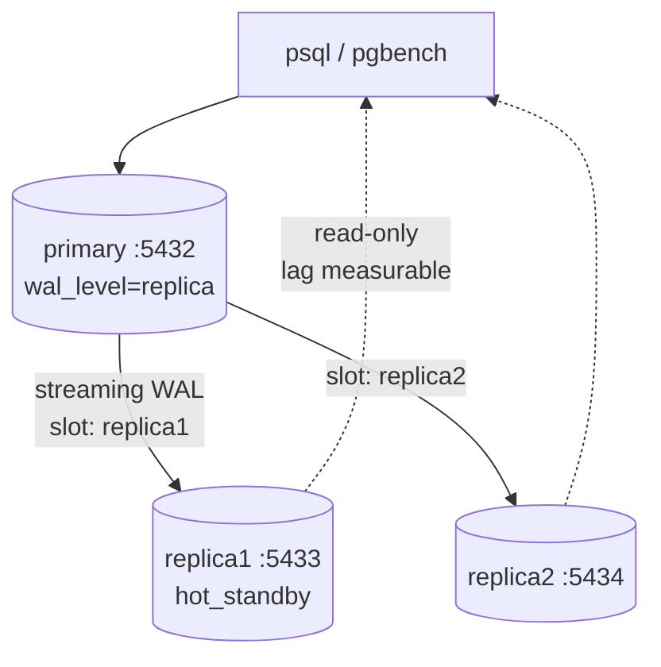

# 5.1.4 — 🧪 Data Replication Tutorial

> **Part 5 · Scaling Data Storage · Data Replication · Chapter 4 of 5**
> Build a replicated Postgres cluster, measure lag, cause the anomalies, fail over, and create split brain on purpose.

---

## 🧒 ELI5 — Explain Like I'm 5

You've read about copies of the notebook. Now **make some and break them.**

You will:

- Set up a master and two copies, and **watch a change appear in the copies** a fraction of a second later.
- **Make the copies fall behind on purpose** and see exactly how stale they get.
- **Write something and immediately read it from a copy** — and see your own change *missing*. That's the bug users complain about.
- **Kill the master** and promote a copy, and time how long it takes.
- **Deliberately create two masters** and watch the data diverge into two incompatible versions — so you understand, viscerally, why fencing exists.

Every one of these takes a couple of commands. The value is in seeing it happen.

---

## Setup — a 3-node cluster



Two replicas rather than one, so drill 5 can show the difference between `ANY 1` (quorum — survives a loss) and `ALL` (one replica down blocks every write).


```yaml
# docker-compose.yml
services:
  primary:
    image: postgres:16
    environment:
      POSTGRES_PASSWORD: pw
      POSTGRES_DB: app
    ports: ["5432:5432"]
    command: >
      postgres
      -c wal_level=replica
      -c max_wal_senders=10
      -c max_replication_slots=10
      -c hot_standby=on
      -c synchronous_commit=on
      -c log_min_duration_statement=0
  replica1:
    image: postgres:16
    environment: { PGPASSWORD: pw }
    depends_on: [primary]
    ports: ["5433:5432"]
    entrypoint: >
      bash -c "
      until pg_isready -h primary; do sleep 1; done;
      rm -rf /var/lib/postgresql/data/*;
      pg_basebackup -h primary -U postgres -D /var/lib/postgresql/data -Fp -Xs -R --slot=replica1 -C;
      chmod 700 /var/lib/postgresql/data;
      exec postgres -c hot_standby=on"
  replica2:
    image: postgres:16
    environment: { PGPASSWORD: pw }
    depends_on: [primary]
    ports: ["5434:5432"]
    entrypoint: >
      bash -c "
      until pg_isready -h primary; do sleep 1; done;
      rm -rf /var/lib/postgresql/data/*;
      pg_basebackup -h primary -U postgres -D /var/lib/postgresql/data -Fp -Xs -R --slot=replica2 -C;
      chmod 700 /var/lib/postgresql/data;
      exec postgres -c hot_standby=on"
```

```bash
docker compose up -d
alias pp='docker compose exec -e PGPASSWORD=pw primary  psql -U postgres -d app -c'
alias r1='docker compose exec -e PGPASSWORD=pw replica1 psql -U postgres -d app -c'
alias r2='docker compose exec -e PGPASSWORD=pw replica2 psql -U postgres -d app -c'
```

---

## Drill 1 — Verify replication works

```bash
pp "CREATE TABLE accounts(id serial primary key, name text, balance bigint);"
pp "INSERT INTO accounts(name, balance) VALUES ('ann', 1000), ('bob', 500);"
r1 "SELECT * FROM accounts;"
```

✅ **Check:** the rows appear on the replica within milliseconds.

```bash
r1 "INSERT INTO accounts(name, balance) VALUES ('eve', 1);"
```
```
ERROR:  cannot execute INSERT in a read-only transaction
```
✅ **Check:** replicas are read-only. This is enforced by the database, not by convention.

```bash
pp "SELECT client_addr, state, sync_state,
    pg_wal_lsn_diff(pg_current_wal_lsn(), replay_lsn) AS bytes_behind
    FROM pg_stat_replication;"
```
✅ **Check:** two streaming replicas, `bytes_behind` near zero.

---

## Drill 2 — Measure lag under load

```bash
# Generate sustained write load
docker compose exec -e PGPASSWORD=pw primary bash -c \
  "pgbench -U postgres -i -s 50 app && pgbench -U postgres -c 20 -j 4 -T 60 app" &

# Watch lag on the replica every second
for i in $(seq 1 60); do
  r1 "SELECT now() - pg_last_xact_replay_timestamp() AS lag;" | sed -n 3p
  sleep 1
done
```

**Typical result:** lag climbs from ~1 ms to tens or hundreds of milliseconds under load, then falls back.

✅ **Check:** lag is not constant — it **tracks write volume**. Now make it much worse:

```bash
# One enormous transaction: replay is single-threaded, so this blocks everything behind it
pp "INSERT INTO accounts(name, balance)
    SELECT 'user'||g, g FROM generate_series(1, 5000000) g;"
r1 "SELECT now() - pg_last_xact_replay_timestamp() AS lag;"
```

☠️ **Check:** lag jumps to **seconds or tens of seconds**. A single bulk operation on the primary makes every replica stale. This is exactly why "we'll just read from replicas" is not a complete design — you need a lag guard.

---

## Drill 3 — Reproduce the read-your-writes bug

```python
# rywbug.py
import psycopg2, time

primary = psycopg2.connect("host=localhost port=5432 user=postgres password=pw dbname=app")
replica = psycopg2.connect("host=localhost port=5433 user=postgres password=pw dbname=app")
primary.autocommit = True

pc, rc = primary.cursor(), replica.cursor()
pc.execute("UPDATE accounts SET balance = 9999 WHERE name = 'ann'")
rc.execute("SELECT balance FROM accounts WHERE name = 'ann'")
print("immediately from replica:", rc.fetchone())     # may be the OLD value
replica.commit()
time.sleep(0.5)
rc.execute("SELECT balance FROM accounts WHERE name = 'ann'")
print("after 500ms:", rc.fetchone())                   # now correct
```

Run it while `pgbench` load is running to widen the window.

☠️ **Check:** the first read returns the **old** balance. To a user this is "I saved it and it didn't save."

### The fixes, demonstrated

```python
# Fix 1 — route reads to the primary for N seconds after a write
def get_conn(wrote_at):
    return primary if time.time() - wrote_at < 5 else replica

# Fix 2 — wait for the replica to reach the write's LSN (exact)
pc.execute("UPDATE accounts SET balance = 5555 WHERE name = 'ann'")
pc.execute("SELECT pg_current_wal_lsn()")
lsn = pc.fetchone()[0]

while True:
    rc.execute("SELECT pg_last_wal_replay_lsn() >= %s", (lsn,))
    if rc.fetchone()[0]:
        break
    replica.commit(); time.sleep(0.01)
rc.execute("SELECT balance FROM accounts WHERE name='ann'")
print("LSN-gated read:", rc.fetchone())     # ALWAYS correct
```

✅ **Check:** fix 2 is exact — the read waits precisely until the replica has the write, and no longer. It's the "correct" answer when asked how to guarantee read-your-writes with replicas.

---

## Drill 4 — Non-monotonic reads

```python
# Two replicas with different lag → time appears to go backwards
r1c = psycopg2.connect("host=localhost port=5433 ...").cursor()
r2c = psycopg2.connect("host=localhost port=5434 ...").cursor()

pc.execute("UPDATE accounts SET balance = 7777 WHERE name = 'bob'")
for i in range(10):
    for name, c in (("r1", r1c), ("r2", r2c)):
        c.execute("SELECT balance FROM accounts WHERE name='bob'")
        print(name, c.fetchone()[0], end="  ")
        c.connection.commit()
    print()
    time.sleep(0.05)
```

Pause `replica2` first to exaggerate:
```bash
docker compose pause replica2   # replica2 now falls behind
```

☠️ **Check:** alternating requests show `7777`, then `500`, then `7777` — **the value flickers**. To a user, a comment appears, disappears, and reappears. This confuses people far more than plain staleness.

✅ **Fix:** sticky-route a session to one replica (monotonic reads).

```bash
docker compose unpause replica2
```

---

## Drill 5 — Synchronous replication

```bash
pp "ALTER SYSTEM SET synchronous_standby_names = 'ANY 1 (replica1, replica2)';"
pp "SELECT pg_reload_conf();"
pp "SELECT application_name, sync_state FROM pg_stat_replication;"
```

Measure the write-latency cost:
```bash
# Async baseline
pp "ALTER SYSTEM SET synchronous_standby_names = ''; SELECT pg_reload_conf();"
docker compose exec primary pgbench -U postgres -c 10 -T 20 app | grep latency

# Semi-synchronous (any 1)
pp "ALTER SYSTEM SET synchronous_standby_names = 'ANY 1 (replica1, replica2)'; SELECT pg_reload_conf();"
docker compose exec primary pgbench -U postgres -c 10 -T 20 app | grep latency
```

✅ **Check:** semi-sync latency is measurably higher — the cost of a round trip to one replica. In exchange, RPO is zero.

### Now prove the availability trade

```bash
pp "ALTER SYSTEM SET synchronous_standby_names = 'ALL (replica1, replica2)'; SELECT pg_reload_conf();"
docker compose stop replica2
pp "INSERT INTO accounts(name, balance) VALUES ('test', 1);"
```

☠️ **Check: the INSERT hangs indefinitely.** With `ALL`, one replica being down blocks **every write**. Your availability is now the product of every node's availability.

```bash
docker compose start replica2      # the hung write completes
pp "ALTER SYSTEM SET synchronous_standby_names = 'ANY 1 (replica1, replica2)'; SELECT pg_reload_conf();"
```

✅ **Takeaway:** `ANY 1` (quorum) gives durability without that fragility. This is why fully-synchronous replication is almost always the wrong setting.

---

## Drill 6 — Failover

```bash
# Note both replicas' positions BEFORE the failure
r1 "SELECT pg_last_wal_replay_lsn();"
r2 "SELECT pg_last_wal_replay_lsn();"

docker compose stop primary          # 💀

# Promote the replica with the HIGHEST LSN
time docker compose exec replica1 pg_ctl promote -D /var/lib/postgresql/data

r1 "INSERT INTO accounts(name, balance) VALUES ('after_failover', 42);"
r1 "SELECT * FROM accounts ORDER BY id DESC LIMIT 3;"
```

✅ **Check:** promotion takes a few seconds and the new primary accepts writes.

Now repoint replica2:
```bash
docker compose exec replica2 bash -c \
  "echo \"primary_conninfo='host=replica1 user=postgres password=pw'\" \
   >> /var/lib/postgresql/data/postgresql.auto.conf"
docker compose restart replica2
```

✅ **Measure the RTO:** detection (say 10 s of health checks) + promotion (~3 s) + client redirection. That total is what you quote as your RTO — and you now know it from measurement rather than hope.

---

## Drill 7 — Create split brain on purpose

⚠️ Do this only in the lab. It is the most instructive drill here.

```bash
# The old primary is "down"... but only from the monitor's point of view.
docker compose start primary          # it comes back thinking it is still primary

pp "INSERT INTO accounts(name, balance) VALUES ('split_old', 111);"
r1 "INSERT INTO accounts(name, balance) VALUES ('split_new', 222);"

pp "SELECT name FROM accounts ORDER BY id DESC LIMIT 3;"
r1 "SELECT name FROM accounts ORDER BY id DESC LIMIT 3;"
```

☠️ **Check:** two nodes, two different datasets, both accepting writes, both convinced they are correct. **There is no automatic way to merge them.** Someone must decide, by hand, which writes to keep — and any decision loses real data.

✅ **This is what fencing prevents.** In a Patroni cluster, the old primary would fail to renew its etcd lease and **demote itself** before accepting a single write.

**Recovery — never just restart it:**
```bash
docker compose stop primary
docker compose exec primary pg_rewind --target-pgdata=/var/lib/postgresql/data \
  --source-server="host=replica1 user=postgres password=pw"
# then start it as a REPLICA of the new primary
```

---

## Drill 8 — The replication slot disk-fill trap

```bash
docker compose stop replica2         # the replica is gone, but its SLOT remains

# Generate lots of WAL
pp "INSERT INTO accounts(name, balance)
    SELECT 'x'||g, g FROM generate_series(1, 3000000) g;"

pp "SELECT slot_name, active,
    pg_size_pretty(pg_wal_lsn_diff(pg_current_wal_lsn(), restart_lsn)) AS retained
    FROM pg_replication_slots;"
docker compose exec primary du -sh /var/lib/postgresql/data/pg_wal
```

☠️ **Check:** the inactive slot for `replica2` forces the primary to **retain all that WAL**. Keep going and the primary's disk fills, at which point Postgres shuts down — a total outage caused by a *replica* being offline.

✅ **Fixes:**
```bash
pp "ALTER SYSTEM SET max_slot_wal_keep_size = '10GB'; SELECT pg_reload_conf();"
# and drop slots for replicas that are genuinely gone
pp "SELECT pg_drop_replication_slot('replica2');"
```

🎯 **This is one of the most common real Postgres outages**, and almost nobody expects it. Alert on inactive slots.

---

## Drill 9 — Logical replication (for CDC and upgrades)

```bash
pp "ALTER SYSTEM SET wal_level = 'logical'; SELECT pg_reload_conf();"
docker compose restart primary

pp "CREATE PUBLICATION app_pub FOR TABLE accounts;"
pp "SELECT * FROM pg_create_logical_replication_slot('cdc_slot', 'pgoutput');"

pp "UPDATE accounts SET balance = balance + 1 WHERE name = 'ann';"
pp "SELECT * FROM pg_logical_slot_peek_binary_changes('cdc_slot', NULL, NULL,
     'proto_version','1','publication_names','app_pub');"
```

✅ **Check:** you can read the stream of row-level changes. **This is the mechanism behind CDC (Debezium), zero-downtime major-version upgrades, and cache invalidation.** ([Change Data Capture](05-change-data-capture.md))

---

## 📋 Lab checklist

| Drill | Done? | What you proved |
|---|---|---|
| 1 Basic replication | ☐ | Replicas are read-only; changes propagate |
| 2 Lag under load | ☐ | One bulk write makes every replica seconds stale |
| 3 Read-your-writes | ☐ | The bug is real; LSN gating fixes it exactly |
| 4 Non-monotonic reads | ☐ | Values flicker across replicas |
| 5 Sync modes | ☐ | `ALL` blocks all writes when one replica is down |
| 6 Failover | ☐ | Measured a real RTO |
| 7 Split brain | ☐ | Two divergent datasets, unmergeable |
| 8 Slot disk-fill | ☐ | An offline replica can kill the primary |
| 9 Logical replication | ☐ | The foundation of CDC |

**The sentence to take away:** *replication is easy to set up and hard to operate — every hard part is a failure mode you have now seen with your own eyes.*

---

**← Previous** [5.1.3 Implementing Replication](03-implementing-replication.md)
**Next →** [5.1.5 Change Data Capture](05-change-data-capture.md)
