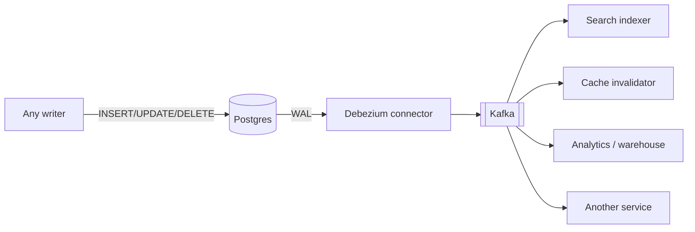
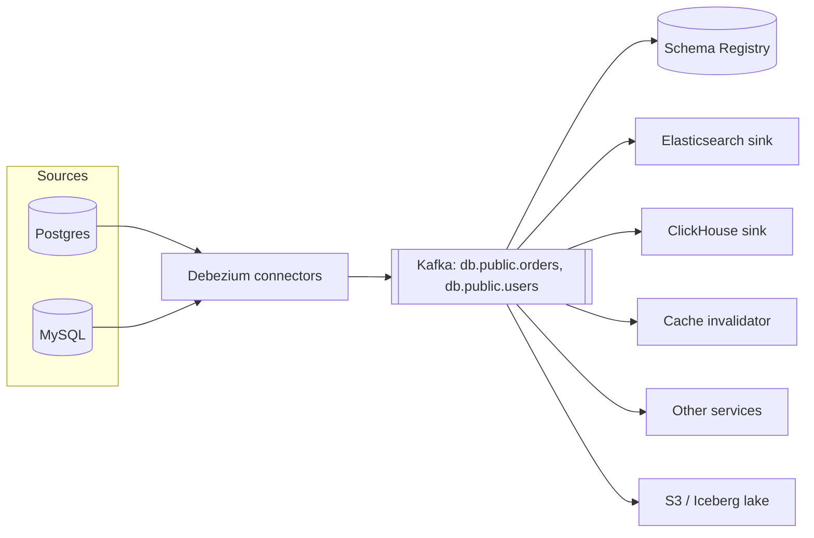

# 5.1.5 — Change Data Capture

> **Part 5 · Scaling Data Storage · Data Replication · Chapter 5 of 5**
> Turn your database's write-ahead log into an event stream. The correct fix for the dual-write problem.

---

## 🧒 ELI5 — Explain Like I'm 5

Your notebook is the truth. But **five other people also need to know when it changes** — the search index, the cache, the analytics team, the email system, the mobile app.

**The naive way:** every time you write in the notebook, you also send five messages. Problem: if you're interrupted after writing but before sending, **the notebook says one thing and the five other people believe another — forever, and silently.** Nobody notices until someone complains months later.

**The clever way:** the notebook already keeps a **diary of every change** — it has to, so it can recover if you drop it. So instead of sending messages yourself, you hire someone to **read the diary out loud**.

Now:

- **It can't be missed.** If it's in the notebook, it's in the diary. Full stop.
- **It catches changes you didn't make.** If the head teacher edits the notebook directly, the diary still records it — and the five people still find out.
- **You can rewind.** A new person joins next year? Read them the diary from the beginning.

That's CDC: **stop announcing your changes; let something read the record the database already keeps.**

---

## The problem it solves: dual writes

```python
# ☠️ BROKEN — and this is extremely common
def create_order(data):
    db.insert("orders", data)              # committed
    kafka.publish("order.created", data)   # process crashes here
    # → the order exists; nothing downstream ever hears about it.
    #   Silently. Forever. No error anywhere.
```

Reversing the order is no better: you'd publish an event for an order that was never saved.

**There is no arrangement of two independent writes that is atomic.** The only correct solutions are:

| Solution | How |
|---|---|
| **Transactional outbox** | Write the event to an `outbox` table **in the same transaction**; a relay publishes it |
| **CDC** | Read the database's own log; the change and the event are the same fact |

⚖️ **Outbox vs CDC:** the outbox is explicit (you choose exactly what to emit and its shape) and requires application changes. CDC is implicit (it emits everything that changes) and requires no application changes — and crucially, **it captures writes made outside your application**. Many systems use both: CDC on the outbox table, giving explicit event shapes with log-based reliability.

---

## How CDC works



The connector acts as a **replication client** — the same mechanism a replica uses — decoding the log into structured change events.

| Database | Mechanism |
|---|---|
| **Postgres** | Logical replication (`wal_level=logical`, `pgoutput`) |
| **MySQL** | Row-based binlog with GTIDs |
| **MongoDB** | Change streams (over the oplog) |
| **SQL Server** | Native CDC tables |
| **Oracle** | LogMiner / XStream |
| **DynamoDB** | DynamoDB Streams |
| **Cassandra** | CDC log (weaker guarantees) |

### The event shape

```json
{
  "op": "u",
  "ts_ms": 1756633451000,
  "source": { "db": "app", "table": "orders", "lsn": 24857392, "txId": 1873 },
  "before": { "id": 88, "status": "pending", "total_minor": 2499 },
  "after":  { "id": 88, "status": "paid",    "total_minor": 2499 }
}
```

🎯 **`before` and `after` together are the powerful part.** A consumer can see exactly *what changed*, not just the new state — which lets it react to transitions ("status moved from pending to paid") rather than re-deriving them.

⚠️ Postgres requires `REPLICA IDENTITY FULL` on a table to include the full `before` image; the default only includes the primary key. That's a per-table decision with a WAL-size cost.

---

## Approaches compared

| Approach | Reliability | Latency | App changes | Captures out-of-app writes |
|---|---|---|---|---|
| **Log-based CDC** | ✅ Cannot miss a committed write | 10–500 ms | ✅ None | ✅ Yes |
| **Transactional outbox** | ✅ Atomic with the data | 100 ms – 1 s | Yes | ❌ No |
| **Triggers** | Good | ms | Schema changes | ✅ Yes |
| **Query polling** (`WHERE updated_at > ?`) | ❌ **Misses deletes; misses intermediate states; clock issues** | Poll interval | Some | ✅ Partially |
| **Dual writes** | ❌ Broken | ms | Yes | ❌ No |

☠️ **Polling on `updated_at` is the most common home-grown approach and it is quietly wrong:** it cannot see deletes, it misses rows that changed twice between polls, and it breaks when clocks skew or transactions commit out of timestamp order (a transaction that started earlier can commit later, so its rows have an earlier `updated_at` than rows you've already scanned past).

⚠️ **Triggers** work and capture everything, but they run inside the writing transaction — so they add latency to every write and can become a performance and correctness liability.

---

## What CDC is used for

| Use case | Detail |
|---|---|
| **Cache invalidation** | The strongest form — cannot miss a write, and covers writes from any source |
| **Search indexing** | Keep Elasticsearch in step with the primary |
| **Data warehouse sync** | Replace nightly batch ETL with near-real-time |
| **Microservice integration** | Publish domain events without touching the writing service |
| **Read model projection** | CQRS projections fed from the log |
| **Cross-region replication** | Between heterogeneous databases |
| **Audit trail** | Every change, with before/after and transaction ID |
| **Zero-downtime migration** | Dual-run old and new schemas; CDC keeps them in step |
| **Cache warming** | Replay a compacted topic to rebuild a cache |

🎯 **The migration use case is worth naming.** To move from a monolith's table to a new service's database: snapshot, then CDC the ongoing changes, verify both agree, then cut over. It's the standard zero-downtime data migration and it depends entirely on CDC.

---

## Snapshot plus stream

A new consumer needs the **current state** plus **everything since**.

```
1. Snapshot: read the whole table at a consistent point (note the LSN)
2. Stream:   apply every change from that LSN onward
3. The consumer is now caught up and stays caught up
```

Debezium does this automatically. The subtleties that matter:

| Issue | Handling |
|---|---|
| Snapshotting a huge table locks or loads the primary | **Incremental snapshots** (Debezium's watermark-based approach) chunk it and interleave with streaming — no long locks |
| Changes during the snapshot | The watermark method deduplicates snapshot rows superseded by streamed changes |
| Re-snapshotting later | Signal tables let you re-snapshot one table without restarting everything |

---

## Ordering, delivery, and idempotency

| Property | Reality |
|---|---|
| **Ordering** | ✅ Guaranteed **per key** if you partition by primary key. **Not** guaranteed across tables or keys |
| **Delivery** | **At-least-once.** Duplicates occur on connector restart |
| **Transactions** | Changes from one database transaction may be split across partitions — atomicity is **not** preserved downstream by default |

☠️ **The cross-table atomicity gap is important.** A transaction that updates `orders` and `inventory` produces two events that may be processed at different times by different consumers. Downstream, there is a window where the two disagree. Options:
- Use the transaction ID in the event metadata to reassemble (Debezium can emit transaction boundary events).
- Design consumers to be **order-tolerant** and eventually consistent.
- Put the events that must be atomic into a single **outbox row** with a composite payload.

**Consumers must be idempotent.** Use the primary key plus the LSN/version:

```python
def apply(event):
    if event.op == "d":
        es.delete(index="orders", id=event.before["id"])
        return
    doc = event.after
    es.index(index="orders", id=doc["id"], document=doc,
             version=event.source["lsn"], version_type="external")
    # Elasticsearch rejects an older version → replays are safe and out-of-order
    # events cannot overwrite newer data
```

🎯 **Using the LSN as an external version number is the elegant idiom** — it makes the consumer both idempotent *and* order-tolerant in one mechanism.

---

## Schema evolution

The source schema changes; consumers must survive it.

| Change | Effect |
|---|---|
| Add a nullable column | ✅ Safe — consumers ignore unknown fields |
| Drop a column | ⚠️ Consumers referencing it break |
| Rename a column | ⚠️ Equivalent to drop + add |
| Change a type | ❌ Breaking |

**Use a schema registry** with `BACKWARD` compatibility so consumers can be upgraded before producers ([Introduction to Kafka](../../02-microservices-and-dataflow/02-asynchronous-communication/06-introduction-to-kafka.md#schema-management)). Debezium emits schema change events on a dedicated topic so consumers can react.

---

## Operating CDC

| Concern | Detail |
|---|---|
| **Replication slot lag** | ☠️ A stopped connector makes the primary retain WAL until its disk fills. **The single biggest operational risk** — set `max_slot_wal_keep_size` and alert |
| **Connector lag** | Monitor `MilliSecondsBehindSource` |
| **Primary load** | Log decoding costs CPU on the primary; a dedicated replica can serve logical decoding in newer versions |
| **Large transactions** | A single transaction updating 10M rows emits 10M events in a burst |
| **Toasted / large values** | Postgres may omit unchanged large values unless `REPLICA IDENTITY FULL` |
| **DDL** | Debezium captures DDL for MySQL; Postgres logical decoding does not emit DDL |
| **Failover** | Slots are **not** replicated by default in older Postgres — after a failover the slot may not exist on the new primary (Postgres 17 adds failover slots) |
| **Exactly-once into a sink** | Requires idempotent writes or transactional sinks |

⚠️ **The failover-and-slots problem is a genuine gotcha.** Plan for re-snapshotting after a failover, or use a version/tooling that supports failover slots.

---

## Reference architecture



**Topic naming:** `<server>.<schema>.<table>`, partitioned by primary key so per-row ordering holds. Use **log compaction** on these topics and they become a durable, replayable snapshot of current state per key — a new consumer replays from offset 0 and materialises the whole table.

🎯 **That last point is the one to make in an interview:** a compacted CDC topic is simultaneously a change stream *and* a rebuildable snapshot. It's what makes derived stores genuinely disposable.

---

## When not to use CDC

| Situation | Better |
|---|---|
| You need **business** events, not row changes | Domain events via the outbox — `OrderPlaced` carries intent; a row change doesn't |
| Only one consumer, and you control the writer | A direct call or an outbox is simpler |
| The source is a third-party system with no log access | Polling or webhooks |
| Very small scale | Cron-based sync is fine |

⚠️ **The row-change vs domain-event distinction matters.** CDC tells you `orders.status` changed from `pending` to `cancelled`. It does **not** tell you *why* — customer cancelled, payment failed, or fraud detected. If consumers need intent, emit explicit domain events through an outbox and use CDC to deliver them reliably. **That combination is the mature architecture.**

---

## 📋 Chapter checklist

| Skill | Ready? |
|---|---|
| Explain the dual-write problem and the only two correct fixes | ☐ |
| Compare outbox and CDC, and describe combining them | ☐ |
| Name the CDC mechanism for four databases | ☐ |
| Explain the before/after event shape and `REPLICA IDENTITY` | ☐ |
| Explain why polling on `updated_at` is wrong (three reasons) | ☐ |
| Describe snapshot + stream and incremental snapshots | ☐ |
| State CDC's ordering and delivery guarantees, including the cross-table gap | ☐ |
| Write an idempotent consumer using the LSN as a version | ☐ |
| Name the replication-slot disk-fill risk | ☐ |
| Explain the failover-and-slots gotcha | ☐ |
| Explain why a compacted CDC topic is also a snapshot | ☐ |
| Distinguish row changes from domain events | ☐ |

---

**← Previous** [5.1.4 Data Replication Tutorial](04-replication-codelab.md)
**Next →** [5.2.1 Database Partitioning](../02-data-partitioning/01-database-partitioning.md)
