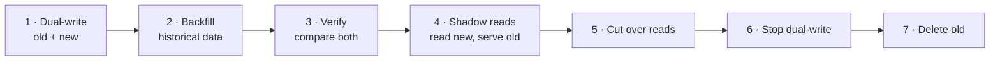

# 5.2.2 — Advanced Database Partitioning Techniques and Key Selection

> **Part 5 · Scaling Data Storage · Data Partitioning · Chapter 2 of 4**
> Hotspots, composite keys, secondary indexes across shards, and the techniques that make sharding survivable.

---

## 🧒 ELI5 — Explain Like I'm 5

You split the library into ten. Now the *interesting* problems start.

**Problem 1 — one library is always packed.** Harry Potter is in library 3, and half the town wants it. Library 3 has a queue out the door; the other nine are empty. **Splitting evenly by *book* doesn't split evenly by *popularity*.**
*Fix:* keep **ten copies of Harry Potter**, one in each library, and send people to a random one.

**Problem 2 — "find every book by this author."** You split by book number, so an author's books are scattered across all ten libraries. Every author search means ten trips.
*Fix:* keep a **separate little index** — one card catalogue that says "Rowling → library 3, 7, 9." Now it's one trip to the catalogue and three to the libraries, not ten.

**Problem 3 — you can't move a book without breaking things.** Someone is halfway through reading it.
*Fix:* copy it first, keep both in step for a moment, then switch the signpost.

**Problem 4 — one customer has 90% of the books.** You split by customer, and one customer is the entire city library.
*Fix:* that customer gets their **own building**, and everyone else shares.

Those four problems — hotspots, secondary lookups, live moves, and skew — are the whole of advanced partitioning.

---

## Hotspots: the fundamental problem

**Even key distribution ≠ even traffic distribution.** Access follows a power law, so a small number of keys take most of the load.

```
Keys evenly spread across 10 shards ✅
But one key takes 30% of all traffic → that shard gets 30% ❌
```

### Sources of hotspots

| Source | Example |
|---|---|
| **Celebrity keys** | One user, product, or tenant with enormous traffic |
| **Monotonic keys** | Sharding by timestamp or auto-increment → all writes hit the newest shard |
| **Low-cardinality keys** | `country`, `status` — a handful of values |
| **Skewed tenants** | One B2B customer is 40% of the data |
| **Temporal bursts** | A flash sale on one product |

### Fixes

| Technique | How | Cost |
|---|---|---|
| **Key salting** | `hash(key + random(0..N))` spreads one key across N shards | Reads must query all N and merge |
| **Selective salting** | Salt **only** known-hot keys; leave the rest alone | Requires hot-key detection |
| **Read replicas of the hot shard** | Spread reads, not writes | Doesn't help write hotspots |
| **Cache the hot key** | ✅ A 1-second local cache turns 10,000 QPS into 1 QPS per instance | Staleness bounded by the TTL |
| **Dedicated shard** | Give the whale its own node | Needs directory routing |
| **Composite key** | Add a dimension that varies | Changes the query model |

🔢 **The local-cache maths, again, because it's the answer most of the time:** a 1-second in-process TTL on a key receiving 10,000 QPS reduces backend load by a factor of 10,000 per instance, at the cost of ≤1 second of staleness. **Try this before redesigning your partitioning.**

### Salting, concretely

```python
SALT_BUCKETS = 16

def write_key(entity_id, is_hot):
    if is_hot:
        return f"{entity_id}#{random.randrange(SALT_BUCKETS)}"   # spread writes
    return entity_id

def read_all(entity_id, is_hot):
    if is_hot:
        parts = [fetch(f"{entity_id}#{i}") for i in range(SALT_BUCKETS)]
        return merge(parts)                                       # 16 reads
    return fetch(entity_id)                                       # 1 read
```

⚖️ **Salting trades read cost for write distribution.** It's right for write-heavy hot keys (counters, event streams for a popular entity) and wrong for read-heavy ones (cache those instead).

---

## Composite and hierarchical keys

Most real partition keys have two parts:

```
Partition key:  what determines the shard      → distribution
Sort key:       ordering within the partition  → range queries
```

| System | Composite model |
|---|---|
| **DynamoDB** | Partition key + sort key |
| **Cassandra** | `PRIMARY KEY ((partition), clustering1, clustering2)` |
| **Citus** | Distribution column + local ordering |
| **MongoDB** | Compound shard key |

```sql
-- Cassandra: messages, partitioned by conversation, ordered by time
CREATE TABLE messages (
  conversation_id uuid,
  bucket int,                    -- ← the anti-unbounded-partition trick
  sent_at timestamp,
  message_id timeuuid,
  body text,
  PRIMARY KEY ((conversation_id, bucket), sent_at, message_id)
) WITH CLUSTERING ORDER BY (sent_at DESC);
```

☠️ **The unbounded partition problem.** Partitioning purely by `conversation_id` means a busy conversation's partition grows forever — Cassandra's practical limit is ~100 MB or 100,000 rows per partition, beyond which reads slow badly and compaction struggles.

✅ **Bucketing** is the standard fix: add a time bucket (`2026-08`) or a numeric bucket to the partition key, so each partition is bounded. Reads for recent data query the current bucket; older reads query previous buckets.

🎯 **"Bound your partition size"** is one of the most important data-modelling rules in wide-column stores, and it's the mistake that most often shows up in production.

---

## Secondary indexes across shards

The hard problem: you sharded by `user_id`, and now someone wants to query by `email`.

| Approach | Read | Write | Consistency |
|---|---|---|---|
| **Local (per-shard) index** | ❌ Scatter-gather to all shards | ✅ Local, atomic | ✅ Strong |
| **Global index table** (sharded by the index key) | ✅ One lookup → then one fetch | ❌ Two shards written | ⚠️ Eventually consistent |
| **External index** (Elasticsearch) | ✅ One query | Async via CDC | ⚠️ Eventual |
| **Denormalised duplicate table** | ✅ One lookup | Write both | ⚠️ Eventual |

```
Global secondary index as a table:
  users        sharded by user_id     (user_id → row)
  users_by_email sharded by email     (email → user_id)

Read by email:  lookup email → user_id (shard A), then fetch user (shard B) = 2 hops
Write:          insert into both — NOT atomic across shards
```

⚠️ **The non-atomicity is the real cost.** If the second write fails, the index is wrong. Mitigations: write the index entry **first** (a dangling index entry is recoverable; a missing one is not), reconcile periodically, and make reads tolerate a stale index entry by verifying against the primary row.

🎯 **This is exactly why DynamoDB's Global Secondary Indexes are eventually consistent** — they're maintained asynchronously across partitions, because doing it synchronously would require a distributed transaction on every write. Knowing *why* GSIs are eventually consistent, rather than just that they are, is a strong signal.

---

## Cross-shard queries

| Query type | Cost | Mitigation |
|---|---|---|
| Point lookup with the shard key | ✅ 1 shard | — |
| Range within one partition | ✅ 1 shard | — |
| Query without the shard key | ❌ All N shards | Add a global index, or denormalise |
| `COUNT(*)` global | ❌ All N | Maintain an approximate counter incrementally |
| Global `ORDER BY ... LIMIT 20` | ❌ Fetch 20 from **each** shard, merge | Precompute the ranked list |
| `JOIN` across shards | ❌ Very expensive | Colocate, or denormalise |
| Pagination across shards | ❌ Composite cursor per shard | Precompute, or paginate within a shard |

### Scatter-gather cost

$$\text{latency} = \max_i(\text{shard}_i) \qquad \text{load} = N \times \text{query cost}$$

☠️ **Latency is bounded by the *slowest* shard**, so with 100 shards you're effectively sampling the p99 of your fleet on every query — this is tail amplification ([Latency](../../01-introduction/03-non-functional-requirements/06-latency.md#the-tail-is-what-matters)). And a global top-20 across 100 shards reads 2,000 rows to return 20.

**Colocation is the structural fix:** choose the shard key so that entities queried together live together. Sharding by `user_id` puts a user's orders, addresses, payments, and sessions on the same node — so the common queries are all single-shard.

---

## Resharding without downtime



| Step | Detail |
|---|---|
| 1 **Dual-write** | Every write goes to both the old and new topology. Behind a feature flag |
| 2 **Backfill** | Copy historical data in throttled batches; use CDC to capture concurrent changes |
| 3 **Verify** | Continuously compare row counts and checksums; alert on drift |
| 4 **Shadow reads** | Read from both, serve the old, **log mismatches** |
| 5 **Cut over** | Flip reads to new, per-tenant or per-percentage |
| 6/7 **Clean up** | Stop dual-writing, retain the old data for a rollback window, then delete |

🎯 **Step 4 is what makes this safe** and it's the step people skip. Shadow reads let you find every correctness bug *while still serving from the known-good path*. Never cut over without it.

**Every step must be reversible** until step 7. If step 5 goes wrong, flip the flag back.

---

## Rebalancing strategies

| Strategy | Data moved | Complexity |
|---|---|---|
| **Consistent hashing** | ~1/N | Medium |
| **Logical shards** (✅ preferred) | Whole logical shards; **no rehashing** | ✅ Low, if adopted early |
| **Range splitting** | Split a hot range in two | Low |
| **Directory** | Any key, anywhere | Medium; needs a lookup service |
| Modulo rehash | ❌ ~90% | Never do this online |

**Logical shards, concretely:**
```
Create 1,024 logical shards on day one.
  logical = hash(key) % 1024        ← NEVER changes
  physical = lookup_table[logical]  ← changes freely

4 nodes:  node0 owns logicals 0-255, node1 256-511, ...
8 nodes:  move logicals 128-255 from node0 to node4, etc.
          → a data copy; no key remapping, no cache invalidation of key mappings
```

🎯 **Adopt logical shards on day one — it costs nothing and saves a migration.** This is one of the highest-value pieces of forward-looking advice in the whole book.

---

## Handling skewed tenants

```
Tenant distribution in real B2B SaaS:
  top 1% of tenants   →  60% of data and traffic
  bottom 80%          →  5%
```

| Technique | How |
|---|---|
| **Directory routing** | Per-tenant placement — move a whale to its own shard |
| **Dedicated shards for whales** | Above a size/traffic threshold, isolate |
| **Sub-sharding within a tenant** | Composite key `(tenant_id, user_id)` for the largest tenants |
| **Capacity-aware placement** | Place new tenants on the least-loaded shard |
| **Continuous rebalancing** | Monitor per-shard load; move tenants automatically |

⚠️ **Plan for the whale before you have one.** Retrofitting per-tenant placement onto `hash(tenant_id) % N` requires a migration; building it in from the start is a lookup table.

---

## Monitoring a sharded system

```
per_shard_qps{shard}                    # ← imbalance is immediately visible
per_shard_storage_bytes{shard}
per_shard_p99_latency{shard}
cross_shard_query_ratio                 # ← what fraction are broadcasts?
scatter_gather_fanout                   # how many shards per query
hot_key_top_n                           # detected hot keys
rebalance_progress
```

| Alert | Meaning |
|---|---|
| Max/min shard QPS > 3× | Distribution is broken |
| One shard's storage > 2× the median | Skew; time to split or move |
| Cross-shard query ratio rising | A new query pattern doesn't match the shard key |
| Any shard > 70% capacity | Rebalance before you're forced to |

🎯 **The cross-shard query ratio is the metric to name.** If it rises, someone has added a query that doesn't use the shard key — and it will quietly degrade the whole system as traffic grows.

---

## 📋 Chapter checklist

| Skill | Ready? |
|---|---|
| Explain why even key distribution doesn't mean even traffic | ☐ |
| Name five hotspot sources and six fixes | ☐ |
| Implement salting and state its read cost | ☐ |
| Explain composite partition + sort keys | ☐ |
| Explain the unbounded partition problem and bucketing | ☐ |
| Compare four approaches to cross-shard secondary indexes | ☐ |
| Explain *why* DynamoDB GSIs are eventually consistent | ☐ |
| Quantify scatter-gather latency and load | ☐ |
| Describe the seven-step resharding procedure and why shadow reads matter | ☐ |
| Explain logical shards and recommend them on day one | ☐ |
| Handle skewed multi-tenant distributions | ☐ |
| Name the sharding metrics and alert thresholds | ☐ |

---

**← Previous** [5.2.1 Database Partitioning](01-database-partitioning.md)
**Next →** [5.2.3 Consistent Hashing](03-consistent-hashing.md)
