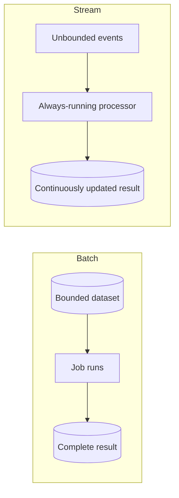
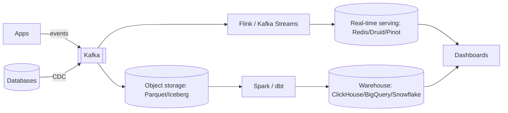

# 6.1.1 — Batch & Stream Processing: Overview

> **Part 6 · Big Data · Overview · Chapter 1 of 1**
> Two ways to process data at volume. The difference is *when*, and everything follows from that.

---

## 🧒 ELI5 — Explain Like I'm 5

You run a shop and you want to know how much you sold.

**Way 1 — the evening count.** At closing time, take the whole day's receipts, sit down, and add them all up. **One big session, once a day.** Simple, accurate, and you can start over if you make a mistake. But at 2pm you have **no idea** how the day is going. *(Batch.)*

**Way 2 — the running total.** Every time a receipt is printed, add it to a number on the wall. **The wall is always up to date.** Brilliant — but harder: you must never miss a receipt, never add one twice, and if a receipt turns up an hour late (someone found it under the counter), you have to decide whether to include it. *(Streaming.)*

The trade is exactly this:

- **Batch:** simple, cheap, correct, easy to redo — but the answer is old.
- **Streaming:** the answer is now — but it's fiddly, and "what about late receipts?" becomes a real question you must answer.

Most shops do **both**: the wall for a live-ish number, the evening count as the definitive one.

---

## The two models

| | **Batch** | **Stream** |
|---|---|---|
| Input | Bounded (a file, a day, a table) | Unbounded (never ends) |
| Execution | Runs, finishes, exits | Runs forever |
| Latency | Minutes to hours | Milliseconds to seconds |
| Completeness | ✅ You know you have everything | You never know — more may arrive |
| Reprocessing | ✅ Trivial: rerun the job | Hard: replay from a log |
| Failure recovery | Restart the job | Checkpoint and resume |
| State | Rebuilt each run | Long-lived, must be persisted |
| Correctness | ✅ Easy | Requires event time, watermarks, exactly-once |
| Cost | ✅ Efficient (bulk, spot instances) | Always-on compute |
| Ordering | Irrelevant — you sort | A first-class concern |
| Examples | Spark, MapReduce, dbt, nightly ETL | Flink, Kafka Streams, Spark Structured Streaming |

🎯 **The one-sentence distinction:** *batch processes a finite dataset you already have; streaming processes an infinite one you're still receiving — which is why completeness, ordering, and late data become design problems.*

---

## The four questions of any data processing system

Google's Dataflow model frames it this way, and it's the clearest mental structure available:

| Question | Meaning |
|---|---|
| **What** results are computed? | Sums, joins, aggregations, models |
| **Where** in event time? | Windows — per minute, per session, per day |
| **When** are results emitted? | Triggers — at the watermark, early, on late data |
| **How** do refinements relate? | Accumulate, discard, or retract-and-restate |

🎯 **In batch, the last three are trivial** — the window is "the whole input", the trigger is "when the job finishes", and there are no refinements. **Streaming makes all four explicit**, which is precisely why streaming is harder. Framing it this way in an interview is a strong signal.

---

## Latency and cost, honestly

| Approach | Latency | Relative cost | Complexity |
|---|---|---|---|
| Daily batch | 24 h | ✅ 1× | ✅ Low |
| Hourly batch | 1 h | 1.5× | Low |
| Micro-batch (5 min) | 5 min | 3× | Medium |
| Streaming | Sub-second | 5–10× | ❌ High |

⚖️ **The cost multiplier is real and often decisive.** Streaming needs always-on compute, durable state, exactly-once machinery, and engineers who understand watermarks. Batch runs on spot instances at 3 a.m. for a tenth of the price.

🎯 **The question to ask before building anything streaming: "what decision changes if this number is one hour old instead of one second old?"** Very often the honest answer is "none" — and then batch is not a compromise, it's the correct engineering choice. Asking this question unprompted is one of the more senior things you can do in a data-platform interview.

**When streaming genuinely earns its cost:**

| Use case | Why sub-second matters |
|---|---|
| Fraud detection | Block the transaction *before* it completes |
| Real-time bidding | 100 ms budget, hard deadline |
| Alerting and monitoring | Detecting an outage an hour late is useless |
| Live dashboards during an event | The event is over in an hour |
| Personalisation within a session | The user leaves in five minutes |
| Inventory during a flash sale | Overselling in the gap |
| Trading | Obvious |

**When batch is right:**

| Use case | Why |
|---|---|
| Daily/weekly business reporting | Nobody acts before tomorrow |
| Billing runs | Monthly by definition |
| ML training | Hours are fine |
| Data warehouse loads | Analysts query yesterday |
| Backfills and corrections | Inherently bounded |
| Compliance and audit exports | Periodic by definition |

---

## Why streaming is genuinely harder

| Problem | Batch | Stream |
|---|---|---|
| **Completeness** | The file ends; you have everything | ❌ You never know if more is coming |
| **Late data** | Doesn't exist — it's in the file or it isn't | ❌ Events arrive out of order, sometimes hours late |
| **Time semantics** | Just a column | ❌ Event time vs processing time is a first-class distinction |
| **State** | In memory, discarded at the end | ❌ Must survive restarts; may grow unbounded |
| **Failure** | Rerun the job | ❌ Resume from a checkpoint without duplicating effects |
| **Correctness** | Deterministic | ❌ Depends on arrival order unless carefully designed |
| **Testing** | Feed a file, compare output | ❌ Must simulate time, delays, and failures |

☠️ **The defining difficulty: event time vs processing time.** An event *happened* at 10:00:00 and *arrived* at 10:04:30 because the user's phone was in a tunnel. Which minute does it belong to? Batch never faces this because it sorts the whole file. Streaming must decide — and that decision is what watermarks are for. ([Event Time & Watermarks](../03-stream-processing/03-event-time-watermarks.md))

---

## The unifying insight

> **A batch job is a stream job over a bounded window.**

Both models compute the same function; they differ only in **when they decide the input is complete**.

This realisation drove the industry's direction:

| System | Unification |
|---|---|
| **Apache Beam / Dataflow** | One API; the runner decides batch or stream |
| **Flink** | Streaming engine that treats batch as bounded streams |
| **Spark Structured Streaming** | Streaming expressed as an incrementally-executed table query |
| **Kafka Streams / ksqlDB** | The **stream–table duality**: a table is a stream's aggregate; a stream is a table's changelog |

🎯 **Stream–table duality is worth stating precisely:** *a table is the current state derived from a stream of changes; a stream is the sequence of changes to a table.* CDC turns a table into a stream; aggregation turns a stream into a table. Recognising that these are the same information in two shapes explains CDC, materialised views, event sourcing, and Kafka Streams all at once.

---

## The architecture patterns

| Pattern | Structure | Trade |
|---|---|---|
| **Batch only** | Source → ETL → warehouse | ✅ Simple, cheap; hours of latency |
| **Stream only (Kappa)** | Source → log → stream processor → serving | ✅ One codebase; reprocessing means replay |
| **Lambda** | Both paths; merge at serving | ✅ Fast + accurate; ❌ two codebases to keep consistent |
| **Unified** | One API, two runners | ✅ One codebase, both latencies |

Details in [Hybrid Architectures](../04-hybrid-architectures/).

---

## The modern stack

| Layer | Role |
|---|---|
| **Ingestion** | Kafka/Pulsar as the durable, replayable buffer — the backbone |
| **Lake** | Parquet on object storage, with Iceberg/Delta for ACID and time travel |
| **Batch** | Spark or dbt over the lake/warehouse |
| **Stream** | Flink or Kafka Streams for low-latency aggregation |
| **Serving** | Druid/Pinot/ClickHouse for sub-second analytics; Redis for point lookups |
| **Orchestration** | Airflow, Dagster, Prefect — dependencies, retries, backfills |

🎯 **The log is the backbone.** Kafka being durable and replayable is what lets batch and stream consume the *same* data, and what makes reprocessing possible at all. Without it, the two paths read different sources and inevitably disagree.

---

## Choosing, in an interview

> "What's the freshness requirement, and what decision depends on it?"

| Answer | Design |
|---|---|
| "Daily reporting" | Batch. Airflow + Spark/dbt into a warehouse |
| "Analysts want yesterday, execs want live headline numbers" | Batch for depth + a small streaming path for the few live metrics |
| "Sub-second, and it drives an automated action" | Streaming (Flink), with a batch reconciliation job for correctness |
| "Both, and it must be exactly right" | Kappa with replay, or Lambda if the batch path must be authoritative |

⚠️ **Always propose a reconciliation job alongside a streaming pipeline.** Streams drift — late data, bugs, restarts. A nightly batch job that recomputes the same aggregate from the raw log and corrects the serving store is cheap insurance, and proposing it unprompted signals real experience.

---

## 📋 Chapter checklist

| Skill | Ready? |
|---|---|
| Contrast batch and stream across ten dimensions | ☐ |
| State the four questions (what/where/when/how) | ☐ |
| Quote the cost multiplier for streaming | ☐ |
| Ask "what decision changes with fresher data?" | ☐ |
| Name seven use cases each way | ☐ |
| Explain why event time vs processing time is the core difficulty | ☐ |
| State the unifying insight and stream–table duality | ☐ |
| Draw the modern stack and explain why the log is the backbone | ☐ |
| Propose a reconciliation job for any streaming design | ☐ |

---

**← Previous** [5.2.4 Database Partition Tutorial](../../05-scaling-data-storage/02-data-partitioning/04-partition-codelab.md)
**Next →** [6.2.1 Unix Pipelines](../02-batch-processing/01-unix-pipelines.md)
