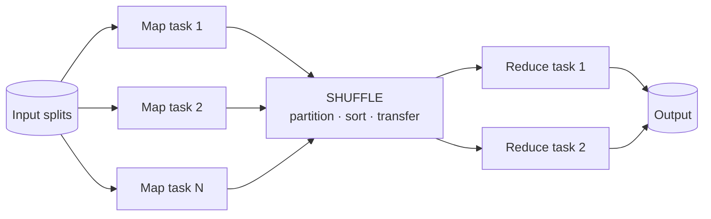

# 6.2.2 — The MapReduce Model

> **Part 6 · Big Data · Batch Processing · Chapter 2 of 4**
> Largely obsolete as a system; permanently important as a model. Everything after it is a refinement.

---

## 🧒 ELI5 — Explain Like I'm 5

You need to count how many times each word appears across **ten thousand books**. One person would take a year.

So you get a hundred helpers:

**Step 1 — MAP.** Give each helper a hundred books. Each helper reads their books and writes little slips: `"the → 1"`, `"cat → 1"`, `"the → 1"`... They don't count anything. They just **turn pages into slips**. All hundred work at once.

**Step 2 — SHUFFLE.** Now sort all the slips into piles, **one pile per word**. Every `"the"` slip goes in the "the" pile, every `"cat"` slip in the "cat" pile. This is the slow, boring, expensive bit — millions of slips being carried across the room.

**Step 3 — REDUCE.** Give each pile to a helper. They count their pile: `"the → 4,182,904"`. All at once again.

That's it. **Map = do something to each item, on your own. Shuffle = group by key. Reduce = combine each group.**

And the clever bit that made it famous: **if a helper faints, you just give their books to someone else.** Nothing is lost, because the books are still there and each helper's work is independent. With a hundred helpers, someone faints every day — so this mattered enormously.

---

## The model



```
map:     (k1, v1)      → list(k2, v2)
shuffle: group all v2 by k2
reduce:  (k2, list(v2)) → list(k3, v3)
```

**Word count:**
```python
def map(doc_id, text):
    for word in text.split():
        emit(word, 1)                    # ("the", 1), ("cat", 1), ("the", 1)

def reduce(word, counts):
    emit(word, sum(counts))              # ("the", 4182904)
```

That's the whole programming model. Everything else — parallelism, fault tolerance, data movement — is the framework's job.

---

## Why it mattered

| Contribution | Detail |
|---|---|
| **Automatic parallelism** | Write two functions; the framework runs them on 10,000 machines |
| **Fault tolerance by re-execution** | A task fails → rerun it. Possible only because tasks are **deterministic and side-effect-free** |
| **Data locality** | Ship the code to the data, not the data to the code |
| **Commodity hardware** | Cheap machines that fail often, instead of one expensive one that fails rarely |
| **A simple mental model** | Two functions, one pattern |

🔢 **The fault-tolerance argument, quantified:** with 10,000 machines and a 3-year MTBF each, you lose roughly **9 machines per day**. A job running for hours on all of them will *definitely* hit failures. Any model requiring the whole job to restart is unusable at that scale. MapReduce's insight was making the **task**, not the job, the unit of retry.

---

## The shuffle: where all the cost is

```
MAP SIDE                                    REDUCE SIDE
1. map() writes to a memory buffer
2. buffer fills → partition by
   hash(key) % numReducers, sort,
   optionally combine, spill to disk
3. merge spills into one sorted file
   per map task                    ────►    4. fetch its partition from EVERY map task
                                            5. merge the fetched sorted runs
                                            6. call reduce() on each key group
```

☠️ **The shuffle is all-to-all: M map tasks × R reduce tasks = M×R network transfers.** With 1,000 maps and 1,000 reduces that's **one million** connections moving data. It is almost always the bottleneck, and it is why every subsequent system's headline optimisation is "avoid or shrink the shuffle."

**Reducing shuffle cost:**

| Technique | Effect |
|---|---|
| **Combiner** (a map-side mini-reduce) | 🎯 The single biggest win — see below |
| **Compression** of map output | 2–10× less network traffic, for CPU |
| **Filter and project early** | Move fewer bytes |
| **Map-side join** (broadcast a small table) | ✅ Eliminates the shuffle entirely |
| **Better partitioning** | Avoid skew |

### The combiner, quantified

```python
def combine(word, counts):        # runs on the MAP side, on that task's output
    emit(word, sum(counts))
```

🔢 For word count over 1 GB of text: without a combiner, a map task emits ~200 million `(word, 1)` pairs. With one, it emits ~100,000 `(word, partial_count)` pairs. **A 2,000× reduction in shuffled data.**

⚠️ **A combiner is only valid if the reduce function is commutative and associative.** `sum`, `min`, `max`, `count` — yes. `average` — **no** (you must carry `(sum, count)` and divide at the end). Getting this wrong produces silently wrong results, which is the worst kind of bug.

---

## Data skew: the killer

☠️ **The job is only as fast as its slowest reduce task.** If one key holds 30% of the data, one reducer does 30% of the work while 999 others finish and wait.

```
Reducer 1:   1M records   ✅ 30 s
Reducer 2:   1M records   ✅ 30 s
...
Reducer 47: 500M records  ❌ 4 hours   ← the whole job takes 4 hours
```

| Cause | Fix |
|---|---|
| A few very hot keys | **Two-stage aggregation** with salting (below) |
| Nulls or defaults concentrated in one key | Filter or handle them separately |
| A skewed join key | Broadcast the small side; or split the hot key |
| Poor hash distribution | Custom partitioner; range partitioning with sampled boundaries |

**Two-stage aggregation — the standard fix:**
```python
# Stage 1: salt the key so one hot key spreads across N reducers
def map1(k, v):
    emit(f"{k}#{random.randrange(100)}", v)
def reduce1(salted_key, vals):
    emit(salted_key, sum(vals))

# Stage 2: remove the salt and combine the partials
def map2(salted_key, partial):
    emit(salted_key.split("#")[0], partial)
def reduce2(k, partials):
    emit(k, sum(partials))
```

🎯 **Skew handling is the most common practical question about batch processing**, and two-stage aggregation is the answer. It's the same salting idea as [hot partitions](../../05-scaling-data-storage/02-data-partitioning/02-advanced-partitioning.md#hotspots-the-fundamental-problem).

---

## Joins in MapReduce

| Join type | How | When |
|---|---|---|
| **Reduce-side (repartition) join** | Both inputs emit `(join_key, tagged_value)`; the reducer receives both sides | General; requires a full shuffle of both |
| **Map-side (broadcast) join** | ✅ Ship the small table to every mapper; join in memory | One side fits in memory — **enormously faster** |
| **Sort-merge join** | Both inputs already sorted and partitioned identically | Repeated joins on the same key |
| **Bloom-filter pre-filter** | Build a Bloom filter of the small side's keys; discard non-matching rows before the shuffle | Large-to-large with low selectivity |

🔢 **The broadcast join is the highest-value optimisation in batch processing.** Joining a 1 TB fact table to a 10 MB dimension table: a reduce-side join shuffles 1 TB; a broadcast join shuffles **nothing** and sends 10 MB to each node. This is why Spark auto-broadcasts tables under a size threshold (`spark.sql.autoBroadcastJoinThreshold`).

---

## Why MapReduce was replaced

| Limitation | Consequence | The successor's answer |
|---|---|---|
| **Materialises to disk between every stage** | A 5-stage job writes and reads HDFS 5 times | Spark keeps intermediate results in memory |
| **Only two operations** | Joins, sorts, and iterations need multiple chained jobs | Rich operator DAGs |
| **Terrible for iteration** | ML algorithms re-read the input from disk every iteration | Cache the dataset in memory |
| **High per-job latency** | ~30 s of JVM startup even for tiny jobs | Long-lived executors |
| **Verbose API** | Hundreds of lines of Java for a word count | DataFrames and SQL |
| **No query optimiser** | The developer must hand-optimise | Catalyst, cost-based optimisation |

🔢 **Spark's headline claim of 10–100× faster came almost entirely from not writing intermediate results to disk**, plus keeping executors alive between stages. For iterative algorithms (k-means, PageRank, gradient descent) the difference is the largest, because MapReduce re-reads the entire dataset from HDFS on every single iteration.

---

## What survives — and why this chapter matters

| Concept | Where it lives now |
|---|---|
| **Map / shuffle / reduce** | Spark stages, Flink operators, SQL `GROUP BY` |
| **Combiner** | Spark's `reduceByKey`, partial aggregation, Flink's pre-aggregation |
| **Partitioner** | Every distributed system's key routing |
| **Task-level retry** | The universal fault-tolerance model |
| **Data locality** | Still matters; less so with fast networks and object storage |
| **Speculative execution** | Spark, Flink, Tez all do it |
| **Skew and two-stage aggregation** | Unchanged; still the answer |
| **Broadcast vs shuffle join** | The central decision in every query planner |

☠️ **The one true anti-pattern that MapReduce taught the industry:** `groupByKey` (shuffle everything, then aggregate) versus `reduceByKey` (aggregate locally first, then shuffle). **They produce the same result; one moves 2,000× more data.** Knowing why is knowing what a combiner is.

```scala
rdd.groupByKey().mapValues(_.sum)   // ❌ shuffles every value
rdd.reduceByKey(_ + _)              // ✅ combines on the map side first
```

🎯 **Speculative execution** is worth naming too: when one task runs much slower than its peers (a "straggler" on failing hardware), the framework launches a duplicate elsewhere and takes whichever finishes first. It's the batch equivalent of [hedged requests](../../01-introduction/03-non-functional-requirements/06-latency.md#the-techniques-to-reduce-latency).

---

## The interview framing

> "MapReduce itself is obsolete — nobody writes new MapReduce jobs — but the model is still exactly how Spark and every SQL engine execute a `GROUP BY`: map to extract the key, shuffle to group, reduce to aggregate.
>
> The shuffle is where all the cost is, because it's all-to-all network transfer. So the optimisations that matter are: combine on the map side before shuffling, broadcast the small side of a join to avoid shuffling the big side, filter and project before the shuffle, and handle skew with two-stage salted aggregation.
>
> MapReduce lost because it materialised to disk between every stage, which made multi-stage and iterative jobs enormously slow. Spark's advantage is keeping intermediate data in memory and having a query optimiser — but the underlying execution model is the same."

---

## 📋 Chapter checklist

| Skill | Ready? |
|---|---|
| Write map and reduce for word count | ☐ |
| Explain fault tolerance by task re-execution, with the 10,000-machine number | ☐ |
| Describe the six steps of a shuffle | ☐ |
| Explain the combiner and quantify its effect | ☐ |
| State when a combiner is invalid (average) | ☐ |
| Explain skew and write two-stage salted aggregation | ☐ |
| Compare four join strategies and quantify broadcast join | ☐ |
| Give six reasons MapReduce was replaced | ☐ |
| Explain `groupByKey` vs `reduceByKey` | ☐ |
| Explain speculative execution | ☐ |

---

**← Previous** [6.2.1 Unix Pipelines](01-unix-pipelines.md)
**Next →** [6.2.3 Distributed File Systems](03-distributed-file-systems.md)
