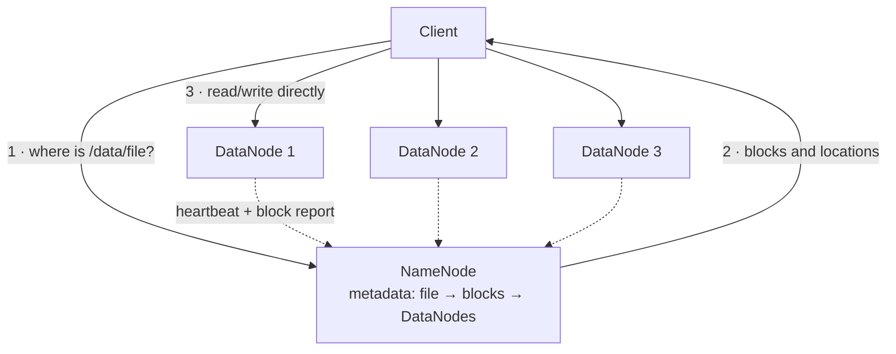

# 6.2.3 — Distributed File Systems

> **Part 6 · Big Data · Batch Processing · Chapter 3 of 4**
> Where the data actually lives. HDFS taught the industry the model; object storage now does the job.

---

## 🧒 ELI5 — Explain Like I'm 5

You have a book so enormous it won't fit in any single cupboard.

So you **tear it into chapters** and put the chapters in different cupboards around the building. You keep a **master list** on the wall saying: *"Chapter 1 is in cupboards 3, 7, and 12. Chapter 2 is in cupboards 1, 5, and 9..."*

Notice three deliberate choices:

1. **Every chapter is in three cupboards, not one.** Cupboards break. With three copies, losing one is a shrug, not a disaster. *(Replication.)*
2. **The three copies are in different rooms** — not all in the same corner, because if the roof leaks in that corner you lose all three at once. *(Rack awareness.)*
3. **The master list is on one wall.** That's simple and fast — but if the wall burns down, **nobody can find anything**, even though every chapter is safe. So you make copies of the list too, and very carefully. *(The NameNode is a single point of failure.)*

And one rule that shapes everything: **chapters are big — a hundred pages, not one.** A million tiny one-page chapters would make the master list enormous and useless. **Big files, few files.**

---

## HDFS architecture



| Component | Role |
|---|---|
| **NameNode** | Holds all metadata **in memory**: the directory tree, and file → block → DataNode mappings |
| **DataNode** | Stores actual block files on local disks; reports what it holds |
| **Block** | The unit of storage — **128 MB default** (not 4 KB!) |
| **Replication factor** | 3 by default |
| **Standby NameNode** | Hot standby, kept in sync via a journal quorum |

🎯 **The key architectural decision: metadata and data are separated.** The client asks the NameNode *where* the data is, then talks **directly** to DataNodes. The NameNode never touches the bytes — which is the only reason one machine can serve a cluster storing petabytes.

---

## Why 128 MB blocks?

A normal filesystem uses 4 KB blocks. HDFS uses 128 MB — **32,000× larger**. Three reasons:

| Reason | Detail |
|---|---|
| **Metadata size** | 🔢 1 PB in 4 KB blocks = 250 billion entries. At ~150 bytes each, that's **37 TB of metadata** — impossible. In 128 MB blocks: 8 million entries ≈ **1.2 GB**, which fits in RAM |
| **Seek vs transfer** | A 10 ms seek to read 128 MB at 100 MB/s (1.28 s) means seek time is <1% of the work. With small blocks, seeking dominates |
| **Fewer network round trips** | One negotiation per 128 MB instead of per 4 KB |

☠️ **This is why the "small files problem" is fatal for HDFS.** A million 1 KB files consume a million metadata entries (~150 MB of NameNode RAM) to store 1 GB of data — and each file spawns its own map task, so a job over them has a million tasks with ~30 s of overhead each.

**Fixes:** combine small files (`CombineFileInputFormat`), use container formats (SequenceFile, Avro, Parquet), or compact on write. **Aim for files of roughly one block size or larger.**

---

## Write path and replica placement

```
1. Client asks the NameNode to create the file
2. NameNode allocates a block and picks 3 DataNodes
3. Client writes to DataNode A, which PIPELINES to B, which pipelines to C
4. Acks flow back down the pipeline
5. Repeat per block; NameNode records the final locations
```

**Default replica placement (rack-aware):**
```
Replica 1: the local node (or a random one if the writer is outside the cluster)
Replica 2: a node on a DIFFERENT rack
Replica 3: a different node on the SAME rack as replica 2
```

🎯 **This placement is a deliberate trade and worth explaining:** putting replicas 2 and 3 on the same remote rack means only **one** cross-rack transfer during writes (cross-rack bandwidth is the scarce resource), while still surviving the loss of an entire rack. Spreading all three across three racks would triple cross-rack write traffic for marginal extra safety.

**Write-once, append-only:** HDFS files cannot be modified in place. This makes replication and consistency trivial — a block is either fully written or not — and it is exactly the immutability principle that makes reruns safe.

---

## Fault tolerance

| Failure | Detection | Recovery |
|---|---|---|
| DataNode dies | Missed heartbeats (~10 min) | NameNode re-replicates its blocks elsewhere |
| Disk corruption | Per-block checksums verified on read | Read from another replica; delete the corrupt one |
| Rack loss | Multiple nodes gone | Rack awareness guarantees a surviving replica |
| **NameNode dies** | ☠️ **Historically fatal** | Standby NameNode + JournalNode quorum + ZooKeeper failover |

☠️ **The NameNode was HDFS's defining weakness.** All metadata lived in one process's memory; losing it made every byte in the cluster unreachable, even though all the data was intact. High-availability HDFS solved it with an active/standby pair sharing an edit log across a JournalNode quorum — but it remains the scaling ceiling: **the NameNode's RAM bounds the number of files the cluster can hold.**

---

## Erasure coding: the 3× storage tax, reduced

| Scheme | Storage overhead | Fault tolerance | Cost |
|---|---|---|---|
| 3× replication | **200%** (3 TB stored per 1 TB of data) | 2 node failures | ✅ Cheap reads; simple |
| Reed-Solomon (6,3) | **50%** | 3 failures | Reconstruction is CPU- and network-expensive |
| Reed-Solomon (10,4) | **40%** | 4 failures | Same |

🔢 **For 10 PB of data: 3× replication needs 30 PB of disk; RS(6,3) needs 15 PB.** At scale that is millions of pounds.

⚖️ **The trade:** with replication, a read just picks any replica. With erasure coding, reading a *lost* block requires fetching 6 other chunks and reconstructing it — expensive in CPU and network. **The standard policy: replication for hot data, erasure coding for cold.** Object storage services do this internally and don't expose the choice.

---

## HDFS vs object storage

The industry has largely moved from HDFS to S3-style object storage. The reasons matter.

| | **HDFS** | **Object storage (S3/GCS)** |
|---|---|---|
| Model | Filesystem (directories, rename, append) | Flat key → bytes |
| Consistency | ✅ Strong | ✅ Strong (S3 since 2020) |
| Data locality | ✅ Compute next to data | ❌ Always over the network |
| Scaling | Bounded by NameNode RAM | ✅ Effectively unlimited |
| Cost | Cluster disks + 3× replication + operations | ✅ ~$0.023/GB-month, no cluster |
| Storage/compute coupling | ❌ Coupled — scale together | ✅ **Decoupled — scale independently** |
| Rename | ✅ Atomic metadata operation | ❌ **Copy + delete — not atomic, and slow** |
| Operations | A cluster to run and upgrade | ✅ Managed |
| Durability | 3 copies in one datacenter | ✅ 11 nines across facilities |

🎯 **Decoupling storage from compute is the decisive advantage**, and it's the sentence to say. With HDFS, storing more data means adding machines that also add compute you may not need — and a cluster sized for the nightly peak sits idle all day. With object storage, you store cheaply forever and spin up compute only when a job runs. That single change is why Spark-on-S3 replaced Hadoop.

☠️ **The non-atomic rename is the real operational gotcha.** Many batch frameworks commit output by writing to a temporary path and renaming it — atomic and instant on HDFS, but on S3 a "rename" is a copy of every object followed by a delete. For a large output this is slow and **not atomic**, so a failure mid-commit leaves partial results.

**Fixes:** S3-optimised committers (the "magic" and "directory" committers in Hadoop 3), or — better — **table formats like Iceberg and Delta Lake**, which commit by atomically swapping a metadata pointer rather than by renaming files.

---

## The modern lake stack

```
s3://lake/events/year=2026/month=08/day=31/part-0001.parquet
```

| Layer | Choice |
|---|---|
| **Storage** | S3 / GCS / Azure Blob |
| **File format** | ✅ Parquet (columnar, compressed, with embedded statistics) |
| **Layout** | Hive-style partitioning (`year=/month=/day=`) for partition pruning |
| **Table format** | ✅ Iceberg / Delta Lake / Hudi — ACID, schema evolution, time travel |
| **Catalog** | Hive Metastore, Glue, Unity Catalog, Iceberg REST |
| **Compute** | Spark, Trino, Athena, DuckDB, Flink |

### Why table formats changed things

A "data lake" of plain Parquet files has no transactions: a reader can see a half-written commit, schema changes are unsafe, and there's no way to update or delete a single row (a GDPR problem).

**Iceberg/Delta add a metadata layer** giving:

| Capability | Detail |
|---|---|
| **Atomic commits** | Swap a metadata pointer; readers see the old or new snapshot, never a mix |
| **Snapshot isolation & time travel** | Query the table as of a timestamp or version |
| **Schema evolution** | Add, drop, rename, reorder columns safely — by **column ID**, not by position |
| **Row-level deletes/updates** | Merge-on-read or copy-on-write — makes GDPR erasure possible |
| **Hidden partitioning** | Queries don't need to know the partition scheme; no more `WHERE year=2026 AND month=8` boilerplate |
| **File pruning from statistics** | Skip files by min/max without listing directories |

🎯 **"Object storage + Parquet + Iceberg" is the modern replacement for HDFS**, and it delivers warehouse-like guarantees at lake-like cost. Naming it shows current knowledge.

---

## Practical file layout guidance

| Guidance | Reason |
|---|---|
| **Target file size: 128 MB – 1 GB** | Too small → metadata and task overhead. Too large → poor parallelism |
| **Partition by the common filter** (usually date) | Enables pruning; the biggest single query speedup |
| **Don't over-partition** | `year/month/day/hour/user_id` creates millions of tiny files — worse than no partitioning |
| **Compact regularly** | Streaming writers produce small files; run compaction |
| **Sort within files by the common filter** | Improves min/max pruning within a file |
| **Use Parquet with zstd or Snappy** | 5–10× compression; column pruning |
| **Store statistics** | Iceberg keeps per-file min/max so whole files are skipped |

☠️ **Over-partitioning is the most common data-lake mistake.** Partitioning by user ID creates one directory per user; a query then lists millions of paths just to plan. **Partition on low-cardinality columns you filter on (date, region); use sorting and file statistics for the rest.**

---

## 📋 Chapter checklist

| Skill | Ready? |
|---|---|
| Draw the NameNode/DataNode architecture and explain the separation | ☐ |
| Give the three reasons for 128 MB blocks, with the metadata arithmetic | ☐ |
| Explain the small-files problem and its fixes | ☐ |
| Describe rack-aware replica placement and why replicas 2 and 3 share a rack | ☐ |
| Explain why the NameNode was the defining weakness | ☐ |
| Compare replication and erasure coding with overhead numbers | ☐ |
| Give the decisive argument for storage/compute decoupling | ☐ |
| Explain the S3 rename problem and how table formats solve it | ☐ |
| List six capabilities Iceberg/Delta add | ☐ |
| State file-size and partitioning guidance, and the over-partitioning trap | ☐ |

---

**← Previous** [6.2.2 The MapReduce Model](02-mapreduce-model.md)
**Next →** [6.2.4 Modern Batch: Spark](04-modern-batch-spark.md)
