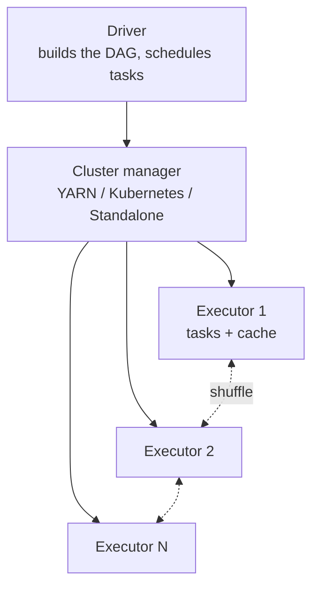

# 6.2.4 — Modern Batch: Spark

> **Part 6 · Big Data · Batch Processing · Chapter 4 of 4**
> The default distributed processing engine. What it does, why it's fast, and how it goes wrong.

---

## 🧒 ELI5 — Explain Like I'm 5

MapReduce made the helpers **write everything down on paper and hand it in** after every single step. Even if step 2 immediately needed what step 1 produced, step 1 still had to file it away first. Enormously wasteful.

Spark's idea: **let the helpers keep their work in their hands** and pass it straight to the next step. Only write to paper when you must.

Two more clever bits:

1. **Don't start until you know the whole plan.** You tell Spark "filter this, then join that, then count" and it does **nothing**. Only when you finally ask for the answer does it look at the whole plan and say *"actually, I can do the filter first and save 90% of the work."* *(Lazy evaluation + a query optimiser.)*

2. **If a helper drops their work, don't panic.** Spark wrote down the **recipe** — "this came from that file, filtered like so." So it just re-does that one piece from the recipe. It never needed the paper copies. *(Lineage-based fault tolerance.)*

That's Spark: keep things in memory, plan before doing, and remember the recipe rather than the result.

---

## Architecture



| Component | Role |
|---|---|
| **Driver** | Runs your code, builds the logical plan, schedules stages, collects results |
| **Executor** | A long-lived JVM running tasks and holding cached data |
| **Task** | One partition's worth of work |
| **Stage** | A set of tasks with no shuffle between them |
| **Job** | Everything triggered by one action |

☠️ **The driver is a single point of failure and a common bottleneck.** `collect()` pulls all data to the driver — an easy way to OOM it. `broadcast` variables also flow through the driver. Keep the driver's job to *planning*, not *processing*.

---

## The execution model

### Transformations vs actions

```python
df2 = df.filter(col("status") == "paid")   # transformation — nothing happens
df3 = df2.groupBy("region").sum("total")   # still nothing
df3.write.parquet("s3://out/")             # ACTION — now the whole plan runs
```

**Lazy evaluation** is what enables optimisation: because Spark sees the entire plan before executing, it can reorder, combine, and prune.

### Narrow vs wide transformations

| | Narrow | Wide |
|---|---|---|
| Examples | `map`, `filter`, `select`, `withColumn` | `groupBy`, `join`, `distinct`, `repartition`, `orderBy` |
| Data movement | ✅ None — each output partition depends on one input partition | ❌ **Shuffle** — all-to-all network transfer |
| Pipelining | ✅ Fused into one stage | Forces a stage boundary |
| Cost | Cheap | Expensive |

🎯 **Stage boundaries are exactly the shuffles.** Reading a Spark plan is mostly counting shuffles: fewer stages means less data movement means a faster job. When asked to optimise a Spark job, *"how many shuffles does it do, and can I remove one?"* is the first question.

### Lineage-based fault tolerance

Spark records **how** each partition was derived, not the data itself. If an executor dies, Spark recomputes only the lost partitions from their lineage.

⚠️ **Long lineages become a problem** — recomputation cost grows, and iterative algorithms build enormous DAGs. `checkpoint()` truncates the lineage by materialising to durable storage.

---

## Why it's faster than MapReduce

| Improvement | Effect |
|---|---|
| **In-memory intermediates** | No disk write between stages — the main win |
| **Long-lived executors** | No per-stage JVM startup (~30 s each in MapReduce) |
| **DAG scheduling** | Multi-stage jobs in one submission, with pipelining |
| **Catalyst optimiser** | Predicate pushdown, column pruning, join reordering, constant folding |
| **Tungsten** | Off-heap memory, cache-aware layout, whole-stage code generation |
| **Adaptive Query Execution** | Re-optimises **at runtime** using actual statistics |

🔢 The historical "100× faster" claim applied mainly to **iterative** workloads (k-means, PageRank), where MapReduce re-reads the whole dataset from HDFS every iteration and Spark keeps it cached. For a single-pass job the gain is more like 2–5×.

### Adaptive Query Execution — worth naming

Introduced in Spark 3, AQE re-plans mid-flight using real statistics:

| AQE feature | What it fixes |
|---|---|
| **Coalesce shuffle partitions** | The default 200 partitions is wrong for most jobs; AQE merges small ones automatically |
| **Switch join strategy** | Converts a sort-merge join to a broadcast join once it *sees* the side is small |
| **Skew join handling** | Detects an oversized partition and splits it |

🎯 AQE removed a large fraction of the manual tuning Spark used to require. Mentioning it signals current knowledge rather than 2016 knowledge.

---

## The API layers

| API | Level | Use |
|---|---|---|
| **RDD** | Low-level, untyped, no optimiser | Rarely — custom partitioning, non-tabular data |
| **DataFrame / Dataset** | ✅ Optimised by Catalyst | The default for everything |
| **Spark SQL** | ✅ Same engine, SQL syntax | Analytics; interchangeable with DataFrames |
| **Structured Streaming** | Same API over unbounded input | Streaming |
| **MLlib / GraphX** | Libraries | ML and graph algorithms |

⚠️ **Prefer DataFrames over RDDs.** RDDs bypass Catalyst entirely — no predicate pushdown, no column pruning, no code generation. A DataFrame job is frequently **5–10× faster** than the equivalent RDD job for the same logic.

```python
# Idiomatic Spark
(spark.read.parquet("s3://lake/events/")
   .filter(col("event_date") >= "2026-08-01")   # ← pushed down to the file reader
   .select("user_id", "amount")                  # ← column pruning
   .groupBy("user_id").agg(sum("amount").alias("total"))
   .write.mode("overwrite").parquet("s3://out/user_totals/"))
```

🔢 **Predicate and projection pushdown into Parquet is the biggest single win.** Reading 2 of 50 columns with a date filter can touch **1% of the bytes** of a naive full read — before any distributed processing happens at all.

---

## Partitioning and parallelism

$$\text{parallelism} = \text{number of partitions}$$

| Symptom | Cause | Fix |
|---|---|---|
| Few tasks, cores idle | Too few partitions | `repartition(n)`; larger input split count |
| Thousands of tiny tasks | Too many partitions | `coalesce(n)` (no shuffle) |
| One task runs for hours | **Skew** | Salting; AQE skew join; broadcast |
| OOM in executors | Partitions too large, or skew | More partitions; more memory |

**Rules of thumb:** target **2–4 tasks per core**, and **100–200 MB per partition**. The default `spark.sql.shuffle.partitions = 200` is wrong for most jobs — too many for small data, far too few for large. **AQE now handles this automatically**, which is why enabling it matters.

```python
df.repartition(200, "user_id")   # shuffle to exactly 200 partitions, hashed by key
df.coalesce(10)                  # ✅ reduce partitions WITHOUT a shuffle (merge only)
```

⚠️ `coalesce` cannot increase partitions and can create skew by merging unevenly; `repartition` always shuffles but distributes evenly.

---

## Joins

| Strategy | When Spark picks it | Cost |
|---|---|---|
| **Broadcast hash join** | One side < `autoBroadcastJoinThreshold` (10 MB default) | ✅ **No shuffle** — ship the small side everywhere |
| **Sort-merge join** | Both sides large | Full shuffle of both |
| **Shuffle hash join** | One side fits in memory per partition | Shuffle, then hash |
| **Broadcast nested loop** | No join key (cross join) | ☠️ Avoid |

```python
from pyspark.sql.functions import broadcast
fact.join(broadcast(dim), "product_id")     # force it when the estimate is wrong
```

🎯 **Raise `autoBroadcastJoinThreshold`.** The 10 MB default is very conservative on modern hardware; 100–200 MB is often safe and turns many shuffles into broadcasts. This is one of the highest-value Spark tunings available.

---

## Caching

```python
df = spark.read.parquet(...).filter(...)
df.cache()          # or .persist(StorageLevel.MEMORY_AND_DISK)
df.count()          # materialise it
# ... several actions reuse the cached DataFrame ...
df.unpersist()      # ← release it, explicitly
```

| Cache when | Don't cache when |
|---|---|
| A DataFrame is used by ≥2 actions | It's used once |
| Iterative algorithms | It doesn't fit in memory (spilling can be slower than recomputing) |
| Expensive lineage (many joins) | The lineage is cheap to recompute |

⚠️ **Caching is not free** — it consumes executor memory that tasks need for shuffles and aggregation. Over-caching causes spilling and OOMs. **Always `unpersist()`.**

---

## The failure modes

| Failure | Cause | Fix |
|---|---|---|
| **Driver OOM** | `collect()` on a large DataFrame; huge broadcast | Write to storage instead; `take(n)` for inspection |
| **Executor OOM** | Skewed partition; too-large partitions; over-caching | More partitions; handle skew; cache less |
| **Shuffle spill to disk** | Insufficient memory for the shuffle | More partitions; more memory; less shuffled data |
| **Straggler task** | Skew or bad hardware | Salting; speculative execution |
| **Small files output** | Too many output partitions | `coalesce()` before writing; compaction |
| **`GC overhead limit exceeded`** | JVM heap pressure | Fewer/smaller cached objects; more executors, smaller heaps |
| **Slow S3 commit** | Rename-based commit | S3 committers; Iceberg/Delta |
| **`java.io.FileNotFoundException` on retry** | Non-idempotent output paths | Write to a unique path, then swap |

☠️ **Skew is the single most common Spark performance problem**, and it presents as "the job is 95% done and has been for an hour." Diagnose it in the Spark UI: one task with far more input records than its peers.

**Fixes, in order:** enable AQE skew handling; broadcast the small side; salt the hot key with two-stage aggregation ([MapReduce](02-mapreduce-model.md#data-skew-the-killer)); or filter the pathological key out and handle it separately.

---

## Tuning that actually matters

```python
spark.conf.set("spark.sql.adaptive.enabled", "true")                     # ✅ AQE
spark.conf.set("spark.sql.adaptive.coalescePartitions.enabled", "true")
spark.conf.set("spark.sql.adaptive.skewJoin.enabled", "true")
spark.conf.set("spark.sql.autoBroadcastJoinThreshold", 100*1024*1024)    # 100 MB
spark.conf.set("spark.sql.files.maxPartitionBytes", 128*1024*1024)
spark.conf.set("spark.serializer", "org.apache.spark.serializer.KryoSerializer")
```

**Executor sizing:** 4–5 cores per executor is the sweet spot — more causes HDFS/S3 throughput contention and worse GC; fewer wastes JVM overhead. Leave ~1 core and ~7% of memory per node for the OS and off-heap.

🎯 **In order of impact:** (1) read less data — partition pruning and column projection; (2) avoid shuffles — broadcast joins, `reduceByKey`-style pre-aggregation; (3) fix skew; (4) right-size partitions; (5) everything else. **Most Spark tuning questions are answered by (1).**

---

## Spark vs the alternatives

| Tool | Better when |
|---|---|
| **Spark** | TB–PB scale, complex transformations, ML, mixed batch/stream |
| **DuckDB** | ✅ < a few hundred GB — faster and vastly simpler, no cluster |
| **Trino / Athena** | Interactive SQL over a lake; federated queries |
| **dbt (on a warehouse)** | ✅ SQL transformations with tests, docs, and lineage |
| **Flink** | True low-latency streaming |
| **Polars / pandas** | Single-machine dataframes |

⚖️ **The honest position:** Spark is often over-applied. A daily job over 50 GB does not need a cluster — DuckDB or dbt will be faster end-to-end (no cluster startup) and far cheaper to operate. **Reach for Spark when data genuinely exceeds one machine, or when you need its ML and streaming ecosystem.** Saying this is a judgement signal, not a knowledge gap.

---

## 📋 Chapter checklist

| Skill | Ready? |
|---|---|
| Describe driver, executor, stage, task | ☐ |
| Explain lazy evaluation and why it enables optimisation | ☐ |
| Distinguish narrow and wide transformations; equate stages with shuffles | ☐ |
| Explain lineage-based recovery and when to checkpoint | ☐ |
| Give six reasons Spark beats MapReduce | ☐ |
| Explain the three things AQE fixes | ☐ |
| Explain why DataFrames beat RDDs | ☐ |
| State partition sizing rules of thumb | ☐ |
| Compare four join strategies and tune the broadcast threshold | ☐ |
| Diagnose skew from the Spark UI and give three fixes | ☐ |
| Rank tuning levers by impact | ☐ |
| Say when Spark is the wrong tool | ☐ |

---

**← Previous** [6.2.3 Distributed File Systems](03-distributed-file-systems.md)
**Next →** [6.3.1 What is Stream Processing?](../03-stream-processing/01-stream-processing-intro.md)
