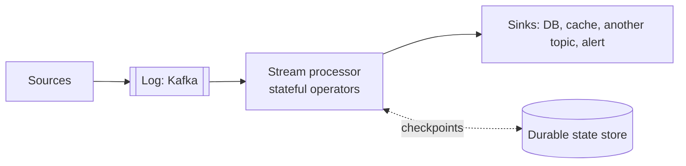

# 6.3.1 — What Is Stream Processing?

> **Part 6 · Big Data · Stream Processing · Chapter 1 of 5**
> Computing continuously over data that never ends.

---

## 🧒 ELI5 — Explain Like I'm 5

Batch is **counting the receipts at closing time**. Stream processing is **keeping a running total on the wall, updated with every sale**.

The running total sounds easy. It isn't, and here's why:

- **The list never ends.** You can never say "right, that's all of them, here's the answer." You only ever have *the answer so far*.
- **You have to remember things.** "Total today" means holding a number in your head all day. If you faint, you must wake up remembering the right number, not zero. *(State, and checkpointing.)*
- **Receipts arrive out of order.** A sale that happened at 10:00 might reach you at 10:04 because the till was offline. Do you go back and fix the 10:00 total? For how long do you keep waiting for stragglers? *(Event time and watermarks.)*
- **You must never count one twice.** If you trip and re-read a receipt, the total is now wrong — permanently, because you never recount from scratch. *(Exactly-once.)*

Batch faces none of these, because it has all the receipts, sorted, at the end of the day.

**Streaming is not "batch, but faster." It is a different problem** — one where completeness, ordering, memory, and duplication all become your responsibility.

---

## The definition

**Stream processing:** continuous computation over an unbounded sequence of events, producing continuously-updated results.



| Element | Detail |
|---|---|
| **Unbounded input** | No end; you process forever |
| **Continuous execution** | The job runs for months |
| **Incremental results** | Each event updates the answer |
| **Long-lived state** | Aggregations, joins, and sessions accumulate |
| **Time semantics** | Event time vs processing time is explicit |

---

## The operators

| Operator | Stateless? | Example |
|---|---|---|
| **Map / filter** | ✅ Stateless | Parse, enrich, drop |
| **Key by** | Stateless | Route by user ID |
| **Windowed aggregation** | ❌ Stateful | Clicks per minute per ad |
| **Stream–stream join** | ❌ Stateful, bounded by a time window | Match impressions to clicks within 5 min |
| **Stream–table join** | ❌ Stateful (the table side) | Enrich events with user profile |
| **Deduplication** | ❌ Stateful | Drop repeated event IDs |
| **Pattern detection (CEP)** | ❌ Stateful | Three failed logins then a success |
| **Session windows** | ❌ Stateful | Group activity by gaps of inactivity |

🎯 **The stateless/stateful split is the fundamental one.** Stateless operators are trivial to scale and restart. **Every hard problem in streaming comes from state:** where it lives, how big it gets, how it survives a restart, and how it's redistributed when you rescale.

---

## State: the central difficulty

```python
# Conceptually simple, operationally the whole problem
state = {}
for event in stream:
    state[event.user_id] = state.get(event.user_id, 0) + event.amount
    emit(event.user_id, state[event.user_id])
```

| Question | Answer |
|---|---|
| Where does it live? | In-memory with a local disk backend (RocksDB), checkpointed to durable storage |
| How does it survive a crash? | **Periodic checkpoints** of state + input positions, restored on restart |
| How big can it get? | Unbounded unless bounded — **use TTLs and windows** |
| What happens when you rescale? | State must be **redistributed** by key across the new parallelism |
| How do you inspect it? | Queryable state, or emit it to an external store |

☠️ **Unbounded state is the classic streaming production failure.** A `keyBy(user_id)` aggregation with no TTL accumulates an entry per user forever — 100 million users later, the job OOMs or checkpoints take hours. **Always bound state**: windows that expire, explicit state TTLs, or periodic cleanup.

🎯 **Checkpointing is what makes streaming fault-tolerant**, and the mechanism is worth knowing: the processor periodically snapshots (a) all operator state and (b) the input offsets, **atomically**. On restart it restores the state and rewinds the input to the matching offsets. That pairing is what makes exactly-once processing possible.

---

## Time: the other central difficulty

| Time | Meaning |
|---|---|
| **Event time** | When it actually happened (in the event) |
| **Ingestion time** | When it reached the system |
| **Processing time** | When the operator handled it |

```
Event happened   10:00:00   (phone in a tunnel)
Reached Kafka    10:04:30
Processed        10:04:31
```

**Which minute does it belong to?** Almost always **event time** — otherwise the same input replayed later produces different results, which makes reprocessing, testing, and backfills meaningless.

⚠️ **Using processing time makes results non-deterministic.** Replay the same data tomorrow and you get different windows. That alone rules it out for anything that must be reproducible or auditable.

But event time forces the hard question: **how long do you wait for stragglers?** That's what watermarks answer. ([Event Time & Watermarks](03-event-time-watermarks.md))

---

## What streaming is good at

| Use case | Why streaming |
|---|---|
| Fraud detection | Block *before* the transaction completes |
| Real-time dashboards | The event is over in an hour |
| Alerting | An outage detected an hour late is useless |
| Personalisation in-session | The user leaves in five minutes |
| ETL with low latency | Continuous CDC into a warehouse |
| Stream enrichment | Join events with reference data as they flow |
| Anomaly detection | Deviation from a rolling baseline |
| Real-time inventory | Prevent overselling in the gap |
| Materialised views | Keep a serving store continuously current |

**And what it is not good for:**

| Not suited | Why |
|---|---|
| Complex multi-way joins over history | Unbounded state |
| Ad-hoc exploration | Streams are pipelines, not query engines |
| ML training | Bounded, iterative, batch-shaped |
| Anything where hours-old data is fine | ❌ 5–10× the cost for no benefit |
| Corrections and restatements | Batch reprocessing is far simpler |

---

## Micro-batch vs true streaming

| | **Micro-batch** (Spark Structured Streaming) | **True streaming** (Flink) |
|---|---|---|
| Model | Small batches every N seconds | Event-at-a-time |
| Latency | 100 ms – seconds | ✅ Milliseconds |
| Throughput | ✅ Very high (batch efficiency) | High |
| State | Per-batch, checkpointed | ✅ Continuous, RocksDB-backed |
| Complexity | ✅ Lower; reuses batch code | Higher |
| Exactly-once | ✅ Via idempotent sinks | ✅ Via checkpoint barriers |
| Best for | Reusing a Spark stack; seconds-level latency is fine | Sub-second latency, complex event-time semantics |

⚖️ **Micro-batch is genuinely sufficient for most "real-time" requirements.** If the dashboard refreshes every 5 seconds, a 2-second micro-batch is indistinguishable from true streaming and much simpler to operate. **Ask what latency is actually required** before choosing Flink.

⚠️ Spark's **Continuous Processing** mode offers ~1 ms latency but with at-least-once semantics and limited operator support — it's not a general replacement for Flink.

---

## Backpressure

When the processor can't keep up with the source, something must give.

| Strategy | Behaviour |
|---|---|
| **Buffer** | Lag grows in Kafka (bounded by retention) |
| **Slow the source** | ✅ Natural with a pull-based source — Flink and Kafka Streams simply consume more slowly |
| **Drop or sample** | Acceptable for metrics and telemetry |
| **Scale out** | Add parallelism, up to the partition count |

🎯 **Pull-based consumption gives backpressure for free**, and this is a real architectural advantage of log-based sources: the consumer reads at its own pace, and the log absorbs the difference. A push-based source would have to be told to slow down, which is a much harder protocol.

⚠️ **Consumer lag is the health metric.** Alert on **lag in time** ("we are 8 minutes behind"), not just in message count — a count is meaningless without knowing the rate.

---

## Scaling and rescaling

Parallelism is bounded by **partition count** in the source. 12 Kafka partitions means at most 12 useful parallel instances per operator.

☠️ **Rescaling a stateful job is the hard part.** State is partitioned by key across instances; changing parallelism means redistributing it. Flink handles this with **key groups** — state is assigned to a fixed number of key groups (a max-parallelism setting), and rescaling reassigns whole groups rather than rehashing every key.

⚠️ **`maxParallelism` is fixed at job creation and cannot be changed without a full state migration.** Set it generously (e.g. 128 or 512) from the start — it's the streaming equivalent of the [logical shards](../../05-scaling-data-storage/02-data-partitioning/02-advanced-partitioning.md#rebalancing-strategies) advice, and the same mistake is just as painful to fix later.

---

## The mental model to carry

> **A stream processor is a continuously-running, incrementally-updated, fault-tolerant database query over an infinite table.**

| Batch concept | Streaming equivalent |
|---|---|
| Table | Stream (the changelog of the table) |
| `GROUP BY` | Windowed aggregation with state |
| `JOIN` | Time-bounded stream join, or stream–table join |
| Query result | Continuously-updated materialised view |
| Job completion | ❌ Doesn't exist — only checkpoints |
| Rerun the job | Replay from an offset |

🎯 **Stream–table duality again:** a table is a stream aggregated; a stream is a table's changelog. This is why Kafka Streams can expose a state store as both, and why CDC turns a database into a stream so naturally.

---

## 📋 Chapter checklist

| Skill | Ready? |
|---|---|
| Explain why streaming is a different problem, not just faster batch | ☐ |
| Classify operators as stateless or stateful | ☐ |
| Explain checkpointing: state + offsets, atomically | ☐ |
| Explain unbounded state and how to bound it | ☐ |
| Distinguish event, ingestion, and processing time | ☐ |
| Explain why processing time makes results non-deterministic | ☐ |
| Name where streaming is and isn't appropriate | ☐ |
| Compare micro-batch and true streaming, and say when micro-batch suffices | ☐ |
| Explain why pull-based sources give backpressure for free | ☐ |
| Explain key groups and why `maxParallelism` must be set generously | ☐ |
| State the stream–table duality | ☐ |

---

**← Previous** [6.2.4 Modern Batch: Spark](../02-batch-processing/04-modern-batch-spark.md)
**Next →** [6.3.2 Windowing Patterns](02-windowing-patterns.md)
