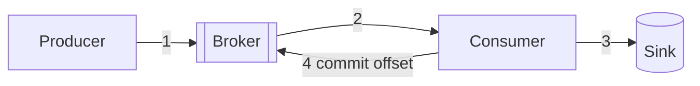
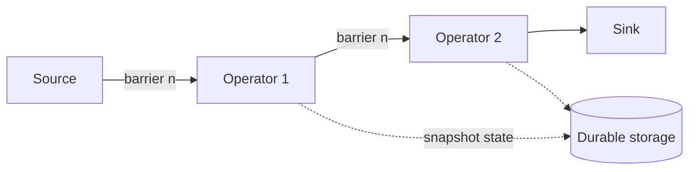

# 6.3.4 — Delivery Guarantees

> **Part 6 · Big Data · Stream Processing · Chapter 4 of 5**
> At-most-once, at-least-once, exactly-once — and what "exactly-once" honestly means.

---

## 🧒 ELI5 — Explain Like I'm 5

You're passing messages down a line of people, and sometimes someone trips.

**Three ways to handle it:**

1. **"I'll say it once and move on."** Fast. If they didn't hear, tough — the message is lost. *(At-most-once.)*
2. **"I'll keep repeating until you say you got it."** Nothing is ever lost — but if they heard you and their "got it" got lost, **they hear it twice**. *(At-least-once.)*
3. **"Exactly once, guaranteed."** Sounds ideal. But think about it: how would you *ever* know the difference between "they didn't hear me" and "they heard me but their reply was lost"? **You can't.** So you cannot promise this by trying harder.

What you *can* do is: **repeat until acknowledged (option 2), but give every message a number** — and the listener writes down which numbers they've already acted on. A repeat arrives, they check their list, and **ignore it**. The message was *delivered* twice; it *took effect* once.

That's the real answer, and it has a name: **at-least-once delivery plus idempotent handling.** Everyone calls it "exactly-once", and what they mean is "the effect happened exactly once."

---

## The three guarantees

| Guarantee | Meaning | Mechanism | Failure |
|---|---|---|---|
| **At-most-once** | 0 or 1 delivery | Ack before processing; fire-and-forget | ❌ Data loss |
| **At-least-once** | ≥ 1 delivery | Ack after processing; retry until acked | ❌ Duplicates |
| **Exactly-once** | Precisely 1 *effect* | At-least-once + deduplication or transactions | ✅ Complexity and cost |

☠️ **Exactly-once *delivery* over an unreliable network is impossible** — this is the two generals problem. The sender can never distinguish "the message was lost" from "the acknowledgement was lost." Any system claiming exactly-once delivery is either lying or, more usually, means **exactly-once *processing*** — which is achievable.

🎯 **Say this precisely in an interview:** *"Exactly-once delivery is impossible; exactly-once processing is achievable through at-least-once delivery combined with idempotent operations or transactional commits."* It's a small distinction that signals real understanding.

---

## Where duplicates come from



| Failure point | Result |
|---|---|
| Producer sends, doesn't get the ack, retries | Duplicate **in the broker** |
| Consumer processes, crashes before committing the offset | Duplicate **processing** on restart |
| Consumer writes to the sink, crashes before committing | Duplicate **in the sink** |
| Operator crashes; job restarts from a checkpoint | Everything since the checkpoint is **reprocessed** |

⚠️ **Note that steps 3 and 4 are two separate systems.** There is no way to make "write to the sink" and "commit the offset" atomic in general — which is precisely the problem exactly-once machinery solves.

---

## Achieving exactly-once processing

### Route 1 — Idempotent operations (simplest and best)

Make repeating the operation harmless.

| Operation | Idempotent? | Fix |
|---|---|---|
| `SET balance = 100` | ✅ Yes | — |
| `balance = balance + 10` | ❌ No | Store an event ID; skip if seen |
| `INSERT` | ❌ No | `INSERT ... ON CONFLICT DO NOTHING` |
| `UPSERT by key` | ✅ Yes | — |
| Send an email | ❌ No | Dedupe on a message key at the gateway |
| Charge a card | ❌ No | Idempotency key |

```python
def handle(event):
    # Natural idempotency: upsert keyed by the event's identity
    db.execute("""
        INSERT INTO totals (user_id, day, amount)
        VALUES (%s, %s, %s)
        ON CONFLICT (user_id, day) DO UPDATE SET amount = EXCLUDED.amount
    """, (event.user_id, event.day, event.running_total))
```

🎯 **Prefer designing for idempotency over building exactly-once machinery.** It's cheaper, simpler, faster, and it works across system boundaries where transactions cannot. *"I'd make the consumer idempotent rather than rely on exactly-once semantics"* is usually the better answer.

### Route 2 — Deduplication

```python
def handle(event):
    if not seen.add_if_absent(event.id, ttl=86400):    # atomic
        return                                          # already processed
    process(event)
```

⚠️ **Deduplication is only correct within its window.** A duplicate arriving after the TTL is processed again. Size the window from your maximum possible retry/replay delay, and remember the state cost: 100M events/day × 16-byte IDs ≈ 1.6 GB/day of dedupe state.

### Route 3 — Transactional commits

Make "process" and "record progress" atomic.

```python
# The offset lives in the SAME database as the result
with db.transaction():
    db.execute("INSERT INTO results ...")
    db.execute("UPDATE offsets SET position = %s WHERE partition = %s", ...)
# On restart, read the offset from your own database — not from Kafka
```

✅ **This is the cleanest general technique** and it works with any transactional sink. The offset and the effect commit together, so they can never disagree.

### Route 4 — Framework exactly-once

| Framework | Mechanism |
|---|---|
| **Flink** | Distributed snapshots (Chandy–Lamport) with barriers; two-phase commit sinks |
| **Kafka Streams** | Kafka transactions: `processing.guarantee=exactly_once_v2` |
| **Spark Structured Streaming** | Idempotent sinks + write-ahead offset log |

⚠️ **All of these are exactly-once *within their own boundary*.** Flink guarantees exactly-once for its internal state and for sinks that implement two-phase commit. **It cannot make "sent an email" exactly-once.** External side effects always need idempotency.

---

## How Flink's checkpointing works



1. The coordinator injects a **barrier** into the source stream at a specific offset.
2. Each operator, on receiving the barrier on all inputs, snapshots its state asynchronously and forwards the barrier.
3. When every operator has acknowledged, the checkpoint is **complete** — state + source offsets, consistently.
4. On failure: restore all state from the last complete checkpoint and **rewind the sources** to the matching offsets.

🎯 **The elegance:** because the barrier flows *with* the data, the snapshot is a consistent cut across a distributed system without ever pausing it. That's the Chandy–Lamport algorithm, and naming it is a strong signal.

⚠️ **Restoring rewinds the source, so events after the checkpoint are reprocessed.** Exactly-once *output* therefore requires the sink to either be idempotent or participate in a two-phase commit — the checkpoint alone only guarantees exactly-once **state**.

**Checkpoint tuning:**

| Setting | Trade |
|---|---|
| Interval (e.g. 30 s) | Shorter → less reprocessing on failure, more overhead |
| Timeout | A checkpoint that takes longer than the interval means they overlap and pile up |
| **Incremental checkpoints** (RocksDB) | ✅ Snapshot only changed state — essential for large state |
| Unaligned checkpoints | Faster under backpressure, larger snapshots |

☠️ **Checkpoints that take longer than the interval are a classic streaming failure**: they pile up, storage fills, and eventually the job cannot checkpoint at all — meaning it also cannot recover. Alert on checkpoint duration and failure count.

---

## Two-phase commit sinks

```
1. PRE-COMMIT: write to the sink in a pending/uncommitted state
                (Kafka transaction open; file written to a temp path)
2. Flink completes the checkpoint
3. COMMIT:     commit the transaction / rename the file
4. On failure between 2 and 3: recover the pending transaction and commit it
```

| Sink | Supports 2PC? |
|---|---|
| Kafka | ✅ Transactions |
| Filesystem/S3 | ✅ Write to temp, rename/commit on checkpoint |
| JDBC | ✅ With XA, or via an idempotent upsert |
| Iceberg / Delta | ✅ Atomic metadata commit |
| Elasticsearch | ❌ Use idempotent upserts with an external version |
| HTTP endpoint | ❌ Use idempotency keys |

⚠️ **2PC introduces latency:** results are only visible after the checkpoint completes, so end-to-end latency becomes at least the checkpoint interval. **A 30-second checkpoint interval means 30 seconds of output latency.** That trade catches people out — you can have exactly-once *or* low latency more easily than both.

---

## Kafka's exactly-once

```properties
# Producer
enable.idempotence=true          # dedupe broker-side retries (default in modern Kafka)
transactional.id=my-app-1        # enables transactions
acks=all

# Consumer (downstream)
isolation.level=read_committed   # skip records from aborted transactions
```

```java
producer.beginTransaction();
producer.send(outputRecord);
producer.sendOffsetsToTransaction(offsets, groupMetadata);   // ← the key line
producer.commitTransaction();
```

🎯 **`sendOffsetsToTransaction` is what makes it work:** the consumer's offset commit is *part of the same transaction* as the output write. Either both happen or neither does — closing the gap between steps 3 and 4 in the diagram above.

⚠️ **Scope:** this is exactly-once for **Kafka → process → Kafka**. The moment an external system is involved, you're back to idempotency.

🔢 **Cost:** transactions typically reduce throughput by 3–20% and add latency equal to the commit interval.

---

## Choosing a guarantee

| Data | Guarantee | Reasoning |
|---|---|---|
| Metrics, telemetry | **At-most-once** | Loss is acceptable; cheapest |
| Logs | At-least-once | Duplicates are tolerable |
| Analytics events | At-least-once + dedupe | Approximate is fine, but not 2× |
| **Billing / ad clicks** | **Exactly-once** | Double-charging is unacceptable |
| Inventory decrements | Exactly-once | Overselling |
| Notifications | At-least-once + dedupe key | A duplicate email is bad but not fatal |
| Payments | Exactly-once via idempotency keys | Non-negotiable |

⚖️ **Don't pay for exactly-once where at-least-once plus idempotency will do** — which is most of the time. It costs throughput, latency, and operational complexity.

---

## The honest summary

| Claim | Reality |
|---|---|
| "Kafka provides exactly-once" | ✅ Within Kafka, for read-process-write |
| "Flink provides exactly-once" | ✅ For internal state, and for 2PC-capable sinks |
| "Our system is exactly-once end-to-end" | ⚠️ Only if **every** external effect is idempotent |
| "Exactly-once means no duplicates ever" | ❌ It means duplicate *effects* are prevented |

🎯 **The framing to use:** *"I'd design for at-least-once delivery with idempotent processing, which gives exactly-once semantics without the cost. Where an external side effect can't be made idempotent — sending money, sending an email — I'd use an idempotency key with a stored result. I'd only enable framework transactions if the pipeline is Kafka-to-Kafka and the throughput cost is acceptable."*

---

## 📋 Chapter checklist

| Skill | Ready? |
|---|---|
| Define the three guarantees and their mechanisms | ☐ |
| Explain why exactly-once *delivery* is impossible | ☐ |
| Identify four places duplicates originate | ☐ |
| Give four routes to exactly-once processing | ☐ |
| Argue for idempotency over framework machinery | ☐ |
| Explain deduplication windows and their state cost | ☐ |
| Explain transactional offset storage in the sink database | ☐ |
| Describe Flink's barrier checkpointing | ☐ |
| Explain the 2PC latency trade | ☐ |
| Explain `sendOffsetsToTransaction` | ☐ |
| Choose a guarantee for seven data types | ☐ |

---

**← Previous** [6.3.3 Event Time & Watermarks](03-event-time-watermarks.md)
**Next →** [6.3.5 Modern Stream: Flink & Kafka Streams](05-modern-stream-flink.md)
