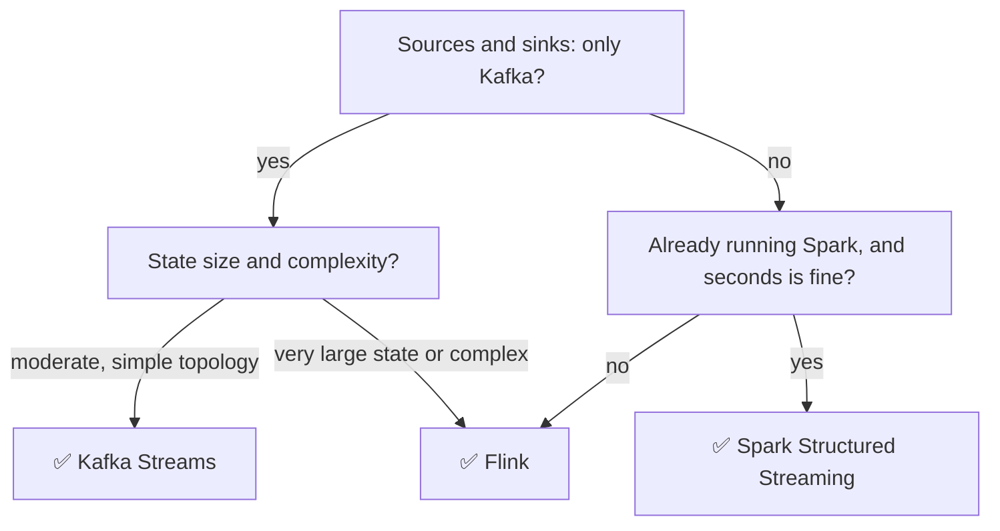

# 6.3.5 — Modern Stream: Flink & Kafka Streams

> **Part 6 · Big Data · Stream Processing · Chapter 5 of 5**
> The two systems you'll actually name, and how to choose between them.

---

## 🧒 ELI5 — Explain Like I'm 5

Two ways to have a team constantly processing incoming work.

**Kafka Streams is a library.** You just write a normal program, and *inside* it there's a bit that says "keep reading from the conveyor belt and doing this." You run it like any other app — the same way you'd run a website. If you want more throughput you start more copies. **There's no separate machine to look after.** It's simple. But it only works with one particular conveyor belt (Kafka), and it can only do the things that library knows how to do.

**Flink is a whole factory.** It has its own manager, its own workers, its own way of remembering things and recovering from disasters. **You have to build and run the factory.** But it can take work from any conveyor belt, handle a hundred times more of it, and do far more complicated things with it.

The choice is that simple:

- **Only Kafka, modest scale, small team** → the library. Fewer moving parts wins.
- **Many sources, huge scale, complicated logic, sub-second latency** → the factory. It's worth the trouble.

---

## Side by side

| | **Kafka Streams** | **Apache Flink** |
|---|---|---|
| Form | A Java/Scala **library** | A distributed **cluster** |
| Deployment | Runs in your app; deploy like a normal service | A job manager + task managers (or on Kubernetes) |
| Sources / sinks | ❌ Kafka only | ✅ Kafka, Kinesis, files, JDBC, CDC, HTTP, custom |
| State backend | RocksDB + a Kafka changelog topic | RocksDB / heap, checkpointed to durable storage |
| Scaling | Add app instances (bounded by partition count) | Adjust parallelism; rescale with savepoints |
| Exactly-once | ✅ Kafka transactions | ✅ Checkpoints + 2PC sinks |
| Latency | Milliseconds | ✅ Milliseconds |
| Throughput | High | ✅ Very high |
| Batch support | ❌ No | ✅ Unified batch and stream |
| SQL | ksqlDB (a separate service) | ✅ Flink SQL, built in |
| Complex event processing | Limited | ✅ Native CEP library |
| Operational burden | ✅ Low — it's just your app | Higher — a cluster to run |
| Learning curve | ✅ Gentle | Steeper |

🎯 **The decisive question: "is everything already in Kafka?"** If yes, and the transformations are moderate, Kafka Streams removes an entire distributed system from your architecture. If you need other sources, batch, or very large state, Flink earns its complexity.

---

## Kafka Streams

```java
StreamsBuilder builder = new StreamsBuilder();

KStream<String, Order> orders = builder.stream("orders",
        Consumed.with(Serdes.String(), orderSerde));

// Enrich with a table (a compacted topic materialised as a local store)
KTable<String, Customer> customers = builder.table("customers");

orders.join(customers, (order, cust) -> enrich(order, cust))
      .groupBy((k, v) -> v.getRegion())
      .windowedBy(TimeWindows.ofSizeWithNoGrace(Duration.ofMinutes(5)))
      .aggregate(Revenue::new, (k, v, agg) -> agg.add(v.getAmount()),
                 Materialized.as("revenue-store"))
      .toStream()
      .to("revenue-by-region");

new KafkaStreams(builder.build(), props).start();
```

### The core abstractions

| Abstraction | Meaning |
|---|---|
| **KStream** | An unbounded sequence of records — a **changelog** |
| **KTable** | The **current value per key** — a materialised view, backed by a compacted topic |
| **GlobalKTable** | A KTable replicated in full to **every** instance — for small reference data, joinable on any key |

🎯 **KStream vs KTable is the stream–table duality made concrete.** `stream.groupByKey().reduce(...)` turns a stream into a table; `table.toStream()` turns a table back into its changelog. Understanding this pair explains most of the API.

### How state works

```
Local RocksDB store (fast reads)
        │
        └──► changelog topic in Kafka (compacted, durable)
```

On failure, a new instance **replays the changelog topic** to rebuild its local store. **Standby replicas** keep a warm copy so failover doesn't require a full replay — worth enabling for large state, because rebuilding tens of GB from a changelog takes a long time.

⚠️ **Rebalancing is Kafka Streams' main operational pain.** Adding or removing an instance triggers partition reassignment, and each moved partition's state must be rebuilt. Mitigations: `num.standby.replicas`, static membership (`group.instance.id`), and cooperative rebalancing.

### Interactive queries

```java
ReadOnlyKeyValueStore<String, Revenue> store =
    streams.store(StoreQueryParameters.fromNameAndType("revenue-store", keyValueStore()));
Revenue r = store.get("EMEA");
```

✅ **Your streaming app becomes a queryable service** — no separate serving database for the aggregates. Elegant for small-to-medium state; you must handle routing queries to the instance that owns the key.

---

## Apache Flink

```java
StreamExecutionEnvironment env = StreamExecutionEnvironment.getExecutionEnvironment();
env.enableCheckpointing(30_000);
env.getCheckpointConfig().setCheckpointingMode(CheckpointingMode.EXACTLY_ONCE);

env.fromSource(kafkaSource, WatermarkStrategy
        .<Order>forBoundedOutOfOrderness(Duration.ofSeconds(30))
        .withTimestampAssigner((o, ts) -> o.eventTime)
        .withIdleness(Duration.ofMinutes(1)),
      "orders")
   .keyBy(Order::getRegion)
   .window(TumblingEventTimeWindows.of(Time.minutes(5)))
   .allowedLateness(Time.minutes(10))
   .aggregate(new RevenueAggregator())
   .sinkTo(icebergSink);

env.execute("revenue-by-region");
```

### What Flink adds

| Capability | Detail |
|---|---|
| **Any source and sink** | Kafka, Kinesis, Pulsar, files, JDBC, CDC (Flink CDC), HTTP |
| **Unified batch and stream** | The same API; bounded sources run as batch |
| **Savepoints** | ✅ A manually-triggered, portable snapshot — **upgrade code or rescale without losing state** |
| **Rich time semantics** | Watermarks, allowed lateness, side outputs, timers |
| **CEP library** | Detect patterns: "three failures then a success within 5 minutes" |
| **Flink SQL** | Full streaming SQL with joins, windows, and a catalog |
| **Large state** | Tens of TB with incremental RocksDB checkpoints |

🎯 **Savepoints are the feature to name.** They let you stop a job, deploy new code, change the parallelism, and resume **with all state intact**. That capability — safely evolving a long-running stateful job — is what makes Flink viable for jobs that run for years.

```bash
flink savepoint <jobId> s3://savepoints/
flink run -s s3://savepoints/savepoint-abc123 -p 24 new-version.jar
```

⚠️ **State schema evolution has rules:** adding fields is fine with Avro/POJO serializers; changing types or removing fields may break restoration. Design state classes for evolution from the start, and set `maxParallelism` generously ([Stream Processing Intro](01-stream-processing-intro.md#scaling-and-rescaling)).

### Flink SQL

```sql
CREATE TABLE orders (
  order_id STRING, region STRING, amount DECIMAL(10,2),
  event_time TIMESTAMP(3),
  WATERMARK FOR event_time AS event_time - INTERVAL '30' SECOND
) WITH ('connector' = 'kafka', 'topic' = 'orders', 'format' = 'avro-confluent');

CREATE TABLE revenue (region STRING, window_start TIMESTAMP(3), total DECIMAL(12,2),
  PRIMARY KEY (region, window_start) NOT ENFORCED)
WITH ('connector' = 'upsert-kafka', ...);

INSERT INTO revenue
SELECT region, window_start, SUM(amount)
FROM TABLE(TUMBLE(TABLE orders, DESCRIPTOR(event_time), INTERVAL '5' MINUTES))
GROUP BY region, window_start;
```

⚖️ **Flink SQL removes most of the learning curve** for standard aggregations and joins. Drop to the DataStream API when you need custom state, timers, or CEP. **Propose SQL first** — it's easier to review, easier to hand over, and usually fast enough.

---

## Spark Structured Streaming — the third option

```python
(spark.readStream.format("kafka").option("subscribe", "orders").load()
   .select(from_json(col("value").cast("string"), schema).alias("d")).select("d.*")
   .withWatermark("event_time", "30 seconds")
   .groupBy(window("event_time", "5 minutes"), "region")
   .agg(sum("amount"))
   .writeStream.format("delta").outputMode("update")
   .option("checkpointLocation", "s3://ckpt/").start())
```

| ✅ | ❌ |
|---|---|
| Same API as Spark batch — one skill set | Micro-batch: latency in seconds, not milliseconds |
| ✅ Excellent if you already run Spark | Weaker event-time and state features than Flink |
| Delta/Iceberg integration | Continuous mode is limited and at-least-once |

⚖️ **If you already run Spark and need seconds-level latency, Structured Streaming is very often the right answer** — one platform, one skill set, no new cluster. Choose Flink when you genuinely need sub-second latency or complex event-time semantics.

---

## Choosing



| Scenario | Choice |
|---|---|
| Kafka → transform → Kafka; small team | **Kafka Streams** |
| Many sources, CDC, sub-second latency | **Flink** |
| Terabytes of state, long-running, evolving | **Flink** (savepoints) |
| Already on Spark; a warehouse sink; seconds is fine | **Spark Structured Streaming** |
| Simple SQL aggregations over Kafka | **ksqlDB** or **Flink SQL** |
| Cloud-managed, minimal ops | Managed Flink (AWS/Confluent/Ververica), Dataflow, Databricks |

---

## Operating a streaming job

| Metric | Alert on |
|---|---|
| **Consumer lag (time)** | > SLO. The headline health metric |
| **Watermark lag** | Growing — the job is falling behind or a partition is idle |
| Checkpoint duration | Approaching the checkpoint interval |
| Checkpoint failures | Any — recovery is at risk |
| State size | Growing without bound |
| Backpressure | Sustained — a downstream operator or sink is the bottleneck |
| Restart count | Frequent restarts mean repeated reprocessing |
| Records dropped as late | Rising — the watermark delay is too tight |

☠️ **The three most common production failures**, all covered earlier and worth restating:
1. **Unbounded state** — no TTL on keyed state; the job OOMs weeks after launch.
2. **Checkpoints exceeding the interval** — they pile up until the job can neither checkpoint nor recover.
3. **An idle partition stalling the watermark** — no output at all, with every metric looking healthy.

**Deployment practice:** always take a **savepoint** before an upgrade, deploy the new version from it, and keep the previous savepoint for rollback. Treat a streaming job like a database, not like a stateless service.

---

## The interview answer

> "For a Kafka-to-Kafka pipeline with moderate state, I'd use **Kafka Streams** — it's a library, so it deploys like any other service and there's no cluster to operate. State lives in local RocksDB backed by a compacted changelog topic, and I'd enable standby replicas so failover doesn't require replaying the whole changelog.
>
> I'd move to **Flink** if I needed non-Kafka sources, sub-second latency with complex event-time semantics, very large state, or the ability to rescale and upgrade a stateful job — savepoints are the feature that makes long-running stateful jobs maintainable.
>
> Either way: event time with watermarks set from the measured p99 lateness, allowed lateness plus a side output for stragglers, idempotent or upsert sinks so at-least-once delivery is safe, and a nightly batch reconciliation that recomputes from the raw log and corrects the serving store.
>
> The failures I'd instrument for are unbounded state, checkpoints exceeding their interval, and idle partitions stalling the watermark."

---

## 📋 Chapter checklist

| Skill | Ready? |
|---|---|
| Compare Kafka Streams and Flink across ten dimensions | ☐ |
| State the decisive "is it all in Kafka?" question | ☐ |
| Explain KStream, KTable, GlobalKTable | ☐ |
| Explain changelog-backed state and standby replicas | ☐ |
| Explain interactive queries | ☐ |
| Explain savepoints and why they matter | ☐ |
| Write a Flink SQL windowed aggregation with a watermark | ☐ |
| Say when Spark Structured Streaming is the right answer | ☐ |
| List the streaming metrics and alert conditions | ☐ |
| Name the three most common production failures | ☐ |
| Deliver the interview answer | ☐ |

---

**← Previous** [6.3.4 Delivery Guarantees](04-delivery-guarantees.md)
**Next →** [6.4.1 Lambda Architecture](../04-hybrid-architectures/01-lambda-architecture.md)
