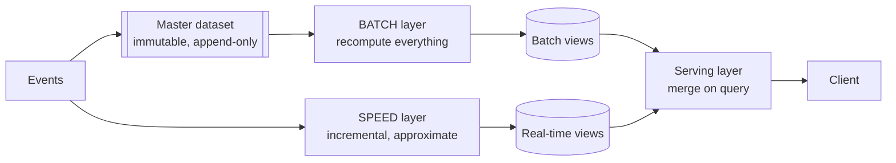

# 6.4.1 — Lambda Architecture

> **Part 6 · Big Data · Hybrid Architectures · Chapter 1 of 3**
> Run both a batch and a streaming path, and merge them. Historically important; now usually the wrong answer.

---

## 🧒 ELI5 — Explain Like I'm 5

You want two things that fight each other:

- **A number right now** (even if it's a bit off).
- **A number that's definitely correct** (even if it's slow).

So you do **both**, in parallel:

- One person keeps a **running tally on the wall** — instant, but occasionally wrong because a receipt got missed or counted twice.
- Every night, another person **counts every receipt from scratch** and writes the true number in the ledger.

When someone asks "how much today?", you answer: *"the ledger says £8,400 up to midnight, and the wall says £1,200 since then — so about £9,600."*

**It works.** But look at the cost: **two people doing the same sum in two different ways**. If they disagree, which is right? If the rule changes ("VAT is now excluded"), **you have to teach both of them, identically**, and if one learns it slightly differently, your numbers are quietly wrong forever.

That double-maintenance is why people stopped doing this.

---

## The architecture



| Layer | Job | Property |
|---|---|---|
| **Batch** | Recompute views from the entire master dataset | ✅ Accurate, simple, self-correcting |
| **Speed** | Process only recent events incrementally | Fast, approximate, may drift |
| **Serving** | Merge batch views with real-time views at query time | Hides the split from clients |

**The core claim** (Nathan Marz, 2011): the batch layer periodically recomputes from scratch, so **any error in the speed layer is automatically wiped out** on the next batch run. The speed layer only ever covers the window since the last batch, so its errors are bounded in time.

$$\text{query} = \text{batch view}(\text{data} \le T) \;\cup\; \text{realtime view}(\text{data} > T)$$

---

## Why it was invented

In 2011 the constraints were genuinely different:

| Constraint then | Consequence |
|---|---|
| Stream processors (Storm) offered **at-most-once or at-least-once only** | The fast path *would* lose or duplicate data |
| No event-time semantics or watermarks | Late data was simply mishandled |
| No exactly-once, no reliable state | Long-running aggregates drifted |
| MapReduce was the only trustworthy engine | Correctness meant batch |

☠️ **The speed layer was known to be wrong.** Lambda's entire design was a way to *live with* an unreliable streaming layer by having batch continuously overwrite it. That was a rational response to the technology of the time.

---

## Why it fell out of favour

| Problem | Detail |
|---|---|
| **Two codebases** | The same business logic implemented twice, in two frameworks, by (often) two teams |
| **Two sets of bugs** | And two *different* sets, so results disagree in ways that are hard to attribute |
| **Divergence** | A logic change must be applied identically to both. It won't be, eventually |
| **Merge complexity** | Deduplicating and reconciling the two views at query time is genuinely fiddly |
| **Double operational cost** | Two clusters, two pipelines, two on-call surfaces |
| **Testing burden** | Every change requires verifying that both paths agree |

☠️ **Divergence is the killer, and it's insidious.** The two implementations agree on day one. Six months later a subtle difference — how a null is handled, how a timezone boundary is treated, a rounding rule — makes them disagree by 0.3%. Nobody notices for a year, and by then nobody knows which number was ever right.

🎯 **The modern counter-argument, in one sentence:** *"Modern stream processors give exactly-once state, event time, and watermarks — so the speed layer can be correct on its own, which removes Lambda's entire reason to exist."*

---

## The serving-layer merge

Even when the two paths are correct, merging them is not trivial:

| Merge type | Method | Difficulty |
|---|---|---|
| **Sums, counts** | Add batch + real-time | ✅ Easy |
| **Max / min** | Take the extreme | ✅ Easy |
| **Distinct counts** | ❌ Cannot add — needs mergeable sketches (HyperLogLog) | Medium |
| **Percentiles** | ❌ Cannot add — needs t-digest or similar | Medium |
| **Top-N** | Merge candidate lists; may be inexact at the boundary | Hard |
| **Deduplication across the boundary** | Events near time T may appear in both views | ☠️ Hard |

⚠️ **The boundary is where correctness leaks.** An event with event time 23:59:58 that arrives at 00:00:03 may be counted by the batch job (which sees it in the file) *and* by the speed layer (which processed it after the cutover). Preventing that double-count requires careful watermark alignment between the two paths — exactly the kind of subtle coordination Lambda was supposed to avoid.

🎯 **Mergeable sketches are what make Lambda workable for approximate metrics.** HyperLogLog unions are exact, so `distinct(batch) ∪ distinct(realtime)` works. Naive `COUNT(DISTINCT)` cannot be merged at all.

---

## When Lambda still makes sense

⚖️ It hasn't disappeared. It's the right answer when:

| Situation | Why |
|---|---|
| **The batch result must be authoritative** (finance, billing, regulatory) | An auditable batch recomputation from raw data is the record; streaming is a preview |
| **The batch and stream logic are genuinely different** | E.g. streaming produces an approximate count; batch computes an exact one with joins to slowly-changing dimensions |
| **You already have a mature batch platform** | Adding a thin real-time path is cheaper than rewriting everything as streaming |
| **The stream path is best-effort by design** | A "live-ish" dashboard, where batch is the source of truth |
| **Reprocessing volume is enormous** | Replaying years of events through a stream processor may be far slower than a batch job over Parquet |

🎯 **The strongest modern form isn't really Lambda at all:** *streaming for the serving path, plus a nightly batch job that recomputes and corrects.* That's a **reconciliation job**, not a co-equal second implementation — one authoritative pipeline plus a repair mechanism. It gets Lambda's self-correcting property without two codebases of business logic.

---

## Lambda vs Kappa vs unified

| | **Lambda** | **Kappa** | **Unified** |
|---|---|---|---|
| Codebases | ❌ Two | ✅ One | ✅ One |
| Reprocessing | Rerun the batch job | Replay the log | Rerun with a bounded source |
| Correctness | Batch corrects the stream | Depends on the stream being correct | Same engine both ways |
| Latency | ✅ Low (speed layer) | ✅ Low | ✅ Low |
| Historical depth | ✅ Unlimited (files) | Bounded by log retention (unless tiered) | ✅ Unlimited |
| Operational cost | ❌ Highest | ✅ Lower | ✅ Lower |
| Best for | Batch must be authoritative | Streaming can be correct | Modern default |

Next chapters: [Kappa Architecture](02-kappa-architecture.md), [Unified Processing](03-batch-stream-unification.md).

---

## A worked example — ad click counting

**Requirements:** live counts for advertisers (seconds), and exact counts for billing (daily).

**Lambda:**
```
Speed:  Kafka → Flink → 1-min counts → Redis          (approximate; ~seconds)
Batch:  Kafka → S3 Parquet → nightly Spark job        (exact; dedupes, joins
        → exact daily counts → warehouse               fraud signals, applies
                                                        billing rules)
Serve:  today = batch(yesterday) + realtime(today)
Bill:   from the batch numbers only
```

**Modern equivalent (recommended):**
```
Kafka → Flink (exactly-once, event time, dedupe by click_id) → serving store
      → also archived to S3/Iceberg
Nightly: a reconciliation job recomputes from the archive and CORRECTS the
         serving store; discrepancies are alerted on, not silently absorbed
Billing: from the reconciled numbers
```

⚖️ **The difference is important:** in Lambda the batch job is a *second implementation of the business logic*. In the modern version it is a *verification and repair job* — usually simpler, and its disagreement with the stream is treated as a bug to investigate rather than an expected condition.

---

## ☠️ Failure modes

| Failure | Consequence |
|---|---|
| Logic divergence between paths | Silently different results; nobody knows which is right |
| Boundary double-counting | Inflated metrics around the batch cutover |
| Non-mergeable aggregates | Distinct counts and percentiles can't simply be added |
| Batch job fails silently | The speed layer's errors are never corrected; drift accumulates |
| Different schemas in the two paths | Fields present in one view and not the other |
| Two teams owning the two paths | Guaranteed divergence, plus blame ambiguity |
| The serving merge itself is untested | Correct inputs, wrong output |

**If you do run Lambda:** put the business logic in a **shared library** used by both paths, and run a **continuous comparison job** that alerts when the two disagree beyond a threshold. Those two practices remove most of the risk.

---

## 📋 Chapter checklist

| Skill | Ready? |
|---|---|
| Draw the three layers and the merge equation | ☐ |
| Explain the 2011 constraints that motivated it | ☐ |
| Explain why divergence is the killer | ☐ |
| Give the one-sentence modern counter-argument | ☐ |
| Name which aggregates can and cannot be merged | ☐ |
| Explain boundary double-counting | ☐ |
| State five situations where Lambda still fits | ☐ |
| Distinguish a second implementation from a reconciliation job | ☐ |
| Give the two mitigations if you must run Lambda | ☐ |

---

**← Previous** [6.3.5 Modern Stream: Flink & Kafka Streams](../03-stream-processing/05-modern-stream-flink.md)
**Next →** [6.4.2 Kappa Architecture](02-kappa-architecture.md)
