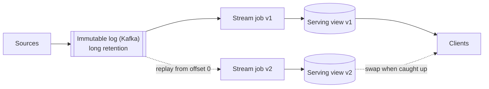

# 6.4.2 — Kappa Architecture

> **Part 6 · Big Data · Hybrid Architectures · Chapter 2 of 3**
> One pipeline. Reprocess by replaying the log. Simpler than Lambda — with one real constraint.

---

## 🧒 ELI5 — Explain Like I'm 5

Lambda had two people doing the same sum in two different ways, and they eventually disagreed.

Kappa asks the obvious question: **why not have one person, and if they get it wrong, just start again?**

That works — **but only if you kept all the receipts.** If you throw receipts away after a week, you can only ever "start again" from a week ago. Everything before that is gone.

So Kappa's whole bargain is: **keep every receipt, forever, in order.** Then:

- Made a mistake in the sum? **Start from receipt #1 and redo it.**
- New question next year ("how many were paid by card?")? **Start from receipt #1 and answer it.**
- Someone joins the team and needs their own tally? **Start from receipt #1.**

**One person, one method, one set of bugs.** And a very big box of receipts.

That box is the log — and Kappa lives or dies on whether you can afford to keep it.

---

## The architecture



**The whole idea:** the log is the source of truth; the serving views are **disposable derivations** of it.

| Step | Action |
|---|---|
| Normal operation | One stream job consumes the log and maintains a serving view |
| Logic change or bug fix | Start **v2** of the job reading from offset 0, writing to a **new** view |
| Cut over | When v2 catches up, atomically switch reads to it, then delete v1 |

🎯 **This is a blue-green deploy for data pipelines**, and framing it that way makes the whole architecture click. You never mutate a view in place; you build a new one and swap.

---

## Why it's simpler than Lambda

| | Lambda | Kappa |
|---|---|---|
| Codebases | ❌ Two | ✅ One |
| Sets of bugs | ❌ Two, different | ✅ One |
| Divergence risk | ❌ Inevitable over time | ✅ None — there's nothing to diverge from |
| Merge logic | ❌ Required, subtle | ✅ None |
| Frameworks to operate | ❌ Two | ✅ One |
| Reprocessing | Rerun the batch job | Replay the log |
| Testing | Verify both paths agree | Verify one path |

⚖️ **Kappa's simplicity is real and substantial.** Halving the code, the bugs, and the operational surface is a large win, and the reason it became the default recommendation once stream processors became correct.

---

## What made it possible

Kappa was proposed in 2014 (Jay Kreps) but only became practical when four things existed together:

| Requirement | Enabling technology |
|---|---|
| **Durable, replayable, ordered log** | Kafka with long retention |
| **Exactly-once stream processing** | Flink checkpoints; Kafka transactions |
| **Event-time semantics** | Watermarks — so replay produces *identical* results |
| **Affordable long retention** | Tiered storage: old segments offloaded to object storage |

🎯 **Event time is the load-bearing requirement.** Replaying a week of history in ten minutes only produces the correct answer if windows are keyed to *event* time. With processing time, every replayed event lands in one giant ten-minute window and the output is nonsense. **Kappa is impossible without event time**, which is why it postdates the Dataflow model.

---

## The constraint: log retention

☠️ **You can only reprocess as far back as the log retains.** If Kafka keeps 7 days and you need to recompute a year, Kappa alone cannot do it.

| Retention approach | Cost | Reprocessing depth |
|---|---|---|
| 7 days on broker disks | Low | 7 days |
| 90 days on broker disks | High — brokers become storage servers | 90 days |
| **Tiered storage** (Kafka 3.6+, Pulsar, Confluent) | ✅ Low — cold segments in S3 | ✅ Effectively unlimited |
| **Archive to a lake, replay from there** | ✅ Lowest | ✅ Unlimited |

🎯 **The practical modern Kappa keeps a short hot retention in Kafka plus a full archive in object storage**, and reprocessing reads from the archive then switches to the live log:

```
Replay:  S3/Iceberg (all history, Parquet)  →  process  →  new view
                    ↓ then switch to
         Kafka (recent, live)
```

⚠️ This is **not** a second codebase — it's the same job with a different source, and Flink's unified batch/stream API makes it literally the same code. That distinction is what keeps it Kappa rather than Lambda.

---

## Reprocessing: the operational procedure

```
1. Deploy job v2 with the new logic, reading from offset 0 (or the archive),
   writing to a NEW output (new topic, new table, new index)
2. Let it run. It will be slower than real time at first, then catch up
3. Verify: compare v2's output against v1's for the overlapping period
4. Wait for v2 to reach the live head
5. Atomically switch readers to v2 (an alias, a feature flag, a pointer swap)
6. Keep v1 running for a rollback window
7. Decommission v1 and delete its view
```

| Concern | Handling |
|---|---|
| **Replay speed** | 🔢 Reprocessing a year of data at 10× real time takes ~5 weeks. Parallelism must be increased for the replay |
| **Load on downstream systems** | A replay writes at maximum speed — throttle, or write to a separate sink |
| **Cost** | Double compute during the catch-up window |
| **Verification** | Compare outputs before switching — never swap blind |
| **Non-idempotent side effects** | ☠️ A replay must **not** resend emails or re-charge cards |

☠️ **The side-effect problem is the sharpest edge in Kappa.** Replaying a pipeline that sends notifications would send every notification again. **Rule: reprocessing is only safe for pipelines that produce *derived state*, never for those with external side effects.** Structure pipelines so the state-deriving part is replayable and the side-effecting part is a separate, non-replayed consumer.

---

## Where Kappa struggles

| Situation | Problem |
|---|---|
| **Very deep history** | Replaying years may take weeks; a batch job over Parquet would take hours |
| **Complex historical joins** | Joining against a large dimension table's *historical* state is awkward in a stream |
| **ML training** | Inherently batch-shaped: multiple passes, shuffles, iteration |
| **Ad-hoc analysis** | A stream job is a pipeline, not a query engine |
| **Side effects** | Cannot be replayed |
| **Very large state** | State that doesn't fit may be easier to handle as a batch shuffle |

⚖️ **The honest position:** Kappa is excellent for **maintaining serving views**. It is not a replacement for a data warehouse or for analytics. Most real platforms are **Kappa for the serving path plus batch for analytics** — which is not Lambda, because the two paths compute *different things*, not the same thing twice.

🎯 That distinction is the most useful thing to say about Kappa in an interview: *"Lambda has two implementations of the same computation. Having a streaming serving path and a separate analytical warehouse isn't Lambda — they answer different questions."*

---

## The immutable-log principle

Kappa is one application of a broader idea:

> **Store the facts, not the conclusions. Derive the conclusions, and be able to re-derive them.**

| System | Manifestation |
|---|---|
| Kappa | The log is truth; views are derived |
| Event sourcing | Events are truth; state is a fold over them |
| CDC | The WAL is truth; derived stores follow |
| Git | Commits are truth; the working tree is derived |
| Data lakehouse | Raw immutable files are truth; tables are derived |
| Functional programming | Immutable data; transformations produce new values |

**What this buys you:** any derived view can be rebuilt; new views can be created from full history; bugs are fixable retroactively; and you have a complete audit trail for free.

**What it costs:** storage for all history, and the discipline never to mutate the source of truth.

---

## Kappa in practice — a checklist

```
□ The log has retention (or an archive) covering the deepest reprocessing you'd need
□ Stream jobs are exactly-once and use event time
□ Views are versioned and swapped atomically (alias / pointer / flag)
□ Reprocessing writes to a NEW view; never in place
□ Verification compares old and new before the swap
□ Side-effecting consumers are separate and never replayed
□ Replay parallelism can be raised independently of steady-state parallelism
□ Downstream write throttling exists for replays
□ A reconciliation job detects drift between the log and the serving view
```

⚠️ **The last one matters even in Kappa.** Exactly-once covers the framework's boundary, not sink bugs, schema mistakes, or logic errors. A periodic job that recomputes a sample and compares is cheap insurance — and in Kappa, unlike Lambda, it's a *check*, not a second implementation.

---

## 📋 Chapter checklist

| Skill | Ready? |
|---|---|
| Draw the architecture and explain view-swapping | ☐ |
| Frame it as a blue-green deploy for pipelines | ☐ |
| Compare Kappa and Lambda across seven dimensions | ☐ |
| Name the four enabling technologies | ☐ |
| Explain why event time is load-bearing for replay | ☐ |
| Explain the retention constraint and tiered storage | ☐ |
| Recite the seven-step reprocessing procedure | ☐ |
| Explain why side-effecting pipelines can't be replayed | ☐ |
| State where Kappa struggles | ☐ |
| Distinguish "Kappa + warehouse" from Lambda | ☐ |
| State the immutable-log principle and four systems that use it | ☐ |

---

**← Previous** [6.4.1 Lambda Architecture](01-lambda-architecture.md)
**Next →** [6.4.3 Unified Processing](03-batch-stream-unification.md)
