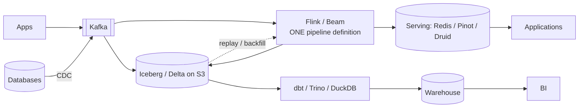
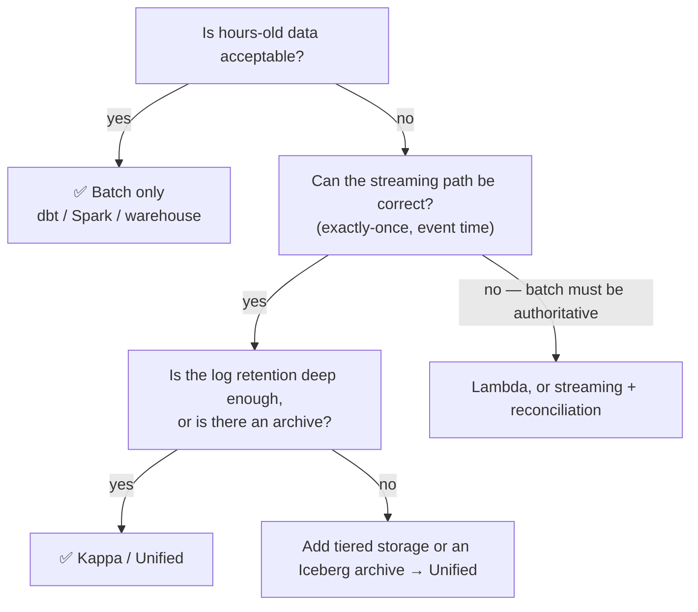

# 6.4.3 — Unified Processing

> **Part 6 · Big Data · Hybrid Architectures · Chapter 3 of 3**
> One API, one codebase, two execution modes. The endpoint of the Lambda→Kappa journey.

---

## 🧒 ELI5 — Explain Like I'm 5

Lambda said: *"two people, two methods."* Kappa said: *"one person, always working live."*

Unified processing says something better:

> **"One recipe. Read it fast when you have all the ingredients laid out, and read it slowly as ingredients arrive. Same recipe either way."**

You write **how to make the dish** — once. Then you tell the kitchen either:

- *"Here's a whole crate of ingredients — go."* It runs flat out and finishes. *(Batch.)*
- *"Ingredients will keep arriving all day."* It keeps going forever. *(Streaming.)*

**The recipe never changed.** Only the ingredient supply did.

Why does this matter so much? Because **the recipe is where the bugs live.** One recipe means one set of bugs, one place to fix them, and — crucially — the guarantee that a redo of yesterday's dish and today's live dish are made **exactly the same way**.

---

## The insight

> **A batch dataset is a bounded stream.**

Everything else follows. If the engine treats "the whole of last month" as simply a stream that happens to end, then:

- The same operators work in both modes.
- The same event-time windows produce the same results.
- Reprocessing history uses the same code as live processing.
- There is nothing to keep in sync, because there is only one thing.

| | Batch | Stream |
|---|---|---|
| Input | Bounded | Unbounded |
| Windows | Fire at end of input | Fire at the watermark |
| Watermark | Jumps to +∞ at the end | Advances with the data |
| State | Discarded at completion | Checkpointed continuously |
| Result | Emitted once | Emitted continuously |

🎯 **The unification is in the *semantics*, not just the API.** Two systems sharing a function name but computing different results (say, one using processing time) are not unified. Real unification means **identical output for identical input**, whichever mode runs.

---

## The implementations

| System | Approach |
|---|---|
| **Apache Beam / Google Dataflow** | ✅ The purest form: one API, pluggable runners (Dataflow, Flink, Spark) |
| **Apache Flink** | A streaming engine; bounded sources run in batch mode with optimisations |
| **Spark Structured Streaming** | A batch engine; streams are incrementally-executed table queries |
| **Kafka Streams / ksqlDB** | Stream–table duality throughout |
| **Delta Lake / Iceberg** | A table readable as both a batch snapshot and a change stream |
| **Materialize / RisingWave** | Streaming SQL databases: write a query, get a continuously-maintained result |

### Beam's model

Beam formalised the four questions ([Overview](../01-overview/01-batch-and-stream-overview.md#the-four-questions-of-any-data-processing-system)):

| Question | Beam concept |
|---|---|
| **What** is computed? | Transforms (`ParDo`, `GroupByKey`, `Combine`) |
| **Where** in event time? | Windowing |
| **When** are results emitted? | Triggers |
| **How** do refinements relate? | Accumulation mode |

```python
(p | beam.io.ReadFromPubSub(topic)            # ← swap for ReadFromParquet: batch
   | beam.WindowInto(beam.window.FixedWindows(60),
                     trigger=AfterWatermark(early=AfterProcessingTime(10)),
                     accumulation_mode=AccumulationMode.ACCUMULATING)
   | beam.CombinePerKey(sum)
   | beam.io.WriteToBigQuery(table))
```

🎯 **Only the source changes between batch and stream.** That one line is the whole argument for unification — and it's a genuinely compelling demonstration in an interview.

### Flink's batch mode

```java
env.setRuntimeMode(RuntimeExecutionMode.BATCH);   // bounded source detected
```

In batch mode Flink: skips checkpointing (it restarts the job on failure instead), sorts by key rather than maintaining hash state, processes stages sequentially where possible, and fires all windows at the end. **Same operators, same semantics, different execution strategy** — which is what makes reprocessing trustworthy.

### Spark's model

Spark inverted the same insight: a stream is a table with rows continuously appended, and a streaming query is a batch query executed incrementally.

```python
static  = spark.read.parquet("s3://events/")        # batch
stream  = spark.readStream.format("kafka").load()   # stream
# ... the same transformation code applies to either ...
```

⚠️ Spark's unification is at the **API** level; execution remains micro-batch, so latency floors at ~100 ms–seconds. Flink and Beam unify at the **semantic** level with true per-event streaming.

---

## What unification actually buys

| Benefit | Detail |
|---|---|
| **One codebase** | Lambda's central problem, solved by construction |
| **Reprocessing uses the same code** | Backfills cannot diverge from live processing |
| **Test with batch, run as stream** | ✅ Deterministic tests over fixed files, for streaming logic |
| **Migrate incrementally** | Start batch, switch the source to a stream later |
| **Portability** (Beam) | The same pipeline on a different runner |
| **One skill set** | The team learns one model |

🎯 **"Test with batch, deploy as stream" is the underrated practical win.** Streaming logic is notoriously hard to test — you need to simulate time, ordering, and failures. With a unified model you feed a fixed file, assert the exact output, and know the streaming path computes the same function. That alone justifies the approach for many teams.

---

## The honest limitations

⚖️ Unification is not free, and it is not total:

| Limitation | Detail |
|---|---|
| **Lowest-common-denominator APIs** | Beam abstracts over runners, so runner-specific optimisations are hard to reach |
| **Different performance profiles** | Code written for streaming may be inefficient as batch, and vice versa |
| **Batch-only optimisations are lost** | Sort-merge joins, full-dataset statistics, cost-based planning |
| **Streaming-only features may not translate** | Custom timers, CEP patterns |
| **Runner maturity varies** (Beam) | The Dataflow runner is the most complete; others lag |
| **Debugging spans two modes** | "It works in batch but not in stream" still happens |

☠️ **A subtle failure worth naming: batch and stream can still diverge in *practice* even with one codebase** — for example if a batch run sees a dimension table's *current* state while the streaming run saw its state at the time of each event. That's a data-modelling issue, not an engine issue, and unification doesn't fix it. **Point-in-time correctness requires temporal joins**, which must be designed explicitly.

---

## The modern reference architecture



| Element | Role |
|---|---|
| **Kafka** | The live log — recent events, low latency |
| **Iceberg/Delta on S3** | The archive — full history, cheap, queryable, **replayable as a bounded source** |
| **One pipeline** | Reads Kafka for live, Iceberg for backfill — same code |
| **Serving store** | Low-latency views the application queries |
| **Warehouse + dbt** | Analytical modelling — a *different question*, not a duplicate implementation |

🎯 **The key structural point: Kafka and Iceberg are the same data at two latencies.** Kafka holds the recent tail for low-latency consumption; Iceberg holds everything for cheap replay. A unified pipeline reads either. That combination is what makes Kappa-style reprocessing affordable at any depth, and it resolves Kappa's retention constraint entirely.

⚠️ **Note the warehouse path is not a second implementation of the serving logic.** It answers analytical questions the serving path doesn't. **Having both is not Lambda** — that distinction is worth stating explicitly, because interviewers sometimes conflate them.

---

## Choosing an architecture, finally



| Situation | Architecture |
|---|---|
| Daily reporting only | ✅ Batch |
| Real-time serving views, modern stack | ✅ Unified (Flink + Kafka + Iceberg) |
| Real-time plus a legally authoritative batch number | Streaming + a batch reconciliation job |
| Existing large batch estate, adding real-time | A thin streaming path alongside; migrate over time |
| Small team, moderate scale | ✅ Batch, or micro-batch. Don't over-build |

⚖️ **The most senior answer is usually "batch, unless the latency requirement justifies more."** Streaming costs 5–10× and demands specialist knowledge. **Ask what decision changes if the data is an hour old** — very often the honest answer is "none."

---

## The interview answer

> "I'd use a unified model — one pipeline definition that runs over a bounded source for backfills and an unbounded source for live processing. Concretely: Flink reading Kafka for the live path, and reading the Iceberg archive for reprocessing, with the same code and the same event-time semantics, so a replay produces identical results.
>
> That avoids Lambda's core problem — two implementations of the same logic that inevitably diverge — while solving Kappa's retention constraint, because full history lives cheaply in object storage rather than on broker disks.
>
> The serving store is a materialised view I can rebuild at any time, so a logic change means running v2 into a new view and swapping atomically once it's verified. And I'd keep a nightly reconciliation job that recomputes a sample from the archive and alerts on drift — that's a check, not a second implementation.
>
> If the latency requirement turned out to be 'within an hour', I'd drop all of this and run dbt on a warehouse, because it's a fraction of the cost and complexity."

---

## 📋 Chapter checklist

| Skill | Ready? |
|---|---|
| State the insight: batch is a bounded stream | ☐ |
| Explain that unification is semantic, not just API-level | ☐ |
| Name six implementations and how each unifies | ☐ |
| Map the four questions to Beam concepts | ☐ |
| Explain "test with batch, deploy as stream" | ☐ |
| Name six honest limitations | ☐ |
| Explain point-in-time correctness as a modelling issue | ☐ |
| Draw the Kafka + Iceberg + one-pipeline architecture | ☐ |
| Explain why a warehouse alongside streaming isn't Lambda | ☐ |
| Walk the architecture decision tree | ☐ |
| Deliver the interview answer, including the "batch unless" caveat | ☐ |

---

**← Previous** [6.4.2 Kappa Architecture](02-kappa-architecture.md)
**Next →** [6.5.1 ETL vs ELT](../05-pipeline-operations/01-etl-vs-elt.md)
