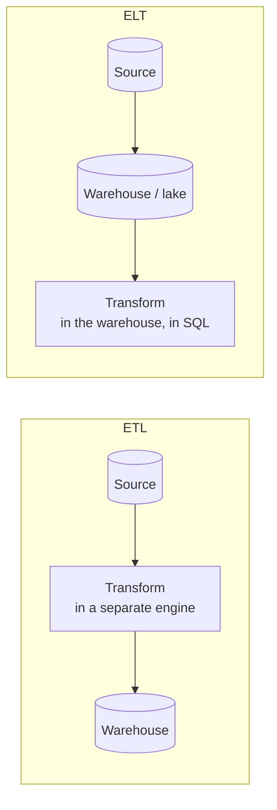
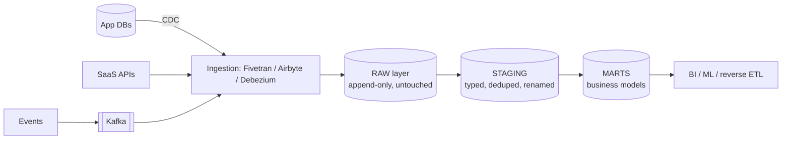

# 6.5.1 — ETL vs ELT

> **Part 6 · Big Data · Pipeline Operations · Chapter 1 of 3**
> Where does the transformation happen — before loading, or after? Cheap storage changed the answer.

---

## 🧒 ELI5 — Explain Like I'm 5

You're moving house. You have thirty boxes of stuff, and you need it organised in the new place.

**Way 1 — sort it before you move.** Go through every box in the old house, throw out the junk, fold everything neatly, and only put the good stuff on the van. **The van is light and the new house is tidy from day one.** But: if you later realise you threw away something you needed — **it's gone.** And the sorting took a whole weekend in a house with no proper light. *(ETL — transform, then load.)*

**Way 2 — move everything, sort it there.** Chuck it all on the van as-is. Unload it into the new house, which has a big garage and good lighting. **Then** sort it, at your leisure, as many times as you like. If you change your mind about how to organise the kitchen, **you still have everything** and you just re-sort. *(ELT — load, then transform.)*

Way 2 used to be impossible because vans and garages were expensive. **Now the garage costs almost nothing** — so almost everyone moves everything and sorts it later.

The one catch: **if some boxes contain things you're legally not allowed to keep**, you must throw those out *before* they go on the van. No exceptions.

---

## The two orders



| | **ETL** | **ELT** |
|---|---|---|
| Transform runs | In a dedicated engine, before loading | ✅ Inside the warehouse, after loading |
| Raw data retained | ❌ Usually not | ✅ Yes — the full source is kept |
| Fix a transformation bug | ❌ Re-extract from source | ✅ Re-run SQL over the raw data |
| New requirement on historical data | ❌ Often impossible | ✅ Just query the raw table |
| Storage cost | ✅ Lower | Higher (but storage is now cheap) |
| Compute | A separate cluster | The warehouse (elastic, pay-per-use) |
| Language | Python/Java/Spark | ✅ SQL — accessible to analysts |
| Schema | Defined up front | ✅ Applied on read; evolves |
| Sensitive data | ✅ Can be filtered before landing | ⚠️ Lands first — needs care |

---

## Why ELT won

| Change | Consequence |
|---|---|
| **Object storage got cheap** | ~$0.023/GB-month makes "keep everything" viable |
| **Warehouses became powerful and elastic** | Snowflake/BigQuery/ClickHouse can transform at scale; compute scales on demand |
| **Storage/compute decoupled** | Storing raw data doesn't require paying for idle compute |
| **SQL is the common language** | Analysts can own transformations; no Python cluster needed |
| **Requirements change** | Keeping raw data means new questions are answerable retroactively |

🎯 **The decisive argument is optionality.** With ETL, a transformation bug or a new requirement means going back to the source — which may have changed, may be rate-limited, or may no longer exist. With ELT, you re-run SQL over data you already have. **That single property is worth more than the storage it costs.**

🔢 **Concretely:** storing 10 TB of raw events costs ~$230/month in S3. Re-extracting 10 TB from a production database — assuming it's even still there — costs a weekend and a load spike. The maths is not close.

---

## The modern ELT stack



| Layer | Rules |
|---|---|
| **Raw** | ✅ **Never modified.** Exactly as received, with ingestion metadata. Append-only |
| **Staging** | One model per source table: cast types, rename to a convention, deduplicate, light cleaning. **No business logic** |
| **Intermediate** | Joins and reusable logic |
| **Marts** | Business-facing facts and dimensions, named in business terms |

🎯 **"Never modify raw" is the load-bearing rule.** It is what makes every downstream layer rebuildable. The moment someone `UPDATE`s a raw table, you've lost the ability to reproduce anything from it, and you're back to ETL's fragility with none of its benefits.

---

## dbt: the tool that made ELT a discipline

```sql
-- models/staging/stg_orders.sql
{{ config(materialized='view') }}
SELECT
    id::bigint          AS order_id,
    customer_id::bigint AS customer_id,
    amount_cents::bigint AS amount_minor,
    status::text        AS status,
    created_at::timestamptz AS created_at
FROM {{ source('raw', 'orders') }}
WHERE _deleted IS NOT TRUE
```

```sql
-- models/marts/fct_daily_revenue.sql
{{ config(materialized='incremental', unique_key=['order_date','region']) }}
SELECT
    date_trunc('day', o.created_at) AS order_date,
    c.region,
    SUM(o.amount_minor)             AS revenue_minor,
    COUNT(*)                        AS order_count
FROM {{ ref('stg_orders') }} o
JOIN {{ ref('stg_customers') }} c USING (customer_id)
WHERE o.status = 'completed'

  AND o.created_at >= (SELECT MAX(order_date) - INTERVAL '3 days' FROM {{ this }})

GROUP BY 1, 2
```

| What dbt adds | Why it matters |
|---|---|
| **`ref()` builds a DAG** | Dependencies and execution order are derived, not maintained by hand |
| **Version control** | Transformations are code: reviewed, diffed, rolled back |
| **Tests** | `unique`, `not_null`, `relationships`, plus custom assertions — **in the pipeline** |
| **Documentation and lineage** | Auto-generated; answers "where does this number come from?" |
| **Incremental models** | Process only new data, with a full-refresh escape hatch |
| **Environments** | Dev builds into a separate schema; identical code |

🎯 **The cultural shift matters as much as the tool:** dbt made data transformations *software* — reviewed, tested, versioned, documented. Before it, business logic lived in ad-hoc SQL scripts and scheduled queries nobody could find. Naming that shift shows you understand why the tool succeeded.

⚠️ **Note the 3-day lookback in the incremental filter.** Late-arriving data means "only process rows newer than the last run" silently drops records. A lookback window plus an idempotent `unique_key` merge handles it — and getting this wrong is one of the most common quiet data-quality bugs.

---

## When ETL is still right

⚖️ ELT is the default, not the universal answer:

| Situation | Why ETL |
|---|---|
| **PII / regulated data** | ☠️ Data you may not store must be masked or dropped **before** landing. GDPR, HIPAA, PCI |
| **Data residency** | Some data legally cannot cross a border, even into raw storage |
| **Massive volume, tiny useful fraction** | Filtering 99% of raw logs before loading saves real money |
| **Format the warehouse can't read** | Proprietary binaries, images, unusual encodings |
| **Heavy non-SQL computation** | ML feature generation, NLP, image processing |
| **Streaming enrichment** | Transformation happens in flight by necessity |
| **Source-side rate limits** | Aggregate at the source to reduce transfer |

🎯 **The PII case is the one to raise unprompted.** *"I'd use ELT generally, but PII gets tokenised or dropped at ingestion — you cannot load raw personal data into a lake and plan to clean it later, because retention and erasure obligations attach the moment it lands."* That's a compliance-aware answer, and it's the kind of thing that distinguishes senior candidates.

**The common shape is EtLT:** a light transformation at ingestion (mask PII, drop junk, parse formats), then the heavy modelling in the warehouse.

---

## Incremental processing

Full refreshes stop being viable as data grows.

| Strategy | How | Watch out |
|---|---|---|
| **Append-only** | Insert rows newer than the last watermark | Misses updates to existing rows |
| **Merge / upsert** | `MERGE` on a unique key | Needs a reliable key and change detection |
| **Insert-overwrite by partition** | ✅ Rebuild whole partitions (e.g. a day) | Idempotent and simple — usually the best |
| **Snapshot / SCD Type 2** | Track historical versions with validity ranges | More storage; the right answer for dimensions that change |
| **Full refresh** | Rebuild everything | Only for small tables |

🎯 **Insert-overwrite by partition is the most robust pattern** and worth defaulting to: reprocessing a day simply replaces that day's partition. It's naturally **idempotent**, so a retry is harmless, and a backfill is just "reprocess these partitions." ([Backfill & Reprocessing](02-backfill-reprocessing.md))

⚠️ **Every incremental model needs a way to full-refresh.** Logic changes, and incremental models only apply new logic to new data — leaving historical rows computed with old logic. Silent inconsistency. `dbt run --full-refresh` exists precisely for this, and knowing *why* it's needed matters more than knowing the flag.

---

## Data quality: tests in the pipeline

```yaml
# schema.yml
models:
  - name: fct_daily_revenue
    tests:
      - dbt_utils.unique_combination_of_columns:
          combination_of_columns: [order_date, region]
    columns:
      - name: revenue_minor
        tests:
          - not_null
          - dbt_utils.accepted_range: { min_value: 0 }
      - name: region
        tests:
          - relationships: { to: ref('dim_regions'), field: region }
```

| Test category | Examples |
|---|---|
| **Schema** | Not null, unique, accepted values, referential integrity |
| **Volume** | Row count within an expected range of yesterday's |
| **Freshness** | Source data is no older than N hours |
| **Distribution** | Mean/percentiles within historical bounds |
| **Reconciliation** | ✅ Totals match the source system |

🎯 **The freshness and volume tests catch the failures nobody notices.** A pipeline that runs successfully but processed zero rows because an upstream API silently returned an empty response produces a green run and wrong dashboards. **Test that data arrived, not just that the job exited zero.**

---

## Orchestration

| Tool | Model |
|---|---|
| **Airflow** | Task-based DAGs; the incumbent |
| **Dagster** | ✅ Asset-based — declare the *data* you want, not the tasks |
| **Prefect** | Pythonic, dynamic workflows |
| **dbt Cloud** | Scheduling for dbt specifically |
| **Kestra / Temporal** | Declarative / durable workflow engines |

⚖️ **The asset-based model (Dagster) is a genuine improvement worth naming:** declaring "this table depends on those tables" lets the orchestrator answer "what needs rebuilding after this change?" and "what is stale?" — questions a task DAG cannot answer, because it doesn't know what the tasks *produce*.

**Orchestration requirements regardless of tool:** dependency ordering, retries with backoff, backfill support (rerun a date range), idempotency, alerting on failure **and on silent success**, and SLA monitoring.

---

## ☠️ Failure modes

| Mistake | Consequence |
|---|---|
| Modifying raw data | Nothing downstream is reproducible |
| No lookback in incremental filters | Late-arriving data silently dropped |
| Non-idempotent loads | A retry duplicates rows |
| Loading PII into a lake "to clean later" | Compliance breach the moment it lands |
| Business logic in the staging layer | Unmaintainable; can't be reused |
| No tests | Wrong numbers reach dashboards unnoticed |
| No freshness test | A dead upstream looks like a successful run |
| Incremental models never full-refreshed after a logic change | Old and new logic mixed in one table |
| One giant SQL script | Untestable, unreviewable, undebuggable |
| No documented lineage | "Where does this number come from?" is unanswerable |

---

## 📋 Chapter checklist

| Skill | Ready? |
|---|---|
| Contrast ETL and ELT across nine dimensions | ☐ |
| Give the optionality argument with the cost comparison | ☐ |
| Describe the raw/staging/intermediate/mart layering and its rules | ☐ |
| Explain why "never modify raw" is load-bearing | ☐ |
| Explain what dbt adds and the cultural shift | ☐ |
| Explain the incremental lookback window | ☐ |
| Name seven situations where ETL is correct, especially PII | ☐ |
| Compare five incremental strategies and justify insert-overwrite | ☐ |
| Explain why full-refresh capability is mandatory | ☐ |
| Name five test categories, including freshness and volume | ☐ |
| Explain asset-based vs task-based orchestration | ☐ |

---

**← Previous** [6.4.3 Unified Processing](../04-hybrid-architectures/03-batch-stream-unification.md)
**Next →** [6.5.2 Backfill & Reprocessing](02-backfill-reprocessing.md)
