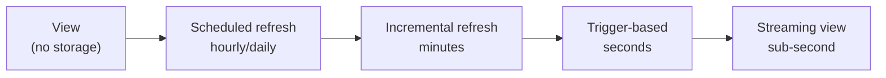
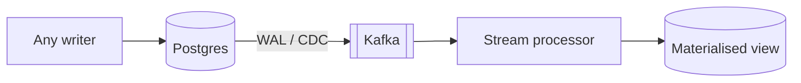

# 6.6.1 — Materialized Views

> **Part 6 · Big Data · Real-time & Analytics · Chapter 1 of 3**
> Compute the answer once, when the data changes — not every time someone asks.

---

## 🧒 ELI5 — Explain Like I'm 5

Someone asks you every ten seconds: **"how many sweets are in the jar?"**

**The slow way:** every time they ask, you tip out the jar and count. A thousand sweets, a thousand questions a day — that's a million counting operations, and the answer was the same for most of them.

**The fast way:** keep a **number written on the lid**. When a sweet goes in, add one. When one comes out, subtract one. Now answering takes **no time at all** — you just read the lid.

That number on the lid is a **materialized view**: the answer, already worked out, kept up to date as things change.

Two things to notice:

1. **You moved the work.** Counting doesn't happen when someone *asks*; it happens when a sweet *moves*. That's a brilliant trade if people ask a thousand times and sweets move ten times. **It's a terrible trade the other way round.**
2. **The lid can be wrong.** If someone sneaks a sweet out without you seeing, the lid says 43 and the jar holds 42 — and nobody finds out until someone actually counts. *(Which is why you occasionally recount.)*

---

## The idea

$$\text{cost}_{\text{on read}} = R \times C \qquad\qquad \text{cost}_{\text{materialised}} = W \times C'$$

Materialising wins when reads vastly outnumber writes — which is the common case.

| | Compute on read | Materialised view |
|---|---|---|
| Read latency | ❌ Full query cost | ✅ A lookup |
| Write cost | ✅ None | Update the view on every change |
| Freshness | ✅ Always exact | Depends on the refresh strategy |
| Storage | ✅ None extra | A copy of the results |
| Complexity | ✅ Low | Refresh, staleness, and drift to manage |

🎯 **This is the same push-vs-pull trade as [Dataflow](../../03-scaling-services/04-dataflow/01-dataflow-overview.md)**, applied to query results. Precompute when reads dominate; compute on demand when they don't.

---

## The spectrum of freshness



| Approach | Freshness | Cost | Complexity |
|---|---|---|---|
| **Plain view** (just saved SQL) | ✅ Exact | Full cost per read | ✅ None |
| **Table refreshed on a schedule** | Up to the interval | Full recompute each time | ✅ Low |
| **Incremental materialised view** | Minutes | ✅ Only changed rows | Medium |
| **Database materialised view with triggers** | Seconds | Write amplification | Medium |
| **Streaming materialised view** (Flink, Materialize) | ✅ Sub-second | Always-on compute | High |
| **Application-maintained** (cache, counters) | Sub-second | Manual invalidation | Medium, error-prone |

⚖️ **Pick the cheapest option that meets the freshness requirement** — and *ask* what that requirement is. "Real-time" for an executive dashboard almost always means "this morning."

---

## Database materialised views

```sql
CREATE MATERIALIZED VIEW daily_revenue AS
SELECT date_trunc('day', created_at) AS day, region, SUM(amount_minor) AS revenue
FROM orders JOIN customers USING (customer_id)
GROUP BY 1, 2;

CREATE UNIQUE INDEX ON daily_revenue (day, region);   -- required for CONCURRENTLY

REFRESH MATERIALIZED VIEW CONCURRENTLY daily_revenue;
```

⚠️ **Postgres materialised views do not refresh automatically.** They are a snapshot until you refresh them — and a plain `REFRESH` takes an `ACCESS EXCLUSIVE` lock, blocking all reads for the duration. `CONCURRENTLY` avoids the lock but requires a unique index and is slower.

☠️ **A stale materialised view nobody refreshes is a common and silent bug.** It looks like a table, it answers queries instantly, and the data is from three weeks ago. **Always schedule the refresh and monitor its recency.**

| Database | Support |
|---|---|
| **Postgres** | Full refresh only (or `pg_ivm` for incremental) |
| **Oracle** | ✅ Incremental ("fast refresh") with materialised view logs |
| **ClickHouse** | ✅ Incremental — a trigger on insert into the source table |
| **Snowflake / BigQuery** | ✅ Automatic incremental maintenance |
| **Materialize / RisingWave** | ✅ Always-current streaming views |

---

## ClickHouse: incremental by design

```sql
CREATE TABLE events (ts DateTime, user_id UInt64, event String, amount UInt64)
ENGINE = MergeTree ORDER BY (ts, user_id);

CREATE MATERIALIZED VIEW hourly_stats
ENGINE = SummingMergeTree ORDER BY (hour, event)
AS SELECT toStartOfHour(ts) AS hour, event, count() AS cnt, sum(amount) AS total
   FROM events GROUP BY hour, event;
```

🎯 **ClickHouse's model is worth understanding because it's the most efficient shape:** the materialised view is a **trigger on insert** that writes pre-aggregated rows into a `SummingMergeTree`, which merges rows with the same key in the background. **No periodic recompute at all** — the aggregation happens once per inserted block, and merging happens as part of normal storage maintenance.

⚠️ It only sees **inserts**. Updates and deletes to the source table are not reflected — which is fine for append-only event data and wrong for anything mutable.

---

## Streaming materialised views

```sql
-- Flink SQL: a continuously-maintained view written to an upsert sink
INSERT INTO revenue_by_region
SELECT region, window_start, SUM(amount)
FROM TABLE(TUMBLE(TABLE orders, DESCRIPTOR(order_time), INTERVAL '5' MINUTES))
GROUP BY region, window_start;
```

```sql
-- Materialize: declare the view; it stays correct, incrementally, forever
CREATE MATERIALIZED VIEW revenue_by_region AS
SELECT region, SUM(amount) FROM orders JOIN customers USING (customer_id)
GROUP BY region;
```

⚖️ **Materialize and RisingWave are the interesting category:** you write ordinary SQL — including joins — and the engine maintains the result incrementally as inputs change, with correct handling of updates and deletes. That is genuinely hard (incremental view maintenance over joins requires retraction semantics) and it removes most of the manual work of building streaming aggregations.

**The cost:** always-on compute, and state proportional to the join inputs.

---

## The application-maintained view

The most common form in practice, and the most error-prone.

```python
def on_order_placed(order):
    db.insert("orders", order)                                    # source of truth
    redis.hincrby(f"revenue:{order.region}:{today}", "total", order.amount)
    redis.zincrby("leaderboard:sales", order.amount, order.seller_id)
```

☠️ **Three ways this drifts, all of them silent:**
1. **Dual write** — the database write succeeds, the Redis update doesn't. Forever wrong.
2. **Non-idempotent increments** — a retry double-counts.
3. **Missed paths** — a migration, an admin tool, or another service writes an order without going through this code.

✅ **The fix is CDC-driven maintenance:** derive the view from the committed database change, not from application code.



🎯 **This is the same argument as [cache invalidation](../../03-scaling-services/03-caching/10-invalidation.md#event-driven-invalidation-architecture):** CDC cannot miss a committed write, including writes that bypass your application. A materialised view maintained by application code is a cache with the same failure modes and none of the safety net of a TTL.

---

## Incremental maintenance: what's hard

Not all aggregations can be updated incrementally.

| Aggregation | Incremental? | Why |
|---|---|---|
| `COUNT`, `SUM` | ✅ Trivially | Add the delta |
| `MIN`, `MAX` | ⚠️ Insert-only | A **delete** of the current max requires a rescan |
| `AVG` | ✅ | Keep `(sum, count)` |
| `COUNT(DISTINCT)` | ⚠️ | Needs a mergeable sketch (HyperLogLog) |
| Percentiles | ⚠️ | Needs t-digest or similar |
| `TOP N` | ⚠️ | A removal may promote an item you no longer track |
| Joins | ❌ Hard | A change on either side can add or remove result rows — needs retractions |

🎯 **`MIN`/`MAX` under deletion is the classic gotcha** and a good detail to raise: incrementally maintaining a maximum is trivial for inserts and requires a full recomputation when the current maximum is deleted. This is why many "incremental" systems restrict themselves to append-only sources.

**Sketches make the hard ones tractable:**

| Sketch | Computes | Size |
|---|---|---|
| HyperLogLog | Distinct count (~2% error) | ~12 KB for billions |
| t-digest / DDSketch | Percentiles | ~KB |
| Count-Min Sketch | Frequencies | ~KB |
| Bloom filter | Set membership | ~10 bits/key |

✅ **All are mergeable**, which is what allows partial aggregates to be combined across partitions, windows, and time buckets — the property that makes distributed incremental maintenance possible at all.

---

## Nested and layered views

```
raw events
  → 1-minute rollups        (fine-grained, short retention)
    → 1-hour rollups        (from the minute rollups, not from raw)
      → daily rollups       (from the hour rollups)
```

🎯 **Build each level from the level below, not from raw.** Computing daily totals from 24 hourly rows instead of 86 million raw events is four orders of magnitude cheaper — and it composes: a "last 7 days" query sums 168 hourly rows.

⚠️ **This only works for aggregations that compose.** Sums and counts do. Distinct counts require sketches at every level (store the HLL, not the count). Percentiles require t-digests. **Store the mergeable intermediate, not the final number**, and you keep the option to roll up.

---

## Refresh strategies

| Strategy | Trigger | Use |
|---|---|---|
| **Scheduled** | Cron | ✅ Predictable, simple, adequate for most reporting |
| **On write** | Trigger / CDC | Sub-second freshness needed |
| **On read, if stale** | Lazy | Rarely-read views |
| **Hybrid** | Incremental continuously + full rebuild nightly | ✅ **The robust production pattern** |

🎯 **The hybrid is the answer to give.** Incremental maintenance keeps the view fresh; a periodic full rebuild corrects any drift from bugs, missed events, or restarts. It is the same "streaming plus reconciliation" pattern that appears throughout Part 6 — and it converts an unbounded correctness risk into a bounded one.

---

## Choosing

| Requirement | Solution |
|---|---|
| Daily report, complex joins | Scheduled table refresh (dbt) |
| Dashboard, minutes fresh | Incremental model, 5-min schedule |
| Live metric, seconds | Streaming view (Flink) or ClickHouse MV |
| Live joins over mutable data | Materialize / RisingWave |
| A counter (likes, views) | Redis, with periodic reconciliation |
| Search results | A search index — a materialised view by another name |
| Timeline / feed | Precomputed per-user list ([Push vs Pull](../../03-scaling-services/04-dataflow/03-push-vs-pull-twitter-timeline.md)) |

⚠️ **Materialised views are the same idea as caches, read replicas, search indexes, and precomputed feeds** — derived data kept in step with a source of truth. **The same three questions apply to all of them:** how is it kept fresh, what happens when that fails, and can it be rebuilt from scratch?

---

## ☠️ Failure modes

| Mistake | Consequence |
|---|---|
| A materialised view nobody refreshes | Silently ancient data |
| Application-maintained via dual writes | Permanent, silent drift |
| Non-idempotent increments | Retries inflate the numbers |
| No periodic full rebuild | Drift accumulates forever |
| Incremental `MIN`/`MAX` with deletions | Wrong after a delete |
| Storing final counts instead of sketches | Cannot roll up to coarser windows |
| `REFRESH` without `CONCURRENTLY` on a hot view | Reads blocked for the duration |
| Views built from raw at every level | Enormous, unnecessary compute |
| No freshness monitoring | Stale views look identical to fresh ones |

---

## 📋 Chapter checklist

| Skill | Ready? |
|---|---|
| State the read-vs-write cost trade | ☐ |
| Name six points on the freshness spectrum | ☐ |
| Explain Postgres refresh semantics and the `CONCURRENTLY` requirement | ☐ |
| Explain ClickHouse's insert-trigger model and its limitation | ☐ |
| Give the three ways application-maintained views drift | ☐ |
| Argue for CDC-driven maintenance | ☐ |
| Say which aggregations are incrementally maintainable | ☐ |
| Explain the `MIN`/`MAX` deletion gotcha | ☐ |
| Name four mergeable sketches | ☐ |
| Explain layered rollups and why to store sketches | ☐ |
| Recommend the incremental + nightly rebuild hybrid | ☐ |

---

**← Previous** [6.5.3 Error Handling](../05-pipeline-operations/03-pipeline-error-handling.md)
**Next →** [6.6.2 Time-Series Patterns](02-time-series-patterns.md)
