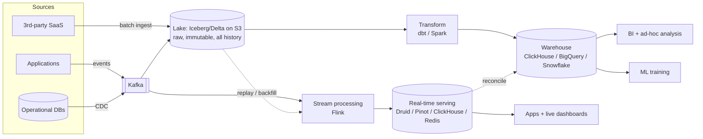

# 6.6.3 — Analytics Architecture

> **Part 6 · Big Data · Real-time & Analytics · Chapter 3 of 3**
> Putting Part 6 together: the end-to-end shape of a modern analytics platform.

---

## 🧒 ELI5 — Explain Like I'm 5

You've learned all the pieces. Here's how they fit into one building.

Think of it as a **kitchen with three serving hatches**, because three very different customers want three very different things:

1. **The chef's live board.** *"How many orders in the last minute?"* Needs to be **instant**, and roughly right is fine. Small, fast, always-on. *(Real-time serving.)*
2. **The manager's weekly report.** *"Revenue by region by month for three years."* Needs to be **exactly right**, can take a minute to produce, and touches enormous amounts of history. *(The warehouse.)*
3. **The storeroom of every receipt ever.** Nobody reads it daily, but **everything else is built from it**, and if a mistake is found, this is what you go back to. *(The raw lake.)*

The mistake people make is trying to serve all three from one hatch. The live board can't scan three years. The warehouse can't answer in 50 milliseconds. And neither can be the storeroom, because you'd be paying warehouse prices to keep every receipt forever.

**Three hatches. One kitchen. One set of ingredients.**

---

## The reference architecture



| Layer | Purpose | Latency | Retention |
|---|---|---|---|
| **Ingestion (Kafka)** | Durable, replayable buffer; decouples producers from consumers | ms | Days (hot) |
| **Lake (Iceberg on S3)** | Immutable raw history; the recompute source | Minutes | ✅ Forever |
| **Stream processing** | Continuously maintained aggregates | Sub-second | State only |
| **Real-time serving** | Sub-second queries over recent data | ms | Days–weeks |
| **Transform** | Business modelling, tested and documented | Minutes–hours | — |
| **Warehouse** | Exact analytics over full history | Seconds | Years |

🎯 **The single most important structural point: Kafka and the lake hold the *same* data at two latencies.** Kafka has the recent tail for low-latency consumption; the lake has everything for cheap replay. One pipeline definition reads either ([Unified Processing](../04-hybrid-architectures/03-batch-stream-unification.md)) — which is what makes reprocessing affordable at any depth.

---

## The three serving paths

| | **Real-time** | **Warehouse** | **Lake** |
|---|---|---|---|
| Query latency | < 100 ms | 1–60 s | Minutes |
| Data freshness | Seconds | Minutes–hours | Minutes |
| History | Days–weeks | Years | ✅ Forever |
| Concurrency | ✅ Thousands | Dozens | Few |
| Query flexibility | Pre-defined shapes | ✅ Full SQL | ✅ Full SQL |
| Cost per query | ✅ Very low | Moderate | Low (but slow) |
| Consumers | Applications, live dashboards | Analysts, BI, execs | Data engineers, ML |

⚠️ **Trying to serve all three from one system is the most common architectural failure.** A warehouse cannot serve 10,000 QPS at 50 ms; a real-time OLAP store cannot scan three years of history for an ad-hoc question. **The paths exist because the requirements are genuinely incompatible.**

🎯 **This is not Lambda.** The three paths answer *different questions*; they are not three implementations of the same computation. Saying so explicitly prevents a common misunderstanding.

---

## Real-time OLAP stores

The layer people are least familiar with, and often the one that makes a design work.

| System | Strength |
|---|---|
| **Apache Druid** | Sub-second on high-cardinality event data; real-time ingestion from Kafka |
| **Apache Pinot** | Very high QPS, low latency; designed for user-facing analytics (LinkedIn) |
| **ClickHouse** | ✅ Fastest general columnar engine; simpler to operate |
| **StarRocks / Doris** | MPP with strong join support |
| **Elasticsearch** | Search plus aggregations |

**What they do differently from a warehouse:**

| Technique | Effect |
|---|---|
| **Pre-aggregation at ingest** | Roll up to the finest useful granularity on write |
| **Inverted indexes on dimensions** | Filter before scanning |
| **Segment-level min/max** | Skip whole segments |
| **Time-partitioned segments** | Recent data in memory |
| **Approximate sketches** | HLL and t-digest instead of exact scans |

🎯 **"User-facing analytics" is the category to name.** A dashboard *inside your product* — "your campaign's performance this week" — is queried by thousands of users at interactive latency. That's not a BI workload and a warehouse will not do it. **Druid and Pinot exist precisely for that shape**, and recognising it is a strong signal.

---

## Worked design: an ad-analytics platform

**Requirements**
```
FR   Advertisers see impressions, clicks, spend — near-real-time and historical
FR   Internal analysts run ad-hoc analysis over full history
FR   Billing is computed daily and must be exact
NFR  10B impressions/day, 100M clicks/day
NFR  Dashboard p99 < 500 ms, up to 10,000 concurrent advertisers
NFR  Freshness < 1 minute for the live view
NFR  Billing exactness is non-negotiable
```

**Estimation**
```
Impressions   10^10/day = 115k/s avg, ~350k/s peak
Event size    ~500 B → 5 TB/day raw → 1.8 PB/year
Compressed    ~10:1 in Parquet → ~180 TB/year
Pre-aggregated (ad × minute × geo): ~10^8 rows/day × 50 B = 5 GB/day
```

**Design**
```
INGEST
  SDK → HTTP collector → Kafka (partition by ad_id for aggregation locality)
  RF=3, min.insync.replicas=2, acks=all
  7-day hot retention; tiered storage beyond

LAKE
  Kafka → S3 as Parquet, Iceberg tables, partitioned by hour
  Immutable, retained indefinitely

REAL-TIME
  Flink: event time, 30 s watermark, 1-minute tumbling windows
         dedupe by event_id (exactly-once within the pipeline)
         → per-(ad, minute, geo) aggregates
  → Druid (or ClickHouse), 30-day retention, pre-aggregated
  Serves the advertiser dashboard: p99 well under 500 ms

WAREHOUSE
  dbt over the Iceberg lake → daily models in ClickHouse/BigQuery
  Full history; ad-hoc analyst queries

BILLING
  A nightly batch job over the lake:
    - dedupe by event_id across the full day
    - join fraud signals (only available with a lag)
    - apply billing rules
  → the authoritative number. Reconciled against the streaming totals;
    any discrepancy above 0.1% is alerted, not silently accepted
```

**Why each choice**

| Decision | Reason |
|---|---|
| Kafka partitioned by `ad_id` | Per-ad ordering, and aggregation locality in Flink |
| Iceberg on S3, not a warehouse, as raw storage | 1.8 PB/year — cost, and it enables replay |
| Flink rather than micro-batch | 1-minute freshness with event-time correctness and dedupe |
| Druid/ClickHouse rather than the warehouse for the dashboard | 10,000 concurrent users at sub-500 ms |
| Pre-aggregation to (ad, minute, geo) | 10⁸ rows/day instead of 10¹⁰ — 100× less to serve |
| **Batch for billing** | Exactness, late data, and fraud signals that arrive hours later |
| Reconciliation with alerting | Drift becomes a detected bug, not an accepted condition |

⚠️ **Note that billing deliberately does *not* use the streaming number.** Streaming gives a fast, good-enough figure for the dashboard; batch gives the exact one for money. **That is not Lambda** — they are different requirements with different tolerances, and only one of them is authoritative.

---

## Cross-cutting concerns

| Concern | Approach |
|---|---|
| **Schema management** | A registry with `BACKWARD` compatibility; events are contracts |
| **Data quality** | Tests at every layer: freshness, volume, distribution, reconciliation |
| **Lineage** | Column-level where possible; answers "where did this number come from?" |
| **Access control** | Row and column-level in the warehouse; per-tenant isolation in serving |
| **PII** | ☠️ Tokenised or dropped **at ingestion** — never landed raw ([ETL vs ELT](../05-pipeline-operations/01-etl-vs-elt.md#when-etl-is-still-right)) |
| **Cost** | Partition pruning, lifecycle tiering, and query cost monitoring |
| **Backfill** | Idempotent partition-overwrite everywhere ([Backfill](../05-pipeline-operations/02-backfill-reprocessing.md)) |
| **Observability** | Consumer lag, watermark lag, freshness per table, pipeline SLAs |

🔢 **Cost control deserves a number.** On a per-TB-scanned warehouse, a single unpartitioned `SELECT *` over a 200 TB table costs ~$1,000. **Partition pruning is not a performance feature there; it is the cost control** — and monitoring per-query cost is as important as monitoring latency.

---

## The build order

Do not build this all at once. The sequence matters:

| Stage | Build | When to move on |
|---|---|---|
| **1** | Operational DB → nightly dump → warehouse → BI | When nightly isn't fresh enough, or the dump hurts production |
| **2** | CDC → lake → dbt → warehouse | When the product needs sub-hour data |
| **3** | Add Kafka + a streaming path for the few metrics that need it | When a user-facing dashboard needs interactive latency at scale |
| **4** | Add a real-time OLAP store for user-facing analytics | When ad-hoc breadth and per-tenant serving genuinely diverge |

⚖️ **Stage 1 serves most companies for years.** 🎯 **The strongest thing to say in an interview is a version of: "I'd start with CDC into a lake and dbt into a warehouse, and only add streaming for the specific metrics whose latency requirement justifies 5–10× the cost."** Proposing the full architecture for a system that needs stage 2 is over-engineering, and interviewers notice.

---

## The decision summary

| Question | Answer |
|---|---|
| How fresh must it be? | Hours → batch. Minutes → micro-batch. Seconds → streaming |
| Who queries it? | Applications → real-time store. Analysts → warehouse. Engineers → lake |
| How much history? | Weeks → serving store. Years → warehouse. Forever → lake |
| How exact? | Approximate → streaming. Exact → batch |
| How many concurrent queries? | Thousands → pre-aggregated serving store. Dozens → warehouse |
| Will requirements change? | ✅ Keep raw data. Always |

---

## 📋 Chapter checklist

| Skill | Ready? |
|---|---|
| Draw the reference architecture from memory | ☐ |
| Explain why Kafka and the lake hold the same data at two latencies | ☐ |
| Compare the three serving paths and say why one system can't do all three | ☐ |
| Explain why three paths is not Lambda | ☐ |
| Name the real-time OLAP category and the "user-facing analytics" shape | ☐ |
| Work through the ad-analytics design end to end | ☐ |
| Justify batch for billing alongside streaming for the dashboard | ☐ |
| List the eight cross-cutting concerns | ☐ |
| Give the four-stage build order and argue for starting simple | ☐ |
| Answer the six decision questions | ☐ |

---

**← Previous** [6.6.2 Time-Series Patterns](02-time-series-patterns.md)
**Next →** [7.1.1 Database Optimization Techniques](../../07-patterns-and-templates/01-patterns/01-database-optimization.md)
