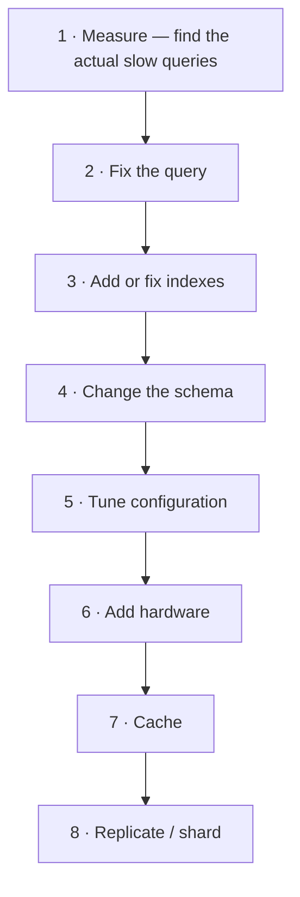

# 7.1.1 — Database Optimization Techniques

> **Part 7 · Patterns & Templates · Patterns · Chapter 1 of 10**
> The highest-return work in most systems, and the first thing to reach for.

---

## 🧒 ELI5 — Explain Like I'm 5

The library is slow. Before you build a second library, **check whether the first one is being used properly.**

Nine times out of ten, one of these is the problem:

- **No index.** The librarian is reading every book, cover to cover, to find one word. Putting a proper index at the back turns a two-hour search into two seconds. *(Add an index.)*
- **Asking a hundred times instead of once.** *"Bring me book 1."* … *"Now book 2."* … a hundred separate trips. **Ask for all hundred at once.** *(Fix the N+1.)*
- **Carrying everything when you need one page.** You asked for the whole encyclopaedia to read one paragraph. *(Select fewer columns.)*
- **The librarian keeps popular books on the desk — but the desk is tiny.** Get a bigger desk and everything speeds up. *(More memory for the buffer pool.)*
- **Counting from the beginning every time.** *"Give me items 900,001 to 900,020"* means counting past nine hundred thousand items first. *(Cursor pagination.)*

**All of these are free.** No new servers, no sharding, no rewrite. **Do them first** — and then, usually, discover you don't need the rest.

---

## The order of operations



🎯 **Never skip step 1.** Optimising a query that runs twice a day while ignoring the one that runs 10,000 times a second is the most common wasted effort in this field.

```sql
-- Postgres: what is ACTUALLY costing you
SELECT query, calls, mean_exec_time, total_exec_time,
       100 * total_exec_time / sum(total_exec_time) OVER () AS pct
FROM pg_stat_statements
ORDER BY total_exec_time DESC LIMIT 20;
```

⚠️ **Sort by `total_exec_time`, not `mean_exec_time`.** A 5 ms query called a million times costs far more than a 30-second query called once — and it is usually the one making the system feel slow.

---

## Indexes: the fundamentals

| Type | Use |
|---|---|
| **B-tree** | ✅ Default. Equality, ranges, sorting, prefix matching |
| **Hash** | Equality only; rarely worth it over B-tree |
| **GIN** | Arrays, JSONB, full-text search |
| **GiST / SP-GiST** | Geometric, ranges, nearest-neighbour |
| **BRIN** | ✅ Enormous, naturally-ordered tables (time-series) — tiny index, big win |
| **Partial** | Index only the rows matching a predicate — much smaller |
| **Expression** | `lower(email)`, `(data->>'status')` |
| **Covering** (`INCLUDE`) | ✅ Index-only scans — no table access at all |

### The rules that matter

**1. Composite index column order is left-to-right.**
```sql
CREATE INDEX ON orders (customer_id, status, created_at);
-- serves: (customer_id), (customer_id, status), (customer_id, status, created_at)
-- does NOT serve: (status), (created_at), (status, created_at)
```

🎯 **Order columns: equality predicates first, then the range/sort column last.** A query `WHERE customer_id = ? AND status = ? ORDER BY created_at` is served perfectly by the index above — the first two narrow the scan, and the third means the rows come out already sorted, so no sort step is needed at all.

**2. A covering index eliminates the table read.**
```sql
CREATE INDEX ON orders (customer_id, created_at) INCLUDE (total_minor, status);
-- SELECT total_minor, status FROM orders WHERE customer_id = ? → Index Only Scan
```
🔢 Often a 2–10× improvement, because the heap access is the expensive part.

**3. A partial index can be dramatically smaller.**
```sql
CREATE INDEX ON orders (created_at) WHERE status = 'pending';
-- If 0.1% of orders are pending, this index is 1000x smaller than the full one
```

**4. Every index slows writes.** Eight indexes means nine structures updated per insert. **Find and drop unused ones:**
```sql
SELECT relname, indexrelname, idx_scan FROM pg_stat_user_indexes
WHERE idx_scan = 0 AND indexrelname NOT LIKE '%_pkey';
```

**5. A function on an indexed column disables the index.**
```sql
WHERE lower(email) = 'a@b.com'        -- ❌ no index used
CREATE INDEX ON users (lower(email)); -- ✅ now it is
WHERE created_at::date = '2026-08-31' -- ❌ function on the column
WHERE created_at >= '2026-08-31' AND created_at < '2026-09-01'  -- ✅ sargable
```

⚠️ **"Sargable"** (Search-ARGument-ABLE) is the term: a predicate the optimiser can satisfy with an index seek. Wrapping the column in a function, or using leading-wildcard `LIKE '%x'`, makes it non-sargable.

---

## Reading a query plan

```sql
EXPLAIN (ANALYZE, BUFFERS, FORMAT TEXT) SELECT ...;
```

| Look for | Meaning |
|---|---|
| `Seq Scan` on a large table | ❌ Missing index, or the planner thinks a scan is cheaper |
| **`rows=10` vs `actual rows=1000000`** | ☠️ Stale statistics — run `ANALYZE` |
| `Index Only Scan` | ✅ The best case |
| `Nested Loop` with a large outer side | ❌ Often a bad plan; usually a bad estimate |
| `Sort` with `Disk:` spill | Raise `work_mem`, or index for the sort order |
| `Rows Removed by Filter` (large) | The index isn't selective enough |
| High `shared read` vs `shared hit` | Cache misses — the working set exceeds the buffer pool |

🎯 **The estimate-vs-actual ratio is the most diagnostic single number in a plan.** The planner chose its strategy based on the estimate; if the estimate is off by 1000×, the strategy is almost certainly wrong. Fix the statistics before fixing anything else.

---

## Query anti-patterns

| Anti-pattern | Fix | Typical gain |
|---|---|---|
| **N+1 queries** | Batch: `WHERE id = ANY($1)`, or a join | **10–100×** |
| `SELECT *` | Name the columns; enable index-only scans | 2–10× |
| `OFFSET 1000000` | Cursor pagination | 10–100× |
| `COUNT(*)` on a huge table | Approximate (`reltuples`), or a maintained counter | 100× |
| `NOT IN (subquery)` with nulls | `NOT EXISTS` | Correctness **and** speed |
| `OR` across different columns | `UNION ALL` of two indexed queries | 10× |
| Correlated subquery in `SELECT` | A join or a lateral | 10× |
| `DISTINCT` masking a bad join | Fix the join | Variable |
| Implicit type casts (`id = '123'`) | Match types | Index usage restored |
| Leading-wildcard `LIKE '%term%'` | Trigram index, or a search engine | 100× |

☠️ **The N+1 is the most common and most costly.** It's invisible in code review — each query is fast — and it's usually created by an ORM lazily loading a relation inside a loop. **200 queries at 1 ms is 200 ms of pure latency** that one batched query removes entirely.

```python
# ❌ N+1
for order in orders:
    customer = db.get_customer(order.customer_id)     # 200 round trips

# ✅ One query
ids = {o.customer_id for o in orders}
customers = {c.id: c for c in db.get_customers(ids)}  # 1 round trip
```

---

## Schema optimisation

| Technique | When |
|---|---|
| **Right-size types** | `int` vs `bigint`, `varchar` vs `text`. Smaller rows = more per page = fewer reads |
| **Column order** (Postgres) | Group by alignment to reduce padding — can save 10–20% on wide tables |
| **Denormalise a hot join** | Only when measured; adds an update obligation |
| **Maintained counters** | Instead of `COUNT(*)` on every read |
| **Partition large tables** | Pruning and instant deletion by dropping partitions |
| **Move cold columns out** | A rarely-read `TEXT` blob inflates every row read |
| **JSONB for sparse attributes** | Instead of 50 mostly-null columns |
| **Archive old rows** | ✅ Often the biggest win — shrinks indexes back into RAM |

🎯 **Archiving deserves emphasis.** Moving 80% of rows to an archive table shrinks the indexes by ~80%, which frequently brings the working set back inside the buffer pool — turning every query from disk-bound to memory-bound. **That is often a larger improvement than any hardware upgrade, and it's free.**

---

## Configuration that matters

| Setting | Guidance |
|---|---|
| `shared_buffers` / `innodb_buffer_pool_size` | ✅ **The single most impactful setting.** 25–40% (PG) / 50–70% (MySQL) of RAM |
| `work_mem` | Per sort/hash operation — too low causes disk spills, too high causes OOM under concurrency |
| `effective_cache_size` | Tells the planner how much OS cache exists; affects plan choice |
| `random_page_cost` | ✅ Lower to ~1.1 on SSD — the default of 4.0 assumes spinning disks and discourages index use |
| `max_connections` | Keep low; use a pooler |
| `autovacuum` settings | ☠️ Must keep up, or bloat and wraparound follow |
| `checkpoint_timeout` / `max_wal_size` | Longer = fewer full-page writes, longer recovery |

⚠️ **`random_page_cost = 4.0` is a legacy default** that assumes random reads are four times as expensive as sequential ones. On NVMe that ratio is closer to 1.1, and leaving the default makes the planner avoid indexes it should use. **This one-line change fixes a surprising number of "why isn't it using my index?" problems.**

---

## Transactions and locking

| Problem | Fix |
|---|---|
| **Long transactions** | ☠️ They hold locks and block vacuum. Keep them short; never hold one across a network call |
| Lock contention on a hot row | Batch updates; sharded counters; queue the writes |
| Deadlocks | Acquire locks in a consistent order across all code paths |
| `idle in transaction` connections | Set `idle_in_transaction_session_timeout` |
| Migration blocking everything | ✅ Set a short `lock_timeout` so it fails fast instead of queueing |

☠️ **The migration-blocking cascade is worth knowing precisely:** an `ALTER TABLE` waits for an `ACCESS EXCLUSIVE` lock. While it waits, **every subsequent query on that table queues behind it** — even simple reads. One long-running transaction plus one migration equals a total outage on that table. **Always `SET lock_timeout = '2s'` before DDL.**

---

## Write optimisation

| Technique | Effect |
|---|---|
| **Batch inserts** | One transaction for 1,000 rows instead of 1,000 transactions — **10–100×** |
| **`COPY` / bulk load** | 10× faster than `INSERT` for large loads |
| **Drop indexes during a bulk load, rebuild after** | Much faster than maintaining them per row |
| **Reduce index count** | Every index is a write cost |
| **Group commit** | Amortise `fsync` across concurrent commits |
| **Async commit** (`synchronous_commit=off`) | ⚠️ Faster, but you can lose recently committed transactions |
| **Partition by time** | Writes land in a small, hot partition |
| **Monotonic primary keys** | ✅ Avoids random insert positions in clustered indexes |

🔢 **The batching figure is worth remembering:** each transaction costs an `fsync` (~0.1–1 ms on SSD). Batching 1,000 inserts into one transaction turns 1,000 fsyncs into one.

---

## The optimisation checklist

```
MEASURE
  □ pg_stat_statements — sort by total_exec_time
  □ EXPLAIN ANALYZE the top offenders
  □ Buffer cache hit ratio (want > 99%)
  □ Check for missing/unused indexes

QUERY
  □ No N+1 patterns
  □ No SELECT * on wide tables
  □ Cursor pagination, not OFFSET
  □ Predicates are sargable (no functions on columns)
  □ Estimates match actuals (statistics are fresh)

INDEX
  □ Composite order: equality first, range/sort last
  □ Covering indexes for hot read paths
  □ Partial indexes where selective
  □ Unused indexes dropped

SCHEMA
  □ Types right-sized
  □ Large tables partitioned
  □ Cold data archived
  □ Counters maintained, not computed

CONFIG
  □ Buffer pool sized to the working set
  □ random_page_cost tuned for SSD
  □ Autovacuum keeping up
  □ Connection pooler in place
```

🎯 **In an interview:** *"Before adding infrastructure I'd measure with `pg_stat_statements` sorted by total time, `EXPLAIN ANALYZE` the top queries, and check the buffer cache hit ratio. In my experience the answer is usually an N+1, a missing composite index, or a working set that no longer fits in RAM — and each of those is a 10–100× improvement for no new hardware. I'd only reach for caching and sharding after that."*

---

## 📋 Chapter checklist

| Skill | Ready? |
|---|---|
| State the eight-step order and why measuring comes first | ☐ |
| Explain why to sort by total, not mean, execution time | ☐ |
| Name eight index types and when each applies | ☐ |
| State the composite-order rule (equality first, range last) | ☐ |
| Explain covering and partial indexes | ☐ |
| Define sargable and give two non-sargable examples | ☐ |
| Read a plan and use the estimate-vs-actual ratio | ☐ |
| Name ten query anti-patterns and their fixes | ☐ |
| Explain why archiving can beat hardware | ☐ |
| Explain `random_page_cost` on SSD | ☐ |
| Explain the migration lock cascade and `lock_timeout` | ☐ |
| Quantify the batching win | ☐ |

---

**← Previous** [6.6.3 Analytics Architecture](../../06-big-data/06-realtime-and-analytics/03-streaming-analytics-architecture.md)
**Next →** [7.1.2 Cache-First Pattern](02-cache-always.md)
