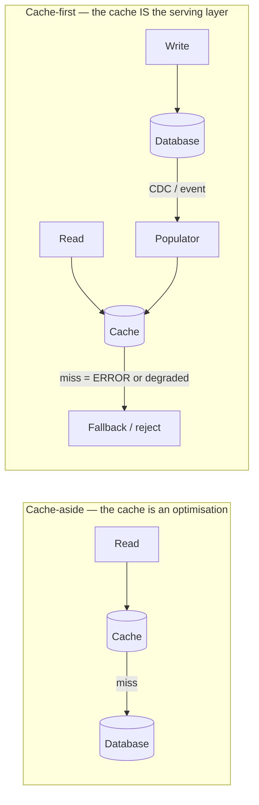
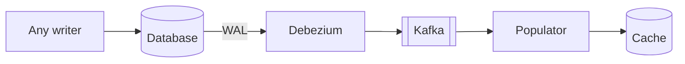

# 7.1.2 — Cache-First Pattern

> **Part 7 · Patterns & Templates · Patterns · Chapter 2 of 10**
> When the cache stops being an optimisation and becomes the primary serving path.

---

## 🧒 ELI5 — Explain Like I'm 5

Normally the fridge is a convenience: if the milk's there, great; if not, walk to the shop.

**Cache-first is different: the fridge is where milk comes from.** The shop only exists to *refill the fridge*. Customers are never sent to the shop — ever.

Why would you do that?

Because if a hundred thousand people a second want milk, **the shop physically cannot serve them.** It was never built for that. So you flip the arrangement: the shop's only job is to keep the fridge stocked, and **the fridge serves everyone**.

The consequences are big, and you have to accept them deliberately:

- **The milk is always slightly old.** By design. You decide how old is acceptable.
- **If the fridge breaks, you are shut.** Not "slower" — *shut*. So you need several fridges.
- **You must fill the fridge before opening.** A cold start isn't a slow morning; it's a closed shop.

That's the trade: **impossible read volumes become possible, and the cache becomes something you must engineer as carefully as a database.**

---

## The pattern



| | Cache-aside | **Cache-first** |
|---|---|---|
| On miss | Read the origin | ❌ Error, degraded response, or a rare slow path |
| Cache populated by | The read path, lazily | ✅ The **write** path, eagerly |
| Origin sized for | Miss traffic (5–10%) | ✅ Writes only — **no read traffic at all** |
| Cache loss | Degraded, recoverable | ☠️ Outage until rebuilt |
| Consistency | Read-through gives correctness | Bounded staleness, always |
| Suits | Most systems | Extreme read volume, or expensive computation |

🎯 **The defining inversion: the cache is populated by writes, not by reads.** In cache-aside, a miss triggers a load. In cache-first, the data is already there because the write path put it there — so a miss means something is *wrong*, not merely cold.

---

## When it's the right answer

| Situation | Why |
|---|---|
| **Read volume exceeds any database** | 500k+ QPS on a dataset a database can't serve at that rate |
| **The value is expensive to compute** | A ranked feed, a recommendation set, a complex aggregate |
| **Precomputation is natural** | Timelines, leaderboards, counters, denormalised views |
| **Staleness is acceptable** | Seconds of lag doesn't harm the product |
| **The origin must be protected absolutely** | A legacy system, or a rate-limited third-party API |

**Real examples:**

| System | Cache-first element |
|---|---|
| Twitter/X timelines | Precomputed per-user lists in Redis; the database is never read on the timeline path |
| Facebook (TAO) | A graph cache in front of MySQL serving billions of reads/sec |
| Netflix | Precomputed recommendations pushed to EVCache |
| CDNs | Origin fetches are the exception, not the norm |
| Product search | An index is a cache-first view of the catalogue |

---

## Populating the cache

The write path must keep the cache correct. There are three mechanisms, in increasing order of robustness.

### 1. Write-through (application)
```python
def update_product(pid, fields):
    row = db.update_returning(pid, fields)
    cache.set(product_key(pid), serialize(row))     # no TTL, or a long one
```
⚠️ Subject to the [dual-write problem](../../02-microservices-and-dataflow/02-asynchronous-communication/01-async-communication.md#the-dual-write-problem-and-the-only-good-fix): if the process dies between the two writes, the cache is wrong indefinitely — and in cache-first there is no read-through path to correct it.

### 2. Event-driven
```python
def on_order_placed(event):
    cache.hincrby(f"stats:{event.region}", "orders", 1)
    cache.zadd("leaderboard", {event.seller: event.amount}, incr=True)
```
Better, but still dependent on every writer publishing correctly.

### 3. ✅ CDC-driven


🎯 **CDC is the correct mechanism for cache-first**, for a reason that matters more here than anywhere else: **there is no read path to repair a miss.** A missed invalidation in cache-aside costs one stale read until the TTL; in cache-first it costs permanently wrong data. CDC cannot miss a committed write — including writes from migrations, admin tools, and other services.

---

## The consequences you must engineer for

### 1. The cache is a database now

| Requirement | Implication |
|---|---|
| **Durability** | Snapshot persistence (RDB/AOF), or a durable store (MemoryDB, DynamoDB) |
| **Replication** | Replicas per shard; a lost shard is lost *service*, not lost performance |
| **Capacity** | It must hold the **whole** working set, not just the hot subset |
| **Backup** | You must be able to rebuild it |
| **Monitoring** | Hit rate near 100% — anything less means the populator is failing |

⚠️ **Sizing is fundamentally different.** Cache-aside sizes for the hot set and accepts misses. **Cache-first must hold everything that can be requested**, or requests fail. That may be 10–100× more memory, and it's a cost you must plan for, not discover.

### 2. Cold start is an outage

☠️ An empty cache-first store cannot serve anything. You cannot "warm up under traffic" — there is no origin path to warm from.

| Mitigation | Detail |
|---|---|
| **Snapshot persistence** | Restart resumes warm |
| **Warm replica failover** | ✅ Promote, don't rebuild |
| **A documented rebuild procedure** | Bulk-load from the database, with a measured duration |
| **Gradual traffic ramp** | Never restore 100% of traffic to a partially-loaded cache |
| **Serve degraded during rebuild** | Static content, a subset of features, or a maintenance page |

🎯 **Know your rebuild time and rehearse it.** *"Rebuilding takes 40 minutes at 50k keys/sec, so we keep two warm replicas and ramp traffic over 10 minutes after a failover"* is the kind of answer that demonstrates you've operated one of these.

### 3. Staleness is a product decision

There is no read-through to fetch fresh data. **Whatever the populator last wrote is what users see.**

```json
{ "data": {...}, "as_of": "2026-08-31T10:04:11Z", "staleness_bound_seconds": 30 }
```

⚠️ **Expose the freshness** where it matters. "Updated 30 seconds ago" is honest and prevents support tickets; silently serving stale prices is not.

### 4. Some paths must bypass it

| Path | Source |
|---|---|
| Browse, feed, display | ✅ Cache |
| Checkout price and inventory | ❌ **Database** — decisions need exactness |
| "My recent activity" after a write | Database, or write-through for that key |
| Payments, balances | ❌ Database |

🎯 **The recurring rule: displays tolerate staleness; decisions do not.** Cache-first is for the read-heavy display path; the correctness-critical path reads the source of truth. Stating this distinction is what makes cache-first a considered design rather than a reckless one.

---

## Handling misses

A miss in cache-first means something is wrong. You still need a policy.

| Policy | When |
|---|---|
| **Fail with a clear error** | The value should exist; failing loudly surfaces the bug |
| **Rare slow path to the origin** | ✅ Pragmatic — protected by request coalescing and a strict rate limit |
| **Serve a degraded default** | Popular items instead of personalised ones |
| **Queue and retry** | For writes; not for reads |

```python
def get_timeline(user_id):
    if (t := cache.get(f"timeline:{user_id}")) is not None:
        return t
    metrics.increment("cache_first.miss")                  # ← should be ~0
    if slow_path_limiter.allow():                          # strictly bounded
        return rebuild_timeline(user_id)                   # coalesced
    return popular_timeline()                              # degraded fallback
```

⚠️ **The slow path must be rate-limited**, or a cold cache sends full traffic at an origin sized for none of it. **Alert on the miss rate** — in cache-first, a rising miss rate is the leading indicator of a populator failure.

---

## Cache-first vs alternatives

| Approach | Read capacity | Origin load | Cache loss | Complexity |
|---|---|---|---|---|
| No cache | Origin's limit | 100% | N/A | ✅ Lowest |
| Cache-aside | 10–20× | 5–10% | Degraded | Low |
| **Cache-first** | ✅ **Unlimited** | **0%** (reads) | ☠️ Outage | High |
| Read replicas | N× | 100%, spread | Degraded | Medium |
| Materialised views | Depends | Low | Depends | Medium |

⚖️ **Do not choose cache-first unless the numbers force it.** It converts a performance optimisation into a critical dependency, and it demands real operational maturity: durable persistence, warm failover, CDC-driven population, rehearsed rebuilds, and miss-rate alerting. **For most systems, cache-aside with a healthy hit rate is the correct answer** — and saying so is a judgement signal.

---

## The interview framing

> "At 500,000 reads per second on this data, no database serves that directly, so the cache stops being an optimisation and becomes the serving layer — cache-first. The database only handles writes; reads never touch it.
>
> That means the cache is populated by the write path, and I'd drive it from CDC rather than application code, because there's no read-through path to repair a missed write — a missed invalidation would be permanently wrong rather than stale for one TTL.
>
> The consequences I'd design for: the cache must hold the entire working set, not just the hot subset, so it's 10–100× the memory of a normal cache. It needs persistence and warm replicas, because a cold cache-first store is an outage, not a slow start. I'd have a rehearsed rebuild procedure with a known duration, alert on miss rate as the leading indicator, and keep the correctness-critical paths — checkout price, inventory reservation — reading the database directly."

---

## 📋 Chapter checklist

| Skill | Ready? |
|---|---|
| State the inversion: populated by writes, not reads | ☐ |
| Name five situations that justify it | ☐ |
| Explain why CDC is the right populator *here specifically* | ☐ |
| Explain why sizing differs from cache-aside | ☐ |
| Explain why cold start is an outage and how to mitigate | ☐ |
| Design a miss policy with a rate-limited slow path | ☐ |
| Say which paths must bypass the cache and why | ☐ |
| Compare with cache-aside and replicas honestly | ☐ |
| Deliver the interview framing | ☐ |

---

**← Previous** [7.1.1 Database Optimization](01-database-optimization.md)
**Next →** [7.1.3 Pre-Computing Pattern](03-pre-computing-pattern.md)
