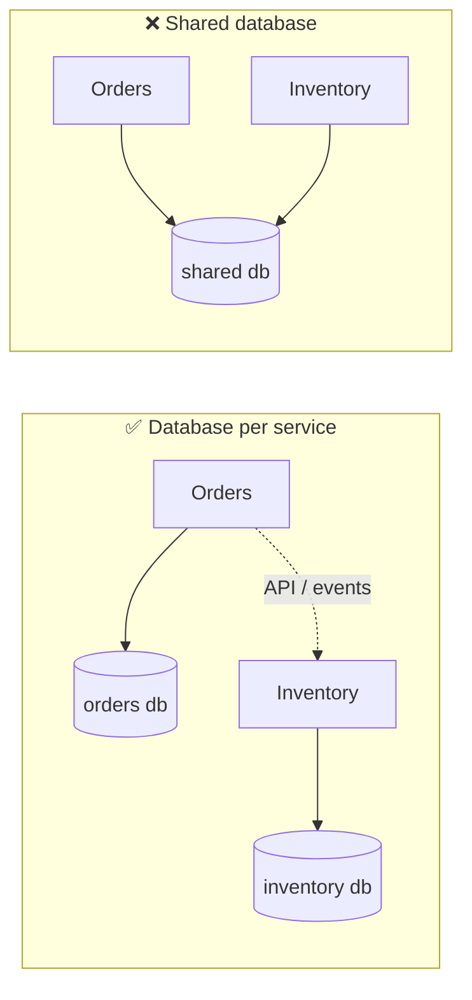
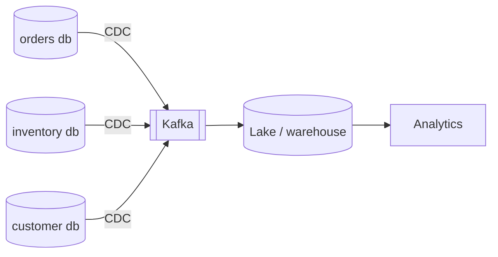

# 7.1.4 — Database Per Microservice

> **Part 7 · Patterns & Templates · Patterns · Chapter 4 of 10**
> The rule that makes microservices real — and the problems it creates.

---

## 🧒 ELI5 — Explain Like I'm 5

Each kitchen keeps **its own recipe book**, and **nobody else is allowed to open it.**

Why so strict? Because if the dessert kitchen can reach into the pizza kitchen's book and read it directly, then the pizza kitchen can **never change a page** — they'd break the dessert kitchen without knowing. They'd have to ask permission for every edit. They aren't really separate kitchens at all; they're one kitchen with two doors.

So the rule is absolute: **want something from another kitchen? Ask them. Don't take it.**

That works, and it makes each kitchen genuinely independent. But it costs you two things you used to get for free:

1. **You can't look at two books at once.** "Which customers ordered pizza *and* dessert?" used to be one glance. Now it's two phone calls and you match things up yourself.
2. **You can't change two books together.** "Take payment *and* reserve the last cake" used to be one action that either fully happened or fully didn't. Now it's two separate actions, and one can succeed while the other fails — leaving a customer charged for a cake that isn't there.

Those two losses are the entire cost of the rule. Everything below is how to live with them.

---

## The rule

> **Each service owns its data. No other service reads or writes it directly. Ever.**



☠️ **A shared database is not a microservice architecture.** It's a distributed monolith: the services deploy separately but cannot *change* separately, because the schema is a coupling that nobody can see in the code. This is the single most common way microservice migrations fail.

| Sharing | Verdict |
|---|---|
| Two services write the same table | ❌ Fatal coupling |
| One writes, one reads directly | ❌ Still coupling — the writer can't change the schema |
| A shared **read replica** | ⚠️ Better, but the schema is still a public contract |
| Separate schemas, same database instance | ⚠️ Acceptable transitional step — physical, not logical, sharing |
| ✅ Separate databases, API/events only | ✅ Genuine independence |

🎯 **The test: "can service A change its schema without telling anyone?"** If no, they share data, whatever the deployment topology says.

---

## What it buys you

| Benefit | Detail |
|---|---|
| **Independent deployment** | Schema changes don't coordinate across teams |
| **Independent scaling** | The write-heavy service gets a different database from the read-heavy one |
| **Technology fit** | Postgres for orders, Elasticsearch for search, Cassandra for events |
| **Fault isolation** | One database's outage doesn't take everything down |
| **Clear ownership** | One team owns the data and its correctness |
| **Blast radius** | A bad migration affects one service |

⚖️ **Technology fit is genuinely valuable and often the strongest justification:** forcing a full-text search workload and a transactional ledger into the same engine serves neither well.

---

## What it costs

### Loss 1 — No cross-service joins

```sql
-- Was one query:
SELECT o.*, c.name FROM orders o JOIN customers c USING (customer_id);
```

| Replacement | How | Trade |
|---|---|---|
| **API composition** | Fetch orders, collect customer IDs, one **batched** call | ⚠️ Latency; a runtime dependency |
| **Event-carried state transfer** | ✅ Orders keeps a local copy of `(customer_id, name)`, updated by events | Duplicated data; eventual consistency |
| **CQRS read model** | A dedicated service builds a joined view from both event streams | Best for complex queries; more machinery |
| **API gateway / BFF composition** | The edge fetches from both and merges | Fan-out latency at the edge |

🎯 **Event-carried state transfer is the pattern to name**, and its cost should be named with it: *"Orders keeps a local projection of customer display names, updated from `CustomerUpdated` events. That means order lookups need zero cross-service calls and survive a Customer outage — the cost is a few seconds of staleness on a name change, plus a reconciliation job."*

⚠️ **Only replicate what you actually need.** Copying the entire customer record into every service recreates the shared database with extra steps. Copy the two fields you display.

☠️ **Never do a naive N+1 across services.** Fetching 50 orders then calling the customer service 50 times is 50 network round trips, 50 failure opportunities, and availability of 0.999⁵⁰ ≈ 95%. **Always batch.**

### Loss 2 — No cross-service transactions

```
Order service:     create order        ✅
Payment service:   charge card         ✅
Inventory service: reserve stock       ❌ out of stock
→ the customer has been charged for something they can't have
```

| Approach | Detail |
|---|---|
| **Reorder the steps** | ✅ Free: reserve inventory *before* charging. Try this first |
| **Saga with compensations** | Explicit "refund payment" on failure ([Saga](10-saga-pattern.md)) |
| **Reservation pattern** | Reserve → confirm, with an expiry — the standard for booking |
| **Outbox + async** | Commit locally, publish an event, let downstream retry until it succeeds |
| ~~Two-phase commit~~ | ❌ Blocking, fragile, poorly supported |
| **Reconciliation job** | ✅ Always have one, whatever else you do |

🎯 **"Reorder so the risky step is last" is genuinely underrated.** Many apparent distributed-transaction problems dissolve once you sequence the operations so that only the *final*, easily-retried step can fail.

---

## The dual-write problem — again

```python
# ☠️ BROKEN
db.save(order)                    # committed
kafka.publish(OrderPlaced)        # crash here → nobody downstream ever knows
```

✅ **The transactional outbox:**
```sql
BEGIN;
  INSERT INTO orders (...);
  INSERT INTO outbox (id, topic, payload, created_at) VALUES (...);
COMMIT;
-- a relay (or CDC) publishes from outbox and marks rows sent
```

⚠️ **This is not optional in a database-per-service architecture.** Every service that both persists state and notifies others has this bug unless it uses the outbox or CDC. It is the single most important implementation detail in this chapter. ([Change Data Capture](../../05-scaling-data-storage/01-data-replication/05-change-data-capture.md))

---

## Reporting and analytics

☠️ **You can no longer query across the business.** "Revenue by customer segment" spans four services.

| Approach | Notes |
|---|---|
| ❌ Query each service's database directly | Breaks the boundary; and analytical queries would hurt the operational databases anyway |
| ❌ A shared reporting database written by all services | Back to a shared schema |
| ✅ **CDC from every service into a warehouse** | Each service's data lands in the lake; joins happen there |
| ✅ **Event-driven analytics** | Services publish domain events; the warehouse consumes them |



🎯 **This is the correct answer, and it's a good one to give unprompted:** the operational boundary stays intact, analytical load never touches operational databases, and the warehouse is the one place where cross-domain joins legitimately happen. **Analytics is a separate concern with separate infrastructure** — not a reason to break service boundaries.

---

## Data duplication is normal — and needs governance

Each service holds copies of data it doesn't own.

| Rule | Reason |
|---|---|
| **One owner per fact** | Exactly one service may change it; everyone else has a read-only copy |
| **Copies are derived, never authoritative** | Rebuildable from the owner's events |
| **Copy only what you use** | Not the whole record |
| **Version or timestamp copies** | To detect and resolve staleness |
| **Reconcile periodically** | ✅ Copies drift; detect it deliberately |

⚠️ **The reconciliation job is not optional.** Events get lost, consumers have bugs, replays go wrong. A daily job that compares each service's copy against the owner and alerts on mismatches turns silent divergence into a detected bug. **Naming this shows operational maturity.**

---

## Practical patterns

### Shared instance, separate schemas (the transitional step)
```sql
CREATE SCHEMA orders;      -- owned by the orders service
CREATE SCHEMA inventory;   -- owned by the inventory service
-- Separate DB users; no cross-schema grants; NO cross-schema foreign keys
```
⚖️ **A legitimate intermediate stage:** logical separation and enforced boundaries, without the cost of N database instances. **Enforce it with permissions, not conventions** — if the grant exists, someone will use it.

### Which database per service
| Service | Store | Why |
|---|---|---|
| Orders | Postgres | Transactions, invariants |
| Users | Postgres | Constraints, unique emails |
| Sessions | Redis | TTL, key lookups |
| Catalogue search | Elasticsearch | Full-text, faceting |
| Events / activity | Cassandra | Write volume, time-ordered |
| Media | S3 + Postgres metadata | Blobs never in a database |
| Analytics | ClickHouse | Columnar aggregation |

⚠️ **Each additional technology has an operational tax:** backups, monitoring, upgrades, on-call expertise, security patching. **"Right tool for the job" has a real cost** — five services on Postgres is often better engineering than five different databases.

---

## When *not* to split the database

| Situation | Better |
|---|---|
| The services are always deployed together | They're one service |
| Cross-entity transactions are the core of the domain | Keep them together |
| The team is small | ✅ A modular monolith with separate schemas |
| Data is genuinely one aggregate | Don't split an aggregate across services |
| You don't have CDC, tracing, or an outbox yet | ✅ Build the platform first |

🎯 **The strongest position:** *"I'd start with a modular monolith using separate schemas and enforced boundaries. That gives clear ownership and makes extraction cheap later, without paying for distributed transactions and cross-service joins before there's a reason to."* ([Microservices vs Monolithic](../../01-introduction/05-microservices/01-microservices-vs-monolithic.md))

---

## ☠️ Failure modes

| Failure | Consequence |
|---|---|
| Shared database "temporarily" | Permanent coupling; deploys must be coordinated |
| Dual writes without an outbox | Silent, permanent divergence |
| N+1 calls across services | Latency and multiplied failure probability |
| Replicating entire records | A shared database, distributed |
| No reconciliation | Copies drift undetected |
| Splitting an aggregate across services | Every operation becomes a distributed transaction |
| Reporting queries against operational databases | Analytical load takes down production |
| Foreign keys across service schemas | The boundary is fiction |
| Five databases, one on-call engineer | Operational collapse |

---

## 📋 Chapter checklist

| Skill | Ready? |
|---|---|
| State the rule and the schema-change test | ☐ |
| Explain why a shared database is a distributed monolith | ☐ |
| Give four replacements for cross-service joins | ☐ |
| Explain event-carried state transfer with its cost | ☐ |
| Give five approaches to cross-service transactions, starting with reordering | ☐ |
| Write the outbox pattern and say why it's mandatory here | ☐ |
| Design cross-service analytics via CDC | ☐ |
| State the five data-duplication rules | ☐ |
| Justify shared-instance/separate-schemas as a transitional step | ☐ |
| Name five situations not to split | ☐ |

---

**← Previous** [7.1.3 Pre-Computing Pattern](03-pre-computing-pattern.md)
**Next →** [7.1.5 Multi-System Data Sync](05-multi-system-data-sync.md)
