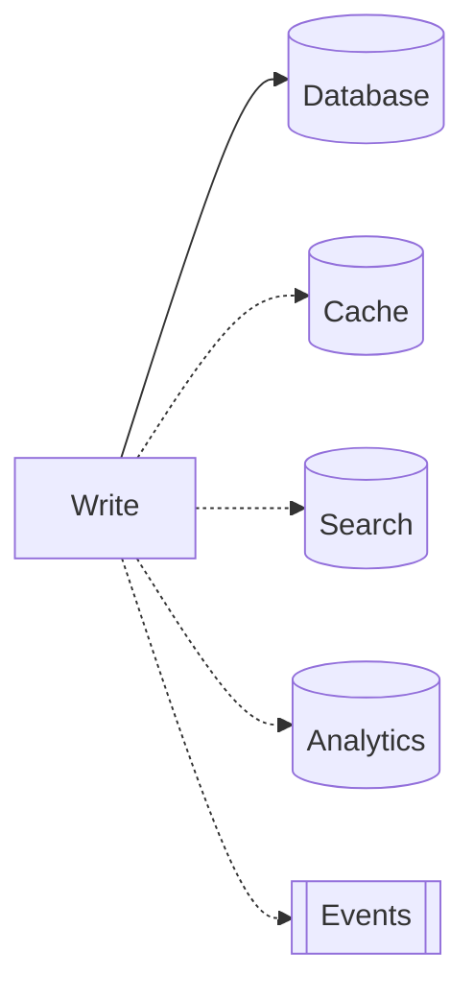
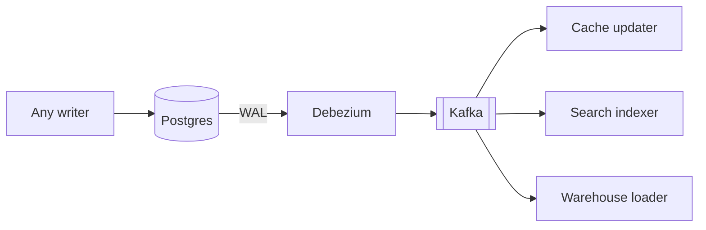
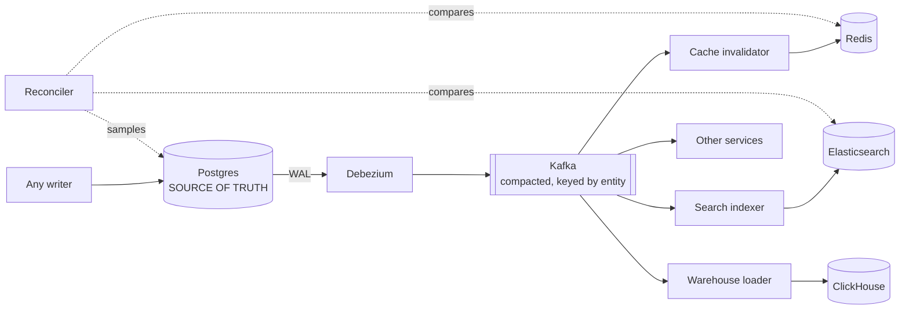

# 7.1.5 — Multi-System Data Sync

> **Part 7 · Patterns & Templates · Patterns · Chapter 5 of 10**
> The same data in a database, a cache, a search index, and a warehouse. Keeping them from disagreeing.

---

## 🧒 ELI5 — Explain Like I'm 5

The same fact — *"the kettle costs £24.99"* — ends up written down in **five different places**:

1. The **main ledger** (the database).
2. The **notepad by the till** for speed (the cache).
3. The **catalogue index** so people can search for "kettle" (the search engine).
4. The **weekly figures book** (the warehouse).
5. The **price tag on the shelf** (the CDN / the customer's browser).

You change the price in the ledger. **Now four other places are wrong.**

The naive fix — "I'll just remember to update all five" — fails for a reason that is completely predictable: **you will be interrupted.** You'll update three, get distracted, and the other two stay wrong. Forever. And nobody will notice, because each one looks perfectly plausible on its own.

The reliable fix is different in kind: **you don't tell anyone anything.** The ledger already keeps a record of every change it makes. So you have **one person read that record out loud**, and everyone else listens and updates themselves.

Now it can't be forgotten, because nobody has to remember.

---

## The problem



☠️ **Every dotted line is a chance to diverge.** If the process dies after the database commit and before the search update, they disagree — permanently, silently, with no error anywhere.

| Failure | Result |
|---|---|
| Process crashes mid-sequence | Some systems updated, others not |
| One system is temporarily down | That update is lost |
| A retry re-applies a non-idempotent update | Double-counted |
| **A write bypasses the application** | ☠️ Migration, admin tool, or another service — nothing downstream hears about it |
| Updates arrive out of order | An older value overwrites a newer one |

🎯 **The bypass case is the one people forget and the one that argues most strongly for CDC.** Application-level syncing only covers writes that go through your application. A DBA running an `UPDATE` to fix data leaves every derived system wrong, and nobody finds out until a customer complains months later.

---

## The four approaches

| Approach | Reliability | Latency | App changes | Catches out-of-app writes |
|---|---|---|---|---|
| **Dual writes** | ❌ Broken | ms | Yes | ❌ |
| **Transactional outbox** | ✅ Atomic with the data | 100 ms – 1 s | Yes | ❌ |
| **CDC** | ✅ Cannot miss a commit | 10–500 ms | ✅ None | ✅ **Yes** |
| **Periodic sync/polling** | ⚠️ Misses deletes and intermediate states | Poll interval | Some | Partially |

### ❌ Dual writes
```python
db.save(product)
search.index(product)          # crash here → search is stale forever
cache.set(key, product)        # or here
```
**There is no ordering of independent writes that is atomic.** This is not a bug to be careful about; it is a structural impossibility.

### ✅ Transactional outbox
```sql
BEGIN;
  UPDATE products SET price_minor = 2499 WHERE id = 9;
  INSERT INTO outbox (topic, payload, created_at)
    VALUES ('product.updated', '{"id":9,"price_minor":2499}', now());
COMMIT;
```
A relay publishes unsent outbox rows and marks them sent. **The event and the data commit together**, so they cannot disagree.

⚖️ **Explicit and shapeable** — you choose exactly what the event contains and can express *intent* (`PriceReduced`) rather than a raw row change. **The cost:** application changes, and it still misses writes that bypass the application.

### ✅ CDC


**The database's own log is the source of truth for what changed.** Nothing can commit without appearing in it.

⚖️ **Zero application changes, catches every writer — but it emits *row changes*, not *business events***. CDC tells you `status` went from `pending` to `cancelled`; it cannot tell you *why*.

🎯 **The mature answer combines them: put domain events in an outbox table, and let CDC deliver them.** You get explicit business semantics *and* log-based reliability. Saying this shows you understand that outbox-vs-CDC is a false choice.

---

## Ordering and idempotency

Even with reliable delivery, two problems remain.

### Out-of-order updates
```
Event 1: price → £24.99   (published 10:00:00)
Event 2: price → £19.99   (published 10:00:01)
Consumer processes 2, then 1 → the index shows £24.99. Wrong, permanently.
```

| Fix | How |
|---|---|
| **Partition by entity key** | ✅ All events for product 9 go to one partition, processed in order |
| **Version / LSN check** | Apply only if the incoming version is newer |
| **External versioning in the sink** | ✅ Elasticsearch `version_type=external` rejects older versions automatically |

```python
es.index(index="products", id=doc_id, document=doc,
         version=event.source_lsn, version_type="external")
# The sink itself enforces monotonicity — replays and reorderings are safe
```

🎯 **Using the LSN as an external version is the elegant idiom** — it makes the consumer simultaneously idempotent *and* order-tolerant with one mechanism, rather than two.

### Duplicates
Delivery is at-least-once. **Every consumer must be idempotent**: upserts keyed by entity ID, or a processed-event-ID table with a TTL.

---

## Reconciliation: the safety net

☠️ **Every sync mechanism drifts eventually** — a consumer bug, a bad deploy, a mis-handled schema change, a replay gone wrong.

```python
def reconcile_search_index():
    mismatches = 0
    for batch in db.scan_products(batch_size=1000):
        indexed = search.mget([p.id for p in batch])
        for src, idx in zip(batch, indexed):
            if idx is None or checksum(idx) != checksum(src):
                search.index(src)               # repair
                mismatches += 1
    metrics.gauge("sync.mismatches", mismatches)
    if mismatches > THRESHOLD:
        alert("search index drift exceeds threshold")
```

| Strategy | Cost | Use |
|---|---|---|
| Full comparison | High | Nightly, small datasets |
| **Sampled comparison** | ✅ Low | Continuous — 0.1% of records |
| Checksum by partition | Medium | Compare aggregate hashes per range |
| Count comparison | ✅ Very low | Cheap first-line detection |
| Merkle trees | Medium | Efficiently locate divergent ranges in huge datasets |

🎯 **Continuous sampling is the highest-value practice here.** Comparing 0.1% of records on every run costs almost nothing and turns silent drift into an alert. **Most teams never do it, and consequently discover divergence from a customer complaint.**

⚠️ **Alert on the mismatch *rate*, not on any mismatch.** A few in-flight differences are normal; a step change means something broke.

---

## Rebuild, don't repair

**Every derived system must be rebuildable from scratch.**

```
1. Build the new index/view alongside the old (v2)
2. Backfill from the source of truth (or replay the log from offset 0)
3. Catch up to live
4. Verify against v1
5. Swap the alias atomically
6. Keep v1 for a rollback window, then delete
```

⚠️ **If a derived store cannot be rebuilt, it is a second source of truth** — and it *will* eventually be the only place some piece of data exists. **Rebuildability is the property that makes derived stores disposable**, which is what makes the whole architecture safe.

🎯 **A compacted CDC topic is both a change stream and a rebuildable snapshot:** replaying it from offset 0 materialises the complete current state per key. That single property makes "rebuild from scratch" a routine operation rather than a project.

---

## Consistency expectations

| System | Realistic lag | User-visible symptom |
|---|---|---|
| Database | 0 | — |
| Cache | ms–seconds | Briefly stale price |
| Search index | 1–10 s | A renamed product not findable for a moment |
| Warehouse | Minutes–hours | Yesterday's numbers |
| CDN | Up to the TTL | An old image or page |
| Browser | Up to `max-age` | ❌ Unfixable — plan with versioned URLs |

⚠️ **State the end-to-end bound explicitly:** *"a price change is authoritative immediately, visible in the cache within a second, searchable within 10 seconds, and reflected at the edge within 60 seconds. The checkout path reads the database directly, so the price charged is never stale."*

🎯 **That last clause is the important one.** Sync lag is acceptable for *display* and unacceptable for *decisions* — the same rule that runs through caching, replication, and CQRS.

---

## Handling deletes

☠️ **Deletes are the most commonly-missed sync case.** A row is deleted; the derived systems still have it — so a deleted product remains searchable, cached, and in reports.

| Approach | Detail |
|---|---|
| **Soft delete + a flag** | ✅ Simplest — the change is an update, which syncs normally |
| **Tombstone events** | CDC emits a delete event; consumers remove the record |
| **Compaction tombstones** | A `null` value removes the key from a compacted topic |
| **Periodic orphan sweep** | Find records in derived stores absent from the source |

⚠️ **GDPR erasure makes this a compliance issue, not just correctness.** A deletion request must propagate to every derived store — cache, index, warehouse, backups, and the lake. **Design deletion propagation before you need it**, and tag or version every key holding personal data so it can be found.

---

## The reference architecture



| Rule | Reason |
|---|---|
| **One source of truth per fact** | Everything else is derived |
| **Derive via CDC or an outbox — never dual writes** | Structural, not a matter of care |
| **Partition by entity key** | Per-entity ordering |
| **Consumers are idempotent** | At-least-once delivery |
| **Every derived store is rebuildable** | Disposability |
| **A reconciler samples and alerts** | Drift becomes a bug, not a surprise |
| **Each consumer is independent** | One failure doesn't stall the others |

---

## ☠️ Failure modes

| Mistake | Consequence |
|---|---|
| Dual writes | Silent permanent divergence |
| No partitioning by key | Out-of-order updates overwrite newer data |
| Non-idempotent consumers | Duplicates corrupt aggregates |
| No reconciliation | Drift discovered by customers |
| Derived store that can't be rebuilt | It becomes a second source of truth |
| Deletes not propagated | Ghost records; GDPR exposure |
| One consumer failure blocking others | Coupled failure domains |
| No end-to-end lag monitoring | Staleness invisible until it's a complaint |
| Application-only sync | Misses migrations, admin tools, other services |

---

## 📋 Chapter checklist

| Skill | Ready? |
|---|---|
| Explain why dual writes are structurally impossible to make atomic | ☐ |
| Compare outbox and CDC, and describe combining them | ☐ |
| Explain why out-of-app writes argue for CDC | ☐ |
| Fix out-of-order updates three ways | ☐ |
| Use the LSN as an external version | ☐ |
| Design a sampled reconciler with rate-based alerting | ☐ |
| Explain why rebuildability makes derived stores safe | ☐ |
| State an end-to-end consistency bound, including the decision path | ☐ |
| Handle deletes and GDPR propagation | ☐ |
| Draw the reference architecture and state its seven rules | ☐ |

---

**← Previous** [7.1.4 Database Per Microservice](04-database-per-service.md)
**Next →** [7.1.6 Unique ID Generators](06-unique-id-generators.md)
