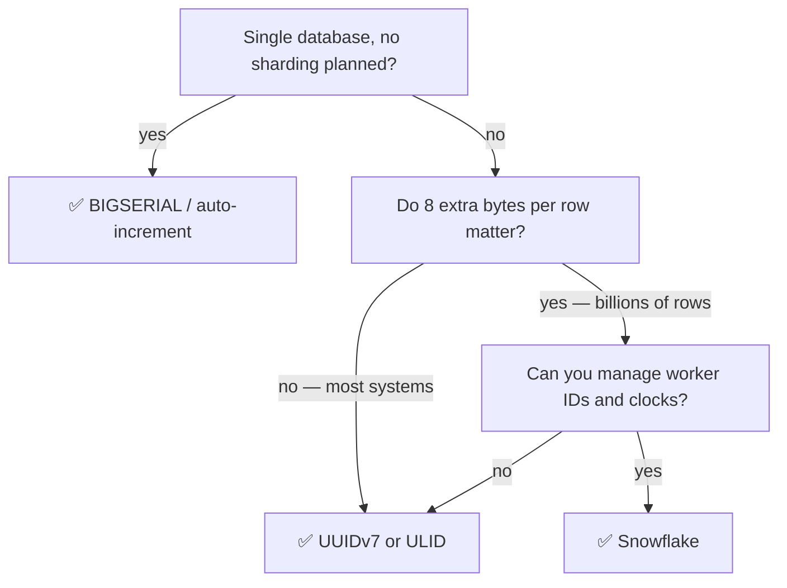

# 7.1.6 — Unique ID Generators

> **Part 7 · Patterns & Templates · Patterns · Chapter 6 of 10**
> Auto-increment stops working the moment you have more than one database. A small problem with surprisingly deep consequences.

---

## 🧒 ELI5 — Explain Like I'm 5

You give every new customer a ticket number: 1, 2, 3, 4...

Easy — because **one person hands out tickets**, so they always know what came last.

Now you open a **second desk**. Both hand out tickets. Both start from 1. Now there are two customers holding ticket #47, and everything breaks.

Four ways to fix it:

1. **One person still hands out all the tickets**, and the desks queue up to ask. Works, but that person is now the slowest part of the shop — and if they're ill, nobody gets served. *(A central sequence.)*
2. **Split the numbers up front.** Desk A uses even numbers, desk B uses odd. Nobody has to ask anyone. Simple! But adding a third desk means re-dividing everything. *(Ranges/offsets.)*
3. **Use very long random numbers.** So long that two desks picking randomly will essentially never collide. No coordination at all — but the numbers are meaningless, and **they're in no order**, which turns out to matter a lot. *(UUIDs.)*
4. **Stick the time on the front.** "10:04:32-deskA-7". Now every number is unique *and* the numbers naturally sort by when they were made — which is enormously useful. *(Snowflake — the usual answer.)*

Option 4 wins for one non-obvious reason: **numbers that arrive in order are much kinder to how databases store things.** Random numbers scatter writes all over the disk; ordered ones land neatly at the end.

---

## The requirements

| Requirement | Why |
|---|---|
| **Unique** | Non-negotiable |
| **No coordination** | Any node generates without asking |
| **Time-sortable** | ✅ Sequential inserts; sort by ID = sort by time; range scans by time |
| **Compact** | Stored in every index; a wide key inflates everything |
| **Opaque** | ☠️ Shouldn't leak volume or allow enumeration |
| **High throughput** | Millions per second across the fleet |

⚠️ **Time-sortability and opacity are in tension.** A sortable ID reveals *when* something was created and, from two samples, roughly how many were created in between. If that matters, use a sortable ID internally and expose an opaque one externally.

---

## The options

| Method | Size | Sortable | Coordination | Notes |
|---|---|---|---|---|
| **Auto-increment** | 8 B | ✅ Yes | ❌ Single database | Breaks on sharding |
| **UUIDv4** | 16 B | ❌ No | ✅ None | ☠️ Terrible for clustered indexes |
| **UUIDv7 / ULID** | 16 B | ✅ Yes | ✅ None | ✅ **The modern default** |
| **Snowflake** | 8 B | ✅ Yes | Worker ID assignment | ✅ Compact and sortable |
| **Central ticket server** | 8 B | ✅ Yes | ❌ Central | A bottleneck and SPOF |
| **Range allocation** | 8 B | Roughly | Occasional | Batches from a central source |
| **Database sequence per shard with offsets** | 8 B | Per shard | Setup only | Awkward to grow |
| **Hash of content** | 32 B | ❌ No | ✅ None | For deduplication, not identity |

---

## Why UUIDv4 is a problem

☠️ **Random IDs destroy clustered-index insert performance.**

In InnoDB (and any clustered index), rows are stored **in primary-key order**. A random UUID means every insert lands at a random position in the B-tree:

| Effect | Detail |
|---|---|
| Random page writes | No locality; every insert touches a different page |
| Constant page splits | Pages fill and split repeatedly |
| Cache thrashing | The working set is the *entire* index, not the recent tail |
| Fragmentation | Poor page occupancy |
| Fatter secondary indexes | InnoDB stores the PK in every secondary index — 16 B (or 36 B as a string!) instead of 8 B |

🔢 **Measured insert throughput on large tables is commonly 5–10× worse with random UUID primary keys than with monotonic ones.** This is one of the most reproducible performance findings in database engineering, and it is the reason UUIDv7 exists.

✅ **UUIDv7 / ULID fix it** by putting a millisecond timestamp in the high bits, so IDs are *roughly* monotonic while remaining globally unique and generated without coordination.

```
UUIDv7:  0189d4f8-9c3e-7a1b-8f2c-3d4e5f6a7b8c
         └──── 48-bit ms timestamp ────┘└─ version ─┘└──── random ────┘
```

⚠️ **Never store a UUID as a 36-character string.** It's 36 bytes instead of 16, it's slower to compare, and in InnoDB it's copied into every secondary index. Use the native `uuid` type (Postgres) or `BINARY(16)` (MySQL).

---

## Snowflake IDs

Twitter's design, now near-universal.

```
 1 bit  │      41 bits       │  10 bits  │  12 bits
 unused │  ms since epoch    │ worker ID │ sequence
        │  (~69 years)       │ (1024)    │ (4096/ms)
```

```python
class Snowflake:
    EPOCH = 1735689600000              # a custom epoch: 2025-01-01

    def __init__(self, worker_id):
        assert 0 <= worker_id < 1024
        self.worker_id, self.seq, self.last_ms = worker_id, 0, -1

    def next_id(self):
        ms = int(time.time() * 1000)
        if ms < self.last_ms:                       # ☠️ clock went backwards
            raise ClockMovedBackwards(self.last_ms - ms)
        if ms == self.last_ms:
            self.seq = (self.seq + 1) & 0xFFF
            if self.seq == 0:                       # 4096 exhausted this ms
                while ms <= self.last_ms:
                    ms = int(time.time() * 1000)    # spin to the next ms
        else:
            self.seq = 0
        self.last_ms = ms
        return ((ms - self.EPOCH) << 22) | (self.worker_id << 12) | self.seq
```

🔢 **Capacity: 4,096 IDs per millisecond per worker × 1,024 workers = 4.2 million IDs/second.** Far beyond most needs, and it fits in a 64-bit integer.

| Property | Detail |
|---|---|
| **Compact** | 8 bytes — half a UUID, and a native integer type |
| **Sortable** | ✅ Time-ordered, so `ORDER BY id` is `ORDER BY created_at` |
| **No coordination per ID** | Only worker-ID assignment needs coordination, once |
| **Time-extractable** | `created_at = (id >> 22) + EPOCH` — free timestamp |

### The two hard parts

**1. Worker ID assignment.** Two nodes with the same worker ID generate duplicate IDs.

| Method | Notes |
|---|---|
| Static config | Simple; error-prone with autoscaling |
| ZooKeeper/etcd ephemeral node | ✅ Automatic and safe; released on death |
| Kubernetes StatefulSet ordinal | ✅ Elegant — the pod index *is* the worker ID |
| Derived from the private IP | Works if IPs are stable and unique |

**2. Clock skew — the sharp edge.**

☠️ **If the clock moves backwards** (NTP correction, VM migration, leap second), a worker can regenerate IDs it has already issued. Options:
- **Refuse to generate** until the clock catches up (the code above). ✅ Correct — briefly unavailable rather than wrong.
- Borrow from the sequence bits for small drifts.
- Use a **monotonic** clock source where available.

⚠️ **Requirement: NTP with slewing, not stepping.** `ntpd -x` / chrony's `maxslewrate` adjust the clock gradually rather than jumping. A stepping correction on a Snowflake node is a duplicate-ID incident.

---

## ULID

```
01AN4Z07BY      79KA1307SR9X4MV3
└─ 48-bit ms ─┘ └── 80-bit random ──┘
26 characters, Crockford base32: URL-safe, case-insensitive, no ambiguous chars
```

| ✅ | ❌ |
|---|---|
| Sortable, no coordination | 16 bytes (vs 8 for Snowflake) |
| ✅ Human-readable and URL-safe | Slightly larger indexes |
| ✅ No worker ID to manage | Monotonic only within a millisecond, per generator |
| Same collision resistance as UUIDv4 within a millisecond | |

🎯 **ULID or UUIDv7 is the pragmatic default for most systems:** you get sortability and independence with **zero operational setup** — no worker IDs, no clock-skew coordination. **Choose Snowflake when the 8 extra bytes per row genuinely matter** (billions of rows, many indexes) and you can manage worker IDs.

---

## Range allocation (the "ticket server, in bulk" approach)

```sql
-- Each node claims a block of 10,000 IDs at a time
UPDATE id_ranges SET next_start = next_start + 10000
WHERE name = 'orders' RETURNING next_start - 10000 AS block_start;
```

| ✅ | ❌ |
|---|---|
| Compact sequential integers | A central allocator (but touched rarely) |
| One coordination round per 10,000 IDs | ☠️ Gaps when a node dies with an unused block |
| Simple to reason about | Not globally time-ordered across nodes |

**Used by:** Hibernate's `hi/lo` generator, Flickr's ticket servers, many ORMs. **Legitimate and underrated** when you want dense integer IDs without a per-insert bottleneck.

---

## Security: don't leak with your IDs

☠️ **Sequential public IDs leak business information and enable enumeration:**
- `/orders/1042` tells a competitor you've had 1,042 orders.
- Creating two accounts an hour apart and comparing IDs reveals your signup rate.
- An attacker can walk `/users/1`, `/users/2`, ... to enumerate everything.

⚠️ **Enumeration is only exploitable if authorization is missing** — but it's exactly the [IDOR](../../01-introduction/02-api-design/05-api-authorization.md#the-rule-that-matters-more-than-the-model) attack surface, and it makes any authorization gap trivially discoverable.

| Defence | Detail |
|---|---|
| ✅ **Separate internal and external IDs** | Sortable Snowflake internally; a random public ID or slug externally |
| Hashids / Sqids | Reversibly obfuscate an integer — ⚠️ obfuscation, **not** security |
| Random public IDs (UUIDv4) | Not enumerable; keep a sortable internal PK |
| ✅ **Always authorize by object** | The real fix — enumeration should reveal nothing |

🎯 **"Sortable internal ID, opaque external ID" is the answer** to the tension between the two. It costs one extra indexed column and resolves the trade completely.

---

## Choosing



| System | Choice |
|---|---|
| A single Postgres, modest scale | `BIGSERIAL` |
| Sharded, high volume, many indexes | Snowflake |
| Distributed, simplicity valued | ✅ UUIDv7 / ULID |
| Client-generated IDs (offline-capable apps) | UUIDv7 / ULID |
| Public-facing URLs | A separate opaque ID or slug |
| Content deduplication | A content hash |
| Short links | Base62 of a counter, or a random code with a collision check |

---

## The URL-shortener case

A common interview follow-up with two valid answers:

**Counter-based:** a distributed counter → base62 encode.
```
counter 125_000_000 → base62 → "8M0kW"
```
✅ Short, dense, no collisions. ❌ Sequential and enumerable — mitigate by encoding `counter × large_prime mod 62^7`, or by mixing in bits.

**Random with collision check:**
```python
for _ in range(5):
    code = random_base62(7)
    if db.insert_if_absent(code, url):
        return code
raise Exceeded
```
🔢 62⁷ ≈ 3.5 × 10¹² codes. At 100 million links stored, the collision probability per attempt is ~0.003% — so retries are essentially never needed. ✅ Not enumerable.

🎯 **Random-with-check is usually the better answer** because it avoids enumeration and needs no distributed counter — and the collision maths shows the retry loop is theoretical rather than real.

---

## ☠️ Failure modes

| Mistake | Consequence |
|---|---|
| UUIDv4 as a clustered primary key | 5–10× slower inserts; bloated secondary indexes |
| UUID stored as a 36-char string | 2.25× the storage in every index |
| Auto-increment on shards without offsets | Duplicate IDs across shards |
| Duplicate Snowflake worker IDs | ☠️ Duplicate IDs — silent data corruption |
| Clock stepping backwards | Regenerated IDs |
| A central ID service on the write path | Bottleneck and SPOF |
| Sequential public IDs | Volume leakage and enumeration |
| Assuming Snowflake IDs are globally strictly ordered | They're ordered *per worker*; clock skew reorders across workers |

⚠️ **That last one matters:** Snowflake gives *approximate* global time ordering, exact only within a worker. If you need a strict global total order (e.g. a financial ledger sequence), you need consensus, not timestamps.

---

## 📋 Chapter checklist

| Skill | Ready? |
|---|---|
| List the six requirements and the sortability/opacity tension | ☐ |
| Explain why UUIDv4 hurts clustered indexes, with the magnitude | ☐ |
| Draw the Snowflake bit layout and compute its capacity | ☐ |
| Explain worker-ID assignment options | ☐ |
| Explain clock skew and the NTP slewing requirement | ☐ |
| Compare ULID/UUIDv7 with Snowflake and pick a default | ☐ |
| Explain range allocation and its gap trade-off | ☐ |
| Explain internal-sortable / external-opaque | ☐ |
| Give both URL-shortener approaches with the collision maths | ☐ |
| Name eight failure modes | ☐ |

---

**← Previous** [7.1.5 Multi-System Data Sync](05-multi-system-data-sync.md)
**Next →** [7.1.7 Rate Limiting Patterns](07-rate-limiting-patterns.md)
