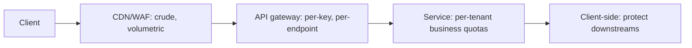

# 7.1.7 — Rate Limiting Patterns

> **Part 7 · Patterns & Templates · Patterns · Chapter 7 of 10**
> Protecting a system from too much traffic — including well-meaning traffic.

---

## 🧒 ELI5 — Explain Like I'm 5

The ice cream van can serve **ten people a minute**. If forty people show up every minute, the queue grows forever and **everyone** ends up waiting an hour — including the ten who could have been served quickly.

So you put someone at the front who says: *"Sorry, we're full — come back in five minutes."* **Thirty people are turned away, and ten get ice cream fast.** That's better than forty people getting nothing after an hour.

The interesting part is **how you count**.

- **"Ten per minute, and the clock resets on the hour"** sounds fair. But someone can take ten at 10:00:59 and ten more at 10:01:00 — **twenty in two seconds**, which is exactly what you were trying to prevent. *(Fixed window — has a boundary hole.)*
- **A better way:** imagine a bucket that gets one new token dropped in every six seconds, and holds at most ten. You need a token to be served. **Been quiet for a while? The bucket is full and you can take ten at once.** Been busy? You wait for the next drip. *(Token bucket — allows a fair burst, then a steady rate.)*

That bucket is what almost everyone uses, because it matches how people actually behave: **occasional bursts are fine; sustained flooding is not.**

---

## Why rate limit

| Reason | Detail |
|---|---|
| **Protect capacity** | Prevent overload and congestive collapse |
| **Fairness** | One noisy tenant mustn't starve everyone else |
| **Cost control** | Expensive endpoints (search, exports, LLM calls) |
| **Abuse prevention** | Credential stuffing, scraping, spam |
| **Monetisation** | Free vs paid tiers |
| **Protect downstreams** | A third-party API with its own limits |

🎯 **The capacity argument connects to [throughput](../../01-introduction/03-non-functional-requirements/07-throughput.md):** past saturation, more offered load produces *less* completed work, because everything times out and the work is thrown away. **Rejecting excess quickly increases total useful throughput.** That's the counter-intuitive point worth making.

---

## The algorithms

### 1. Fixed window
```
counter[user][minute]++;  reject if > limit
```
| ✅ | ❌ |
|---|---|
| Trivial; O(1) memory per key | ☠️ **Boundary burst: 2× the limit across a window edge** |
| Easy to explain | Bursty traffic at window boundaries |

### 2. Sliding window log
```
Store a timestamp per request; count those within the last window
```
| ✅ | ❌ |
|---|---|
| ✅ Exact | Memory grows with the request rate |
| No boundary problem | Expensive at scale |

### 3. Sliding window counter (✅ the practical compromise)
```
count = current_window × elapsed_fraction + previous_window × (1 − elapsed_fraction)
```
| ✅ | ❌ |
|---|---|
| ✅ Smooths the boundary; O(1) memory | Approximate (assumes even distribution in the previous window) |
| Cheap | |

### 4. Token bucket (✅ the default)
```
Tokens refill at R/second, capped at B.
A request takes 1 token; reject if none available.
```
| ✅ | ❌ |
|---|---|
| ✅ Allows bursts up to B, then a steady rate R | Two parameters to tune |
| ✅ Matches real traffic shapes | |
| O(1) memory: `(tokens, last_refill)` | |

### 5. Leaky bucket
```
Requests enter a queue; they drain at a constant rate.
```
| ✅ | ❌ |
|---|---|
| ✅ Perfectly smooth output — protects a fragile downstream | ❌ No bursts allowed at all |
| Natural queueing | Adds latency |

| Algorithm | Bursts | Memory | Accuracy | Use |
|---|---|---|---|---|
| Fixed window | ❌ 2× at boundaries | O(1) | Poor | Quick and rough |
| Sliding log | Controlled | O(n) | ✅ Exact | Small scale, strict limits |
| Sliding counter | Controlled | O(1) | Good | ✅ High scale |
| **Token bucket** | ✅ Configurable | O(1) | Good | ✅ **The default** |
| Leaky bucket | ❌ None | O(1) | Exact rate | Smoothing to a downstream |

🎯 **Token bucket is the answer to give**, with the reason: *"it allows a burst up to the bucket size and then enforces a steady rate, which matches how clients actually behave — a page load fires ten requests at once, then nothing for a minute."*

---

## Distributed implementation

☠️ **The naive mistake:** each instance keeps its own counter. With 50 instances, the effective limit is **50× the configured one.**

### Redis token bucket (atomic, via Lua)

```lua
-- KEYS[1]=key  ARGV[1]=rate  ARGV[2]=capacity  ARGV[3]=now_ms  ARGV[4]=cost
local state = redis.call('HMGET', KEYS[1], 'tokens', 'ts')
local tokens   = tonumber(state[1]) or tonumber(ARGV[2])
local last     = tonumber(state[2]) or tonumber(ARGV[3])
local rate     = tonumber(ARGV[1])       -- tokens per ms
local capacity = tonumber(ARGV[2])
local now      = tonumber(ARGV[3])
local cost     = tonumber(ARGV[4])

tokens = math.min(capacity, tokens + (now - last) * rate)   -- refill
local allowed = tokens >= cost
if allowed then tokens = tokens - cost end

redis.call('HMSET', KEYS[1], 'tokens', tokens, 'ts', now)
redis.call('PEXPIRE', KEYS[1], math.ceil(capacity / rate) * 2)
return { allowed and 1 or 0, tokens }
```

| Property | Detail |
|---|---|
| **Atomic** | One Lua script; no read-modify-write race |
| **Lazy refill** | No background timer; tokens computed from elapsed time |
| **Self-expiring** | `PEXPIRE` bounds memory automatically |
| **Cost parameter** | ✅ Expensive endpoints can consume more than one token |

⚠️ **The `cost` parameter is underrated:** a search query can cost 10 tokens and a simple `GET` 1, so the limit reflects *work*, not *request count*.

### Reducing Redis round trips

🔢 At 100,000 QPS, one Redis call per request is 100,000 extra round trips per second — a meaningful cost and a hard dependency.

| Technique | How |
|---|---|
| **Local pre-check** | ✅ Track locally; only consult Redis near the limit |
| **Batch token acquisition** | Each instance claims 100 tokens at a time from Redis |
| **Approximate local limits** | `limit / instances` per instance; accept unfairness for zero coordination |
| **Sticky routing by key** | Route a tenant's traffic to one instance; count locally |

🎯 **Batched acquisition is the standard high-scale answer:** each instance claims a block of tokens and serves from it locally, refilling when it runs low. That turns 100,000 Redis calls/sec into ~1,000, at the cost of slight over-admission when an instance dies holding unused tokens.

---

## What to limit — the dimensions

Apply several simultaneously; a request must pass all of them.

```
per API key       1,000/min    ← the business tier
per user ID         100/min    ← fairness between users
per IP              300/min    ← abuse control for anonymous traffic
per endpoint    /search: 20/min ← protect expensive paths
per tenant       10,000/min    ← multi-tenant fairness
global           50,000/sec    ← protect the system itself
```

⚠️ **IP-based limiting is blunt:** corporate NAT and mobile carriers put thousands of users behind one address, so a strict IP limit blocks legitimate users. **Use IP limits generously, as an abuse backstop, and rely on authenticated identity for real limits.**

⚠️ **IPv6 requires limiting by prefix (/64 or /48), not by address** — a single client may have billions of addresses available.

---

## The response

```http
HTTP/1.1 429 Too Many Requests
Retry-After: 12
RateLimit-Limit: 1000
RateLimit-Remaining: 0
RateLimit-Reset: 1756633451
```

| Header | Purpose |
|---|---|
| `Retry-After` | ✅ Tells the client exactly when to return |
| `RateLimit-Limit` / `-Remaining` / `-Reset` | Lets a good client self-regulate *before* hitting the limit |

🎯 **Returning limit headers on every response — not just on 429 — is what makes clients well-behaved.** A client that can see it has 12 requests left will slow down; one that only learns at the wall will hammer and retry.

⚠️ **Clients must honour `Retry-After` with jitter.** Without jitter, every rejected client retries at the same instant and you get a synchronised stampede — the limit protected you once and then delivered a thundering herd.

---

## Where to enforce it



| Layer | Limits | Why there |
|---|---|---|
| **CDN / WAF** | Volumetric floods, per-IP | ✅ Cheapest — rejected before your infrastructure |
| **API gateway** | Per key, per endpoint | ✅ The main place; one implementation |
| **Service** | Business quotas ("500 exports/month") | Needs domain knowledge |
| **Client-side** | Outbound calls to third parties | Respects *their* limits |

🎯 **Reject as early and as cheaply as possible.** A request rejected at the CDN costs nothing; one rejected after authentication, database lookups, and business logic has already consumed most of the resources you were protecting.

---

## Fairness and prioritisation

☠️ **A global limit alone is not fair:** one aggressive client can consume the entire global budget, and everyone else is rejected.

| Technique | Effect |
|---|---|
| **Per-tenant quotas** | ✅ Guaranteed share |
| **Weighted fair queueing** | Proportional to tier or entitlement |
| **Priority classes** | Shed bots → anonymous → free → paid → checkout |
| **Reserved capacity** | Hold back X% for premium traffic |
| **Adaptive limits** | Tighten as system load rises |

⚖️ **Adaptive (load-based) limiting is the sophisticated form:** instead of a fixed number, derive the limit from observed system health — latency, queue depth, or error rate. Netflix's concurrency-limits library does this with a TCP-congestion-style algorithm. It adapts automatically to capacity changes, at the cost of being harder to explain to customers who expect a documented number.

---

## Client-side rate limiting

Equally important, and often forgotten:

```python
limiter = TokenBucket(rate=10, capacity=20)      # respect the API's stated limit

def call_partner_api(payload):
    limiter.acquire()                             # block until a token is free
    r = requests.post(url, json=payload)
    if r.status_code == 429:
        sleep(int(r.headers.get("Retry-After", 5)) * random.uniform(0.8, 1.2))
        return call_partner_api(payload)          # bounded retries
    return r
```

⚠️ **Combine with a circuit breaker.** If a downstream is rate-limiting you persistently, back off entirely rather than continuing to consume its budget and your own resources.

---

## Rate limiting vs adjacent controls

| Control | Protects | Basis |
|---|---|---|
| **Rate limiting** | The callee, from too many requests | Request rate |
| **Concurrency limiting** | The callee, from too much *simultaneous* work | In-flight count |
| **Load shedding** | The callee, when already overloaded | Current health |
| **Circuit breaker** | The **caller**, from a failing dependency | Downstream error rate |
| **Backpressure** | The producer | Consumer capacity |
| **Quota** | Business/billing limits | Longer periods (monthly) |

⚖️ **Concurrency limiting is often better than rate limiting for protecting capacity**, because what actually saturates a system is *simultaneous work*, not arrival rate. Ten slow requests can hurt more than a hundred fast ones. Limiting in-flight requests bounds the real resource. **Use rate limits for fairness and billing; use concurrency limits for capacity protection.** That distinction is a strong signal.

---

## ☠️ Failure modes

| Mistake | Consequence |
|---|---|
| Per-instance counters | The effective limit is N× the configured one |
| Non-atomic check-then-increment | Races let bursts through |
| Fixed window at scale | 2× bursts at boundaries |
| No `Retry-After` | Clients hammer immediately |
| Clients retrying without jitter | Synchronised stampedes |
| Limiting only by IP | Corporate NAT blocked; distributed attacks unaffected |
| No keys expiring in Redis | Unbounded memory growth |
| Limiter fails closed on a Redis outage | ☠️ A cache outage becomes a total outage |
| Rejecting after doing the work | The protection saved nothing |
| No per-tenant fairness | One client consumes the global budget |

⚠️ **Fail open or fail closed?** If Redis is unavailable, should you allow or reject? **Usually allow** — a rate limiter's job is protection, not correctness, and turning a cache outage into a full outage is a worse trade. **Except** where the limit is a security control (login attempts) or a billing boundary, where failing closed is correct. **Decide deliberately and document it.**

---

## 📋 Chapter checklist

| Skill | Ready? |
|---|---|
| Give six reasons to rate limit, including the throughput argument | ☐ |
| Compare five algorithms and justify token bucket | ☐ |
| Explain the fixed-window boundary burst | ☐ |
| Write an atomic Redis token bucket and explain lazy refill | ☐ |
| Explain batched token acquisition at high scale | ☐ |
| List the limiting dimensions and the IP caveats | ☐ |
| Give the correct 429 response headers | ☐ |
| Explain why headers on every response matter | ☐ |
| Say where to enforce and why early is cheaper | ☐ |
| Distinguish rate limiting from concurrency limiting | ☐ |
| Decide fail-open vs fail-closed with reasoning | ☐ |

---

**← Previous** [7.1.6 Unique ID Generators](06-unique-id-generators.md)
**Next →** [7.1.8 The Two-Stage Processing Pattern](08-two-stage-processing.md)
