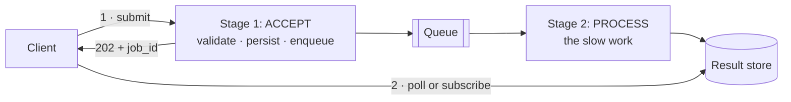
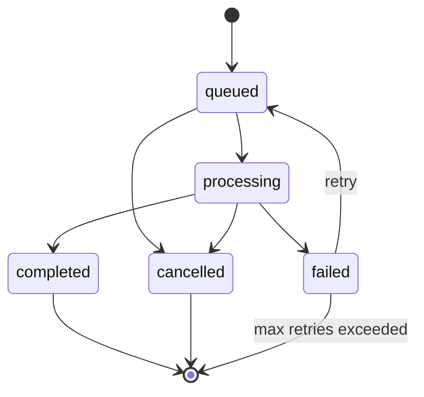

# 7.1.8 — The Two-Stage Processing Pattern

> **Part 7 · Patterns & Templates · Patterns · Chapter 8 of 10**
> Accept fast, process later. The pattern behind almost every `202 Accepted`.

---

## 🧒 ELI5 — Explain Like I'm 5

Someone hands you a huge pile of forms to process. Each takes ten minutes.

**The bad way:** they stand at your desk while you do it. Ten minutes of them waiting, doing nothing. And if twenty people arrive at once, nineteen queue in the corridor and most give up.

**The good way — two stages:**

**Stage 1 (fast, in front of them):** you take the form, **check it's actually filled in properly**, put it in a tray, and hand them **a ticket with a number**. *Three seconds.* They walk away happy.

**Stage 2 (slow, behind the scenes):** you work through the tray at your own pace. When a form is done, the ticket number shows "finished".

Look at what this buys you:

- **Twenty people can arrive at once.** They all get a ticket in a minute. The tray just gets deeper.
- **If you go for lunch, nothing is lost.** The tray is still there.
- **If a form goes wrong, you retry it** — nobody was waiting.
- **You can hire a second person** to empty the tray faster, without changing anything at the front desk.

And the one rule that makes it work: **stage 1 must check the form properly.** If you accept a form with the name missing, you've promised something you can't deliver — and the person has already gone home.

---

## The pattern



| Stage | Job | Latency | Must |
|---|---|---|---|
| **1 — Accept** | Validate, persist, enqueue, return an ID | ✅ Milliseconds | Be durable and idempotent |
| **2 — Process** | The actual work | Seconds to hours | Be idempotent and retryable |

**The contract:**
```http
POST /v1/exports
202 Accepted
Location: /v1/exports/exp_9f2
{ "export_id": "exp_9f2", "status": "queued", "poll_after_seconds": 5 }
```

---

## Why it's everywhere

| Benefit | Detail |
|---|---|
| **Fast response** | The user isn't blocked by slow work |
| **Absorbs spikes** | A 10× burst becomes queue depth, not errors |
| **Independent scaling** | Accept and process tiers scale separately |
| **Retries for free** | The broker redelivers on failure |
| **Resilience** | The processor can be down; work waits |
| **Backpressure signal** | Queue depth is an honest measure of overload |

☠️ **Without it, slow work on the request path exhausts your capacity.** A 30-second export at 100 requests/second means 3,000 concurrent requests held open — connections, threads, and memory — and everything else times out behind them.

---

## Stage 1: what "accept" must guarantee

You are making a **promise**. Once you return `202`, the work must eventually happen.

```python
def create_export(request, user):
    validate(request)                                  # 1. fail fast on bad input
    authorize(user, request.dataset)                   # 2. reject unauthorised NOW
    check_quota(user)                                  # 3. reject over-quota NOW

    job_id = new_id()
    with db.transaction():                             # 4. persist + enqueue atomically
        db.insert("jobs", id=job_id, user_id=user.id, status="queued",
                  params=request.params, created_at=now())
        db.insert("outbox", topic="exports", payload={"job_id": job_id})
    return Accepted(job_id)
```

| Requirement | Why |
|---|---|
| **Validate fully** | ☠️ You cannot report a validation error after the user has left |
| **Authorize** | Don't queue work the caller may not do |
| **Check quotas** | Rejecting at submission is much better than failing later |
| **Persist first** | The job must survive a crash between accept and enqueue |
| ✅ **Outbox, not a direct publish** | [Dual writes lose jobs silently](../../02-microservices-and-dataflow/02-asynchronous-communication/01-async-communication.md#the-dual-write-problem-and-the-only-good-fix) |
| **Idempotency key** | A client retry must not create two jobs |

🎯 **"Validate everything in stage 1" is the design rule** and the one most often violated. Every check you defer to stage 2 becomes an error the user discovers minutes later, through a status field, with no ability to correct it inline. **Fail fast, or don't accept.**

---

## The status model



```json
{
  "job_id": "exp_9f2",
  "status": "processing",
  "progress": { "current": 4200, "total": 10000, "percent": 42 },
  "created_at": "2026-08-31T10:00:00Z",
  "started_at": "2026-08-31T10:00:03Z",
  "estimated_completion": "2026-08-31T10:04:00Z",
  "result_url": null,
  "error": null,
  "attempts": 1
}
```

⚠️ **Progress and an estimate matter more than they seem.** "Processing" with no indication of progress is indistinguishable from "stuck", so users retry, cancel, or contact support. Even a rough percentage removes most of that.

---

## Telling the client it's done

| Mechanism | Latency | Cost | Use |
|---|---|---|---|
| **Polling** | Poll interval | High at scale | ✅ Simple; the default |
| **Long polling** | Near-instant | One connection per waiter | Better UX, same simplicity |
| **WebSocket / SSE** | Instant | Connection state | The client is already connected |
| **Webhook** | Instant | Needs retries and signing | Server-to-server |
| **Email / push** | Minutes | Low | Long jobs; the user has left |

🎯 **Tell the client how to poll:** returning `poll_after_seconds` (or `Retry-After`) prevents thousands of clients polling every 100 ms. **Add jitter and exponential backoff** — start at 1 s, back off to 30 s — or a fleet of clients created at the same moment will poll in lockstep forever.

---

## Stage 2: processing safely

```python
def process_export(msg):
    job = db.get_job(msg.job_id)
    if job.status in ("completed", "cancelled"):
        return                                        # ← idempotency: already done

    db.update_job(job.id, status="processing", started_at=now(), attempts=job.attempts+1)
    try:
        with heartbeat(msg, every=30):                # extend the visibility timeout
            key = f"exports/{job.id}.csv"             # ← DETERMINISTIC output key
            generate_export(job.params, to=key)       # a retry overwrites harmlessly
        db.update_job(job.id, status="completed", result_key=key, completed_at=now())
        notify(job.user_id, job.id)
    except TransientError:
        raise                                          # let the broker redeliver
    except PermanentError as e:
        db.update_job(job.id, status="failed", error=str(e))
        # ack the message — retrying will never help
```

| Requirement | Detail |
|---|---|
| **Idempotent** | Delivery is at-least-once; check status, use deterministic output keys |
| **Heartbeat long work** | Extend the visibility timeout rather than setting a huge static one |
| **Distinguish transient from permanent** | Retry the first; dead-letter the second immediately |
| **Bounded retries + DLQ** | A poison message must not loop forever |
| **Report failure to the user** | A silently failed job is worse than an error |

☠️ **The deterministic output key is the trick that makes retries free.** Writing to `exports/{job_id}.csv` means a retry overwrites the partial file. Writing to `exports/{uuid4()}.csv` leaves orphaned partial files and an ambiguous result.

---

## Variations

### Two-phase within a request
```
POST /orders → reserve inventory (fast) → 202
              → async: charge payment, confirm, notify
```
The user gets immediate confirmation that the *reservation* succeeded; the slow parts complete behind it. **Reserve the scarce resource synchronously; do everything else async.**

### Fan-out inside stage 2
```
Stage 1: accept a video upload → 202
Stage 2: split into segments → N parallel transcode jobs → fan-in → mark ready
```
See [Fan-Out/Fan-In](09-fan-out-fan-in.md).

### Staged validation
```
Stage 1: syntactic validation (schema, types, size)      → 202 or 400
Stage 2: semantic validation (referenced entities exist)  → status = "invalid"
```
⚠️ Only defer validation that genuinely *requires* expensive work. **If a check is cheap, do it in stage 1** where the user can act on it.

### Write-behind
```
Stage 1: accept the write, update the cache, return 200
Stage 2: persist to the database in batches
```
☠️ **Only for loss-tolerant data** (counters, telemetry). The user has been told it succeeded before it was durable.

---

## Capacity and queue management

```
Arrival rate     100 jobs/s
Processing time  5 s per job
Throughput/worker 0.2 jobs/s
Workers needed   500
+ headroom ×1.5  → 750

Burst: 10x for 60s adds 54,000 jobs.
Surplus drain at 750 workers (150/s capacity − 100/s arrivals = 50/s)
→ ~18 minutes to clear.
Is an 18-minute delay acceptable? If not: scale faster, or shed.
```

🎯 **That final question is the one that turns a queue from a magic box into an engineered component.** Always compute the recovery time after a burst, and state whether it's acceptable.

| Signal | Action |
|---|---|
| Queue depth stable near 0 | Healthy |
| Depth growing linearly | Scale workers (autoscale on depth) |
| **Oldest-message age rising** | ✅ **The alert that matters** — it's the user-visible delay |
| Depth growing, workers idle | Workers stuck or crashed — investigate them, not capacity |
| Depth beyond a hard limit | Reject new submissions with `503 Retry-After` |

⚠️ **Alert on message *age*, not depth.** A depth of a million is fine if you drain it in 30 seconds; a depth of ten is a problem if the oldest is two hours old.

---

## Priority and isolation

☠️ **One queue for everything means a bulk import starves interactive jobs.** A user waiting for a 3-second thumbnail sits behind a 6-hour backfill.

| Technique | Detail |
|---|---|
| **Separate queues per workload class** | ✅ Interactive, bulk, and scheduled never mix |
| **Weighted consumption** | Poll high-priority 9:1 against low |
| **Dedicated worker pools** | Guaranteed capacity per class |
| **Age-based promotion** | Prevents low-priority starvation entirely |

⚠️ **Strict priority starves low-priority work indefinitely** if high-priority arrivals never stop. Weighted consumption or age-based promotion is the fix.

---

## The client experience

| Practice | Why |
|---|---|
| Return a **stable, meaningful job ID** | The client can reference it in support requests |
| Provide **progress**, not just status | Prevents "is it stuck?" |
| Give an **estimated completion** | Even a rough one |
| Make it **cancellable** | Long jobs will be started by mistake |
| **Persist the result** with a documented lifetime | Not just a transient notification |
| Report **errors in detail** | The user must be able to fix and resubmit |
| Support **idempotency keys** | A double-click must not create two jobs |

🎯 **Cancellation is the most commonly omitted feature.** Users start expensive jobs by accident constantly. Without cancellation they contact support, and you burn compute on work nobody wants.

---

## ☠️ Failure modes

| Mistake | Consequence |
|---|---|
| Insufficient validation in stage 1 | Errors surface after the user has left |
| Publishing to the queue without an outbox | Accepted jobs silently vanish |
| Non-idempotent processing | Duplicate side effects on redelivery |
| Non-deterministic output keys | Orphaned partial results |
| No DLQ | A poison message blocks the queue forever |
| No visibility-timeout heartbeat | Long jobs are redelivered mid-processing |
| Silent failures | Users wait forever for a job that died |
| No progress reporting | Support tickets |
| One queue for all workloads | Interactive work starved by bulk |
| Alerting on depth, not age | Slow-drain incidents missed |
| No cancellation | Wasted compute, frustrated users |

---

## 📋 Chapter checklist

| Skill | Ready? |
|---|---|
| Draw the two stages and state each one's obligations | ☐ |
| List what stage 1 must guarantee, and why full validation is mandatory | ☐ |
| Explain why the outbox is required at accept time | ☐ |
| Design a status model with progress and estimates | ☐ |
| Compare five completion-notification mechanisms | ☐ |
| Write an idempotent stage-2 handler with deterministic output keys | ☐ |
| Explain heartbeat-extended visibility timeouts | ☐ |
| Size workers and compute burst recovery time | ☐ |
| Explain why to alert on message age | ☐ |
| Design priority isolation without starvation | ☐ |
| Name the seven client-experience practices | ☐ |

---

**← Previous** [7.1.7 Rate Limiting Patterns](07-rate-limiting-patterns.md)
**Next →** [7.1.9 Fan-Out/Fan-In Pattern](09-fan-out-fan-in.md)
