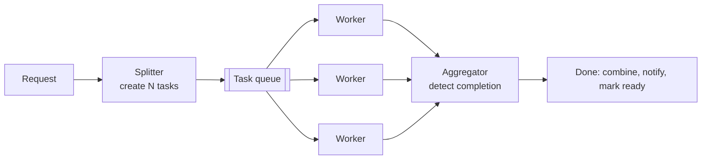

# 7.1.9 — Fan-Out / Fan-In Pattern

> **Part 7 · Patterns & Templates · Patterns · Chapter 9 of 10**
> Split one big job into many small ones, run them in parallel, then know when they're all done.

---

## 🧒 ELI5 — Explain Like I'm 5

You have to paint a hundred fence panels. Alone, that's a hundred hours.

So you get a hundred friends and give each of them **one panel**. An hour later, the fence is painted. **That's fan-out** — chop the job up and hand out the pieces.

Then the hard bit. Someone asks: *"is the fence finished?"*

You can't just look, because your friends are scattered around a very long fence. So you need a way to **know when the last one finishes**. **That's fan-in.**

The neat trick: put a **counter on the gate starting at 100**. Every friend, as they finish, crosses it out and writes one less. **Whoever writes the zero shouts "done!"** Nobody has to watch anybody; the last person to finish knows they're last.

And the questions that make this real:

- **What if a friend gives up halfway?** The counter never reaches zero, and you wait forever. So you need a **deadline** and a plan.
- **What if someone paints their panel twice?** The counter goes to −1 and nobody ever shouts. So the counting must be **safe against repeats**.
- **What if 95 panels are painted and 5 friends went home?** Is that "done"? **You have to decide in advance.**

---

## The pattern



| Phase | Job |
|---|---|
| **Split** | Divide the work into independent units; record the expected count |
| **Fan out** | Enqueue all units; workers consume in parallel |
| **Process** | Each unit independently and idempotently |
| **Fan in** | Detect that all units are complete |
| **Combine** | Merge results; emit the final outcome |

---

## Where it's used

| System | Fan-out | Fan-in |
|---|---|---|
| Video transcoding | One task per segment × rendition | Mark the video "ready" |
| MapReduce / Spark | Map tasks | Shuffle + reduce |
| Search across shards | Query every shard | Merge and rank |
| Price comparison | Call N vendor APIs | Combine, with a deadline |
| Bulk import | One task per chunk | Report the total result |
| Report generation | One task per section | Assemble the document |
| Timeline fan-out | One write per follower | (Usually no fan-in needed) |
| ML inference | Shard the batch | Concatenate |

⚠️ **Note the timeline row: not every fan-out needs a fan-in.** If the units are independent side effects with no combined result, you can skip completion detection entirely — which removes most of the difficulty. **Ask whether you actually need fan-in before building it.**

---

## Fan-in: the four mechanisms

### 1. Atomic counter (✅ the simplest)

```python
def split(job_id, items):
    redis.set(f"job:{job_id}:remaining", len(items))
    redis.set(f"job:{job_id}:total", len(items))
    for i, item in enumerate(items):
        queue.publish({"job_id": job_id, "index": i, "item": item})

def worker(task):
    result = process(task["item"])
    store_result(task["job_id"], task["index"], result)
    remaining = redis.decr(f"job:{task['job_id']}:remaining")
    if remaining == 0:
        finalize(task["job_id"])            # ← whoever hits zero finalises
```

| ✅ | ❌ |
|---|---|
| Trivial; O(1) | ☠️ **A duplicate decrement finalises early** |
| Atomic | A lost task means it never reaches zero |
| No polling | Counter loss = stuck job |

⚠️ **The duplicate problem is real:** at-least-once delivery means a worker may process the same task twice and decrement twice, so the counter reaches zero while a task is still outstanding. **Make the decrement conditional on first completion:**

```python
if redis.sadd(f"job:{job_id}:done", task_index):     # returns 1 only if newly added
    remaining = redis.decr(f"job:{job_id}:remaining")
```

🎯 That one line — decrement only when the index is newly recorded — makes the counter **idempotent**, and it's the detail that separates a working implementation from a subtly broken one.

### 2. Database rows (✅ the most robust)

```sql
CREATE TABLE job_tasks (
  job_id uuid, task_index int, status text, result jsonb,
  attempts int DEFAULT 0, updated_at timestamptz,
  PRIMARY KEY (job_id, task_index)
);

-- completion check
SELECT count(*) FILTER (WHERE status = 'done')  AS done,
       count(*) FILTER (WHERE status = 'failed') AS failed,
       count(*) AS total
FROM job_tasks WHERE job_id = $1;
```

| ✅ | ❌ |
|---|---|
| ✅ Naturally idempotent (upsert by primary key) | Requires polling, or a trigger |
| ✅ Full visibility — you can *see* what's stuck | More storage |
| Survives cache loss | Higher write cost |
| Supports partial-completion policies | |

🎯 **This is the pattern to recommend for anything important.** The counter approach is elegant but opaque: when a job is stuck you cannot see *which* task is missing. With rows, `SELECT * FROM job_tasks WHERE job_id = ? AND status != 'done'` answers it instantly — and that visibility is worth the extra cost.

### 3. Windowed stream aggregation
```sql
SELECT job_id, count(*) FROM task_results
GROUP BY job_id HAVING count(*) = expected_count(job_id)
```
Natural in Flink/Kafka Streams; needs a session or count window plus a timeout.

### 4. Workflow engine
```python
@workflow
async def transcode(video_id):
    segments = await split_video(video_id)
    results = await asyncio.gather(*[transcode_segment(s) for s in segments])
    await assemble(video_id, results)          # ← fan-in is just `await`
```
✅ **Temporal, Step Functions, and Airflow handle completion, retries, and timeouts for you.** If the orchestration is complex, this is far better than hand-rolling — and naming it as an option shows you know when not to build.

---

## Partial failure: the decision you must make

☠️ **99 tasks succeed, 1 fails permanently. Now what?**

| Policy | Behaviour | Use |
|---|---|---|
| **All-or-nothing** | Fail the whole job; discard results | Financial batches, transactional imports |
| **Best-effort** | Return what succeeded, list the failures | Search across shards, price comparison |
| **Threshold** | Succeed if ≥ X% completed | Analytics, recommendations |
| **Retry then degrade** | Retry N times, then continue without it | ✅ Most systems |

```json
{
  "status": "completed_with_errors",
  "succeeded": 99,
  "failed": 1,
  "failures": [{ "index": 42, "error": "source file corrupt" }],
  "result_url": "s3://..."
}
```

⚠️ **Decide this at design time and encode it in the API.** A client that receives "completed" cannot tell whether one task silently failed. **`completed_with_errors` is an honest status** and it prevents a whole class of downstream bugs.

---

## Deadlines: the mandatory safety valve

☠️ **Without a job-level deadline, one lost task hangs the job forever** — and the resources it holds are never released.

```python
def split(job_id, items, deadline_seconds=3600):
    db.insert("jobs", id=job_id, total=len(items), status="running",
              deadline=now() + deadline_seconds)
    ...

# A separate sweeper, running periodically
def sweep_expired():
    for job in db.query("SELECT * FROM jobs WHERE status='running' AND deadline < now()"):
        done = db.count_done(job.id)
        if done >= job.total * job.threshold:
            finalize_partial(job.id)          # good enough
        else:
            fail_job(job.id, reason="deadline exceeded")
        release_resources(job.id)
```

| Level | Purpose |
|---|---|
| **Per task** | Visibility timeout; redeliver if a worker dies |
| **Per attempt** | Bound a single execution |
| **Per job** | ✅ The overall safety valve |
| **Sweeper** | Finds and resolves jobs nobody is watching |

🎯 **The sweeper is the part people forget.** Deadlines only work if something *checks* them. A `deadline` column with no process reading it is decoration.

---

## Choosing the fan-out granularity

$$\text{total time} \approx \frac{\text{work}}{\text{parallelism}} + \text{overhead} \times \text{tasks}$$

| Granularity | Problem |
|---|---|
| **Too coarse** (10 tasks for 1,000 items) | Poor parallelism; a straggler dominates |
| **Too fine** (10,000 tasks of 10 ms each) | ☠️ Per-task overhead exceeds the work |

🔢 **Target 10 seconds to 5 minutes per task**: long enough that queueing, startup, and bookkeeping overhead (typically 10–100 ms) is negligible, short enough that a retry is cheap and progress is visible.

**Also cap the fan-out.** A job that would create 1,000,000 tasks should chunk into 10,000 tasks of 100 items each — otherwise the queue, the counter, and the tracking table all become the bottleneck instead of the work.

---

## Stragglers

☠️ **The job is only as fast as its slowest task.** 999 tasks finish in 10 seconds and one takes 4 hours — the job takes 4 hours.

| Cause | Fix |
|---|---|
| **Data skew** (one chunk far larger) | Split by *size*, not by count |
| Slow hardware | ✅ **Speculative execution** — run a duplicate elsewhere, take the first |
| A dependency timing out | Per-task timeouts + retry on a different worker |
| Unbounded per-task work | Cap it; split further |

🎯 **Speculative execution is the batch equivalent of [hedged requests](../../01-introduction/03-non-functional-requirements/06-latency.md#the-techniques-to-reduce-latency):** when a task is significantly slower than its peers, launch a duplicate and take whichever finishes first. Spark, MapReduce, and Flink all do this. **It requires the task to be idempotent** — which it must be anyway.

---

## Nested fan-out

```
Video (1 job)
 └─ 5 renditions (fan-out)
     └─ 30 segments each (fan-out) = 150 tasks
         └─ fan-in per rendition
     └─ fan-in across renditions → video ready
```

⚠️ **Nesting multiplies task counts and makes completion tracking hierarchical.** Track completion at each level: a rendition is complete when its 30 segments are; the video is complete when its 5 renditions are.

**This is where a workflow engine earns its keep** — hand-rolling nested counters with deadlines, retries, and partial-failure policies at two levels is a lot of subtle code.

---

## Ordering the results

Workers finish out of order. If the output must be ordered:

| Approach | How |
|---|---|
| **Index the results** | Store `(job_id, index) → result`; sort at assembly |
| **Deterministic output keys** | `output/{job_id}/{index:06d}.part` — sorts naturally |
| **Sequence the assembly** | The aggregator reads parts in index order |

☠️ **Never rely on completion order.** Retries, worker speed, and queue behaviour make it arbitrary — and it will *usually* be right in testing and wrong in production.

---

## Monitoring

```
fanout_tasks_created_total{job_type}
fanout_tasks_completed_total{job_type, outcome}
fanout_job_duration_seconds{job_type}
fanout_job_straggler_ratio          # slowest task ÷ median task
fanout_jobs_stuck                   # ← past deadline, not finalised
fanout_partial_completions_total
```

⚠️ **The straggler ratio is the most diagnostic metric.** A ratio near 1 means healthy parallelism; a ratio of 50 means one task dominates every job, and fixing that single skew is worth more than any amount of extra workers.

---

## ☠️ Failure modes

| Mistake | Consequence |
|---|---|
| Non-idempotent counter decrements | Early finalisation while tasks are outstanding |
| No job-level deadline | One lost task hangs the job forever |
| A deadline with no sweeper | The deadline is decoration |
| No partial-failure policy | Ambiguous "completed" status |
| Too-fine granularity | Overhead exceeds the work |
| Too-coarse granularity | Poor parallelism; stragglers dominate |
| Unbounded fan-out | The tracking layer becomes the bottleneck |
| Relying on completion order | Non-deterministic assembly |
| No straggler handling | p99 job time dominated by one slow task |
| Counter in a non-durable store | Cache eviction loses the job |

---

## 📋 Chapter checklist

| Skill | Ready? |
|---|---|
| Draw the five phases | ☐ |
| Say when fan-in isn't needed at all | ☐ |
| Compare four fan-in mechanisms | ☐ |
| Make a counter decrement idempotent | ☐ |
| Argue for the database-rows approach on visibility grounds | ☐ |
| Choose a partial-failure policy and encode it in the API | ☐ |
| Design deadlines at three levels plus a sweeper | ☐ |
| Choose task granularity with the 10 s – 5 min guideline | ☐ |
| Explain speculative execution and its idempotency requirement | ☐ |
| Handle nested fan-out and say when to use a workflow engine | ☐ |
| Explain the straggler ratio metric | ☐ |

---

**← Previous** [7.1.8 Two-Stage Processing](08-two-stage-processing.md)
**Next →** [7.1.10 Saga Pattern](10-saga-pattern.md)
