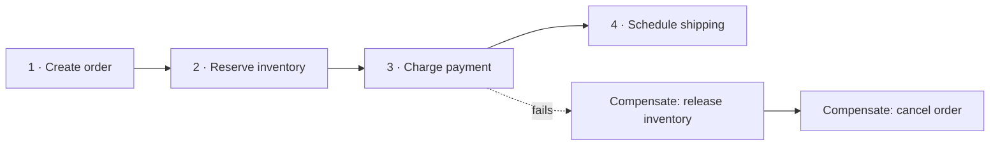
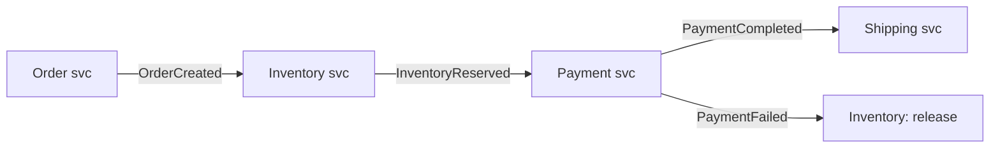

# 7.1.10 — Saga Pattern

> **Part 7 · Patterns & Templates · Patterns · Chapter 10 of 10**
> Multi-step business transactions across services, without distributed transactions.

---

## 🧒 ELI5 — Explain Like I'm 5

Booking a holiday needs three things: a **flight**, a **hotel**, and a **hire car**. Three different companies.

In one shop you could say *"all three or none"* and mean it. Across three companies **there is no such button.** You have to book them one at a time.

So: flight ✅. Hotel ✅. Car ❌ — **none available.**

You now have a flight and a hotel you don't want. What do you do?

**You undo the earlier steps, one at a time, in reverse:** cancel the hotel, cancel the flight.

That's a saga: **a chain of steps, each with a matching "undo".** If step 3 fails, run undo-2 and undo-1.

The important, slightly uncomfortable part: **undoing is not the same as it never happening.**

- The hotel might keep a cancellation fee.
- The airline may already have emailed you a confirmation. You can't unsend an email — you can only send an apology.
- And for a few minutes, **the world genuinely believed you had a hotel booking.** Anyone looking in that moment saw it.

That's the trade. You get to work across companies; you give up the illusion that everything happens at once.

---

## The pattern



> **A saga is a sequence of local transactions. Each has a compensating transaction that semantically undoes it. If step N fails, run compensations for N−1 … 1.**

| Property | Detail |
|---|---|
| Each step is **locally atomic** | A normal database transaction within one service |
| Each step is **committed immediately** | ⚠️ Visible to everyone before the saga finishes |
| **No global rollback** | Only forward compensation |
| Consistency is **eventual** | The system passes through inconsistent states |

☠️ **The defining property: intermediate states are visible.** Between step 2 and step 3, inventory *is* reserved and payment *is not* taken. Any query in that window sees it. **This is not a bug to design away — it is the trade you accepted**, and the system must be correct in those states.

---

## Why not two-phase commit?

| | 2PC | Saga |
|---|---|---|
| Atomicity | ✅ True atomicity | ❌ Eventual consistency |
| Isolation | ✅ Yes | ❌ **None** — intermediate states are visible |
| Locks | ❌ Held across the whole transaction | ✅ Released per step |
| Availability | ❌ **The coordinator is a SPOF; blocking on failure** | ✅ Each step independent |
| Latency | ❌ Two round trips × N participants | ✅ Per step |
| Cross-technology | ❌ Needs XA support everywhere | ✅ Any service |
| Long-running | ❌ Impossible | ✅ Hours or days |

☠️ **2PC's fatal flaw:** if the coordinator dies after "prepare" and before "commit", **every participant holds locks and waits — indefinitely**. Rows are locked, and no participant can decide alone. In a microservice architecture that means a coordinator crash freezes multiple services.

⚖️ **Sagas trade isolation for availability.** That is almost always the right trade across service boundaries — and stating it that way is the answer to "why not just use a distributed transaction?"

---

## Choreography vs orchestration

### Choreography — services react to events



| ✅ | ❌ |
|---|---|
| No central component | ☠️ **The flow exists nowhere** — you must read every service to understand it |
| Loose coupling | Hard to debug: "where did order 88 stop?" |
| Easy to add a participant | Cyclic dependencies creep in |
| Naturally resilient | Compensation logic scattered across services |

### Orchestration — a coordinator drives

```python
class OrderSaga:
    steps = [
        Step(create_order,       compensate=cancel_order),
        Step(reserve_inventory,  compensate=release_inventory),
        Step(charge_payment,     compensate=refund_payment),
        Step(schedule_shipping,  compensate=cancel_shipping),
    ]

    def execute(self, ctx):
        completed = []
        for step in self.steps:
            try:
                step.run(ctx)
                completed.append(step)
                self.persist_state(ctx, completed)     # ← durable after EVERY step
            except Exception as e:
                self.compensate(reversed(completed), ctx)
                raise SagaFailed(step.name, e)
```

| ✅ | ❌ |
|---|---|
| ✅ The flow is **explicit and in one place** | A central component to build and run |
| ✅ Easy to debug, monitor, and visualise | Slightly more coupling |
| Compensation logic lives together | Can drift toward a god service |
| Straightforward to add timeouts and retries | |

🎯 **Recommend orchestration for anything with more than three steps.** The debuggability argument is decisive: when an order is stuck, an orchestrator tells you *exactly* which step it is on and why. With choreography you reconstruct the flow from logs across five services. **Choreography suits simple two-or-three-step flows; orchestration suits real business processes.**

⚠️ **The orchestrator must not become a god service.** It coordinates and holds saga state; the *business logic* stays inside each participant.

---

## Compensating transactions

| Original | Compensation | Note |
|---|---|---|
| Create order | Cancel order (status change) | ✅ Clean |
| Reserve inventory | Release reservation | ✅ Clean |
| Charge card | Refund | ⚠️ Visible on the customer's statement |
| Send email | ❌ **Impossible** | Send a correction |
| Ship a package | Recall / return | Expensive and slow |
| Delete data | ❌ Impossible if hard-deleted | ✅ Use soft deletes |
| Publish an event others acted on | Publish a reversal | They must handle it |

☠️ **Not everything can be compensated**, and this drives the design:

🎯 **Order the steps so that irreversible actions come last.** Reserve inventory (reversible) → charge payment (refundable) → **send the confirmation email (irreversible) last**. Then a failure never leaves you having done something you cannot undo. **This single principle removes most saga pain**, and it's the first thing to say.

**Design rules for compensations:**

| Rule | Why |
|---|---|
| **Idempotent** | Compensation may be retried |
| **Commutative where possible** | Order of compensations shouldn't matter |
| **Must eventually succeed** | ☠️ A failed compensation leaves permanent inconsistency — retry forever, then alert a human |
| **Semantic, not literal** | "Refund", not "un-charge". The record of both remains |
| **Auditable** | The compensation is itself a business event |

---

## Isolation: the missing property

Sagas have **no isolation**. Other transactions see intermediate states, which permits real anomalies:

| Anomaly | Example |
|---|---|
| **Dirty read** | Another process reads the reserved inventory before the saga fails and releases it |
| **Lost update** | Two sagas modify the same entity concurrently |
| **Fuzzy read** | A value read early in the saga changes before it's used later |

**Countermeasures** (from Garcia-Molina's original work, and still the standard toolkit):

| Countermeasure | How |
|---|---|
| **Semantic lock** | Mark the entity `PENDING`; other operations refuse or queue |
| **Commutative updates** | `balance += x` rather than `balance = y` — order-independent |
| **Pessimistic ordering** | Put the step that could cause a dirty read last |
| **Re-read value** | Verify a value hasn't changed before acting on it |
| **By-value dispatch** | Route low-risk requests through a saga and high-risk ones through a real transaction |

🎯 **The semantic lock is the most practical and worth naming:** an order in `PENDING_PAYMENT` is visible but explicitly marked as not-yet-final, so other parts of the system know not to treat it as confirmed. **You cannot hide the intermediate state, so make it explicit and meaningful instead.**

---

## Making sagas durable

```sql
CREATE TABLE saga_instances (
  saga_id uuid PRIMARY KEY,
  saga_type text,
  state text,                       -- running | compensating | completed | failed
  current_step int,
  context jsonb,                    -- accumulated data
  completed_steps jsonb,            -- for compensation
  created_at timestamptz, updated_at timestamptz,
  deadline timestamptz
);
```

| Requirement | Why |
|---|---|
| **Persist after every step** | ☠️ A crash mid-saga must be recoverable |
| **Idempotent steps** | Recovery may re-execute the last step |
| **A recovery process** | Find running sagas with no recent progress and resume them |
| **Deadlines** | A saga stuck on an unavailable service must not hang forever |
| **Correlation IDs** | Trace a saga across every service |

☠️ **A saga whose state lives only in memory is lost on restart** — leaving inventory reserved, payment taken, and nothing to finish or undo it. **Durable state after every step is non-negotiable**, and it's the most common implementation mistake.

**A recovery sweeper is mandatory:**
```sql
SELECT * FROM saga_instances
WHERE state IN ('running','compensating') AND updated_at < now() - INTERVAL '5 minutes';
-- → resume, or compensate, or escalate
```

---

## Workflow engines

Hand-rolling durable state, retries, timeouts, and compensation is a lot of subtle code. Engines exist:

| Engine | Model |
|---|---|
| **Temporal / Cadence** | ✅ Durable execution — write ordinary code; state is checkpointed automatically |
| **AWS Step Functions** | State machines as JSON |
| **Camunda / Zeebe** | BPMN workflows |
| **Netflix Conductor** | JSON-defined workflows |

```python
@workflow.defn
class OrderWorkflow:
    @workflow.run
    async def run(self, order):
        try:
            await workflow.execute_activity(reserve_inventory, order, ...)
            await workflow.execute_activity(charge_payment, order, ...)
            await workflow.execute_activity(ship_order, order, ...)
        except ActivityError:
            await workflow.execute_activity(release_inventory, order, ...)
            raise
```

🎯 **Temporal's model is worth naming specifically:** the workflow function's *execution state* — including local variables and where it is in the code — is durably checkpointed, so a process crash resumes exactly where it stopped. That removes the entire category of "persist state after every step" code, which is where most hand-rolled sagas have bugs.

⚖️ **Cost:** another system to operate, and a programming model with real constraints (workflow code must be deterministic and replayable). **Worth it once you have more than a couple of non-trivial sagas.**

---

## Worked example: e-commerce checkout

```
STEPS
  1. Create order (status = PENDING)            → cancel order
  2. Reserve inventory (with a 15-min expiry)   → release reservation
  3. Charge payment                             → refund
  4. Confirm order (status = CONFIRMED)         → (nothing — the last reversible step)
  5. Send confirmation email                    → ⚠️ irreversible; deliberately LAST
  6. Schedule fulfilment                        → cancel fulfilment
```

| Decision | Reason |
|---|---|
| Inventory **before** payment | Releasing a reservation is far cleaner than refunding a card |
| The reservation **expires** | ✅ A crashed saga self-heals — inventory is released automatically |
| Email **after** confirmation | Never tell the customer something you might undo |
| Fulfilment **after** email | Cancellable, and the customer is already informed |
| Order status is **visible and explicit** | `PENDING` is the semantic lock |

🎯 **The self-expiring reservation is the elegant part.** Even if the saga dies completely and the sweeper fails, inventory returns automatically after 15 minutes. **Building expiry into the reservation makes the compensation optional rather than mandatory** — a genuinely good design instinct and an excellent detail to raise.

---

## When *not* to use a saga

| Situation | Better |
|---|---|
| All steps in one service | ✅ A local ACID transaction |
| ✅ **The steps can be reordered so only the last can fail** | No saga needed at all |
| Strict isolation is required | Keep it in one database |
| Two steps only, second is retryable-forever | Outbox + async retry |
| Nothing needs undoing | Just an event chain |

⚠️ **Many "we need a saga" situations dissolve under the reordering question.** If you can arrange the steps so every step before the last is reversible-by-expiry and the last is idempotently retryable, you have the benefits without the compensation machinery. **Ask that question first.**

---

## ☠️ Failure modes

| Mistake | Consequence |
|---|---|
| Saga state only in memory | Lost on restart; permanent inconsistency |
| Non-idempotent steps or compensations | Duplicate charges or double refunds |
| Compensation that can itself fail permanently | Stuck in an inconsistent state |
| Irreversible action early in the sequence | Cannot compensate |
| No deadline or sweeper | Sagas hang indefinitely |
| Ignoring the lack of isolation | Dirty reads; concurrent sagas conflict |
| Choreography for a complex flow | Nobody can explain what happens |
| No correlation ID | Untraceable across services |
| Compensating a compensation | Infinite loop; compensations must be terminal |
| No alerting on stuck sagas | Silent business failures |

---

## 📋 Chapter checklist

| Skill | Ready? |
|---|---|
| Define a saga and its compensations | ☐ |
| Explain 2PC's blocking failure and why sagas trade isolation for availability | ☐ |
| Compare choreography and orchestration; recommend one with a reason | ☐ |
| Give the ordering principle: irreversible actions last | ☐ |
| State the five rules for compensating transactions | ☐ |
| Name three isolation anomalies and the semantic-lock countermeasure | ☐ |
| Design durable saga state with a recovery sweeper | ☐ |
| Explain Temporal's durable-execution model and its cost | ☐ |
| Walk the checkout example and justify each ordering decision | ☐ |
| Explain the self-expiring reservation trick | ☐ |
| Ask the reordering question before proposing a saga | ☐ |

---

**← Previous** [7.1.9 Fan-Out/Fan-In](09-fan-out-fan-in.md)
**Next →** [7.2.1 Design Template](../02-template/01-design-template.md)
