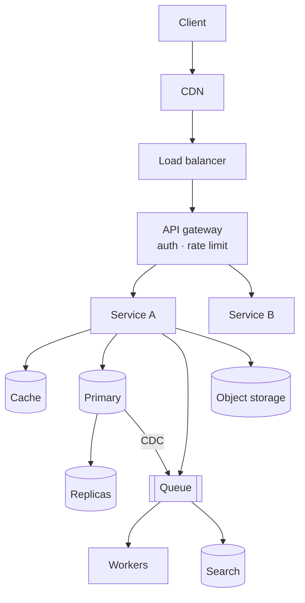

# 7.2.1 — The Design Template

> **Part 7 · Patterns & Templates · Template · Chapter 1 of 2**
> One page. Print it, learn it, and never freeze in an interview again.

---

## 🧒 ELI5 — Explain Like I'm 5

You've learned every ingredient in the kitchen. **This is the recipe card** that tells you what order to use them in.

Six steps, always the same, always in this order:

1. **Ask what they want.** *(Requirements.)*
2. **Work out how big it is.** *(Estimation.)*
3. **Write the menu.** *(API.)*
4. **Draw the kitchen.** *(Architecture.)*
5. **Zoom in on the hard bit.** *(Deep dive.)*
6. **Say what could go wrong and what you'd do next.** *(Wrap-up.)*

You don't have to be clever under pressure if you have the card. **You just follow it.**

---

## The one-page card

```
┌────────────────────────────────────────────────────────────────────────┐
│ 1 · REQUIREMENTS                                          5-8 min      │
│   □ 3-5 clarifying questions (ones that CHANGE the design)             │
│   □ Functional requirements: 3-5 user-facing verbs                     │
│   □ OUT OF SCOPE, stated explicitly                                    │
│   □ Non-functional requirements WITH NUMBERS                           │
│       scale · latency (p99) · availability (%) · consistency · cost    │
│   □ Repeat the scope back for confirmation                             │
├────────────────────────────────────────────────────────────────────────┤
│ 2 · ESTIMATION                                            3-5 min      │
│   □ QPS: daily ÷ 100,000, then × peak factor (2-5x)                    │
│   □ Reads vs writes SEPARATELY — state the ratio                       │
│   □ Storage/year: size × count × retention × RF(3) × indexes(1.5)      │
│   □ Bandwidth: egress is what you pay for                              │
│   □ "SO WHAT" — the decision each number forces                        │
├────────────────────────────────────────────────────────────────────────┤
│ 3 · API                                                   3-5 min      │
│   □ 3-5 endpoints, request AND response shapes                         │
│   □ Cursor pagination · auth · idempotency key on unsafe writes        │
│   □ 202 Accepted for anything slow                                     │
│   □ Read it back: what does this imply for storage?                    │
├────────────────────────────────────────────────────────────────────────┤
│ 4 · HIGH-LEVEL DESIGN                                     10-12 min    │
│   □ Draw: client → edge → services → storage → async (in that order)   │
│   □ Data model + partition key, said out loud                          │
│   □ NARRATE one full request path end to end                           │
│   □ Justify each box: what problem does it solve?                      │
├────────────────────────────────────────────────────────────────────────┤
│ 5 · DEEP DIVE                                             10-15 min    │
│   □ Offer two, let them choose                                         │
│   □ Mechanism · scale numbers · failure modes · idempotency ·          │
│     backpressure · monitoring                                          │
├────────────────────────────────────────────────────────────────────────┤
│ 6 · WRAP-UP                                               3-5 min      │
│   □ Bottleneck at 10x                                                  │
│   □ What I traded away, deliberately                                   │
│   □ SPOF walk of the diagram                                           │
│   □ What I'd do with more time                                         │
└────────────────────────────────────────────────────────────────────────┘
```

---

## Phase 1 — Requirements

**Questions that change the design** (pick 3–5):

| Question | What it decides |
|---|---|
| "How many users, and what growth?" | Every number downstream |
| "Read-heavy or write-heavy?" | Caching, replicas, sharding |
| "How fresh must the data be?" | Sync/async, consistency model |
| "Global or single region?" | Geo-replication, CDN, residency |
| "What's the cost of an hour of downtime?" | The availability target |
| "Mobile clients?" | Push vs poll, payload size, offline |

**Write NFRs as numbers:**
```
NFR1 Scale        100M DAU · 5k writes/s · 150k reads/s peak
NFR2 Latency      p99 < 200 ms read, < 500 ms write
NFR3 Availability 99.95% read path (≈22 min/month), 99.9% write
                  RTO 5 min · RPO 60 s
NFR4 Consistency  read-your-writes for the author; ≤30 s for others
NFR5 Durability   no acknowledged write may be lost
NFR6 Cost         < $0.20 per million requests
```

🎯 **Per-feature NFRs are the senior move.** Different data deserves different guarantees — say so explicitly and the rest of the interview has a criterion to argue against.

---

## Phase 2 — Estimation

```
QPS       = daily events ÷ 100,000        (86,400 ≈ 10^5)
Peak      = average × 2-5
Storage   = bytes × events/day × 365 × retention × 3 (RF) × 1.5 (indexes)
Bandwidth = QPS × payload  →  egress cost at ~$0.05/GB
Cache     = hot set (top ~20%) × entry size × 1.3
Servers   = peak QPS ÷ per-node capacity ÷ 0.66 (N-1) × 1.5 (growth)
```

| Reference | Value |
|---|---|
| 1M/day | ≈ 12 QPS |
| 1B/day | ≈ 12,000 QPS |
| Same-DC RTT | 0.5 ms |
| Cross-continent RTT | 150 ms |
| SSD random read | 100 μs |
| Disk seek | 10 ms |
| Postgres indexed read | 10–30k QPS/node |
| Postgres durable write | 5–20k QPS/node |
| Redis | 100k+ ops/s/node |
| API node, one DB query | 2–10k QPS |
| Object storage | $0.023/GB-month |
| Cloud egress | $0.05–0.09/GB |

⚠️ **Always end with the "so what":** *"3 PB/year means object storage with tiering, not a database — and 500 GB/s of egress makes a CDN mandatory, not optional."*

---

## Phase 3 — API

```http
POST /v1/resources                 Idempotency-Key: <uuid>
  { field: ... }
  201 { id, status, created_at }

GET  /v1/resources/{id}
  200 { id, ..., links: {...} }

GET  /v1/resources?filter=x&limit=20&cursor=<opaque>
  200 { items: [...], next_cursor, has_more }

POST /v1/exports                   ← slow work
  202 { job_id, status: "queued" }
  Location: /v1/exports/{job_id}
```

**The checklist:** nouns not verbs · correct methods · cursor pagination · auth named · idempotency on unsafe retryable writes · `202` for slow work · one error envelope · rate limits mentioned.

---

## Phase 4 — High-level design

**Draw in this order** (client first, storage last, async below):



**Then narrate one request:**
> "A read hits the CDN. On miss, the LB routes to the gateway, which validates the token and applies rate limits. The service checks Redis for `entity:{id}` — a hit returns in ~5 ms. On a miss it reads a replica, populates the cache with a 5-minute jittered TTL, and returns. Writes go to the primary and delete the cache key, and an outbox row is committed in the same transaction so CDC can update search."

⚠️ **Narrating the path is what turns a picture into a design.** Candidates who draw boxes and stop are scored much lower than those who walk a request through them.

**Say the data model and the partition key out loud:**
```
entities(id PK, owner_id, status, created_at, ...)
  partitioned by hash(id) — all reads are by ID, so this spreads evenly
  secondary index on (owner_id, created_at) for the listing endpoint
```

---

## Phase 5 — Deep dive

**Offer two and let them choose** — it shows you know which parts are hard.

**Cover this checklist for whatever you pick:**

| Element | Say |
|---|---|
| **Mechanism** | Exactly how it works, step by step |
| **Numbers** | Throughput, state size, latency |
| **Concurrency** | How it parallelises; the ordering guarantee |
| **Idempotency** | How a retry is made safe |
| **Failure modes** | What breaks and what happens then |
| **Backpressure** | Behaviour when overloaded |
| **Monitoring** | The metrics and the alert conditions |

**Topics that are almost always available:**
hot keys · cache stampede · rate limiting · unique IDs · exactly-once · sharding key choice · fan-out/celebrity · replication lag · idempotency · multi-region failover.

---

## Phase 6 — Wrap-up

```
1. BOTTLENECK AT 10x
   "The write path on the primary. I'd shard by owner_id next."

2. WHAT I TRADED AWAY
   "View counts are up to 60 s stale — deliberate, to keep writes cheap.
    If the product needs exact real-time counts, that's a different design."

3. SPOF WALK
   "Let me walk the diagram: LB is managed and multi-AZ; the primary has
    automated failover with a 60 s RPO; a total cache loss would put 20x load
    on the database, so local caches, request coalescing, and load shedding."

4. WITH MORE TIME
   "Multi-region read replicas, the abuse/moderation path, and cost
    modelling for the CDN egress."
```

🎯 **The SPOF walk is the strongest closing move available.** It takes 60 seconds, it's completely mechanical, and it demonstrates exactly the systems thinking interviewers are trying to detect.

---

## Phrases that buy time and score points

| Situation | Say |
|---|---|
| Starting | *"Let me state my assumptions so you can correct me early."* |
| Choosing | *"Two reasonable options — A and B. I'll take A because [constraint], and here's the cost."* |
| Stuck | *"Let me come back to that — I want the skeleton on the board first."* |
| Corrected | *"You're right, that breaks my consistency assumption. Here's the fix."* |
| Deep dive | *"The two interesting parts are X and Y — which would you rather I dig into?"* |
| Any technology | *"...because [property], and the cost is [trade-off]."* |

---

## The scoring rubric (what they're actually marking)

| Dimension | Weak | Strong |
|---|---|---|
| Requirements | Started designing immediately | Scoped, quantified, confirmed, out-of-scope stated |
| Estimation | Skipped or unused | Fast, rounded, **used to drive a decision** |
| Structure | Wandered; needed prompting | Drove the session through clear phases |
| Breadth | Missing major components | Complete, nothing important absent |
| Depth | Fell apart on the second "why?" | Survived three levels of why |
| Trade-offs | Asserted choices | Named alternatives and costs |
| Failure handling | Not mentioned | Failure modes, degradation, recovery |
| Communication | Interviewer confused | Never had to ask what you meant |

---

## The anti-patterns

| Don't | Do |
|---|---|
| Start drawing before scoping | Requirements first, always |
| Name technologies without reasons | *"X because Y, and it costs Z"* |
| Design for 1B users when asked for 1M | Design for the stated scale |
| Go deep before the skeleton exists | Breadth, then depth |
| Ignore a repeated interviewer hint | That's a rescue — follow it |
| Defend a design they've broken | Adapt; it's a graded dimension |
| Run out of time mid-sentence | Watch the clock; wrap up at minute 40 |
| Skip failure handling | It's often the highest-weighted section |

---

## The 30-second self-check

Before you say you're finished:

```
□ Did I quantify the requirements?
□ Did my estimate change a decision?
□ Did I narrate a full request path?
□ Did I justify every box?
□ Did I say what each choice costs?
□ Did I cover failure and degradation?
□ Did I walk for single points of failure?
□ Did I say what I'd do next?
```

---

## 📋 Chapter checklist

| Skill | Ready? |
|---|---|
| Recite all six phases with times, from memory | ☐ |
| Have five design-changing clarifying questions ready | ☐ |
| Write NFRs as numbers, per feature | ☐ |
| Do the full estimation sequence in 3 minutes | ☐ |
| Produce the API checklist | ☐ |
| Draw and **narrate** an architecture | ☐ |
| Run the seven-point deep-dive checklist | ☐ |
| Deliver the four-part wrap-up including the SPOF walk | ☐ |
| Know the eight rubric dimensions | ☐ |

---

**← Previous** [7.1.10 Saga Pattern](../01-patterns/10-saga-pattern.md)
**Next →** [7.2.2 Template Application: Social Media Comment System](02-template-application-comments.md)
