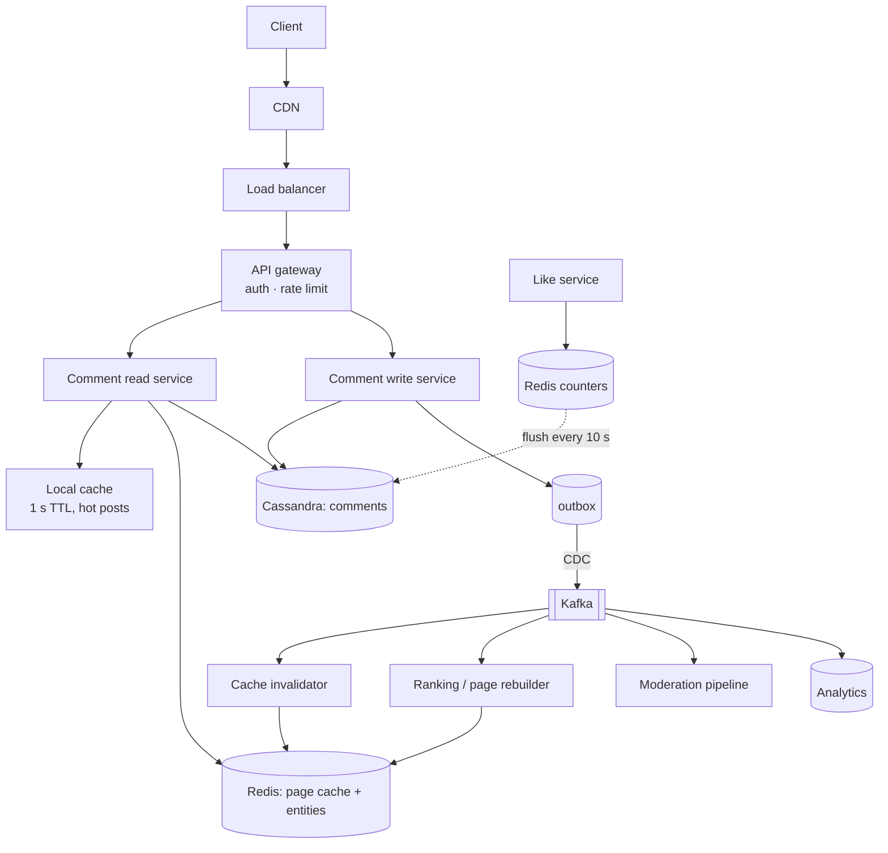

# 7.2.2 — Template Application: A Social Media Comment System

> **Part 7 · Patterns & Templates · Template · Chapter 2 of 2**
> The whole book, applied end to end, in one 45-minute answer.

---

## 🧒 ELI5 — Explain Like I'm 5

This is the **worked example** — the one where we actually cook the dish, following the recipe card, start to finish.

The task: **build the comments under a post.** Sounds simple. It isn't, and the reasons are interesting:

- **Almost everyone reads; almost nobody writes.** So we should do the hard work *when someone comments*, not every time someone looks.
- **Comments have replies, which have replies.** Drawing that tree is easy for five comments and horrible for fifty thousand.
- **One post can go viral.** A million people load the same comments in ten minutes. That one post breaks everything designed for the average post.
- **Someone will write something awful**, and it has to disappear quickly — including from every place we copied it to.

Watch how each of those becomes a specific design decision. **That's what an interview is measuring.**

---

## Phase 1 — Requirements (6 min)

**Clarifying questions asked:**
1. *Threaded replies, or flat?* → Threaded, but capped at 2 levels (like Instagram, not Reddit).
2. *Read-heavy?* → Yes, roughly 100:1.
3. *Ordering?* → Default "top" (by score), with a "newest" option.
4. *Real-time updates while viewing?* → Nice to have, not required. Polling is acceptable.
5. *Editing?* → Yes, within 15 minutes.

```
FUNCTIONAL
  FR1  Post a comment on a post, or a reply to a comment (max depth 2)
  FR2  Read a post's comments, paginated, sorted by top or newest
  FR3  Like a comment
  FR4  Edit (15 min window) and delete own comments
  FR5  Moderation: remove a comment; it disappears everywhere

OUT OF SCOPE (confirmed)
  notifications, mentions, media in comments, ranking ML, spam detection

NON-FUNCTIONAL
  NFR1  Scale        500M DAU · 200M comments/day · 20B comment-reads/day
  NFR2  Latency      p99 < 150 ms to load the first page of comments
                     p99 < 300 ms to post
  NFR3  Availability 99.99% read path · 99.9% write path
  NFR4  Consistency  author sees their own comment immediately;
                     others within 5 s; like counts ≤30 s stale
  NFR5  Moderation   a removed comment invisible everywhere within 10 s
  NFR6  Durability   no acknowledged comment may be lost
```

🎯 **NFR4 and NFR5 are the two that shape everything.** NFR4 says the read path can be cached aggressively *except* for the author. NFR5 says caches must be invalidated fast — which rules out a long TTL as the only mechanism.

---

## Phase 2 — Estimation (4 min)

```
WRITES
  Comments      200M/day  = 2,300/s avg  → ~7,000/s peak
  Likes         2B/day    = 23,000/s avg → ~70,000/s peak   ← 10x the comments

READS
  Comment loads 20B/day   = 230,000/s avg → ~700,000/s peak
  READ:WRITE ≈ 100:1 on comments

STORAGE
  Comment row   ~500 B (id, post_id, parent_id, author_id, text≤2000, ts, counts)
  Per day       200M × 500 B = 100 GB/day
  Per year      36 TB → 110 TB with RF=3 → ~160 TB with indexes
  Likes         2B/day × 50 B = 100 GB/day  → do NOT store one row per like forever

CACHE
  Hot posts: ~1% of posts get ~50% of reads.
  10M active posts × 1% = 100k hot posts × 20 KB (first page) = 2 GB
  Plus comment entities: ~50M hot comments × 500 B = 25 GB
  → ~30 GB of Redis. Trivial.

BANDWIDTH
  700k reads/s × 20 KB = 14 GB/s egress
  → ~$60k/day at direct cloud egress. CDN + aggressive caching is mandatory.
```

**So what:**
1. **700k QPS reads** — no database serves this. The read path must be cache-first.
2. **160 TB/year** — sharded storage; a single Postgres is out.
3. **70k likes/s** — do not write a row per like synchronously; batch or use write-behind.
4. **14 GB/s egress** — cache at the edge, and keep payloads small.
5. **100:1 ratio** — precompute the read shape; writes can afford to be expensive.

---

## Phase 3 — API (4 min)

```http
POST /v1/posts/{post_id}/comments        Idempotency-Key: <uuid>
  { "text": "...", "parent_comment_id": null }
  201 { comment_id, author, text, created_at, like_count: 0, status: "visible" }

GET  /v1/posts/{post_id}/comments?sort=top&limit=20&cursor=<opaque>
  200 { items: [ { comment_id, author: {id,name,avatar}, text, created_at,
                   like_count, reply_count, replies: [ ...top 3... ] } ],
        next_cursor, has_more, total_approx }

GET  /v1/comments/{comment_id}/replies?limit=20&cursor=<opaque>

POST   /v1/comments/{comment_id}/likes     → 204
DELETE /v1/comments/{comment_id}/likes     → 204
PATCH  /v1/comments/{comment_id}           { text }  → 200 | 403 (past 15 min)
DELETE /v1/comments/{comment_id}           → 204
```

**Decisions embedded:**

| Decision | Reason |
|---|---|
| **Top 3 replies embedded** in the parent | The common case renders in **one** request, not N+1 |
| **Cursor pagination** | 700k QPS; `OFFSET` on a large table is fatal |
| **Idempotency key** | A double-tap must not post twice |
| `total_approx` | Exact `COUNT` on a hot post is too expensive |
| Author object **denormalised** into the response | Avoids a cross-service call per comment |
| Like/unlike as `POST`/`DELETE` on a subresource | ✅ Naturally idempotent — a repeated like is a no-op |

🎯 **The embedded top-3 replies is the highest-value API decision here**, and worth calling out: without it, rendering 20 comments requires 20 additional requests for replies. With it, one request renders the whole visible page.

---

## Phase 4 — High-level design (11 min)



### Data model

```sql
-- Cassandra: comments, partitioned by post + bucket, clustered by time
CREATE TABLE comments_by_post (
  post_id     uuid,
  bucket      int,          -- ← bounds the partition; 10k comments per bucket
  created_at  timeuuid,
  comment_id  uuid,
  parent_id   uuid,
  author_id   uuid,
  text        text,
  like_count  counter_snapshot,
  status      text,         -- visible | deleted | removed
  PRIMARY KEY ((post_id, bucket), created_at, comment_id)
) WITH CLUSTERING ORDER BY (created_at DESC);

CREATE TABLE comments_by_id (comment_id uuid PRIMARY KEY, ...);
CREATE TABLE replies_by_parent (parent_id uuid, created_at timeuuid, ..., 
  PRIMARY KEY ((parent_id), created_at));
```

⚠️ **The `bucket` is not optional.** Without it, a viral post's partition grows unbounded — and Cassandra partitions degrade badly past ~100 MB. Bucketing by comment count keeps every partition bounded. ([Advanced Partitioning](../../05-scaling-data-storage/02-data-partitioning/02-advanced-partitioning.md#composite-and-hierarchical-keys))

⚠️ **Note the duplication across three tables.** That is normal in a wide-column store — you design a table per access pattern, and the write path (or CDC) keeps them in step. ([NoSQL](../../04-data-storage/02-storage/03-nosql-database.md#query-first-modelling-demonstrated))

### The read path, narrated

> "A comment page request hits the CDN, which serves anonymous first-page loads directly for popular posts with a 10-second TTL — that alone removes most of the traffic. On a miss, the gateway authenticates and the read service checks its **local in-process cache** with a 1-second TTL; that absorbs viral hot posts, turning 100,000 QPS on one post into 1 QPS per instance.
>
> On a local miss it checks Redis for `page:{post_id}:top:0` — a **precomputed, fully-rendered first page**. That's a single lookup, about 1 ms, and it's the common case. On a Redis miss, the read service queries Cassandra by `(post_id, bucket)`, assembles the page, and writes it back to Redis with a jittered 5-minute TTL.
>
> Deeper pages and 'newest' ordering are less common, so those go to Cassandra directly with cursor pagination — no precomputation."

### The write path, narrated

> "A post-comment request validates the text and rate limit, then writes to Cassandra and an outbox row. CDC picks up the outbox and publishes a `CommentCreated` event. Three consumers act on it: the **cache invalidator** bumps `ver:post:{id}`, which instantly orphans every cached page for that post at every layer; the **page rebuilder** recomputes the top page asynchronously; and the **moderation pipeline** scores the text.
>
> The author sees their comment immediately because the write response returns the created comment and the client optimistically prepends it — so read-your-writes doesn't depend on cache timing at all."

🎯 **That last sentence is the elegant bit.** The hardest consistency requirement (NFR4: the author sees it immediately) is solved by returning the created entity from the write, not by any cache or replica machinery. **Solving a consistency problem in the API rather than the infrastructure is a strong instinct.**

---

## Phase 5 — Deep dive (13 min)

> "The two interesting parts are the **hot-post read path** and the **like counter at 70,000 writes per second**. Which would you like?"

### Deep dive A — The viral post

**The problem:** one post gets 100,000 QPS. It maps to one Cassandra partition and one Redis key. Aggregate capacity is fine; **one shard is on fire.**

| Layer | Mitigation | Effect |
|---|---|---|
| **CDN** | Cache the anonymous first page, 10 s TTL | Removes ~80% before it reaches us |
| **Local cache** | 1 s TTL, per instance | 🔢 100,000 QPS → **1 QPS per instance** — 500 instances means 500 QPS total |
| **Redis** | Replicate the hot key across 10 replicas; read a random one | Spreads what's left |
| **Coalescing** | `SET NX` lock on rebuild | One rebuild per expiry, not 10,000 |
| **Precomputed page** | The read is a single `GET`, never an assembly | 1 ms instead of 40 ms |

🔢 **The local cache is doing nearly all the work here, and it's worth stating why:** a 1-second TTL bounds staleness to 1 second — well inside NFR4's 5-second budget — while reducing backend load by a factor equal to the request rate. **A 1-second cache on a key receiving 100,000 QPS is a 100,000× reduction.**

☠️ **Failure mode:** if Redis dies, 700k QPS hits Cassandra, which is sized for ~7k. Mitigations: local caches absorb the hot set; request coalescing collapses duplicate loads per key; and load shedding rejects anonymous deep-page requests first, protecting logged-in first-page loads.

**Detecting hot posts dynamically:** the read service tracks top-K post IDs in a Count-Min Sketch and promotes anything above a threshold to a longer local TTL automatically — so virality is handled without a human.

### Deep dive B — Like counts at 70k/s

**Why the naive approach fails:** `UPDATE comments SET like_count = like_count + 1` at 70,000/s creates severe contention on hot rows, and a popular comment becomes a single-row hotspot.

**The design:**
```
1. Like arrives → Redis:  HINCRBY likes:pending:{shard} {comment_id} 1
                          SADD  liked:{user_id} {comment_id}      (for idempotency)
2. Every 10 s   → a flusher reads the pending hash, writes batched
                  updates to Cassandra counters, and clears the flushed fields
3. Reads        → base count from the cached comment + the pending delta
```

| Property | Detail |
|---|---|
| **Write amplification** | 🔢 70,000/s → ~100 batched writes/s. **A 700× reduction** |
| **Idempotency** | The `liked:{user}` set makes a repeated like a no-op |
| **Staleness** | ≤10 s — inside NFR4's 30 s budget |
| **Hot key** | Shard the pending hash 16 ways; sum on read |
| ☠️ **Durability** | Redis is not durable — up to 10 s of likes can be lost on a crash |

⚖️ **Is losing 10 seconds of like counts acceptable?** Yes — this is an approximate engagement metric, not money. **But say it explicitly**, because it's a deliberate trade, not an oversight. If exactness were required, the same pattern would write to Kafka instead of Redis, giving durability at slightly higher cost.

🎯 **Notice this is [write-behind](../../03-scaling-services/03-caching/07-write-patterns.md#write-behind-write-back) applied deliberately, with its risk named.** That framing — pattern + explicit cost — is what an interviewer is listening for.

### Moderation (NFR5)

```
Removal → status = 'removed' in Cassandra
        → INCR ver:post:{post_id}         ← orphans every cached page instantly
        → INCR ver:comment:{comment_id}
        → CDN purge by surrogate key `post-{id}`
        → pub/sub broadcast to invalidate local caches
```

🎯 **Version-key invalidation is what makes the 10-second requirement achievable**, because it works uniformly across Redis, local caches, the CDN, and even browser URLs — no purge enumeration required. ([Invalidation](../../03-scaling-services/03-caching/10-invalidation.md#3-version-keys--the-strongest-general-mechanism))

⚠️ **Local caches with a 1-second TTL converge within 1 second even if the pub/sub message is lost** — the TTL is the correctness backstop, and pub/sub is the latency optimisation.

---

## Phase 6 — Wrap-up (4 min)

**1. Bottleneck at 10×**
> "At 7 million reads/second the local + Redis tiers still hold, but the Cassandra miss path and the page-rebuild pipeline become the constraint. I'd push more of the read path to the CDN with signed URLs for authenticated users, and precompute pages 2 and 3 rather than only page 1."

**2. What I traded away, deliberately**
> "Like counts are up to 10 seconds stale and can lose 10 seconds on a Redis failure — acceptable for an engagement metric, not for anything billable. 'Top' ordering is recomputed asynchronously, so a comment's rank can lag by seconds. And I chose Cassandra, which means every access pattern had to be designed into a table up front — a new one later means a new table and a backfill."

**3. SPOF walk**
> "Walking the diagram: CDN and load balancer are managed and multi-region. The gateway is stateless behind the LB. Redis is clustered with replicas — and critically, **total cache loss is survivable** because local caches, coalescing, and shedding bound the damage. Cassandra is RF=3 across three AZs with quorum reads and writes, so it survives one node loss per replica set. Kafka is RF=3 with `min.insync.replicas=2`. The one thing I'd want to test is the cache-loss scenario under real traffic — that's the failure I'd least like to discover in production."

**4. With more time**
> "Ranking quality — the 'top' sort is currently just like count, and a real system would need a model. Abuse and spam detection. Multi-region: comments are globally read but written locally, so I'd want regional read replicas with an async global write path. And cost modelling on the CDN egress, which at 14 GB/s is the single largest line item."

---

## What made this a strong answer

| Move | Where |
|---|---|
| Clarifying questions that changed the design | Threading depth capped at 2 |
| NFRs as numbers, per feature | NFR4 splits consistency by data type |
| Estimation that drove five decisions | "700k QPS means cache-first" |
| An API decision with a stated reason | Embedded top-3 replies kills the N+1 |
| Bounded partitions | The `bucket` in the Cassandra key |
| A consistency problem solved in the API | Return the created comment |
| A quantified hot-key mitigation | 1 s local cache = 100,000× reduction |
| A deliberate durability trade, named | 10 s of likes may be lost |
| Invalidation that works across all layers | Version keys |
| An honest SPOF walk with a named untested risk | Cache-loss scenario |

🎯 **Notice how little of this was novel.** Every technique came from earlier chapters — caching tiers, version keys, write-behind, bucketed partitions, outbox + CDC, coalescing, load shedding. **The skill being tested is not invention; it is selecting known patterns and justifying them against stated numbers.**

---

## 📋 Chapter checklist

| Skill | Ready? |
|---|---|
| Run all six phases on a fresh prompt, timed | ☐ |
| Ask questions that measurably change the design | ☐ |
| Split consistency requirements per feature | ☐ |
| Derive five decisions from one estimation | ☐ |
| Design an API that avoids N+1 rendering | ☐ |
| Bound partitions in a wide-column model | ☐ |
| Quantify a hot-key mitigation | ☐ |
| Name a durability trade explicitly | ☐ |
| Design invalidation that spans every cache layer | ☐ |
| Deliver a four-part wrap-up including an untested risk | ☐ |

---

**← Previous** [7.2.1 The Design Template](01-design-template.md)
**Next →** [Back to the index](../../README.md) · [Full contents](../../SUMMARY.md)
