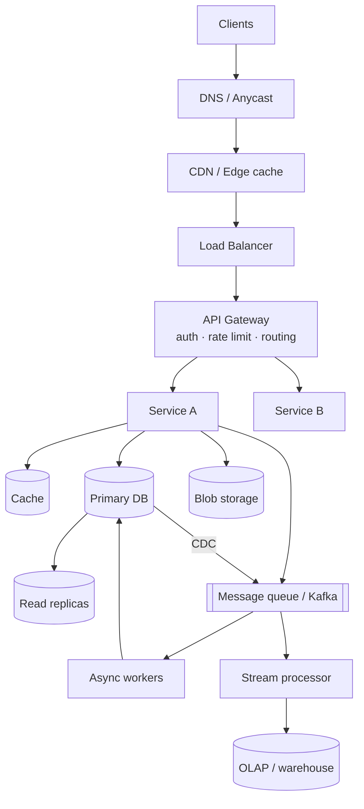

# System Design Mastery

A complete, first-principles system design course — **117 chapters**, every one written twice:

1. **🧒 ELI5** — the idea explained like you are five. No jargon. Analogies only.
2. **The real thing** — deep technical treatment with numbers, diagrams, trade-offs, failure modes, and interview scripts.

Built as a self-study book. Read it top to bottom, or jump to what you're weak at.

---

## How to read this book

| If you are... | Start here |
|---|---|
| Never done a system design interview | [Part 1 → Basics](01-introduction/01-basics/) — read all 5 chapters in order |
| Interview in 2 weeks | [Study Guide](01-introduction/01-basics/05-study-guide.md) → follow the 14-day plan |
| Interview tomorrow | [Interview Template](01-introduction/01-basics/02-interview-template.md) + [Design Template](07-patterns-and-templates/02-template/01-design-template.md) |
| Strong coder, weak on infra | Part 3 (Scaling) → Part 4 (Storage) → Part 5 (Scaling Storage) |
| Need to sound senior | Part 7 (Patterns) — these are the vocabulary of staff-level design |

### Reading conventions used everywhere

| Marker | Meaning |
|---|---|
| 🧒 **ELI5** | Zero-jargon explanation. Always the first section of a chapter. |
| 🎯 **Interview angle** | Exactly what an interviewer is probing for, and what to say. |
| ⚖️ **Trade-off** | There is no free lunch. This is what you pay. |
| 🔢 **Numbers** | Real-world magnitudes worth memorising. |
| ☠️ **Failure mode** | How this breaks in production at 3 a.m. |
| 🧪 **Lab / Drill** | Hands-on exercise. Do it, don't skim it. |

---

## Table of contents

Full clickable index: **[SUMMARY.md](SUMMARY.md)**

### Part 1 — [Introduction](01-introduction/)
Foundations: what the interview actually tests, a repeatable answer template, the core challenges of web-scale, API design, non-functional requirements, capacity estimation, and the monolith/microservices decision.

### Part 2 — [Microservices & Data Flow](02-microservices-and-dataflow/)
How services talk. Synchronous RPC and everything that goes wrong with it (timeouts, retries, circuit breakers, fallbacks, discovery), then asynchronous messaging: queues, patterns, Redis, log-based queues, Kafka.

### Part 3 — [Scaling Services](03-scaling-services/)
From one box to a fleet: statelessness, load balancing, autoscaling, read/write separation, CQRS, an 18-chapter deep dive on **caching**, and dataflow (push vs pull).

### Part 4 — [Data Storage](04-data-storage/)
The data structures that actually make databases fast (B-tree, SSTable, LSM tree), then every storage family: SQL, NoSQL, key-value, document, full-text search, OLTP vs OLAP, blob storage, and how to choose.

### Part 5 — [Scaling Data Storage](05-scaling-data-storage/)
Replication (algorithms, failover, CDC) and partitioning (sharding, key selection, consistent hashing) with hands-on codelabs.

### Part 6 — [Big Data](06-big-data/)
Batch (Unix pipelines → MapReduce → HDFS → Spark), streaming (windowing, event time, delivery guarantees, Flink/Kafka Streams), hybrid architectures (Lambda, Kappa), pipeline operations, and real-time analytics.

### Part 7 — [Patterns & Templates](07-patterns-and-templates/)
The reusable building blocks — rate limiting, unique IDs, fan-out/fan-in, saga, two-stage processing, pre-computing — plus the master design template and a full worked example.

---

## The one-page mental model

Almost every system you will be asked to design is a **subset of this picture**. Your job in an interview is to justify which boxes you keep, which you drop, and why.

---

## Study plan (14 days)

| Day | Chapters | Goal |
|---|---|---|
| 1 | 1.1 all | Know what's being tested; memorise the template |
| 2 | 1.2 all | API design fluency |
| 3 | 1.3 + 1.4 | Non-functional requirements + estimate any system in 3 min |
| 4 | 1.5 + 2.1 | Microservices and synchronous failure handling |
| 5 | 2.2 | Queues and Kafka |
| 6 | 3.1 + 3.2 | Scaling out, load balancing, CQRS |
| 7–8 | 3.3 | Caching (the highest-yield section in the book) |
| 9 | 3.4 + 4.1 | Push/pull + storage engines |
| 10 | 4.2 | Pick the right database, every time |
| 11 | 5.1 + 5.2 | Replication and partitioning |
| 12 | 6 | Batch and stream processing |
| 13 | 7.1 | Patterns vocabulary |
| 14 | 7.2 | Mock interviews using the template |

---

## Credits

Curriculum structure follows the public outline of [System Design School](https://systemdesignschool.io/fundamentals/what-is-system-design-interview). All prose, diagrams, numbers, labs and ELI5 sections here are original and written for this repository.

## License

[MIT](LICENSE) — study it, fork it, teach from it.
